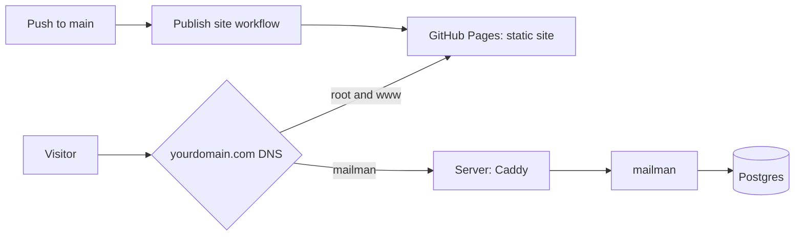

# Deploying the portfolio

How this repository is put behind one domain. The browser apps are a static site on GitHub
Pages at the root domain. mailman, the live full-stack system, runs on one small rented
server at a subdomain. Nothing uses a hosted-model key.

| Address | What | Served by |
| --- | --- | --- |
| `yourdomain.com`, `www.yourdomain.com` | The navigator, resume, snowball, tektak, story generator (`/story-generator/`), whereyago's page, trail | GitHub Pages, free |
| `mailman.yourdomain.com` | mailman: upload, extraction, review queue. Reads open, writes need a key | Rented server, 2-4 GB |



Not hosted: herder (shown by its code, benchmark and a recording; it needs about three times
mailman's memory), the evaluaters command-line tools, and the whereyago mobile app. herder
and fallacysuspect can be switched on later; see [Switching on another app](#switching-on-another-app).

The files:

| File | What it does |
| --- | --- |
| [.github/workflows/pages.yml](.github/workflows/pages.yml) | Builds the static site and publishes it to Pages on every push to `main` |
| [deploy/build-static.mjs](deploy/build-static.mjs) | Builds `deploy/dist/` from an explicit list of files, so nothing private is published |
| [deploy/docker-compose.prod.yml](deploy/docker-compose.prod.yml) | The server: Caddy, Postgres, mailman. Other apps behind profiles |
| [deploy/Caddyfile](deploy/Caddyfile) | Which subdomain goes to which service. Caddy gets the certificates itself |
| [deploy/initdb/01-databases.sh](deploy/initdb/01-databases.sh) | One database and one login per app, on first start |
| [deploy/.env.example](deploy/.env.example) | Every secret the server needs, blank |

## What it costs

| Item | Cost |
| --- | --- |
| Domain | About $10-15 a year for a `.com` or `.dev`, at cost from Cloudflare Registrar |
| Server: 2 vCPU, 2-4 GB RAM, Ubuntu 24.04 | Roughly $4-8 a month at a budget provider (Hetzner, Netcup, OVH, DigitalOcean). Check current prices |
| GitHub Pages, HTTPS certificates, Caddy, Docker | Free |

## Part 1 - Prepare the repository

### 1. Stop git tracking trail's model packs

`.gitignore` already says the trail packs do not belong in the repository, but they were committed
before that rule was written: 669 MB of the repository's 681 MB. In PowerShell, in the repository
folder:

```powershell
git rm -r --cached --quiet -- trail/models
git add trail/models
git status --short trail/models | Select-Object -First 5
```

The files stay on your disk. The second command re-adds only what `.gitignore` allows: the JSON
files and `names/`. The status lines should start with `D` (removed from git), and not a single
line should mention `index.json`.

Removing them from history as well is optional, cannot be undone once pushed, and is not needed for
anything below:

```powershell
pip install git-filter-repo
# every pack folder under trail/models except names/, which is the project's own work
git filter-repo --invert-paths --path-regex '^trail/models/(?!names/)[^/]+/' --force
git remote add origin https://github.com/MoAbboud/PortFolio.git
git push --force origin main
```

### 2. Build and look at the site locally

```powershell
node deploy/build-static.mjs
npx serve deploy/dist
```

Open the address it prints (usually `http://localhost:3000`) and click into every app. The build
copies only listed files: a private note (`requirements/`, any `06-context.md`, `HERDER_SPEC.md`,
`.env`) cannot be published. For trail it copies only the model files `trail/models/index.json`
names, plus their companions and each pack's licence file.

### 3. Upload trail's models to a release

The Pages workflow builds on GitHub's machines, which do not have trail's packs. It downloads them
from one file attached to a release. Make the file:

```powershell
node deploy/build-static.mjs
tar -czf deploy/trail-models.tar.gz -C deploy/dist/trail/models .
```

That makes `deploy/trail-models.tar.gz`, about 68 MB (git ignores it). Then attach it to a
release:

1. Open <https://github.com/MoAbboud/PortFolio> in a browser.
2. In the right-hand column, find **Releases** and click **Create a new release** (or click
   **Releases**, then **Draft a new release**).
3. Click **Choose a tag**, type `trail-models` exactly, and click **Create new tag: trail-models on
   publish**. The workflow looks for this exact name.
4. In **Release title**, type `trail models`.
5. In the description, type: `CC0 model packs used by trail, packed for the Pages build.`
6. Drag `deploy/trail-models.tar.gz` from File Explorer onto the box that says **Attach binaries by
   dropping them here**. Wait until the file name appears with its size and the progress bar is
   gone.
7. Near the bottom, untick **Set as the latest release** if it is ticked, so this does not show as
   the repository's headline release.
8. Click **Publish release**.

To check it worked: the release page shows `trail-models.tar.gz` under **Assets**. Only redo this
when trail's models change.

### 4. Turn Pages on

1. On the repository page, click **Settings** (the tab with a gear, top right of the tab row).
2. In the left-hand menu, under **Code and automation**, click **Pages**.
3. Under **Build and deployment**, find **Source** and choose **GitHub Actions** from the dropdown.
   There is no save button; it saves on selection.

### 5. Commit and push

Commit the changes in your usual way and push to `main`. Then:

1. On the repository page, click the **Actions** tab.
2. A run called **Publish site** should appear within a minute, with a yellow dot while it runs.
3. After two or three minutes it should turn into a green tick. Click it: the **deploy** box shows a
   link like `https://moabboud.github.io/PortFolio/`.

That address works but the navigator's links will not, because they expect the site at the root of
a domain. They work once the custom domain is set in step 8.

If the run shows a red cross, click it, then click the red step to see the error. "404" in the
**Download trail's models** step means the release in step 3 is missing or its tag is not exactly
`trail-models`.

## Part 2 - The domain

### 6. Buy the domain at Cloudflare

The domain is registered with **Cloudflare Registrar**, which sells at cost and includes WHOIS
privacy (your name and address are not published). A domain bought there must use Cloudflare's DNS,
which is fine: step 7 is done in the same dashboard.

Cloudflare's menus move around from time to time. If a name below does not match what you see, look
for the closest match in the left-hand menu; the steps themselves do not change.

1. Go to <https://dash.cloudflare.com/sign-up>, create an account, and click the link in the
   confirmation email Cloudflare sends you.
2. Turn on two-factor authentication before buying anything: click the person icon (top right),
   **Profile**, then **Authentication**, and follow **Two-Factor Authentication**. This account will
   control your domain, so it is worth protecting.
3. In the left-hand menu, open **Domain Registration** and click **Register Domains**.
4. Type the name you want and press Enter. `.com` is the safe choice; `.dev` reads well for a
   developer and forces HTTPS, which this setup already provides.
5. Next to the name, check the yearly price. At Cloudflare the renewal price is the same as the
   first-year price. Skip names marked **premium**.
6. Click **Purchase** (or **Confirm**), fill in the contact details (they are required by the
   registry and are hidden from WHOIS), add a card or PayPal, and complete the purchase.
7. Leave **Auto-renew** on, so the domain cannot lapse while the site is live.

To check it worked: in the left-hand menu, **Domain Registration** then **Manage Domains** lists the
domain as **Active**, and the domain also appears on the dashboard home page. That second listing is
its DNS, used in step 7.

### 7. Point the domain at Pages and the server

**The one thing to get right at Cloudflare: every record below must be "DNS only" (a grey cloud),
not "Proxied" (an orange cloud).** New records default to orange. With the proxy on, GitHub cannot
issue the certificate for the root domain ("Enforce HTTPS" stays greyed out), and Caddy cannot get
one for `mailman.`. The site fails in confusing ways rather than with a clear error.

1. On the dashboard home page, click your domain.
2. In the left-hand menu, click **DNS**, then **Records**.
3. If any records are already listed, delete them: click **Edit** on each, then **Delete**. A newly
   bought domain usually has none.
4. Click **Add record** and fill in the first row of the table below:
   - **Type**: choose from the dropdown.
   - **Name**: type exactly what the table says. `@` means the root domain itself.
   - **IPv4 address** (for A) or **Target** (for CNAME): the value from the table.
   - **Proxy status**: click the orange cloud so it turns **grey** and the label reads
     **DNS only**.
   - **TTL**: leave it on **Auto**.
   - Click **Save**.
5. Repeat step 4 for every row.

| Type | Name | IPv4 address / Target | Proxy status |
| --- | --- | --- | --- |
| A | `@` | `185.199.108.153` | DNS only (grey) |
| A | `@` | `185.199.109.153` | DNS only (grey) |
| A | `@` | `185.199.110.153` | DNS only (grey) |
| A | `@` | `185.199.111.153` | DNS only (grey) |
| CNAME | `www` | `moabboud.github.io` | DNS only (grey) |
| A | `mailman` | your server's IPv4 address | DNS only (grey) |

The four `185.199.x.153` addresses are GitHub Pages. The `mailman` record is the only one pointing
at your server; add it once the server exists (step 10). The TXT record in step 8 has no proxy
setting, so there is nothing to switch there.

To check it worked: the records list shows six rows (five until the server exists), and every row's
**Proxy status** column reads **DNS only** with a grey cloud. If any shows an orange cloud, click
**Edit** on that row, click the cloud to turn it grey, and **Save**.

### 8. Connect the domain to Pages

First, verify the domain with GitHub. This stops anyone else attaching your domain to their own
Pages site:

1. Click your profile picture (top right on GitHub), then **Settings**.
2. In the left-hand menu, under **Code, planning, and automation**, click **Pages**.
3. Click **Add a domain**, type your domain (no `www`, no `https://`), and click **Add domain**.
4. GitHub shows a **TXT** record: a host name starting `_github-pages-challenge-MoAbboud` and a
   value. In Cloudflare, add it as a record (DNS, Records, Add record): Type **TXT**, **Name** is
   the host name GitHub shows, **Content** is the value. Save.
5. Back on GitHub, click **Verify**. If it says the record was not found, wait ten minutes and click
   again.

Then set it on the repository:

1. Repository **Settings**, then **Pages**.
2. Under **Custom domain**, type your domain and click **Save**.
3. GitHub runs a DNS check. A green **DNS check successful** means the records from step 7 are right.
4. Tick **Enforce HTTPS**. If the box is greyed out, GitHub is still issuing the certificate; this
   can take up to an hour. Come back and tick it.

To check it worked: `https://yourdomain.com` opens the navigator, and `https://www.yourdomain.com`
lands on the same page.

## Part 3 - The server

### 9. Check the images build on your PC

Start Docker Desktop, then in PowerShell:

```powershell
cd deploy
Copy-Item .env.example .env
notepad .env      # put any letters and digits in POSTGRES_PASSWORD, MAILMAN_DB_PASSWORD, MAILMAN_API_KEY
docker compose -f docker-compose.prod.yml build
cd ..
```

It should end without red error lines. This catches a broken image here instead of on the server.

### 10. Rent the server

At the provider, create a server with Ubuntu 24.04, 2 vCPU and 2-4 GB of RAM (2 GB runs mailman; 4 GB
leaves room to switch on fallacysuspect later). When it asks for an SSH key, give it your public key.
If you do not have one, in PowerShell:

```powershell
ssh-keygen -t ed25519            # press Enter at every question
Get-Content $HOME\.ssh\id_ed25519.pub
```

Copy the single line it prints into the provider's SSH key box. Note the server's IPv4 address
and add it as the `mailman` record from step 7.

### 11. Prepare the server

```powershell
ssh root@<server IP>
```

Type `yes` if asked whether to trust the server. Then, on the server:

```bash
adduser deploy                 # choose a password; the other questions can be left blank
usermod -aG sudo deploy
rsync --archive --chown=deploy:deploy ~/.ssh /home/deploy

ufw allow OpenSSH
ufw allow 80
ufw allow 443
ufw enable                     # answer y

curl -fsSL https://get.docker.com | sh
usermod -aG docker deploy
exit
```

From here on, log in as `deploy`: `ssh deploy@<server IP>`.

### 12. Fetch the code and fill in the secrets

On the server:

```bash
git clone https://github.com/MoAbboud/PortFolio.git ~/PortFol
cd ~/PortFol/deploy
cp .env.example .env
openssl rand -hex 24; openssl rand -hex 24; openssl rand -hex 24
nano .env
```

The `openssl` line prints three random values. In `nano`, set `DOMAIN` and `ACME_EMAIL`, and paste
one value into each of `POSTGRES_PASSWORD`, `MAILMAN_DB_PASSWORD` and `MAILMAN_API_KEY`. Leave the
optional ones blank. Save with `Ctrl+O` then `Enter`, and exit with `Ctrl+X`. Keep a copy of the
three values in your password manager.

### 13. Start it

```bash
docker compose -f docker-compose.prod.yml up -d --build
docker compose -f docker-compose.prod.yml ps
```

Every service should show `running` (the database also shows `healthy`). Then from any machine:

```bash
curl -I https://mailman.<domain>
```

A `200` or a redirect means it is live. If the certificate fails, the `mailman` DNS record has not
reached the server yet; wait a few minutes, Caddy retries by itself. To see why something is not
working:

```bash
docker compose -f docker-compose.prod.yml logs --tail=100 caddy
docker compose -f docker-compose.prod.yml logs --tail=100 mailman
```

## Keeping it running

### Update after a change

The static site updates itself: every push to `main` that touches it runs **Publish site**.

The server updates with two commands:

```bash
cd ~/PortFol && git pull
cd deploy && docker compose -f docker-compose.prod.yml up -d --build
```

Only changed images rebuild, and migrations run on start.

### Back up the database

Everything worth keeping on the server is mailman's database and its stored documents. A nightly
dump, on the server:

```bash
mkdir -p ~/backups
crontab -e                     # choose nano if asked
```

Add this line at the bottom, then save and exit as before:

```
0 3 * * * cd ~/PortFol/deploy && docker compose -f docker-compose.prod.yml exec -T db pg_dump -U postgres mailman | gzip > ~/backups/mailman-$(date +\%F).sql.gz && find ~/backups -mtime +14 -delete
```

Copy `~/backups` off the server now and then. A backup kept only on the machine it protects is not
a backup.

## Switching on another app

Each one is a profile in the compose file, a commented block in the Caddyfile, and a DNS record.

| App | Profile | Extra RAM | Also needs |
| --- | --- | --- | --- |
| fallacysuspect | `fallacy` | about 2 GB | Its model sets copied to `~/PortFol/fallacysuspect/models/` on the server |
| herder | `herder` | about 5 GB | `HERDER_DB_PASSWORD` in `.env`, then `ollama pull all-minilm` and `python -m herder bootstrap` |
| whereyago backend | `whereyago` | about 0.5 GB | `WHEREYAGO_DB_PASSWORD` and `WHEREYAGO_SECRET_KEY` in `.env` |

Steps, using fallacysuspect as the example:

1. In Cloudflare (DNS, Records), add an `A` record `fallacy` pointing at the server, **DNS only**
   (grey cloud).
2. For fallacysuspect only, copy the models from your PC:
   ```powershell
   ssh deploy@<server IP> "mkdir -p ~/PortFol/fallacysuspect/models"
   scp -r fallacysuspect/models/v2_bert fallacysuspect/models/v1_baseline deploy@<server IP>:~/PortFol/fallacysuspect/models/
   ```
3. On the server, uncomment that app's block in `deploy/Caddyfile` (remove the `# ` at the start of
   each of its lines).
4. Start it with its profile, and reload Caddy:
   ```bash
   cd ~/PortFol/deploy
   docker compose -f docker-compose.prod.yml --profile fallacy up -d --build
   docker compose -f docker-compose.prod.yml restart caddy
   ```

herder and whereyago also need a database. `initdb/01-databases.sh` only runs on the database's very
first start, so if it has already run, create theirs by hand (herder shown; whereyago is the same
without the extension line):

```bash
docker compose -f docker-compose.prod.yml exec db psql -U postgres \
  -c "CREATE ROLE herder LOGIN PASSWORD '<HERDER_DB_PASSWORD from .env>'" \
  -c "CREATE DATABASE herder OWNER herder"
docker compose -f docker-compose.prod.yml exec db psql -U postgres -d herder \
  -c "CREATE EXTENSION IF NOT EXISTS vector"
```

Once a profile is in use, add it to every later `up` command, or that app is left out of the
update.

## How this differs from each project's own docker-compose.yml

The per-project compose files are for development and stay as they are. The production file differs
on purpose:

- no source folder mounted over the image, no `--reload`
- no database port published to the internet
- one Postgres with a database and login per app, instead of one Postgres each
- secrets from `deploy/.env` only, with no default passwords
- migrations run when a container starts
- a memory limit per service, so one busy process cannot starve the rest
- fallacysuspect runs under gunicorn instead of Flask's development server
