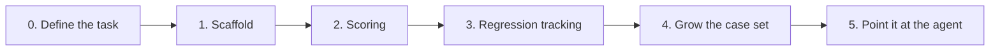

# eval-harness - Build plan

## Objective

A harness that answers one question with evidence: did that change make the model better or
worse? Finished, for the purpose of this project, when a run produces per-case scores, a
second run can be diffed against the first, and the case set is large enough for the
difference to mean something.

The wider objective is what this demonstrates alongside its sibling project: measuring
model behaviour, and then acting on it safely. Stage 5 joins the two.

## Order of work

The stages are ordered so that each one leaves something runnable. The scaffold before the
scorers, the scorers before regression tracking, regression tracking before growing the
case set - because a larger case set is only worth the labelling effort once there is
machinery to consume it.

| Stage | Goal | Done when | Status |
| --- | --- | --- | --- |
| 0 | Decide what is being measured | The task is chosen, the expected output shape is fixed, the failure modes worth catching are written down, and the first cases are labelled by hand | Done |
| 1 | Scaffold | Loader, runner, scorer contract, store and command line exist, and a run collects raw responses under a run id | Done. No scoring yet, on purpose |
| 2 | Scoring | Deterministic scorers first, then a model-as-judge scorer for what determinism cannot reach | **Not started. This is the current work** |
| 3 | Regression tracking | Two runs can be diffed per case per scorer, and the difference is reported | Not started |
| 4 | Grow the case set | Fifty to a hundred hand-labelled cases | Not started |
| 5 | Evaluate the agent | The harness measures the sibling triage agent's task success and how often each of its guardrails fired | Not started |

### Stage 2 in detail

The order within the stage matters.

1. A scorer that checks whether the output is well-formed at all. This is the cheapest and
   catches the failure the harness was deliberately built to be able to see - the runner
   does not force structured output precisely so that malformed answers reach the scorers.
2. A scorer that compares field by field against the expected answer, reporting which
   fields differ rather than a single pass or fail.
3. A model-as-judge scorer for the fields where an exact match is too strict and a human
   would accept a different wording.

The judge comes last because it is the least trustworthy component, and it should only be
reached for after the deterministic scorers have taken everything they can.

## Decisions already made

| Decision | Reason |
| --- | --- |
| The task is structured extraction from messy support tickets | It has a correct answer that can be compared field by field, which keeps scoring honest |
| Raw model output is stored unmodified | A harness that cleans up output cannot measure how often output needs cleaning up |
| Structured output mode is not forced | Same reason. If the model cannot fail to produce well-formed output, well-formedness cannot be measured |
| The runner is a protocol, the scorer is an abstract base class | A runner wraps something that already exists and only has to fit a shape. A scorer is written for this harness and gets a contract |
| Retries live inside the runner | Provider flakiness is the runner's problem. No caller and no scorer should know a request can fail |
| The retry count is carried in response metadata | A run that succeeded after twenty attempts should not look identical to one that succeeded first time |
| Responses and scores are separate tables | Scores are re-derivable from responses. A new scorer can be run against responses already paid for |
| Every score carries a detail field | A number that regressed is a question. The detail is the answer |
| Nothing is ever updated in the store | A run is a historical record |
| Duplicate case identifiers are a load error | The identifier is a database key. Silently overwriting would lose a measurement |
| The provider library is imported lazily | Keeps the loader, store and command line testable with no provider installed |
| Credentials come from an environment variable | Never in source, never in the results file |
| Scoring was deliberately left out of the scaffold stage | Building the machinery and the measurements at once makes it unclear which one is wrong |

## Open questions

| Question | Blocks | Notes |
| --- | --- | --- |
| Which fields tolerate a fuzzy match and which must be exact? | Stage 2 | Determines where the deterministic scorer stops and the judge starts |
| How is the judge itself validated? | Stage 2 | A judge that is wrong in a consistent direction is worse than no judge. It probably needs its own small labelled set |
| What counts as a meaningful regression? | Stage 3 | One case moving on a set of eight is noise. On a set of a hundred it may not be |
| Where do fifty to a hundred realistic tickets come from? | Stage 4 | Hand-writing them risks a set that only contains failures already thought of |
| What does the agent's task success actually mean? | Stage 5 | Needs defining jointly with the sibling project before either can measure it |

## Risks

| Risk | Effect if it happens | Response |
| --- | --- | --- |
| The case set stays at eight | Every number is noise and every conclusion is unfounded | Stage 4 exists for this. Do not report percentages off a set this size |
| The judge is used where a deterministic scorer would do | Slower, costlier, and less repeatable than necessary | Deterministic scorers are built first and the judge only covers what they cannot |
| Cases are written to match what the model already does well | The harness reports good news and measures nothing | Cases come from the failure modes written down in stage 0, not from observed output |
| Provider cost grows with the case set | Running becomes something to avoid, which defeats the point | Responses are stored, so a new scorer can be evaluated against existing responses without re-running the model |
| The two projects never meet | Stage 5 is the payoff and the reason both exist in one folder | Define the agent's success criteria early rather than at the end |
