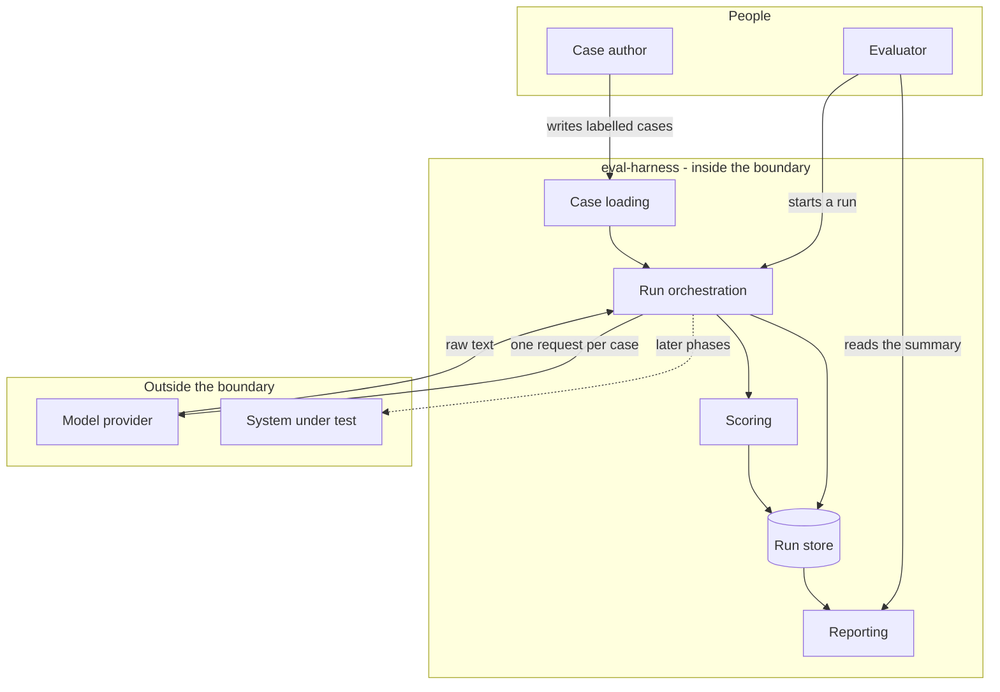

# eval-harness - Interaction and system boundary

## Actors

| Actor | Type | What they want |
| --- | --- | --- |
| Evaluator | Human | To find out whether a change made the model better or worse, with evidence |
| Case author | Human | To encode what a correct answer looks like, once, so it can be checked forever |
| Model provider | External system | Receives a case, returns text |
| System under test | External system | In later phases, the thing being evaluated is another program rather than a model directly |

## Interaction diagram

## What the system is in the business of

- Turning a subjective impression of quality into a number that can be compared to last
  week's number.
- Preserving exactly what the model returned, including the broken answers.
- Keeping every run separable, so two runs can be placed side by side.
- Making it cheap to add a new way of scoring without touching the code that runs the model.
- Making it cheap to swap the thing being run without touching the scoring.
- Surviving a flaky provider. Transient failures are the provider's normal behaviour, not
  an exception.

## What the system does not care about

- Whether the model is good. It reports; it does not conclude.
- Repairing, reformatting or retrying a bad answer to make it look better. A bad answer is
  data.
- Which provider is on the other end. The runner is an interface with one implementation
  today.
- Prompt engineering. The prompt is an input to a run, and changing it is the thing being
  measured, not the harness's job.
- Serving anything. There is no interface beyond a terminal and a database file.
- Being fast. It is a measurement tool, not a production path.
- Cost accounting, beyond whatever metadata a response happens to carry.

## Main use cases

| ID | Actor | Goal | Trigger | Result |
| --- | --- | --- | --- | --- |
| UC-1 | Case author | Add a case | Append a line to the case file | The case is loaded on the next run, identified by its stable id |
| UC-2 | Evaluator | Measure the current state | Run the harness | Every case is sent, every raw answer stored under a new run id |
| UC-3 | Evaluator | Score a run | Scorers configured | Every case has a score per scorer, with an explanation of why |
| UC-4 | Evaluator | Compare two runs | Two run ids exist | A difference per case per scorer |
| UC-5 | Evaluator | Add a new scorer | Implement the scorer contract | It participates in the next run with no changes elsewhere |
| UC-6 | Evaluator | Evaluate a different system | Implement the runner contract | The new system is measured by the existing cases and scorers |

## Constraints that come from the actors

- Credentials are supplied through the environment. A case file or a database is a thing
  you might share; a key is not.
- A duplicated case identifier must be an error, not a silently overwritten row.
- The provider will fail intermittently. Retries with backoff belong to the runner, not to
  the caller and not to the scorer.
- Nothing between the model and the store may alter the answer.
