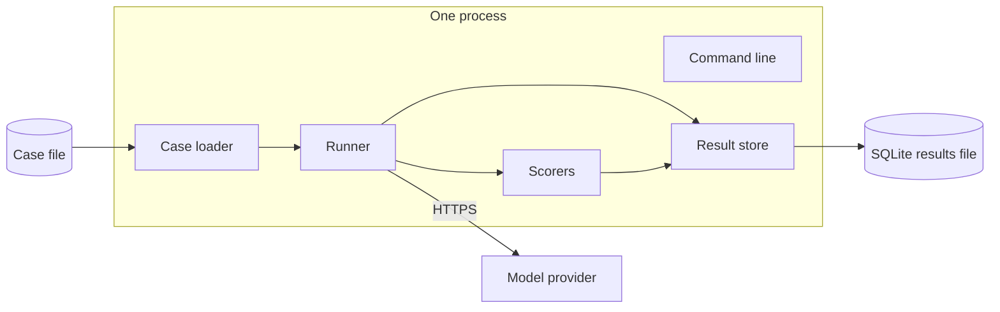
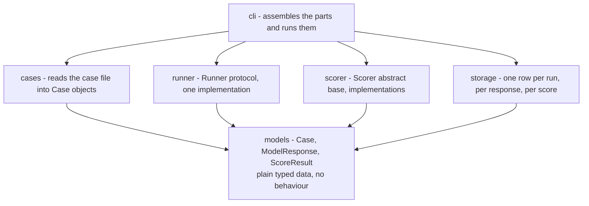
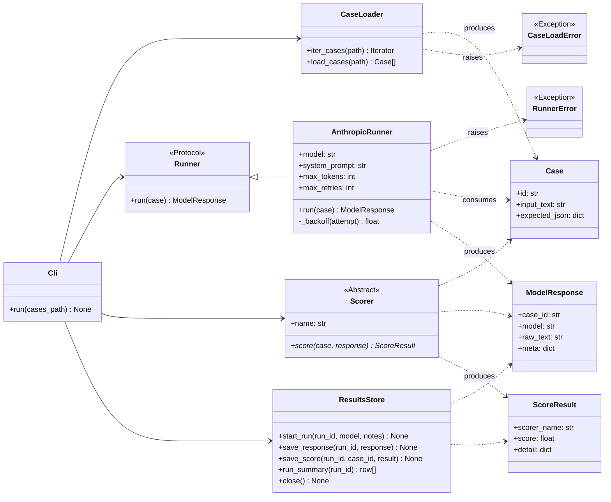
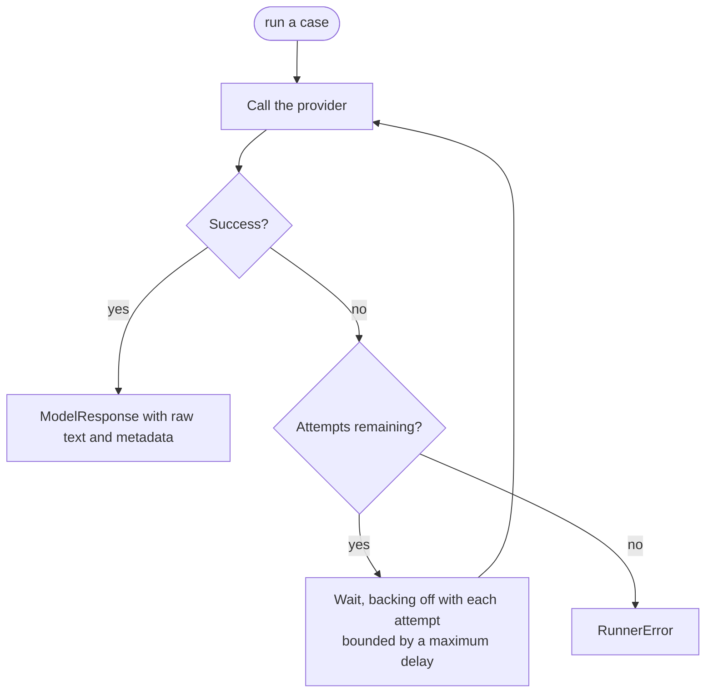
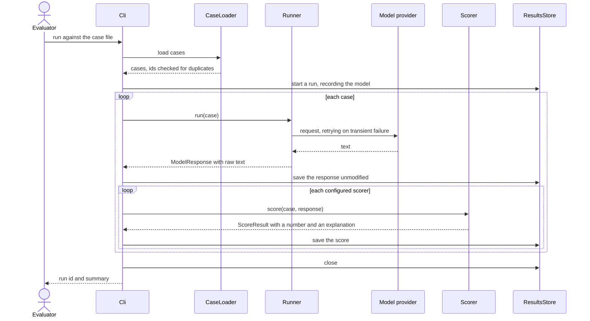

# eval-harness - Architecture

Internal document. Credentials are referred to by environment variable only.

## Components

A single command-line process with a file store. Not distributed.

## Layers

The dependency rule: the runner, the scorers and the store never import each other. They
meet at typed data objects and at two abstractions. That is what allows a scorer to be
added without touching the runner, and a provider to be swapped without touching either.

Everything points at the data objects and nothing points sideways. The command line is the
only place that knows about all four.

The provider client is imported lazily inside the runner. That means the loader, the store
and the command line can be exercised without the provider library installed at all, which
keeps most of the harness testable offline.

## Class diagram

`Runner` is a protocol and `Scorer` is an abstract base class. The difference is
intentional. A runner is something that already exists elsewhere and merely has to fit a
shape, so structural typing suits it. A scorer is something written for this harness, and
the base class gives it a name field and a contract it must implement.

`ResultsStore` is a context manager. It opens the database, is used, and closes.

## Retry policy

Retries live inside the runner and nowhere else. A caller asks for one case and either gets
a response or an error; it never sees the attempts in between.

The harness counts its own retries and carries the count in the response metadata, so a run
that looked fine but took twenty attempts is visible in the record rather than invisible.

## Key sequence - one run

## Rules this architecture is meant to protect

- Raw model output reaches the store unmodified. Nothing cleans, parses or repairs it on
  the way.
- Retry logic belongs to the runner. No other component knows a request can fail.
- Adding a scorer requires implementing one method and nothing else.
- Swapping the system under test requires satisfying one protocol and nothing else.
- Credentials come from `ANTHROPIC_API_KEY` and are never written in source or stored in
  the results file.
- The provider library is imported lazily, so the harness remains largely testable without
  it.
- A duplicate case identifier is an error at load time, because the identifier is a
  database key.
- Errors are typed and raised. Nothing is swallowed.
