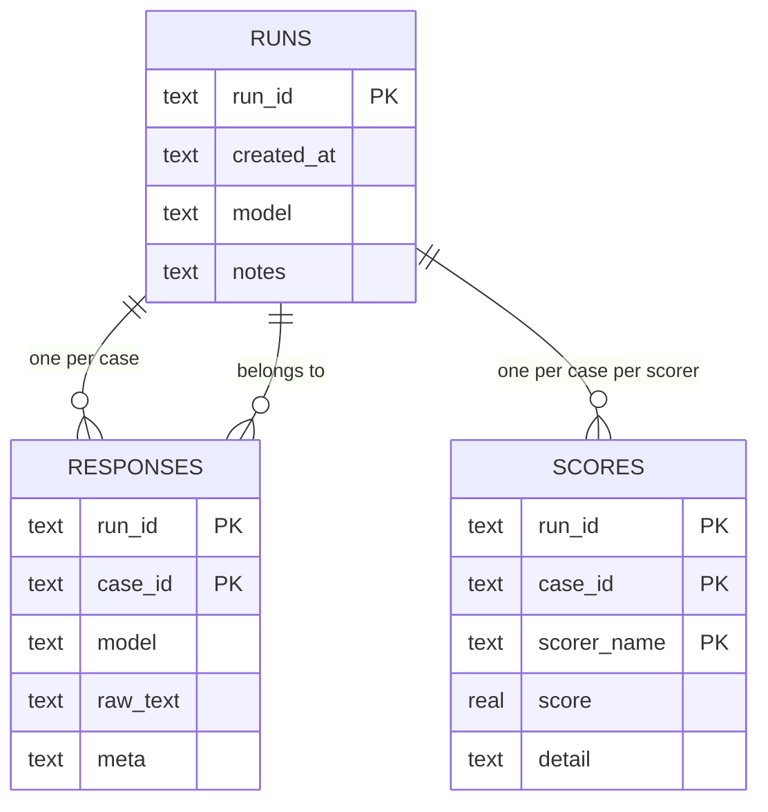

# eval-harness - Data model

Two stores, with different jobs. The case file is input, written by hand and read by a
person. The results database is output, written by the harness and never edited.

## Case file

A line-delimited JSON file. One case per line, so a case can be appended without rewriting
the file and a malformed line can be reported by line number.

| Field | Type | Notes |
| --- | --- | --- |
| `id` | string | Stable and unique. It is a database key, so it must never be reused for a different case |
| `input_text` | string | The messy input handed to the model |
| `expected_json` | object | The hand-labelled correct extraction |

Duplicate identifiers are rejected at load time. Silently accepting one would overwrite a
stored response and lose a measurement without warning.

There are currently eight hand-labelled cases. That is enough to exercise the harness and
not enough to draw conclusions from; growing the set is a planned stage.

## Results store

SQLite, a single file. Three tables, appended to and never updated.

### `runs`

One row per invocation. This is what makes two measurements comparable.

| Column | Type | Notes |
| --- | --- | --- |
| `run_id` | text | Primary key. Generated per run |
| `created_at` | text | When the run started |
| `model` | text | What was being evaluated. Without this a comparison is meaningless |
| `notes` | text | Optional. What changed since last time |

### `responses`

Exactly what came back, per case.

| Column | Type | Notes |
| --- | --- | --- |
| `run_id` | text | Part of the primary key, references `runs` |
| `case_id` | text | Part of the primary key. The identifier from the case file |
| `model` | text | Recorded again at row level, so a response is interpretable on its own |
| `raw_text` | text | The model's output, unmodified. Malformed output is stored as-is |
| `meta` | text | Serialised metadata, including the retry count the runner observed |

Primary key on (`run_id`, `case_id`): one response per case per run.

`raw_text` being unmodified is the point of the table. A harness that stored parsed output
could not measure how often parsing fails.

### `scores`

One row per case per scorer per run.

| Column | Type | Notes |
| --- | --- | --- |
| `run_id` | text | Part of the primary key, references `runs` |
| `case_id` | text | Part of the primary key |
| `scorer_name` | text | Part of the primary key. Which scorer produced this |
| `score` | real | By convention 1.0 passes and 0.0 fails, or a fraction between |
| `detail` | text | Serialised explanation - field-level differences, parse errors, the judge's reasoning |

Primary key on (`run_id`, `case_id`, `scorer_name`). Adding a scorer adds rows, never
columns, which is why a new way of scoring needs no migration.

`detail` is not decoration. A score with no explanation cannot be acted on; the number says
something regressed and the detail says what.

## Why three tables rather than one

Responses and scores are produced at different times by different components, and scores
are re-derivable from responses while the reverse is false. Keeping them apart means a new
scorer can be run against responses already collected, without paying to call the model
again.

## Constraints worth stating

- Nothing is ever updated. A run is a historical record of what happened on a particular
  day against a particular model.
- Case identifiers are foreign keys in spirit, though the store does not enforce them
  against the case file, because the case file is not in the database.
- Scores are meaningless without their run, which is why `model` sits on the run row.

## What is deliberately not stored

- Credentials, in any table.
- Parsed or cleaned-up model output. Only raw text.
- Any judgement about whether a run was good. That is the reader's conclusion, not a column.
