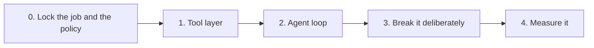

# triage-agent - Build plan

## Objective

An agent that triages open issues on a repository and cannot damage it. Finished when it
runs a full triage pass, proposes labels and comments, applies nothing without a yes, stops
at its step limit, recovers from its own bad tool calls, and has been measured rather than
demonstrated.

The measurable claim is not "the model chose the right tool". It is "every write was
confirmed, the run terminated, and the failures were the ones the policy anticipated".

## Order of work

Built tools-first. The order is the argument: the safety policy was written before the
agent, the tools were built and tested before the loop, and the loop is written to the
policy rather than having guardrails added to it afterwards.

| Stage | Goal | Done when | Status |
| --- | --- | --- | --- |
| 0 | Decide what the agent may do | The job is fixed, the four tools are chosen, and it is written down which two have side effects and what the policy around them is | Done |
| 1 | The tool layer | Four tools, one HTTP choke point, typed errors, pagination handled, and all of it tested offline | Done. Thirteen tests, no network needed |
| 2 | The agent loop | The model picks tools, the gate stops every write, the step cap holds, and a bad argument comes back as an error instead of a crash | **Not started. This is the current work** |
| 3 | Break it deliberately | Adversarial issues fed in, every failure logged, the policy adjusted where it did not hold | Not started |
| 4 | Measure it | The sibling harness reports task success and how often each rule in the policy fired | Not started |

### Stage 2 in detail

The policy already exists. This stage implements it, in this order:

1. The loop skeleton with the step cap enforced by the loop itself, before any tool is
   wired in. A loop that cannot terminate is not made safe by adding tools to it.
2. Read tools only. Confirm the agent can list and read issues and produce a proposal
   without being able to change anything.
3. The confirmation gate, sitting between the model's decision and the call.
4. Write tools behind the gate.
5. Bad-argument handling with a bounded number of corrections.

Steps two and four are separated on purpose. There should be a commit where the agent can
think but not act.

## The safety policy

Decided in stage 0, before any agent code. Restated here because it is the specification,
not a feature list.

| Rule | Behaviour |
| --- | --- |
| Confirmation on side effects | Applying a label or posting a comment stops and asks for a yes or no, every time, one at a time |
| Step cap | A fixed maximum number of agent steps per run, then stop regardless of state |
| Bad arguments return errors | A missing or nonsensical tool argument is returned to the model as an error, not raised out of the run |
| Bounded corrections | The model gets a small fixed number of attempts to fix a bad call before the loop moves on |

## Decisions already made

| Decision | Reason |
| --- | --- |
| The job, the tools and the side-effect list were fixed before any code | A safety policy written after the agent works is a rationalisation of whatever it happens to do |
| Four tools, two read and two write | Small enough to reason about completely. The read and write split is what the whole design rests on |
| Tools built and tested before the loop | Testing tools against a live repository would mean testing writes against a live repository |
| The HTTP session is injected | Lets the entire tool layer be tested offline with no token |
| One private request method is the only place HTTP happens | Four separate error handlers would eventually disagree, and then no caller could trust a specific exception type |
| Status codes map to specific typed errors | A caller should be able to catch a rate limit without catching a missing repository |
| Errors form a hierarchy | Lets a caller be as specific or as general as it needs |
| The identifier everywhere is the issue number | The host also exposes an internal id. Using it would address a different issue than the one approved |
| Listing follows pagination to the end | Seeing only the first page looks like working and is not |
| Every request has a timeout | A tool that hangs gives the operator no signal at all |
| The policy lives in the loop, not in the prompt | A model cannot be relied on to respect a rule it was merely told about |
| Tools are exposed as plain functions as well as client methods | A model-facing tool should be a function with named arguments and nothing else |
| No local database | The repository is the state. A second copy could disagree with it |
| Credentials and the target repository come from the environment | This is a write credential to a real repository |

## Open questions

| Question | Blocks | Notes |
| --- | --- | --- |
| What exactly does the confirmation prompt show? | Stage 2 | The operator has to be able to approve without going and looking at the issue. Too little and the yes is meaningless |
| Should a declined action be reported back to the model? | Stage 2 | Telling it lets it try something else. Not telling it stops it arguing. Probably tell it, once |
| What is the step cap actually for - cost, or a runaway loop? | Stage 2 | Determines whether the cap counts model calls or tool calls |
| What repository is stage 3 run against? | Stage 3 | It needs write access and it needs to be somewhere a mess does not matter |
| What does task success mean? | Stage 4 | Joint decision with the harness project. Neither can measure until it is defined |
| Who owns the run record the harness will need? | Stage 4 | The agent keeps no state today. The record probably belongs to the harness |

## Risks

| Risk | Effect if it happens | Response |
| --- | --- | --- |
| The gate is bypassed by a future tool | The one thing the project exists to guarantee stops being guaranteed | Read and write tools are distinguished in code, not by convention. A new tool must declare which it is |
| Confirmation fatigue | The operator says yes without reading, and the gate becomes decoration | The prompt must show enough to decide on. This is an open question, not a detail |
| The policy drifts into the prompt | It looks like it works until a model ignores it once | The policy is enforced by the loop. Nothing about it is delegated |
| Stage 3 is skipped because stage 2 looks fine | The failures found in production are the ones stage 3 was meant to find first | Stage 3 is a stage, not a review |
| The token used has more access than the agent needs | The blast radius is larger than the design assumes | Use a token scoped to issues on one repository |
| Comments are attributed to a personal account | Anyone reading the issue sees a person, not an agent | Decide the account before stage 3 runs against anything real |
| The two projects never meet | Stage 4 is the payoff and the reason both exist in one folder | Define task success early rather than at the end |
