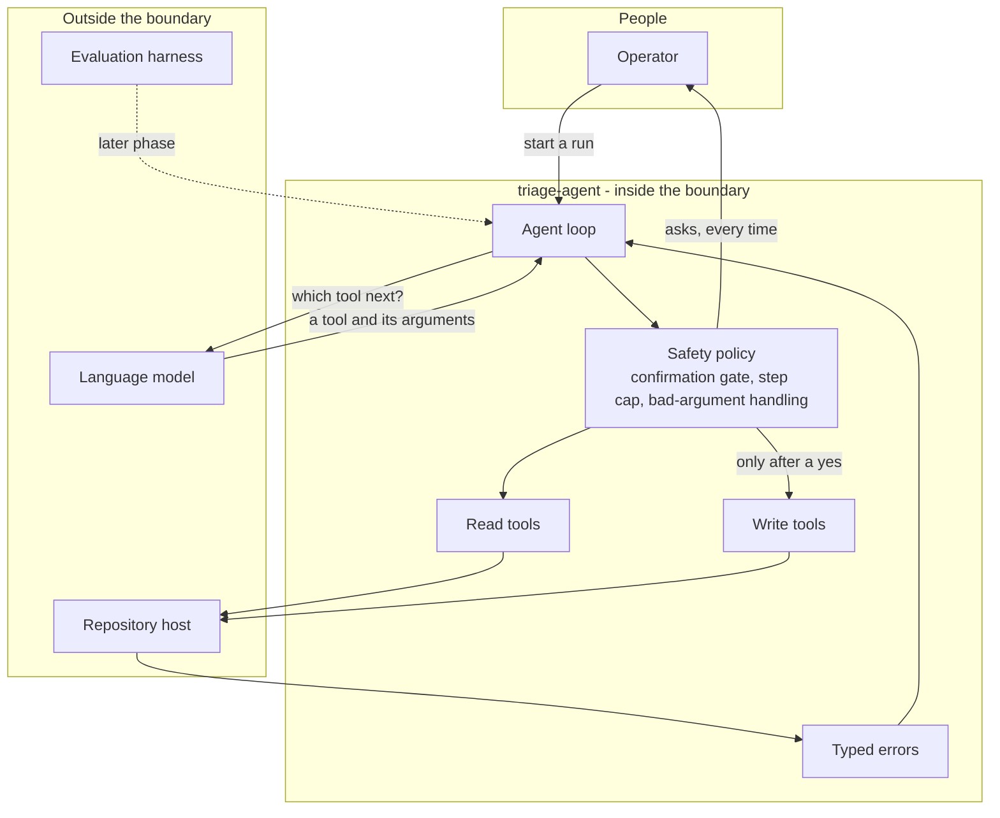

# triage-agent - Interaction and system boundary

## Actors

| Actor | Type | What they want |
| --- | --- | --- |
| Operator | Human | Triage done without having to read every issue, and without waking up to a repository full of wrong labels |
| Repository host | External system | Serves issues, accepts labels and comments, and enforces its own rate limits |
| Language model | External system | Reads issue text and chooses which tool to call |
| Evaluator | External system | The sibling harness, which in a later phase drives this agent to measure it |

The Operator is not a spectator. They are inside the control loop by design; every write
passes through them.

## Interaction diagram

## What the system is in the business of

- Deciding what may happen to a repository, and making that decision in code rather than
  leaving it to the model.
- Separating reads from writes, and treating the two completely differently.
- Asking a person before every single change, one change at a time.
- Bounding a run, so a confused agent stops instead of spinning.
- Turning every failure from the repository host into a specific, named error a caller can
  branch on.
- Handing the model a small set of plain tools rather than an open interface.

## What the system does not care about

- Being clever about triage. A merely adequate label that the operator approved is worth
  more than a brilliant one applied without asking.
- Autonomy. Removing the human is the opposite of the point.
- Throughput. There is no batching, no parallelism, and no unattended run.
- Anything about the repository other than its issues. Not code, not branches, not pull
  requests, not releases.
- Managing labels as a resource. It applies labels that already exist.
- Which model is on the other end. The loop asks for a decision and validates the answer
  against its own policy either way.
- Being right about an argument the model got wrong. A bad argument is an error returned to
  the model, not a crash and not a guess at what was meant.

## The safety policy

Written before any agent code, deliberately, and it is the specification the loop is built
against rather than a set of guardrails bolted on afterwards.

| Rule | Applies to | Behaviour |
| --- | --- | --- |
| Confirmation gate | Every tool with a side effect | The run stops and asks for a yes or no before the call is made. A no skips it |
| Step cap | The whole run | A fixed maximum number of agent steps, then stop regardless of state |
| Bad-argument handling | Any tool call | A missing or nonsensical argument returns an error to the model rather than raising out of the run |
| Retry limit | Bad arguments | The model gets a small, fixed number of attempts to correct itself before the loop moves on |

Read tools have no gate. That is what makes the gate meaningful: it fires only on the
calls that change something, so the operator's attention is spent where it matters.

## Main use cases

| ID | Actor | Goal | Trigger | Result |
| --- | --- | --- | --- | --- |
| UC-1 | Operator | Confirm setup before writing anything | Run the auth check | Confirmation that the credentials and repository resolve |
| UC-2 | Operator | Triage the open issues | Start a run | Proposals, each confirmed or declined individually |
| UC-3 | Agent | Understand the backlog | Loop start | The list of open issues, across every page |
| UC-4 | Agent | Read one issue in full | A listed issue looks relevant | The full issue |
| UC-5 | Agent | Label an issue | The model proposes a label | The operator is asked; on yes the label is applied and the resulting label set returned |
| UC-6 | Agent | Comment on an issue | The model proposes a comment | The operator is asked; on yes the comment is posted |
| UC-7 | Operator | Decline a proposal | The gate asks | Nothing is called, and the loop continues |
| UC-8 | Agent | Recover from its own bad call | A tool argument is missing or nonsensical | An error the model can read, and a bounded number of further attempts |
| UC-9 | Evaluator | Measure the agent | A later phase | Task success and how often each rule in the policy fired |

## Constraints that come from the actors

- The token comes from the environment. It is a write credential to a real repository and
  never belongs in source.
- The repository host rate limits and occasionally fails. Both are normal operating
  conditions and must produce a distinguishable error rather than a generic one.
- Issue identity is the issue number as the host uses it in its own interface, not any
  internal identifier. Confusing the two would send a comment to the wrong issue.
- A tool that hangs is worse than one that fails quickly. Every call is bounded by a
  timeout.
