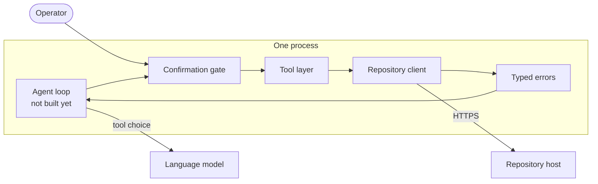
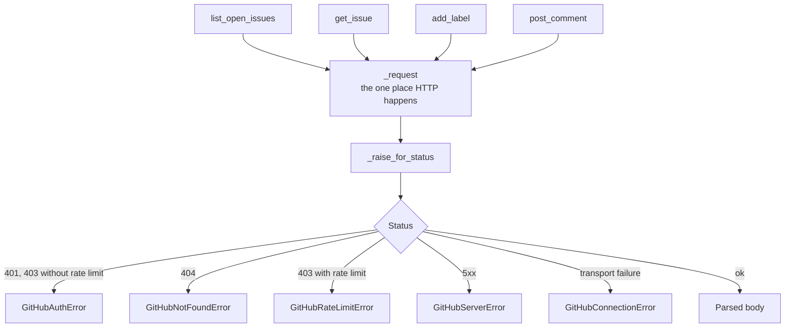
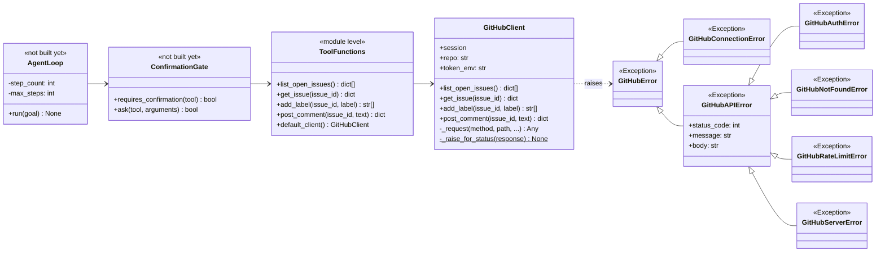
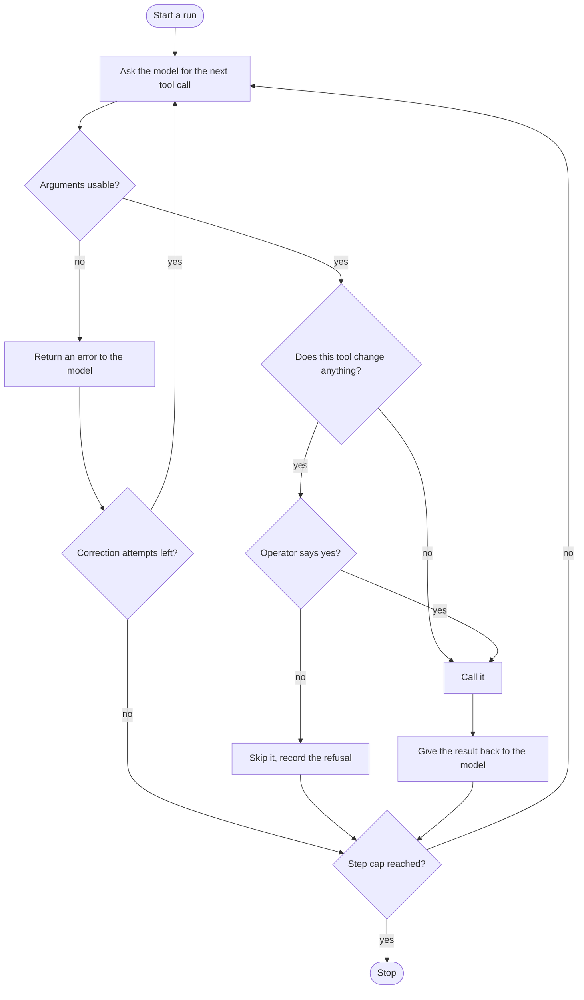
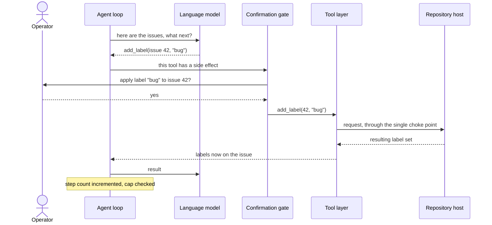

# triage-agent - Architecture

Internal document. The access token is referred to by environment variable only.

## Components

A single command-line process. Not distributed. Two external services.

The tool layer exists and is tested. The loop and the gate are the next phase. This
document describes both, and marks which is which, because the safety policy was specified
before the loop was written and the loop must be built to it rather than around it.

## The single choke point

Every call to the repository host goes through one private request method on the client.
Nothing else in the codebase performs HTTP.

Having one choke point is what makes the error mapping trustworthy. If four tools each did
their own error handling, three of them would eventually be wrong, and a caller could not
rely on catching a specific type.

Every request carries a timeout. A tool that hangs blocks the operator and gives them no
signal; a tool that fails quickly can be retried or reported.

## Class diagram

The error hierarchy is shaped so a caller can be as specific or as general as it needs. A
retry policy catches the rate limit and the server error. A setup check catches the auth
error. Something that just wants to give up catches the base.

The tools are exposed twice: as methods on a client, and as four plain module-level
functions backed by a default client. The methods are what the tests drive, with an
injected session. The plain functions are what the loop will hand to the model, because a
model-facing tool should be a function with named arguments and nothing else.

## The tool set

Four tools, chosen and frozen before anything was built. Two read, two write. The split is
the entire safety story.

| Tool | Effect | Gated | Notes |
| --- | --- | --- | --- |
| `list_open_issues` | Read | No | Follows pagination to the end, so the agent sees the whole backlog rather than the first page |
| `get_issue` | Read | No | One issue in full |
| `add_label` | **Write** | Yes | Returns the resulting label set, so the effect is visible rather than assumed |
| `post_comment` | **Write** | Yes | Returns the created comment |

Across all four, the issue identifier is the issue **number** as the host displays it, not
any internal database identifier. Getting this wrong would apply a label to a different
issue than the one the operator approved, which is precisely the failure the gate exists to
prevent, arriving through the back door.

## Planned control flow

Not yet built. This is the specification the loop is to be written against.

Three things in that diagram are the whole point, and none of them are the model:

- The gate sits between the decision and the call, so no write can bypass it.
- The step cap is checked by the loop, not requested from the model.
- A bad argument is fed back as data rather than raised, so the model can correct itself,
  but only a fixed number of times.

## Key sequence - a gated write

## Testability

The client takes its HTTP session by injection. The tests supply a fake, so the entire tool
layer runs offline with no token and no network. Thirteen tests cover the four tools, the
pagination behaviour and the status-code mapping.

This is why the tools were built first. A tool layer that can only be tested against a live
repository would mean testing write operations against a real repository, which is a bad
idea for the same reason the confirmation gate exists.

## Rules this architecture is meant to protect

- Exactly one place performs HTTP. Adding a fifth tool must not add a second.
- Every status code becomes a specific typed error. Nothing is swallowed and nothing is
  returned as a generic failure.
- Read tools and write tools are distinguishable in code, not just by convention, because
  the gate depends on the distinction.
- The safety policy lives in the loop, never in the prompt. A model cannot be relied on to
  respect a rule it was merely told about.
- The step cap is enforced by the loop, not requested from the model.
- The identifier passed to every tool is the issue number as the host displays it.
- Credentials come from `GITHUB_TOKEN` and the target from `GITHUB_REPO`. Neither appears
  in source.
- Every request has a timeout.
- The tool layer stays testable with an injected session and no network.
