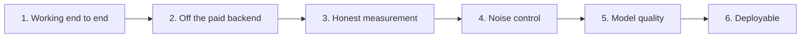

# fallacysuspect - Build plan

## Objective

A tool that reads a debate transcript and marks passages worth a second look, running
entirely on the machine it is installed on, at no cost per use, and never asserting a
verdict.

The measure of done is not "it produces output". It is: on a real debate transcript it
catches the textbook fallacies a careful reader would catch, and stays quiet on
conversational filler. Both halves count. A tool that flags everything is as useless as one
that flags nothing.

## Order of work

| Stage | Goal | Done when | Status |
| --- | --- | --- | --- |
| 1 | Transcript in, warnings out, in a browser and from a terminal | A pasted transcript produces highlighted spans and a report, and every run is recorded | Done |
| 2 | No per-call cost | Locally trained models serve every request, with the hosted service retained only as a fallback | Done |
| 3 | Numbers that can be believed | Quality measured on held-out real-world documents, split by document, with real negatives in the test set | Done |
| 4 | Suppress noise without hiding findings | Length gate plus a calibrated scoring threshold, output on the sample transcript down from unusable to reviewable | Done |
| 5 | The models are actually good enough | Both stages trained on the improved data; the sample transcript's obvious false dilemma is caught and the false alarm rate stays low | **Partly done. The false dilemma is caught; the detector now over-fires on debate prose. This is the current work** |
| 6 | Someone else can run it without a local setup | The light model pairing runs on a free host, driven by a committed configuration | Not started |

### Stage 5 in detail

The transformer stage has been retrained on the improved, reconciled data and installed as a
new model set the application defaults to. That fixed the miss the stage was named for: the
flagship false dilemma, previously scored well below the threshold, is now caught with high
confidence, and both false dilemmas in the sample transcript are found.

Retraining did not fix everything, and it surfaced the real remaining problem. The reconciled
data feeds the detector far more positive examples than negative ones, roughly four to one,
because two of the three sources are entirely fallacies. On a real debate transcript the
detector now fires on almost every argumentative sentence, including clean concessions and
plain statements. It learned "sounds like debate argumentation" as a shortcut for "is a
fallacy". No threshold corrects this, because the clean sentences score as high as the real
fallacies. It is a data-balance problem and it is now the live work of the stage.

Two design changes came out of the retraining work:

- Scoring moved from three independent gates to a single combined score, after the type gate
  was measured discarding correctly-detected fallacies the typer could not confidently name.
- The interface gained a model switcher, because two model sets now coexist and comparing
  them on the same transcript is the fastest way to see whether a change helped.

Order of remaining work within the stage:

1. Rebalance the detector's training data so positives and negatives are comparable, rather
   than leaning on loss weights that do not cure the over-firing.
2. Read the honest per-epoch metrics the notebook prints, selecting on validation and scoring
   test once. Do not accept a run whose real-world numbers are worse than the current set.
3. Re-run the sample and the longer transcripts. The false dilemma must stay caught and the
   false alarm rate on clean debate prose must come down.
4. Record the refreshed measured numbers here.

## Current measured state

Recorded here because a plan built on guessed quality is worthless. All figures are on
held-out real-world documents.

The application now runs the transformer detector and transformer typer together, from the
newest model set, chosen automatically by declared data version. The older set - a light
detector with the previous transformer typer - is kept installed and selectable for
comparison.

| Stage | Model family | Verdict |
| --- | --- | --- |
| Detector | Transformer, current data | Catches the fallacies it is meant to, including the false dilemma it used to miss. But over-fires on debate prose because its training positives outnumber its negatives roughly four to one |
| Typer | Transformer, current data | The weaker stage. Names the obvious patterns and now recognises the recovered slippery-slope pattern, but spreads its confidence thinly across similar classes and mislabels some findings |
| Detector | Light, previous data | Usable. False alarm rate around a quarter. Kept as the deployable and comparison option |
| Typer | Light, previous data | Not usable on its own. Bag-of-words cannot see argument structure |

Progress on the sample transcript: seventy-five findings originally, down to a reviewable
handful, with the false dilemma now among them rather than missed. On a longer, deliberately
mixed transcript the detector's over-firing is visible and is what stage 5 must still fix.

## Decisions already made

| Decision | Reason |
| --- | --- |
| Two stages rather than one multi-class model | Detecting that something is wrong and naming what is wrong are different problems with different error costs. Separating them lets each be scored on its own terms |
| Warnings, never verdicts | The tool is not reliable enough to judge, and even if it were, judging is not what it is for |
| Confidence is the product of both stage confidences | A finding is only as good as the weaker of the two decisions behind it |
| A combined score, not two independent vetoes | Measurement showed the type veto discarded fallacies the detector was sure about whenever the typer, spread across many similar classes, could not clear its bar - including ones it had named correctly. Multiplying the two confidences uses both without letting either reject a passage alone. The old veto behaviour is retained as an opt-in mode |
| A low type confidence marks the pattern a best guess, it does not drop the finding | If the detector is sure something is wrong, saying so with an uncertain name is more useful than saying nothing |
| Detector thresholds ship inside the model | Measured on held-out data at training time and carried with the weights, so the number is not a guess in configuration. A per-model-family default remains as a fallback for models that predate this |
| Several model sets installed side by side, switchable in the interface | Comparing a new model against the previous one on the same transcript is the fastest way to see whether a change helped, and it makes the improvement visible instead of asserted |
| The three sources are reconciled, not used raw | They disagree on labels and coverage. Recovering a collapsed pattern, dropping unlearnable classes, adding the unused climate domain, and removing cross-source overlaps is where most of the model quality came from |
| Dropped the paid hosted backend as the primary path | Per-call cost on a tool meant to be run freely and often |
| The hosted backend is kept as a fallback | It satisfies the same contract, so keeping it costs nothing and covers an installation with no models |
| Models declare their own class list and data version | Prevents a stale model being paired with a newer taxonomy, and lets the application pick the better pairing without being told |
| Real-world data is split by document | Splitting by sentence leaks context between train and test and inflates every number |
| Real-world negatives are in the training data | Without them the detector flags ordinary prose. This was observed, not predicted |
| Training runs offline, never in the application | Training is a separate activity with a separate lifecycle |
| The light model pair is the deployable one | The transformer weights exceed both the repository file size limit and the free hosting memory limit |
| No collection of any information about the user | Declined explicitly. Not revisited |
| Docker was dropped | The run path is a single command in a terminal. The container added a step and solved nothing |

## Open questions

| Question | Blocks | Notes |
| --- | --- | --- |
| Can the detector's over-firing be cured by rebalancing its positives and negatives, or does it need more real-world negatives? | Stage 5 | The stage now rests on this. The retrained detector catches what it should but flags too much clean prose, because two of three sources are all fallacies |
| What is deployed, given the light typer is weak? | Stage 6 | Either accept degraded quality on the free host, or host the larger models elsewhere and pay for it. This is a product decision |
| Should classification work on a whole speaker turn instead of a passage? | Stage 5 or later | A turn is closer to the shape of the training data. It would change the highlighting granularity, which affects the interface |
| Is the real-world dataset large enough? | Stage 5 | A few hundred labelled fallacies is thin for the class count. More labelled real-world data is the strongest lever available |

## Risks

| Risk | Effect if it happens | Response |
| --- | --- | --- |
| Rebalancing does not fix the over-firing | Stage 5 stalls; the detector stays too eager to be trusted alone | Treat it as a data problem. The real-world negatives are the scarce resource, and there may not be enough of them |
| The combined score is tuned to one transcript rather than the held-out data | The threshold looks good on the sample and fails elsewhere | Tune it only on the validation split and report on test, never on the sample transcript |
| The deployable pairing is visibly worse than the local one | Anyone who tries the hosted version judges the project by the weaker model | Say so plainly wherever it is deployed, or do not deploy until it is good enough |
| Serialised light models break against a different library version | The application fails to load models on another machine | Regenerate the exports on the machine that will run them before committing |
| The tool is read as a verdict machine | The exact failure mode the design exists to avoid | Every finding is a warning, every finding carries a confidence, and the interface never scores a side |
| Findings are correct in location but wrong in name | Undermines trust even when the detection worked | Known and observed. Tracked as part of the typer quality problem |
