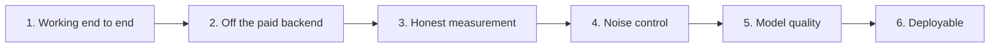

# fallacysuspect - Build plan

## Objective

A tool that reads a debate transcript and marks passages worth a second look, running
entirely on the machine it is installed on, at no cost per use, and never asserting a
verdict.

The measure of done is not "it produces output". It is: on a real debate transcript it
catches the textbook fallacies a careful reader would catch, and stays quiet on
conversational filler. Both halves count. A tool that flags everything is as useless as one
that flags nothing.

## Order of work

| Stage | Goal | Done when | Status |
| --- | --- | --- | --- |
| 1 | Transcript in, warnings out, in a browser and from a terminal | A pasted transcript produces highlighted spans and a report, and every run is recorded | Done |
| 2 | No per-call cost | Locally trained models serve every request, with the hosted service retained only as a fallback | Done |
| 3 | Numbers that can be believed | Quality measured on held-out real-world documents, split by document, with real negatives in the test set | Done |
| 4 | Suppress noise without hiding findings | Three gates in place, thresholds calibrated per model family, output on the sample transcript down from unusable to reviewable | Done |
| 5 | The models are actually good enough | Both stages trained on the improved data; the sample transcript's obvious false dilemma is caught and the false alarm rate stays low | **Not done. This is the current work** |
| 6 | Someone else can run it without a local setup | The light model pairing runs on a free host, driven by a committed configuration | Not started |

### Stage 5 in detail

Stage 4 squeezed everything a threshold can squeeze. What remains is a model problem, and
the evidence is specific: the flagship false dilemma in the sample transcript scores well
below the detector's threshold. No threshold rescues that. Lowering the gate to catch it
brings back the false alarms stage 4 removed.

The fix is to retrain the transformer stage on the improved data, which now includes
real-world negatives. The current transformer detector was trained before those negatives
existed, which is why it raises false alarms at a rate that makes it unusable despite
being the stronger architecture.

Order of work within the stage:

1. Retrain both stages on a free hosted GPU using the prepared notebook. Local CPU training
   works and takes ten to twenty minutes per run, which is too slow to iterate on.
2. Read the honest per-epoch metrics the notebook prints. Do not accept a run whose
   real-world numbers are worse than the current pairing.
3. Place the new model files where the application looks for them.
4. Restart and confirm the application auto-selects the newer models by their declared data
   version, with no code change.
5. Re-run the sample transcript. The false dilemma must be caught.
6. Confirm the false alarm rate has not regressed.

## Current measured state

Recorded here because a plan built on guessed quality is worthless. All figures are on
held-out real-world documents.

| Stage | Model family | Data version | Verdict |
| --- | --- | --- | --- |
| Detector | Light | Current | Usable. False alarm rate around a quarter, macro-F1 around 0.75 |
| Typer | Light | Current | Not usable. Macro-F1 around 0.14, and it scores zero on two of the most important patterns. Bag-of-words cannot see argument structure |
| Detector | Transformer | Stale | Not usable. False alarm rate above sixty percent, because it was trained without real-world negatives |
| Typer | Transformer | Stale | Usable. Handles real prose |

The application currently runs the light detector with the transformer typer, chosen
automatically as the best available pairing. That pairing is a workaround for two half-good
models, not a design.

Progress on the sample transcript: seventy-five findings originally, down to fourteen after
the gates, down to twelve after the retrained detector and calibrated thresholds. Twelve is
reviewable. Missing the false dilemma is not acceptable.

## Decisions already made

| Decision | Reason |
| --- | --- |
| Two stages rather than one multi-class model | Detecting that something is wrong and naming what is wrong are different problems with different error costs. Separating them lets each be gated independently |
| Warnings, never verdicts | The tool is not reliable enough to judge, and even if it were, judging is not what it is for |
| Confidence is the product of both stage confidences | A finding is only as good as the weaker of the two decisions behind it |
| The detector threshold is set per model family | Different families produce differently shaped probability distributions. One shared number discarded most real findings from the flatter family. This is a correction, not a preference |
| Dropped the paid hosted backend as the primary path | Per-call cost on a tool meant to be run freely and often |
| The hosted backend is kept as a fallback | It satisfies the same contract, so keeping it costs nothing and covers an installation with no models |
| Models declare their own class list and data version | Prevents a stale model being paired with a newer taxonomy, and lets the application pick the better pairing without being told |
| Real-world data is split by document | Splitting by sentence leaks context between train and test and inflates every number |
| Real-world negatives are in the training data | Without them the detector flags ordinary prose. This was observed, not predicted |
| Training runs offline, never in the application | Training is a separate activity with a separate lifecycle |
| The light model pair is the deployable one | The transformer weights exceed both the repository file size limit and the free hosting memory limit |
| No collection of any information about the user | Declined explicitly. Not revisited |
| Docker was dropped | The run path is a single command in a terminal. The container added a step and solved nothing |

## Open questions

| Question | Blocks | Notes |
| --- | --- | --- |
| Does the retrained transformer beat the current mixed pairing on real-world text? | Stage 5 | The whole stage rests on this. If it does not, the answer is more data, not more training |
| What is deployed, given the light typer is weak? | Stage 6 | Either accept degraded quality on the free host, or host the larger models elsewhere and pay for it. This is a product decision |
| Should classification work on a whole speaker turn instead of a passage? | Stage 5 or later | A turn is closer to the shape of the training data. It would change the highlighting granularity, which affects the interface |
| Is the real-world dataset large enough? | Stage 5 | A few hundred labelled fallacies is thin for fourteen classes. More labelled real-world data is the strongest lever available |

## Risks

| Risk | Effect if it happens | Response |
| --- | --- | --- |
| Retraining does not fix the miss | Stage 5 stalls and there is no threshold left to turn | Treat it as a data problem. The corpus is small for the number of classes |
| The deployable pairing is visibly worse than the local one | Anyone who tries the hosted version judges the project by the weaker model | Say so plainly wherever it is deployed, or do not deploy until it is good enough |
| Serialised light models break against a different library version | The application fails to load models on another machine | Regenerate the exports on the machine that will run them before committing |
| The tool is read as a verdict machine | The exact failure mode the design exists to avoid | Every finding is a warning, every finding carries a confidence, and the interface never scores a side |
| Findings are correct in location but wrong in name | Undermines trust even when the detection worked | Known and observed. Tracked as part of the typer quality problem |
