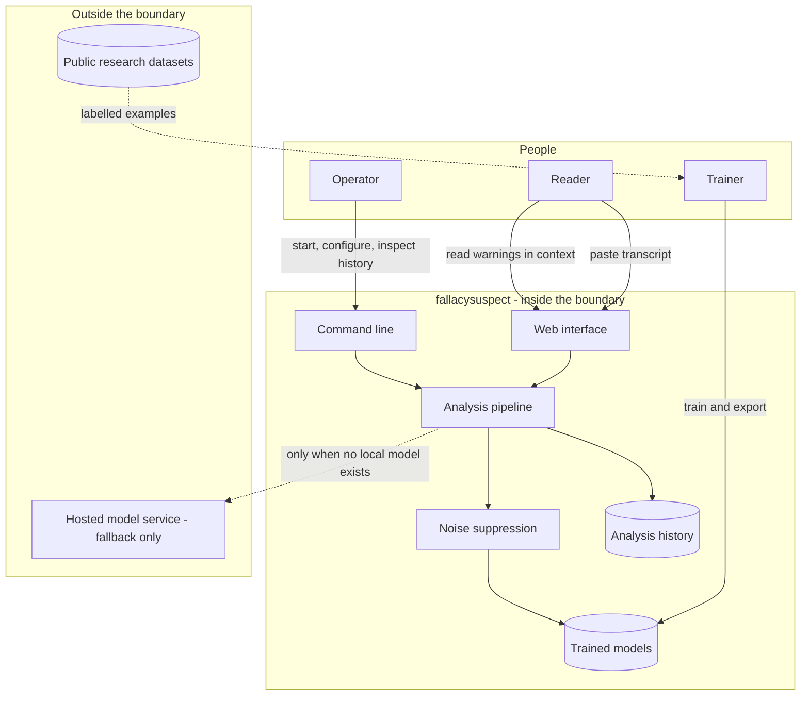

# fallacysuspect - Interaction and system boundary

## Actors

| Actor | Type | What they want |
| --- | --- | --- |
| Reader | Human | To find the weak reasoning in a long transcript without reading it four times |
| Operator | Human | To run the service, check what it has been doing, and swap the model it uses |
| Trainer | Human | To rebuild the models from data and measure whether they got better |
| Hosted model service | External system | Optional fallback that scores text when no local model is present |

The Reader and the Operator are usually the same person running it on their own machine.
They are separated because a deployed instance would split them, and the design should not
assume otherwise.

## Interaction diagram

## What the system is in the business of

- Locating passages whose reasoning shape matches a known fallacy pattern.
- Naming the pattern and defining it, so the reader can judge for themselves.
- Attaching a confidence to every finding and refusing to present one as a fact.
- Showing every finding next to the text it came from. A quote taken out of its transcript
  is not a finding, it is an accusation.
- Staying quiet on procedural and conversational filler rather than flagging everything
  that moves.
- Running for nothing. No per-request cost and no key.

## What the system does not care about

- Who is winning. There is no notion of a side, a speaker score, or a verdict.
- Whether a claim is true. Truth and validity are different problems and this tool only
  looks at the second.
- Tone, civility, or rhetoric that is intentional.
- Any patterns outside its fixed list. An unrecognised bad argument is silently ignored,
  which is preferable to inventing a category.
- Who the reader is. No accounts, no identifiers, no location, no usage analytics.
- Audio, video or images.
- Being right often enough to be trusted alone. It is a highlighter, not a referee.

## Main use cases

| ID | Actor | Goal | Trigger | Result |
| --- | --- | --- | --- | --- |
| UC-1 | Reader | Scan a transcript | Paste text, press Evaluate | Highlighted transcript and a report of warnings |
| UC-2 | Reader | Understand a warning | Read a report entry | The quote, the pattern name, its definition, and where possible a fair reading of the passage |
| UC-3 | Reader | Follow a highlight to its finding | Hover a marked passage | The matching report entry is identified |
| UC-4 | Reader | See progress on a long transcript | Analysis in flight | A bar advancing through the text, changing colour as findings accumulate |
| UC-5 | Operator | Analyse from a terminal | Run the check command with text | The same findings, printed |
| UC-6 | Operator | Review past runs | Run the history command | Previous analyses with their finding counts |
| UC-7 | Operator | Force a particular model | Set the model environment variable and restart | The chosen model is used instead of the automatic choice |
| UC-8 | Trainer | Improve the models | Rebuild datasets, train, export | New model files that the application picks up on next start |

## Constraints that come from the actors

- Nothing the Reader pastes may leave the machine when a local model is in use. A
  transcript can be private.
- The Operator must be able to run this without signing up for anything.
- Every finding shown to the Reader must be phrased as a possibility. The interface is not
  permitted to assert a fallacy.
- The Trainer must be able to measure quality on held-out real-world text, not just on the
  data the models were fitted to. Numbers that only look good on the training distribution
  are worse than no numbers.
