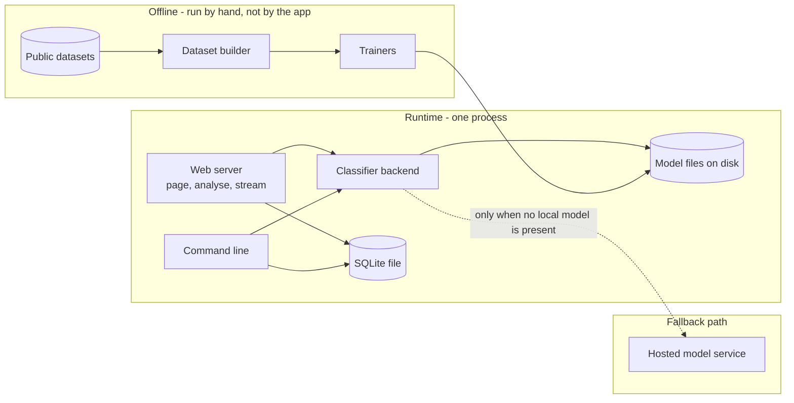
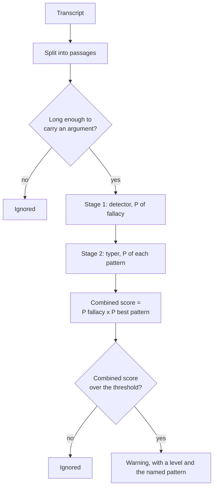
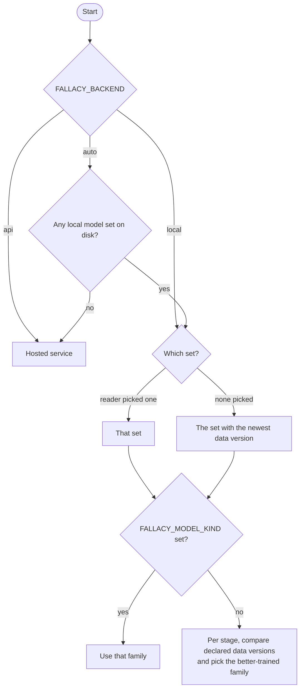
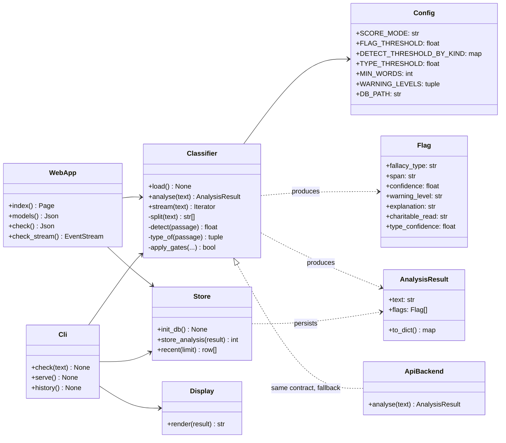
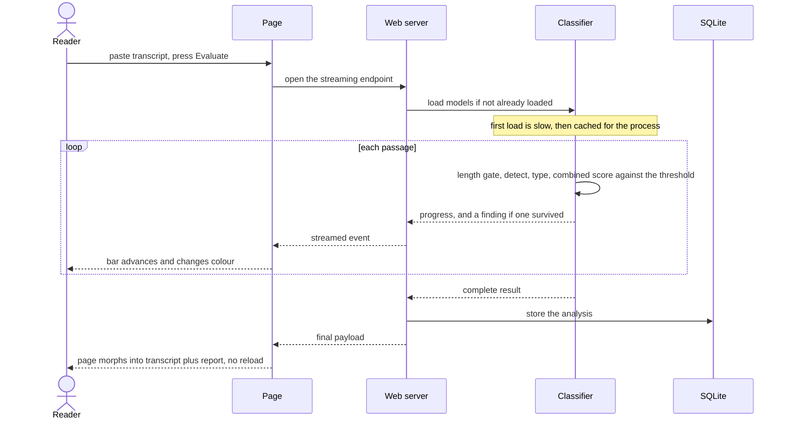
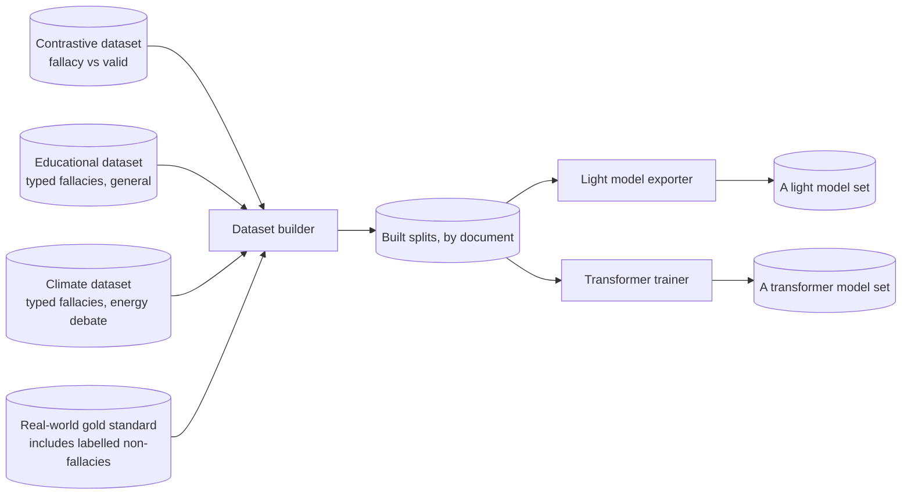

# fallacysuspect - Architecture

Internal document. Configuration values are named; secrets are referred to by their
environment variable only.

## Components

The running application is a single process. It is not distributed. The diagram below
separates the runtime from the two offline activities that feed it, because those are
separate pieces of work with separate lifecycles.

| Component | Runs where | Responsibility |
| --- | --- | --- |
| Web server | Local process | Serves the single page, the analyse and streaming endpoints, and an endpoint that lists the installed model sets for the switcher |
| Command line | Same process family | check, serve and history subcommands |
| Classifier backend | In-process | Loads a model set on first use and caches it, scores each passage, produces findings |
| Model files | Disk | One or more model sets, each a self-contained folder holding a detector and a typer, every file self-describing |
| SQLite file | Disk | Every analysis that was run |
| Dataset builder and trainers | Run by hand, offline | Turn public datasets into training splits and models |
| Hosted model service | External | The original backend, retained as a fallback when no local model exists |

The models being self-describing is the load-bearing detail. Each carries its own class
list and a data version, so the application can compare what it finds on disk, default to the
model set trained on the newest data, choose the better-trained family per stage, and never
let a model drift out of step with the taxonomy it was trained against. A transformer
detector also ships the decision threshold measured for it.

## The analysis pipeline

Two stages, applied per passage. The first decides whether there is a problem at all; the
second decides which one. Both stages vote on whether to flag; neither is allowed to veto on
its own.

### How a finding is decided

The length gate comes first: procedural lines - greetings, closings, thanks - carry no
argument and are dropped before any model runs (`FALLACY_MIN_WORDS`).

Everything past that is decided by one number, the **combined score**: the detector's
confidence that the passage is a fallacy at all, multiplied by the typer's confidence in the
single pattern it names. A passage is flagged when that product clears `FALLACY_FLAG_THRESHOLD`.
The score maps to a warning level so the interface can grade the display, and the typer's own
confidence is carried alongside as a separate figure.

This replaced an earlier design of three independent gates, where the detector and the typer
each had a veto. Measurement showed the type veto was the problem: it discarded passages the
detector was sure about whenever the typer, spreading its confidence across many similar
patterns, could not clear its own bar - including fallacies it had in fact named correctly.
Multiplying the two confidences uses both signals without letting either stage reject a
passage alone. When the typer's confidence is low, the pattern is still shown, marked as a
best guess, rather than the whole finding being thrown away.

| Control | Effect | Setting |
| --- | --- | --- |
| Minimum length | Drops passages too short to carry an argument | `FALLACY_MIN_WORDS` |
| Flag threshold | The one gate that decides whether to flag, on the combined score | `FALLACY_FLAG_THRESHOLD` |
| Scoring mode | `combined` (default) or `gates`, the retained legacy behaviour | `FALLACY_SCORE_MODE` |
| Type confidence | In `combined` mode, only decides whether the pattern is shown as confident or as a best guess. In `gates` mode it is a veto again | `FALLACY_TYPE_THRESHOLD` |
| Detector confidence | The detector's veto, used only in `gates` mode | see below |

In `gates` mode the detector threshold is resolved in order of precedence: an explicit
override (`FALLACY_DETECT_THRESHOLD`), then the threshold the model itself ships, then a
per-model-family default. The per-family default exists because different model families
produce differently shaped probability distributions, and one shared number silently
discarded most real findings from the flatter of the two. A transformer detector now measures
and ships its own threshold, so the number travels with the model rather than being guessed
in configuration.

## Backend and model selection

Selection happens at two levels: which backend, then, for the local backend, which model set
and which family per stage.

A **model set** is one folder under `models/` holding a pipeline descriptor and both stages.
Several can be installed at once. The application offers all complete sets in the interface,
defaults to whichever declares the newest data version, and lets the reader pick another for
a given run without a restart. Pinning one set through `FALLACY_MODEL_DIR` hides the menu and
uses only that set.

Within the chosen set, the two stages are still selected independently, so a strong detector
from one family can be paired with a strong typer from another. `FALLACY_BACKEND` and
`FALLACY_MODEL_KIND` override the backend and family choices respectively.

## Class diagram

`ApiBackend` stands in for the original hosted-service path. It is kept because it
satisfies the same contract, which is what makes the fallback possible at all. It is not
the primary path and carries a per-call cost, which is why the local models exist.

## Key sequence - analysing a transcript in the browser

## Offline: how models are produced

Each trainer writes a self-contained model set into its own folder under `models/`. The
transformer trainer additionally sweeps encoders and seeds, keeps the best on validation, and
measures the decision threshold it ships with the model.

Properties of the builder that are the reason the measured numbers can be believed:

- The real-world dataset is split by document into train, validation and test, so no part of
  a document appears on two sides. Splitting by sentence would leak and inflate every score.
- Selection is done on validation and reported on test, so the headline number is never the
  one the model was tuned against.
- Sentences shared verbatim between the sources and the held-out documents are removed from
  training, because the sources overlap and would otherwise leak.
- Real-world non-fallacious sentences are included as negatives. Training a detector only on
  textbook fallacies against textbook valid arguments produces a model that flags ordinary
  prose, which is exactly what happened before this was fixed.

The builder reconciles the sources rather than trusting any one: it recovers a pattern the
educational taxonomy had collapsed into another, drops two classes with no real-world
examples, and merges the two typed-fallacy sets. The current transformer set recognises
thirteen patterns; the older set recognises fourteen.

## Rules this architecture is meant to protect

- The interface may only ever present a warning. No code path is permitted to assert a
  fallacy or produce a verdict.
- Confidence, once computed, is displayed. It is not rounded away or hidden behind a badge.
- The length gate and the scoring threshold are the noise control. If output is too noisy,
  the fix is a better model or a recalibrated threshold, never a silent cap on how many
  findings are shown.
- Thresholds live in configuration, not scattered through the classifier.
- No transcript is sent anywhere when a local model is in use.
- No information about the reader is collected, at all. This was decided explicitly and any
  change to it is a product decision, not an implementation detail.
- Models declare their own classes and data version. Nothing else is allowed to assume what
  a model file contains.
- Training is never run by the application. It happens offline and produces files.
