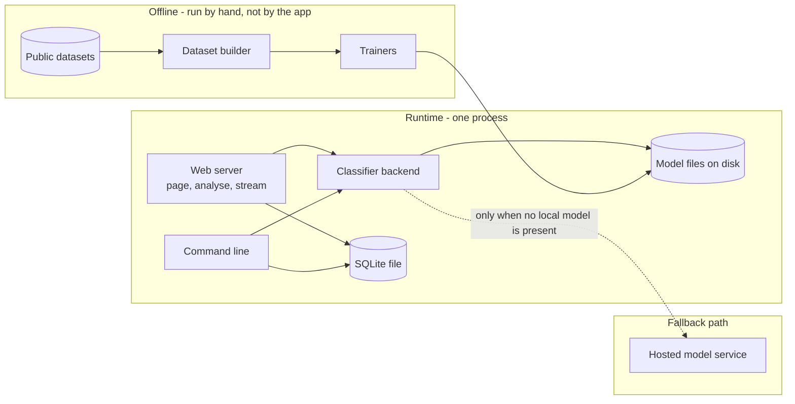
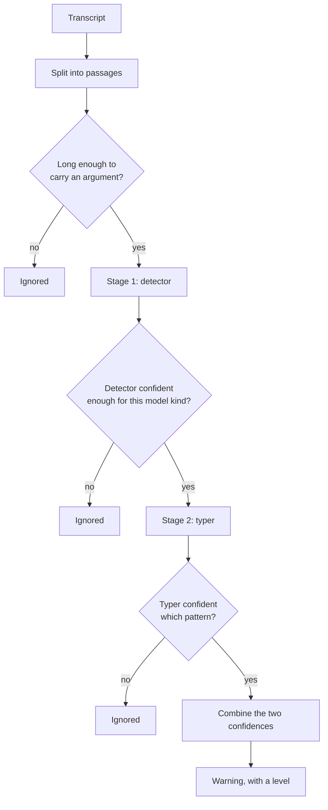
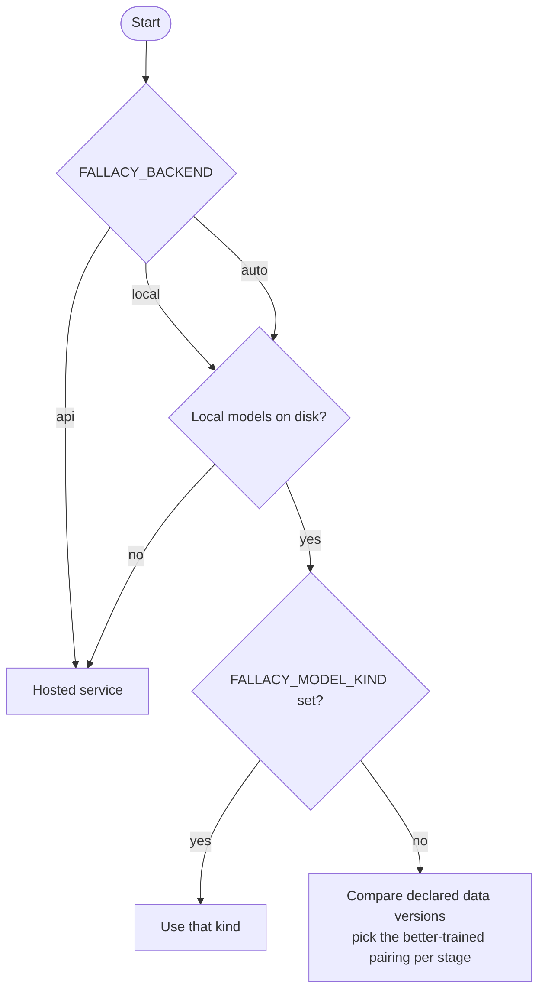
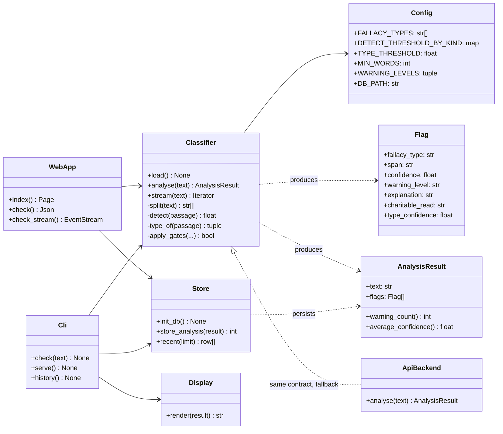
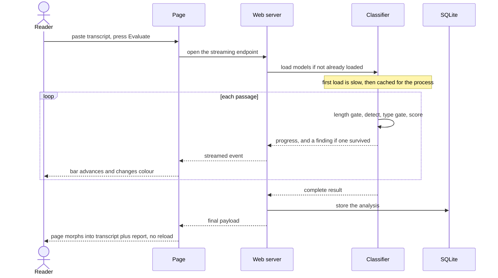
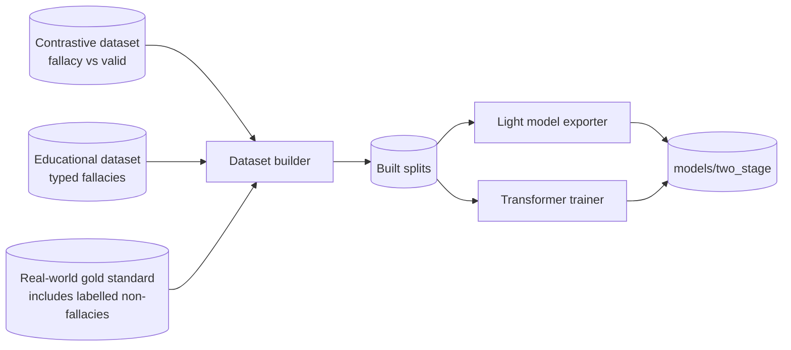

# fallacysuspect - Architecture

Internal document. Configuration values are named; secrets are referred to by their
environment variable only.

## Components

The running application is a single process. It is not distributed. The diagram below
separates the runtime from the two offline activities that feed it, because those are
separate pieces of work with separate lifecycles.

| Component | Runs where | Responsibility |
| --- | --- | --- |
| Web server | Local process | Serves the single page, the analyse endpoint, and the streaming endpoint that drives the progress bar |
| Command line | Same process family | check, serve and history subcommands |
| Classifier backend | In-process | Loads the models once, applies the gates, produces findings |
| Model files | Disk | The trained detector and typer, each self-describing |
| SQLite file | Disk | Every analysis that was run |
| Dataset builder and trainers | Run by hand, offline | Turn public datasets into training splits and models |
| Hosted model service | External | The original backend, retained as a fallback when no local model exists |

The models being self-describing is the load-bearing detail. Each carries its own class
list and a data version, so the application can compare what it finds on disk and choose
the better-trained pairing, and a model can never drift out of step with the taxonomy it
was trained against.

## The analysis pipeline

Two stages, applied per passage. The first decides whether there is a problem at all; the
second decides which one.

### Why there are three gates

Each one removes a different kind of noise, and removing any of them makes the output
worse in a different way.

| Gate | Removes | Setting |
| --- | --- | --- |
| Minimum length | Procedural lines - greetings, closings, thanks - that carry no argument | `FALLACY_MIN_WORDS` |
| Detector confidence | Passages the detector is unsure about | Per model kind, overridable with `FALLACY_DETECT_THRESHOLD` |
| Type confidence | Passages where something looks wrong but the pattern cannot be named. This is the strongest single filter | `FALLACY_TYPE_THRESHOLD` |

The detector threshold is set per model kind rather than shared. Different model families
produce differently shaped probability distributions, and one shared number silently
discarded most real findings from the flatter of the two. This is a deliberate correction,
not a tuning convenience, and it must survive any future refactor.

The reported confidence is the product of the two stage confidences, and it maps to a
warning level so the interface can grade the display.

## Backend selection

Selection can be overridden by `FALLACY_BACKEND` and `FALLACY_MODEL_KIND`. Left alone it
reads what is on disk and chooses. The two stages are chosen independently, so a strong
detector from one family can be paired with a strong typer from another.

## Class diagram

`ApiBackend` stands in for the original hosted-service path. It is kept because it
satisfies the same contract, which is what makes the fallback possible at all. It is not
the primary path and carries a per-call cost, which is why the local models exist.

## Key sequence - analysing a transcript in the browser

## Offline: how models are produced

Two properties of the builder are the reason the measured numbers can be believed:

- The real-world dataset is split by document, not by sentence, so no part of a document
  appears in both training and test. Splitting by sentence would leak and inflate every
  score.
- Real-world non-fallacious sentences are included as negatives. Training a detector only
  on textbook fallacies against textbook valid arguments produces a model that flags
  ordinary prose, which is exactly what happened before this was fixed.

The builder also adds a pattern the educational dataset lacks entirely, bringing the
taxonomy to fourteen classes.

## Rules this architecture is meant to protect

- The interface may only ever present a warning. No code path is permitted to assert a
  fallacy or produce a verdict.
- Confidence, once computed, is displayed. It is not rounded away or hidden behind a badge.
- The gates are the noise control. If output is too noisy, the fix is a better model or a
  recalibrated gate, never a silent cap on how many findings are shown.
- Thresholds live in configuration, not scattered through the classifier.
- No transcript is sent anywhere when a local model is in use.
- No information about the reader is collected, at all. This was decided explicitly and any
  change to it is a product decision, not an implementation detail.
- Models declare their own classes and data version. Nothing else is allowed to assume what
  a model file contains.
- Training is never run by the application. It happens offline and produces files.
