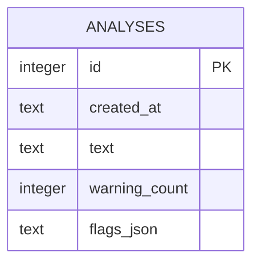
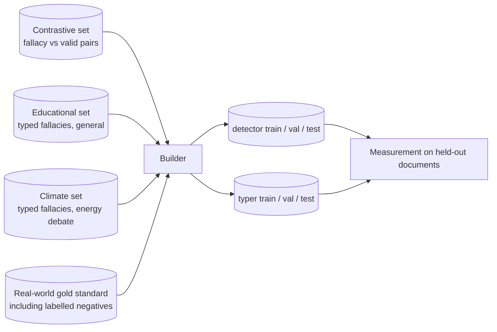

# fallacysuspect - Data model

There are two separate bodies of data and they should not be confused. The application
database holds what the tool has been asked to analyse. The training corpus is offline
material used to produce models and is never touched at runtime.

## Application store

SQLite, a single file, one table. The path is set by `FALLACY_WARN_DB` and defaults to a
file in the working directory. Write-ahead logging is enabled so that a browser making
several requests at once does not trip a lock.

The file is local to whoever runs the application. There is no server-side database and no
shared instance.

### Entity relationship

One table, deliberately. A findings table was considered and rejected: findings are only
ever read back as a complete set belonging to one analysis, they are never queried across
analyses, and their shape changes whenever the taxonomy changes. Storing them as a document
keeps the schema stable through model changes.

### `analyses`

One row per completed analysis, written after the run finishes.

| Column | Type | Notes |
| --- | --- | --- |
| `id` | integer | Primary key, auto-increment |
| `created_at` | text | Timestamp of the run |
| `text` | text | The transcript exactly as submitted |
| `warning_count` | integer | Number of findings that survived the length gate and the scoring threshold. Denormalised so history can be listed without parsing the document |
| `flags_json` | text | The findings, serialised |

### Shape of a stored finding

Each element inside `flags_json` carries the fields below. This is a document, not a
schema; a reader must tolerate fields being absent on older rows.

| Field | Meaning |
| --- | --- |
| `fallacy_type` | One of the patterns the model that ran recognises |
| `span` | The exact quoted passage the warning refers to |
| `confidence` | Combined confidence, the product of both stage confidences |
| `type_confidence` | The second stage's confidence on its own. When it is low, the type is shown as a best guess rather than dropped |
| `warning_level` | Low, medium or high, derived from the combined confidence |
| `explanation` | What the named pattern is |
| `charitable_read` | The strongest fair reading of the passage, where one is available |

### Constraints worth stating

- Nothing enforces referential integrity, because there is nothing to refer to.
- The transcript is stored verbatim. Anyone running this on sensitive material should know
  that the file on disk contains it.
- Rows are never updated. An analysis is a record of one run against whatever models were
  loaded at the time.
- The database is not versioned by the taxonomy. A row written under an older class list
  keeps its old type names.

## Training corpus

Offline material. Not read by the running application, not committed to the repository, and
not part of any backup the application is responsible for.

The three source projects do not agree with each other, and reconciling them is where most
of the model quality comes from. They are combined, not used in isolation.

| Source | Used for | Notes |
| --- | --- | --- |
| Contrastive set | Detector negatives and positives | Its valid half is the only argument-shaped negative available; the rest are ordinary prose |
| Educational set | Both stages | Every row is a fallacy. Fed to the typer for its type, and to the detector as a positive so the detector finally sees examples it was missing |
| Climate set | Both stages | Same taxonomy as the educational set, an energy-debate domain, and previously unused. Closest domain to the transcripts the tool actually receives |
| Real-world gold standard | Both stages, plus the honest split | The only source with labelled non-fallacious sentences, which is what stops the detector flagging ordinary prose, and the only honest evaluation set |

Three reconciliations the builder performs, each fixing an inconsistency between the sources:

- One pattern the educational taxonomy collapsed into another is recovered from its original
  label, so it is trained as itself rather than mislabelled.
- Two classes with no examples in the real-world set are dropped, because on the real-world
  evaluation they can only ever be a wrong prediction, never a correct one.
- Any sentence shared verbatim between the sources and the held-out documents is removed from
  training, so the honest split cannot leak.

### The honest split

The real-world material is split **by document** into train, validation and test. Two
sentences from the same document never end up on opposite sides. The validation split
chooses the best epoch, encoder and threshold; the test split is scored once and never used
for any decision. Splitting by sentence, or selecting on the test split, would inflate every
reported number.

Two earlier project outputs remain on disk but are not used to train: a pre-baked build of
the older splits, and a human-annotator agreement study whose documents are already inside
the gold standard and would leak if trained on.

## Model artefacts

Each trained model lives in its own folder under `models/`. A folder holding a pipeline
descriptor and both stages is one **model set**, and any number of them can be installed
side by side.

| Set | Stages | Size | Committed |
| --- | --- | --- | --- |
| Baseline (`v1_baseline`) | Light detector, transformer typer | Light part under a megabyte; typer hundreds of megabytes | Only the light parts. This is the deployable pairing |
| Transformer (`v2_bert`) | Transformer detector and typer | Hundreds of megabytes each | No. Over the hosting file size limit and over the free-tier memory limit |
| Pipeline descriptor | Per set | Small | Yes |

Every model file declares its own class list and the data version it was trained on, and a
transformer detector additionally ships the decision threshold measured for it. The
application reads those declarations rather than assuming. This is what lets the two stages
be sourced from different model families, lets the application default to the set trained on
the newest data, and prevents a stale model being paired with a newer taxonomy.

## What is deliberately not stored

- Anything identifying the person using the tool. No address, no location, no device or
  session identifier, no usage analytics. This was decided explicitly.
- No account, because there are no accounts.
- No per-speaker record. The tool has no concept of who said what beyond the text itself.
- No verdicts, scores per side, or anything that could be aggregated into one.
