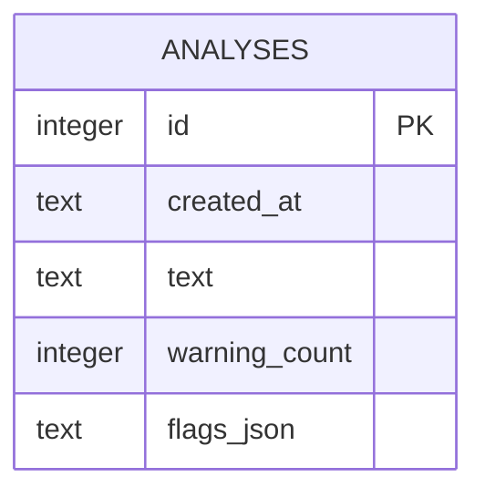
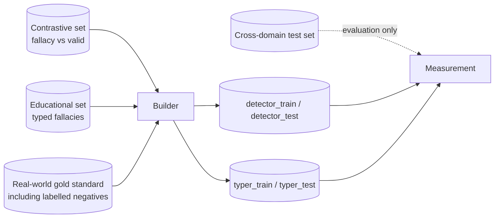

# fallacysuspect - Data model

There are two separate bodies of data and they should not be confused. The application
database holds what the tool has been asked to analyse. The training corpus is offline
material used to produce models and is never touched at runtime.

## Application store

SQLite, a single file, one table. The path is set by `FALLACY_WARN_DB` and defaults to a
file in the working directory. Write-ahead logging is enabled so that a browser making
several requests at once does not trip a lock.

The file is local to whoever runs the application. There is no server-side database and no
shared instance.

### Entity relationship

One table, deliberately. A findings table was considered and rejected: findings are only
ever read back as a complete set belonging to one analysis, they are never queried across
analyses, and their shape changes whenever the taxonomy changes. Storing them as a document
keeps the schema stable through model changes.

### `analyses`

One row per completed analysis, written after the run finishes.

| Column | Type | Notes |
| --- | --- | --- |
| `id` | integer | Primary key, auto-increment |
| `created_at` | text | Timestamp of the run |
| `text` | text | The transcript exactly as submitted |
| `warning_count` | integer | Number of findings that survived all three gates. Denormalised so history can be listed without parsing the document |
| `flags_json` | text | The findings, serialised |

### Shape of a stored finding

Each element inside `flags_json` carries the fields below. This is a document, not a
schema; a reader must tolerate fields being absent on older rows.

| Field | Meaning |
| --- | --- |
| `fallacy_type` | One of the fourteen recognised patterns |
| `span` | The exact quoted passage the warning refers to |
| `confidence` | Combined confidence, the product of both stage confidences |
| `type_confidence` | The second stage's confidence on its own |
| `warning_level` | Low, medium or high, derived from the combined confidence |
| `explanation` | What the named pattern is |
| `charitable_read` | The strongest fair reading of the passage, where one is available |

### Constraints worth stating

- Nothing enforces referential integrity, because there is nothing to refer to.
- The transcript is stored verbatim. Anyone running this on sensitive material should know
  that the file on disk contains it.
- Rows are never updated. An analysis is a record of one run against whatever models were
  loaded at the time.
- The database is not versioned by the taxonomy. A row written under an older class list
  keeps its old type names.

## Training corpus

Offline material. Not read by the running application, not committed to the repository, and
not part of any backup the application is responsible for.

| Source | Used for | Notes |
| --- | --- | --- |
| Contrastive set | Stage one, fallacy against valid | Balanced |
| Educational set | Stage two, typed fallacies | Lacks one pattern, which the builder supplies |
| Real-world gold standard | Both stages, and the honest test set | Contains labelled non-fallacious sentences, which is what stops the detector flagging ordinary prose |
| Cross-domain set | Evaluation only | Never trained on |

### Built splits

| File | Contents |
| --- | --- |
| `detector_train` | Passages labelled fallacy or not |
| `detector_test` | Held-out real-world documents |
| `typer_train` | Fallacious passages with their pattern |
| `typer_test` | Held-out real-world documents |

The real-world material is split **by document**. Two sentences from the same document
never end up on opposite sides of the split. Splitting by sentence would leak context
between train and test and make every reported number meaningless.

## Model artefacts

| Artefact | Size | Committed |
| --- | --- | --- |
| Light model pair | Under a megabyte | Yes. This is the deployable pairing |
| Transformer model pair | Hundreds of megabytes each | No. Over the hosting file size limit and over the free-tier memory limit |
| Pipeline descriptor | Small | Yes |

Every model file declares its own class list and the data version it was trained on. The
application reads those declarations rather than assuming, which is what allows the two
stages to be sourced from different model families and what prevents a stale model from
being paired with a newer taxonomy.

## What is deliberately not stored

- Anything identifying the person using the tool. No address, no location, no device or
  session identifier, no usage analytics. This was decided explicitly.
- No account, because there are no accounts.
- No per-speaker record. The tool has no concept of who said what beyond the text itself.
- No verdicts, scores per side, or anything that could be aggregated into one.
