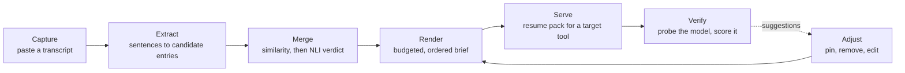

# herder

Portable, user-controlled memory for AI chat.

herder takes a long conversation with any chatbot and keeps the part worth keeping: a compact,
versioned brief of the decisions, constraints, preferences and open threads it established, with
every line traceable back to the messages it came from. The brief can be pasted into any other AI
tool, and a benchmark in this repository measures how much of the conversation survives the trip.

**It runs no hosted model and needs no API key.** Every model it uses is a file on disk.

## The result

Eight long synthetic conversations, 221 true facts and 40 false ones written by hand, and four ways
of carrying a conversation forward - all judged by the same local model on the same answer key, in
one run (`bench/results/2026-09-16_2321-full-comparison-render`).

| Method | Budget | Tokens used | Recall | Wrong claims | Compression |
| --- | --- | --- | --- | --- | --- |
| **herder** | 3,000 | 772 | **0.68** (150 of 221) | **0 of 40** | 14.3x |
| plain summary | 3,000 | 2,084 | 0.20 (39 of 195) | 3 of 35 | 5.3x |
| most recent text | 3,000 | 2,967 | 0.32 (70 of 221) | 0 of 40 | 3.7x |
| **herder** | 500 | 484 | **0.54** (119 of 221) | **0 of 40** | 22.8x |
| plain summary | 500 | 421 | 0.04 (8 of 195) | 0 of 35 | 26.3x |
| most recent text | 500 | 438 | 0.07 (16 of 221) | 0 of 40 | 25.2x |
| nothing | - | 0 | 0.00 | 0 | - |

- At a 3,000-token budget herder carries **3.4 times** what a plain summary does while using **37% of
  its tokens**, and 2.1 times what the most recent text does in 26% of its tokens.
- **At 500 tokens it recalls 0.54 where the alternatives manage 0.07 and 0.04** - eight to thirteen
  times as much, from a brief 23 times smaller than the conversation.
- On the facts rated **essential** the gap is widest: **0.81** against 0.29 and 0.31 at 3,000 tokens,
  and **0.68** against 0.11 and 0.06 at 500.
- It is the only method in the run that never carried a claim forward after the user had reversed it.
  The plain summary did so three times.

**What this does not show.** The project's own target was 0.85 recall at 20x compression; this is 0.68
at 14.3x, and 0.54 at 22.8x. The summary timed out on one conversation, so its rates cover seven of
eight. The conversations were generated, and their claims are cleaner than real chat. The judge
disagrees with itself on about 3.4% of verdicts between runs, so a difference of a few facts is noise -
and this run was interrupted by a machine restart and resumed, so its verdicts come from two sessions
of that judge. See [Limitations](#limitations).

## The problem

Context does not travel between AI tools. A long session establishes decisions, constraints and
half-finished threads, and none of it reaches the next session, another vendor, or an agent. Vendor
memory belongs to the vendor, stops at its boundary, and cannot be inspected or corrected.

The usual workaround is pasting the last few thousand tokens into the new chat. That keeps whatever
happened to be recent and drops whatever happened to be early - usually the part where the
constraints were agreed. It is the "most recent text" row above.

## How it works



1. **Capture.** A pasted transcript is split into turns and stored append-only. A paste is
   content-addressed, so pasting the same conversation twice adds nothing.
2. **Extract.** Only what the user said is read - a conversation with a chatbot is mostly the
   chatbot talking, and treating its suggestions as fact fills the memory with ideas the user turned
   down. Each candidate entry has a kind (decision, constraint, preference, fact, open thread...) and
   cites the exact messages it came from; a candidate citing a message that was not there is dropped.
3. **Merge.** Each candidate is compared with stored entries - embedding similarity first, because it
   is cheap, then a natural-language-inference model decides: **duplicate** (it entails the stored
   entry and back), **update** (it entails it and adds detail), **supersede** (they contradict each
   other) or **distinct**. A sentence that announces its own change ("correction", "change of plan",
   "I said earlier") retires what it contradicts on one strong reading. An entry the user removed
   never comes back, and an entry the user pinned or edited is never changed by derivation.
4. **Render.** Active entries are compiled into a brief under a token budget, most important kinds
   first, with a share reserved for the most recent turns. Every render is an immutable version that
   records what it left out.
5. **Serve and verify.** The brief goes out as a resume pack with an instruction preamble for the
   target tool. A checkpoint asks the model questions only the brief can answer and reports what was
   lost, which becomes a suggestion in the adjuster.

Everything runs locally: rules for extraction, `cross-encoder/nli-deberta-v3-base` for merge
verdicts and grading, `all-minilm` embeddings in PostgreSQL with pgvector, and a small `qwen2.5:3b`
through Ollama as the benchmark's reader. A web UI serves the paste box, the adjuster, the brief with
its versions, lineage per entry, and checkpoint results.

### Why it is built this way

> **To be written by the author.** The three design calls an interviewer will probe, in your own
> words:
>
> - **The render ordering** - why constraints come before decisions and decisions before facts, and
>   why the most recent turns get a reserved share rather than competing.
> - **The merge verdicts** - why four verdicts rather than two; why an unreadable verdict falls back
>   to `distinct` rather than `duplicate`; why a removed entry is never resurrected; why a correction
>   may retire an entry on one direction of contradiction while everything else needs both.
> - **The integrity weighting** - why checkpoint probes come from three places (in the brief, cut by
>   the budget, never extracted) and why a system that only probed the first would look good while
>   dropping almost everything.

## How it is measured

**The circular-measurement problem is the thing to get right.** A model extracts, a model answers,
and a model grades - left alone, that is one system agreeing with itself. The benchmark breaks the
circle with an answer key **written by hand**: 261 facts across eight conversations, each citing the
turns it comes from, 40 of them false on purpose - suggestions the user refused and decisions later
reversed. Recall is measured on the true facts; wrong claims on the false ones.

- **Four methods, one reader.** herder, a plain map-reduce summary given the same budget, the most
  recent text cut to the budget, and nothing at all. Every context is judged by the same local model
  with the same prompt, so a difference in score is a difference in the context.
- **Facts are rated by importance** (essential, useful, incidental) before any result is looked at,
  so a system that keeps the database choice and drops the delivery day scores differently from one
  that does the opposite.
- **The answer key was audited blind.** Eight reviewers, shown no results, checked all 261 facts
  against the conversations; 3 were corrected, each with its evidence recorded in the fact itself.
- **Nothing from the benchmark conversations may enter training or rules.** The training-set builder
  checks every sentence against them and reports the count; a test fails if an extraction rule keys on
  a phrase the conversation generator uses.

The in-product checkpoint score is model-generated and model-graded. It is useful for finding what a
brief dropped; it is **not** the headline number, and the checkpoint page says so.

## What did not work

Kept on purpose. Each one is in [NOTES.md](NOTES.md) with its numbers.

- **A local language model lost to a list of rules.** `qwen2.5:3b` as the extractor recalled 0.20
  against the rules' 0.41, kept half the entries, and took 272 seconds a conversation against 9.
- **The specification's similarity threshold would have stopped merging.** 0.86 was calibrated for a
  different embedding model; against `all-minilm` one labelled pair in eleven cleared it. Measured and
  set to 0.50.
- **Every early wrong claim was a missed reversal.** Across both budgets the baseline carried nine false
  claims forward, and all nine were decisions the user had changed; the sentences announcing the change matched no rule, so
  nothing ever contradicted the stale entry. Fixed by extraction first and by the merge step later.
- **A better score on test pairs did not survive real conversations - three times.** A smaller NLI
  checkpoint (17 of 20 labelled pairs against 15) fixed one bad merge, lost a correct one and created a
  new wrong one. Two fine-tuned
  models (18 and 17 of 20) each fixed real bad merges and lost a real reversal, serving a claim the
  user had withdrawn. Across both, fine-tuning made the model **less sure about everything** rather
  than better at telling cases apart - a true reversal scored 0.57 and a false one 0.56.
- **Off-the-shelf models failed in structural ways.** A licence-clean zero-shot checkpoint had a
  two-label head that cannot express contradiction, caught by a guard that refuses any head it cannot
  read. Models trained on revised Wikipedia facts called a plain reversal neutral.
- **The judge is not deterministic.** Two runs of identical code on byte-identical briefs disagreed on
  18 of 522 verdicts. Two back-to-back runs had agreed on all 518, which had been taken as proof;
  it was not.

> **To be written by the author:** what surprised you, what you would do differently, and which of
> these you would lead with in an interview.

## Limitations

- **Short of its own target.** 0.68 at 14.3x, or 0.54 at 22.8x - not 0.85 at 20x.
- **Eight synthetic conversations.** The claims in them are clean single clauses, which suits a
  rule-based extractor; real chat is messier, and no held-out set in different wording has been
  measured. Every rate is reported with its count for that reason.
- **The judge is a 3-billion-parameter local model.** It is strict, which lowers every method equally,
  and it varies by about four facts between runs.
- **The small budget is still the weaker one**, though less so than it was: ordering entries by
  priority and cutting the verbatim reserve from a quarter of the budget to a tenth took recall at 500
  tokens from 0.44 to 0.54, and open threads there from 2 of 24 to 13.
- **Extraction is rules over English cue phrases.** A bare "yes, do that" carries nothing, because the
  content lives in the assistant's turn, which is never read.
- **The merge model sometimes reads agreement as contradiction** - "No evening opening." retired by
  "Opening hours will be 7am to 4pm" is one recorded case.
- **Not built:** the browser extension, the MCP server and hosting, all optional in the plan. Hosting is
  handled for the portfolio as a whole.

## Running it

Windows PowerShell 5.1. Docker Compose brings up the API, the worker and PostgreSQL with pgvector.
[Ollama](https://ollama.com) with `qwen2.5:3b` and `all-minilm` is needed for embeddings and for the
benchmark's reader.

```powershell
Copy-Item .env.example .env
docker compose up -d
docker compose exec api alembic upgrade head
Invoke-RestMethod http://localhost:8000/health

# an account and an API key (printed once)
docker compose exec api python -m herder bootstrap --email you@localhost
```

Then open `http://localhost:8000`, log in with the key, and paste a transcript that labels its turns
(`User:` / `Assistant:`). The API documentation is at `http://localhost:8000/docs`.

The same loop from the command line: `python -m herder derive | brief | render | resume | checkpoint |
entries | adjust | suggestions`.

### Tests

```powershell
python -m venv .venv
.\.venv\Scripts\pip install -r requirements.txt
.\.venv\Scripts\python -m pytest -q
```

497 tests. The ones that need the database skip when it is not running.

### The benchmark

```powershell
$env:HERDER_KEY = "hrd_..."
python -m bench.run --label trial                     # all four methods, about an hour
python -m bench.run --label trial --methods herder    # herder alone, about six minutes
python -m bench.report bench/results/<run>            # rebuild a report
python -m bench.nli_compare                           # score NLI checkpoints on labelled pairs
```

Fact lists are written and rated in the browser at `http://localhost:8000/bench`.

### Training

`training/` holds the recipe and a Colab notebook for fine-tuning the merge model on public data
(VitaminC, WANLI) plus pairs written for this project. See [training/README.md](training/README.md) for
the licences and for why neither trained model is the one running.

## Configuration

Everything comes from the environment; see [.env.example](.env.example). There is no provider key.

| Variable | Default | What it does |
| --- | --- | --- |
| `HERDER_EXTRACTOR` | `heuristic` | `heuristic` or `local`; `trained` is reserved and refuses to start. An unknown value is an error, never a silent default |
| `HERDER_NLI_MODEL` | `cross-encoder/nli-deberta-v3-base` | The merge and grading model. A head that is not three-label is refused |
| `HERDER_SIMILARITY_THRESHOLD` | `0.50` | The cheap pre-filter before an NLI verdict. Tuned for recall |
| `HERDER_BRIEF_BUDGET_TOKENS` | `3000` | The brief's token budget |
| `HERDER_SESSION_TAIL_TOKENS` | `1200` | The share reserved for the most recent turns |
| `HERDER_OLLAMA_URL` / `HERDER_LLM_MODEL` | `localhost:11434` / `qwen2.5:3b` | The local model, for the `local` extractor and the benchmark |
| `HERDER_MODEL_DIR` | `./models` | Weights. Gitignored |

`/health` reports which extractor is running, because briefs from different extractors are not
comparable.

## Layout

```
herder/
  api/         routers. No logic, no inference
  core/        config, database, ids, embeddings, NLI
  domain/      pure functions: chunking, merging, rendering, scoring
  extractors/  heuristic and local
  services/    orchestration: ingest, derive, serve, checkpoint, adjust
  web/         the server-rendered UI
  worker/      the job runner. All inference happens here
bench/         the benchmark: conversations, fact lists, methods, reports, results
training/      the merge-model training recipe and notebook
migrations/    Alembic
requirements/  the plan, the architecture and the task list
NOTES.md       what was tried and what the numbers did
```

## Credits

Training data for the merge-model experiments: **VitaminC** (Schuster, Fisch and Barzilay, NAACL 2021,
CC BY-SA 3.0) and **WANLI** (Liu et al., 2022, CC BY 4.0). The running merge model is
`cross-encoder/nli-deberta-v3-base` (Apache-2.0).
