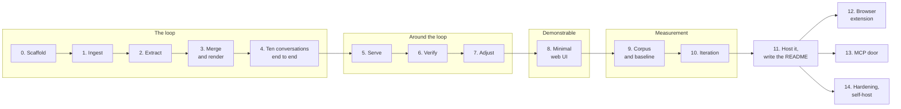

# herder - Build plan

## Objective

**The primary goal is a system that runs and produces a number.** Something that can be
opened in a browser, handed a long transcript, and watched turning it into a few thousand
tokens that still work - and a benchmark in this repository saying how well they work
compared to the obvious alternative.

Both halves are required here, and that is different from the sibling project. mailman could
be shown without its harness and still look like something. herder cannot: a summariser with
no measurement is indistinguishable from every other summariser, and the entire claim of this
project is that a structured, layered, lineage-carrying brief beats a summary at the same
token budget. Without the number there is no project, only an assertion.

Finished, for the purpose of this project, when four things are true:

1. A person who is not the author can paste a long conversation and get a brief back, with
   every line traceable to the messages it came from.
2. The adjuster shows what is in the brief and what did not fit, and removing an entry
   changes the next brief and keeps it changed.
3. The README carries the compression ratio and the integrity score produced by the harness
   in this repository, beside the same numbers for a plain summary and for tail truncation,
   including the runs where herder did not win.
4. It is hosted somewhere with a link that can go on an application.

There are no dates in this plan. Stages are ordered by what each one needs from the one
before it.

## Order of work

| Stage | Goal | Done when |
| --- | --- | --- |
| 0 | Scaffold | FastAPI, Docker Compose with PostgreSQL and pgvector, one hand-written Alembic migration creating every table, `/health` green from PowerShell **and verified to go red**, `.env` and `06-context.md` gitignored before the first commit |
| 1 | Ingest | `POST /ingest/paste` takes a transcript, parses it into turns, and stores them append-only against a conversation and a project. Re-pasting the same transcript adds no messages. `POST /ingest` takes the extension's batch shape and is idempotent on the same hash |
| 2 | Extract | One chunk goes through **both** the `heuristic` and the `local` extractor and comes back as candidate entries with lineage that validates against the chunk. Every call writes a `model_calls` row with its implementation, prompt version, tokens, latency and raw output. Invented lineage, empty lineage and a timeout are handled as three different things. **The wall-clock cost of one real chunk is measured and written down here** |
| 3 | Merge and render | **The loop closes.** Embeddings, similarity search, adjudication, the session tail, and a rendered brief version under budget with what it excluded recorded. `GET /projects/{id}/brief` returns it. Removing an entry and re-deriving does not bring it back |
| 4 | Ten conversations end to end | Ten varied long transcripts go in and briefs come out, **and there is a written list of everywhere it got something wrong**. That list is what stages 6 and 10 are aimed at. The first real compression ratio is recorded here |
| 5 | Serve | Resume packs with a per-vendor preamble, `GET /resume`, and an injection row per serve. The pack can be pasted into a chat by hand and visibly works |
| 6 | Verify | Probe generation cached per revision, `local`-mode checkpoints, NLI grading, the integrity score with its three weighted categories, and a suggestion for every zero |
| 7 | Adjust | Pin, remove, edit, re-layer, add, promote. Re-render without re-extracting. The invariants in [04-data-model.md](04-data-model.md) all have tests, especially "removed never resurrects" |
| 8 | Minimal web UI | **The demo exists.** Adjuster with three columns, the brief, a checkpoint detail page, a lineage panel. Bare. No styling pass |
| 9 | Corpus and baseline | Twenty synthetic conversations with hand-written ground-truth fact lists, a harness that runs `herder`, `naive_summary` and `truncate_tail` at the same budget, and **a recorded baseline** |
| 10 | Iteration | At least three genuine attempts at improvement, each measured, each written down, including the ones that failed |
| 11 | Host it, write the README | A public link, and a README with the problem, the diagram, the numbers, the dead ends and the limitations |
| 12 | Browser extension | Optional. ChatGPT and Claude adapters with DOM fixture tests, the observer, batching and retry, the popup, and the `in_chat` checkpoint |
| 13 | MCP door | Optional. Six tools over the API that already exists |
| 14 | Hardening and self-host | Optional. Export, delete, rate limits, `/metrics`, and the self-host document |

**Stages 0 to 9 are done. The demo runs in a browser and the baseline is recorded**: 261
hand-written facts, herder at 0.36 recall and 11.4x compression. Stage 10 is the current work,
and the gate on stage 8 is lifted.

**[05-tasks.md](05-tasks.md) is the authority on status**, and the only place test counts and
per-stage verification live. This paragraph names the stage and nothing more, on purpose: the
same status used to be restated in three documents and it drifted in all of them - this one
still claimed stage 2 was current after stage 3 had shipped. A fact worth stating once is
worth stating in one place.

### Why the core loop comes before everything else

The specification this folder was written from ends with an instruction from its author:
build the core loop first and stop, because the only expensive question in the project is
whether derivation produces a brief twenty times smaller than its source that still scores
0.85 or better. Everything else is plumbing.

That is right, and it is why the extension - which is the most impressive part to watch and
the part a demo video would lead with - is stage 12 rather than stage 3. The extension proves
that turns can be scraped from a page. It proves nothing about whether the memory is any
good, and it is the most fragile code in the project, because it depends on the private DOM
of three products that are rewritten without notice. Building it early would mean maintaining
it through every stage that follows for no gain in what the project can claim.

The paste door reaches the same place with a parser and no fragility. If the loop works on a
pasted transcript it works on a captured one, because by ingest time they are the same rows.

### Why ten conversations come before the verification stage

Copied deliberately from the sibling project, where it was the single decision that made
every later number mean anything. Running documents through a pipeline with no rules found
five silent bugs in an afternoon and produced the list every later rule was written from.

The same shape applies here. Stage 4 runs ten long transcripts through a loop with no
checkpoints, no tuning and no suggestions, and writes down every place the brief was wrong:
entries that should have merged and did not, decisions the extractor attributed to the model
rather than the user, constraints that lost to facts in the render ordering, a session tail
that ate half the budget. That list is what stage 6's probe categories and stage 10's
improvements are aimed at.

Designing the fixes first would produce fixes for the failures that seemed plausible in
advance, which are not the ones this pipeline will actually have.

### Why the UI comes before the corpus

Same reasoning as the sibling project, and the same gate.

1. **It is the demo.** The stated goal is something that can be shown, and nobody is
   impressed by a terminal.
2. **It is the tool for building the corpus.** Writing ground-truth fact lists for twenty
   long conversations means reading a lot of entries and a lot of lineage. Doing that against
   jsonb in a database client is miserable, and miserable work gets cut short.
3. **It is small.** Three columns, a text block and a table, over an API that already exists,
   server-rendered.

The risk - stalling in the interface and never getting to the measurement - is handled by a
gate rather than by ordering: **stage 8 is bare and stays bare** until the baseline in stage
9 is recorded. If stage 8 starts growing, that is the failure this note exists to catch.

### Stage 10 in detail

1. The baseline is recorded before anything is touched. A baseline recorded after the first
   improvement is not a baseline.
2. The report names the facts each method missed, per conversation and per archetype. That
   list is what makes the next change informed rather than a guess.
3. One change at a time. Measure. Write down what happened, including no change and worse.
4. Keep the failures in the README. "Layering by lifespan did not improve recall at this
   budget" is worth more to a reader than three improvements and no dead ends.

The candidate improvements are already visible and should be tried in roughly this order,
because they run from cheapest to most invasive: the render ordering, the size of the tail
reserve, the similarity threshold, the chunk size, the extraction prompt, and whether the
layers earn their keep at all.

## Decisions already made

| Decision | Reason |
| --- | --- |
| A running system with a number beside it is the goal | It goes on a job application. A summariser with no measurement is an assertion, and this project's whole claim is comparative |
| **No hosted model API and no key, ever. Every model is a file on disk** | A standing rule across this repository, and it holds here. An earlier draft of this plan argued the opposite - that compacting a conversation is language-model work with no honest local substitute - and that argument was overruled. It is kept in the context log with what replaced it. For a system holding everything its user has ever said to a chatbot, shipping that material to a third party to be summarised is the wrong shape regardless of what it costs |
| Extraction is an interface with three implementations: `heuristic`, `local`, `trained` | Straight from `mailman`, where the same arrangement produced the project's most interesting result - a trained model that lost to eleven lines of regular expressions on realistic documents. Only having both made that visible. It also solves hosting: the heuristic is what a free tier can serve, the local model is what the numbers are made with, and the gap between them is a measurement rather than an embarrassment |
| Merge verdicts and probe grades come from an NLI model, not a generative one | Not a compromise forced by having no key - a better fit. Entailment, contradiction and neutral are almost exactly `duplicate`, `supersede` and `distinct`, and grading becomes "does the actual answer entail the expected one", which yields 0 / 0.5 / 1 directly instead of asking a generative model for a number and trusting it to be calibrated |
| A 3B-class quantised model, with grammar-constrained decoding | The target machine has no dedicated GPU. Grammar constraints make valid JSON a property of decoding rather than something to hope for and then repair, which matters more on a small model than on a large one |
| Training a model is a stage 10 improvement, not a prerequisite | It needs synthetic conversation-to-entry pairs that do not exist yet. Blocking the loop on a training run would mean nothing runs until the hardest part is finished, which is how projects stall |
| Build the core loop first and stop | The only expensive question is whether a brief 20x smaller still scores 0.85. Everything else is plumbing, and plumbing built before the answer is plumbing that may be wasted |
| The paste door before the browser extension | The extension is the most fragile code in the project and it proves nothing about memory quality. By ingest time a pasted turn and a captured turn are the same row |
| Ten conversations end to end, with a written failure list, before any tuning | Rules and fixes designed in advance address imagined failures. This is imported from the sibling project, where it was the decision that made every later number mean anything |
| The web UI before the corpus, kept bare by a gate | It is the demo and it is the tool for writing ground-truth fact lists. The gate, not the ordering, is what stops it becoming a front-end project |
| PostgreSQL with pgvector rather than a separate vector store | The similarity search *is* the merge step, over the same rows the merge writes. A second store would be a second place for the same fact to live and a second thing to keep in sync |
| Eighteen tables | Six are the versioning that makes the brief auditable, four are the measurement chain. Both groups are the project rather than bookkeeping around it. What was cut is named in [04-data-model.md](04-data-model.md) |
| `workspaces` kept from the start, `workspace_members` deferred, `vendor_accounts` cut | Retrofitting a tenancy boundary moves a foreign key on `projects` and touches every query. Adding a membership table later is additive and touches nothing. `vendor_accounts` held encrypted provider keys and is gone outright, because there is no provider |
| A `model_calls` table, with the raw output and the implementation kept | The specification asks for every call to be logged so the benchmark is reproducible; this is where that lives. Keeping the raw output makes re-scoring a re-read rather than a re-run, and a harness whose every run costs an afternoon of CPU is a harness that stops being run. Recording which of the three extractors produced a row is what makes comparing them possible at all |
| The API never loads or runs a model. Only the worker does | Ingest has to be fast enough for a browser extension to hammer it, and a derive that takes minutes on CPU must never be inside an HTTP request. Decided before the models were local, and worth much more now than it was then |
| A database-backed job queue, no broker | A broker earns its place when retry has to survive a restart. This does not yet, and Redis in the compose file is a service to explain in an interview for no gain |
| One derive per project, enforced by a partial unique index | Two concurrent derives would extract the same messages twice and merge each other's output. Debouncing in application code mostly works; an index cannot be got wrong under load |
| Merge filters by embedding first and only then adjudicates | Similarity is arithmetic over an index and costs nothing; adjudication is a model call. Adjudicating every candidate against every entry is the obvious implementation and makes the cost of derivation quadratic in the size of the memory |
| The session tail is replaced wholesale, never merged | It is verbatim recent text. Deduplicating it against durable entries would fill the store with near-identical tails |
| Removal is permanent, and enforced in the merge step | Derivation runs repeatedly over material that repeats itself. Without a hard rule the user deletes an entry, the next derive re-creates it, and they delete it again forever. This is the single behaviour that decides whether the adjuster is trustworthy |
| Nothing is ever auto-promoted to the stable layer | Promotion is a claim about who the user is. Making it without asking is what turns a memory system into something that feels like it is watching |
| Injected text lands in the composer and stops there | Auto-sending puts words in someone's mouth, in a product other people can see. This is not a setting |
| Capture is per-site opt-in, with a visible indicator and a pause control | The difference between a tool and a keylogger. Not a preference |
| Brief versions are immutable; an adjust re-renders rather than edits | A checkpoint score has to refer to an exact text that still exists. It also makes the adjuster feel immediate, because re-rendering runs no inference at all, while re-extracting would be minutes |
| Probe scores are 0, 0.5 or 1 | Three values a person can argue with, rather than a continuous number the judge would be inventing |
| Probes come from three categories, weighted differently | Included, excluded and uncovered measure transmission, the cost of compression, and what extraction missed. A system that only probed the first would score a brief that had dropped almost everything |
| The failure of any model call is recorded and counted, never defaulted | An extraction that silently produced nothing looks exactly like a chunk that contained nothing worth keeping |
| Invented lineage is a hard failure and the candidate is dropped | The audit trail is the product. A model citing message ids that were not in the chunk is the one failure that cannot be tolerated |
| Adjudication that fails to parse falls back to `distinct` | The cost is a near-duplicate the user can see and remove. The other default, `duplicate`, silently discards new information |
| `domain/` is pure functions with no IO | Chunking, render ordering, merge verdicts and integrity weighting are the parts most likely to be wrong and the most awkward to reach through an API. Behind a service call they would never be properly tested |
| Server-rendered templates for the UI | No Node build step, one process, runs from PowerShell. The TypeScript budget belongs to the extension |
| `tiktoken` `cl100k_base` everywhere, documented as an estimator | Budgeting and compression ratios need one consistent ruler, not the right answer for a particular vendor |
| Its own benchmark, not the sibling projects' harnesses | `eval-harness` scores a model on cases and `mailman` scores fields on documents. This scores recall of hand-written facts from a conversation, under a token budget, against two alternative methods. Nothing transfers except the shape |
| `naive_summary` is a first-class method in the harness, not a footnote | It is what a reasonable person would build in an afternoon. If it wins, that is the finding, and the harness has to be able to say so |
| Synthetic conversations only, hand-written ground truth | The author's own chat logs would be the most natural material and they are not allowed. Nothing from an employer or a client, and nothing real, enters the corpus |
| `06-context.md` gitignored before the first commit | It is the handoff log, not a deliverable, and the repository is public. Two earlier projects were already public before this was noticed. This one is covered from the day it is created |
| The specification the folder was written from is gitignored too | `HERDER_SPEC.md` is the raw output of the design conversation. The settled version is these documents |
| Commit as the work happens | The history is part of what is on display and is not squashed at the end |

## Open questions

| Question | Blocks | Notes |
| --- | --- | --- |
| ~~How long does one derive take on this machine?~~ **Answered at stage 2** | - | Warm, a 36-token chunk is 6.2 s (1.0 s prefill, 2.8 s generation); extrapolated to a 6,000-token chunk that is 25-35 s, so a 60k-token conversation is 4-6 minutes. Acceptable for a background job nothing waits on. **The real finding was elsewhere: loading the model costs 121 s against 5 s of inference**, so every call now sends `keep_alive` and load time is measured as its own column rather than inferred. The 6,000-token figure is still an extrapolation and gets confirmed at stage 4 |
| Which 3B-class model, and at what quantisation | Stage 2 | Quality against speed against memory, on a machine with no GPU. Q4 is the usual starting point. Measurable rather than arguable, and stage 4 has ten conversations to measure it on |
| Which NLI model, and where the confidence floor sits | Stage 3 | The floor decides how often merging falls back to `distinct` and creates a near-duplicate. Too high and the memory grows; too low and distinct entries get merged, which is the worse failure because it loses information silently |
| Which sentence transformer | Stage 3 | 384 dimensions is the working answer. The dimension is fixed in the DDL, so this is a migration rather than a setting. Decide before stage 3 writes any embeddings |
| Does the heuristic extractor need to be good, or only present? | Stage 4 | If it is what the public link serves, a visitor's experience is the heuristic's output. That may argue for spending real effort on it, or for the hosted demo being fully pre-derived and read-only |
| Is 0.86 the right similarity threshold | Stage 4 | Too low and distinct entries get adjudicated constantly, which is NLI calls that need not have happened; too high and the memory grows linearly and the whole compaction claim fails. Only stage 4 can say |
| Is 6000 the right chunk size | Stage 4 | The single biggest lever on how long a derive takes, and stage 2 put a number on it: **the fixed instruction overhead is 1,570 prompt tokens per call** - 21% of prefill at a 6,000-token chunk, 44% at 2,000, 98% at 36. That argues for larger chunks; against it, a 3B model handles a long context worse than a short one. A real trade with a measurable optimum |
| Is 2000 tokens the right derive threshold | Stage 4 | This is a cost dial in disguise. It decides how often a model is called during a live conversation |
| Does the layer split earn its keep | Stage 10 | Three layers with different expiry is the most elaborate part of the design. If the benchmark cannot tell it apart from one flat list at the same budget, that should be reported rather than defended |
| Are six probes enough to be a number | Stage 6 | Six probes gives a score with a granularity of about 0.08. That may be too coarse to detect the improvements stage 10 is looking for, and more probes mean a longer checkpoint |
| Compound or per-probe for in-chat checkpoints | Stage 12 | One numbered message is less noise in the user's chat; separate messages grade more cleanly. Default is compound |
| Should the default project be per workspace or per vendor | Stage 1 | Per workspace is the current answer. Per vendor would auto-separate work that happens to be split across tools, which may be right or may be exactly wrong |
| Where does it host, and what runs there | Stage 11 | Part of the deliverable, so not optional, and harder than it was. A container plus a hosted PostgreSQL **with pgvector** is already a smaller set of free tiers than plain PostgreSQL; a quantised model of several gigabytes fits none of them, exactly as `fallacysuspect`'s 255 MB DistilBERT does not fit a 512 MB tier. The likely answer is that the hosted demo runs the `heuristic` extractor over pre-derived data, or does no derivation at all and is read-only |
| What is a visitor to the hosted demo allowed to do | Stage 11 | The reason changed but the answer probably did not. It is no longer that a paste box spends tokens; it is that a free tier has neither the memory to hold a quantised model nor the CPU to run a derive while anyone waits. Likely a read-only demo over a pre-derived project, with the paste box disabled or served by the `heuristic` extractor |
| Does export and delete have to exist before hosting | Stage 11 | If the hosted demo is read-only and single-account, nobody else's data is at risk and stage 14 can carry them. If visitors can create accounts, they are required before the link goes anywhere |
| Product name and domain | Stage 11 | herder is the working name |

## Risks

| Risk | Effect if it happens | Response |
| --- | --- | --- |
| **The benchmark says a plain summary wins** | The central claim of the project is false | This is the risk the project is built to detect rather than avoid, and it has to be reported if it happens. It is also not a disaster: a harness that can prove a structured approach does not beat a summary at 3000 tokens is a better interview story than three unmeasured features. What would be a disaster is finding out and not saying |
| **A 3B model on CPU is not good enough to extract usefully** | The briefs are poor, and every number after it measures a weak extractor rather than the method | The risk that replaced provider cost, and the real one now. Three things contain it: the `heuristic` baseline means there is always a floor to compare against; stage 4 runs ten conversations before anything is tuned, so the failure shows up early and concretely; and the extractor is an interface, so a better or trained model is configuration rather than a rewrite. If the honest answer is that local extraction is not good enough at this size, that is a finding and it goes in the README |
| A derive takes so long that nobody runs the harness | Stages 9 and 10 quietly do not happen, which is this project failing | Measure at stage 2, not at stage 9. Chunk size is the biggest lever and it is cheap to change. The benchmark may run overnight if it has to; what it may not be is too slow to run twice |
| The memory grows linearly anyway | The compaction claim fails quietly. The brief still renders, because the budget truncates it - it just drops more every time | This is the failure mode with no error message. Stage 4 records entry count against source tokens for all ten conversations, and a linear relationship there is a stop-and-fix rather than a note |
| Extraction fills the memory with the model's own rejected suggestions | The brief carries things the user read and said no to, which is worse than forgetting them | It is the first rule in the extraction prompt, it is a specific thing to look for in stage 4's failure list, and it is what the `uncovered` probe category will not catch, so it has to be looked for by hand |
| Circular measurement: a model judging a model's recall of a model's extraction | Every number is the same system agreeing with itself | The ground-truth fact lists in the benchmark are hand-written from the conversations, not generated, which is what breaks the circle. The in-product checkpoint probes are model-generated and are therefore a weaker instrument - honest about it in the README, and never the number quoted as the headline |
| Scope. Eighteen tables, six stages, four doors | Three half-built subsystems and no measurement | Stages 12 to 14 are optional and come after a hosted, documented, measured system. The extension in particular is the thing most likely to eat the project, which is why it is last |
| The web UI turns into a front-end project | Time spent on an interface nobody was going to grade, and the measurement never happens | Stage 8 is three columns, a text block and a table. No styling pass before the stage 9 baseline is recorded |
| DOM adapters rot | Capture silently stops, and the memory quietly stops being current | Adapters stay tiny, are covered by saved HTML fixtures per vendor, and fail loudly in the popup. Silent capture failure is worse than a visible break, because it destroys trust in the memory without ever showing an error |
| Twenty conversations is too few to separate a real improvement from noise | Every reported percentage is a coin flip | Report the count beside every number, report per archetype rather than only in aggregate, and treat a movement of one or two facts as nothing |
| A real conversation ends up in the corpus | A privacy problem, not a portfolio problem | Synthetic and hand-written only. The author's own logs are the most tempting material in this project and are not allowed |
| The code gets ahead of the understanding | The parts an interviewer probes hardest are the parts that cannot be explained | The render ordering, the merge verdicts and the integrity weighting are read line by line and adjusted until they reflect the author's own judgement. Those three are the interview |
