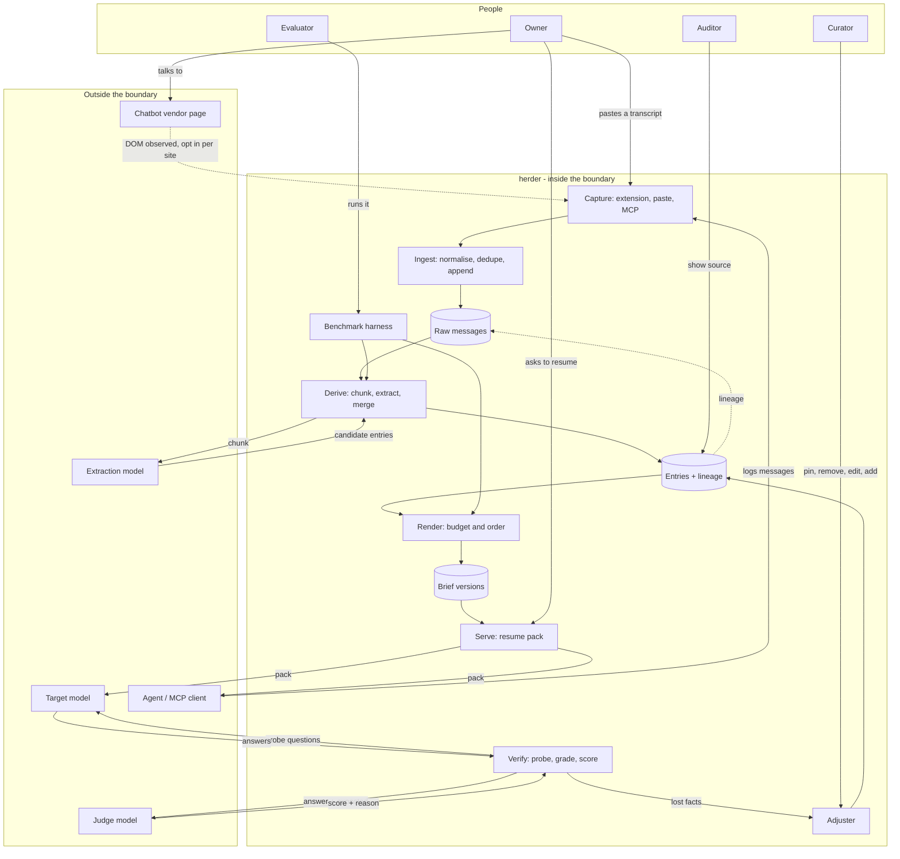

# herder - Interaction and system boundary

## Actors

| Actor | Type | What they want |
| --- | --- | --- |
| Owner | Human | To stop re-explaining themselves. To move a working context from one chatbot to another without losing the parts that were agreed early |
| Curator | Human | To see what the system decided to remember, remove what is wrong, pin what matters, and have the next brief reflect it |
| Auditor | Human | To ask "why does it think that" about any line in the brief and be shown the exact messages it came from |
| Evaluator | Human | To find out whether a change to the extraction prompt, the merge rule, the ordering or the budget moved recall, with evidence, and to compare it against a plain summary |
| Chatbot vendor | External system | Nothing. The conversation happens in their product and they are not a party to this. herder reads what is on the user's own screen |
| Extraction model | External system | Receives a chunk of conversation, returns candidate entries as structured data |
| Judge model | External system | Receives a question, a ground-truth answer and an actual answer, returns a score and a reason |
| Target model | External system | The model being resumed into. It receives the pack and is the thing being measured |
| Agent or MCP client | External system | To fetch context for a project without a browser, and to write back what it establishes |

The Owner, Curator, Auditor and Evaluator are one person in this project. They are separated
because they want different things and the system owes each of them something different -
in particular the Auditor, whose demand for lineage on every line is the constraint that
shapes the data model.

## Interaction diagram

## What the system is in the business of

- Compacting a conversation without losing the parts that were agreed, and being able to
  prove which of them it lost.
- Being auditable line by line. Every derived entry points at the messages it came from, and
  the raw messages are never edited, so "why does it believe this" always has an answer.
- Belonging to the user. Every line can be read, edited or deleted, there is no processing
  the user cannot see, and the whole store can be exported.
- Treating removal as final. If a person says an entry is wrong, no amount of the
  conversation repeating it brings it back.
- Distinguishing what it dropped from what it never had. A brief that ran out of budget and
  a brief whose extraction missed something are different failures and get different fixes.
- Measuring itself against the obvious alternative. A summary prompt at the same budget is
  cheap, and if it wins, that has to be reportable.
- Recording every version. A brief is immutable once rendered, so a checkpoint score always
  refers to an exact text that still exists.

## What the system does not care about

- Being a chatbot. It never talks to the user's model on their behalf and never sends a
  message into a chat that the user did not press send on.
- Which vendor is on the other end. Vendors are adapters, and the memory is the same memory
  whichever one produced it.
- Which model does the extraction or the grading. Both are behind one interface and both are
  configuration.
- Retrieval over documents. This is not RAG. The corpus is the user's own conversations, and
  the output is a rendered block rather than a set of retrieved chunks.
- Being fast. Derivation is a background job and nobody waits for it. A capture that takes a
  minute to become part of the brief is fine.
- Being complete. The brief is deliberately lossy. The claim is not that nothing was lost,
  it is that the loss is measured and the user is shown it.
- Real-time collaboration, teams, or several people editing one project. The data model
  leaves room; the feature waits until there is a second user.
- Scale. One process, one database, one person's conversations.
- Reading anything the user has not switched on. No site is captured by default and no
  capture is silent.

## Main use cases

| ID | Actor | Goal | Trigger | Result |
| --- | --- | --- | --- | --- |
| UC-1 | Owner | Get a conversation into the system | Paste a transcript, or capture is on for a site | Turns are stored append-only against a conversation and a project. Duplicates are silently accepted rather than duplicated. An id comes back immediately and derivation runs behind it |
| UC-2 | Owner | Have new turns become memory | Enough new tokens have arrived, or enough time has passed | Candidate entries are extracted with lineage, merged into the existing set, and a new brief version is rendered under budget |
| UC-3 | Owner | Resume somewhere else | Starting a new chat in any tool | A resume pack for the project comes back, formatted for that tool, and lands in the composer. The user presses send |
| UC-4 | Owner | Find out whether it worked | After resuming | A checkpoint asks probes, grades them, and reports an integrity score plus a named list of what the model did not know |
| UC-5 | Curator | Correct the memory | An entry is wrong, stale, or should never have been kept | Pin, remove, edit, or change the layer. A new revision is written, the brief is re-rendered without re-extracting, and a removed entry never returns |
| UC-6 | Curator | Recover something that was lost | A checkpoint reported a zero on an excluded or uncovered probe | The suggestion is in the adjuster. Accepting it pins the entry or extracts the missing one, and the next brief carries it |
| UC-7 | Auditor | Challenge a line in the brief | Any entry looks wrong or invented | The lineage panel shows the raw messages behind it, highlighted. An entry with no lineage is a manual one and says so |
| UC-8 | Owner | Keep contexts apart | Two unrelated pieces of work | Conversations belong to projects, a conversation can be moved between them, and briefs never mix |
| UC-9 | Agent | Fetch and extend context without a browser | An MCP client or a script | The pack comes back over MCP or REST, the fetch is recorded as an injection, and the agent can log its own messages back into the project |
| UC-10 | Evaluator | Find out whether a change helped | Two benchmark runs exist | Recall of ground-truth facts, hallucination rate, compression ratio and cost per resume, per method, on the same conversations, with the per-fact detail behind every number |
| UC-11 | Owner | Take it all back | Leaving, or a privacy check | An export of every raw message, entry and brief as JSON, and a delete that actually deletes |

## Constraints that come from the actors

- **The Auditor's demand is the expensive one.** Lineage on every derived entry is what makes
  the brief defensible rather than another opaque summary, and it constrains extraction: the
  model must return message ids and they must be real. An entry that cannot say where it came
  from is a bug, not a low-confidence entry.
- **The Curator's edits outrank the pipeline.** Derivation runs repeatedly over material that
  keeps repeating itself, so without a hard rule a removed entry is re-created on the next
  pass. Removal is therefore a permanent property of the entry rather than a deletion.
- **The Owner will not tolerate silent capture.** Per-site opt-in, a visible indicator, and a
  pause control are requirements rather than settings. This is the difference between a tool
  and a keylogger, and it is not a preference.
- **The Owner does not want the pack sent for them.** Text goes into the composer and stops.
  Anything else puts words in someone's mouth in a system that other people can see.
- **The Evaluator needs the same conversation re-run without losing the previous answer**, so
  brief versions are immutable and every LLM call is logged with its prompt version, its
  tokens and its raw response. A scoring change must be re-measurable against responses
  already paid for, or the harness becomes something to avoid running.
- **The vendor page is not a stable interface.** Every DOM adapter is wrong eventually. A
  broken adapter has to fail loudly and visibly rather than quietly capturing nothing, which
  is the failure that would destroy trust in the memory without ever showing an error.
- **Provider cost is a real constraint on a portfolio project.** Every design decision that
  affects how often a model is called is also a decision about whether this can be left
  running.
- **Nothing from an employer or a client goes through this system**, into the repository, or
  into the benchmark corpus. The benchmark conversations are synthetic and written for the
  purpose. This outranks realism, and here it also outranks convenience, because the author's
  own real chat logs would be the most natural test material and they are not allowed.
