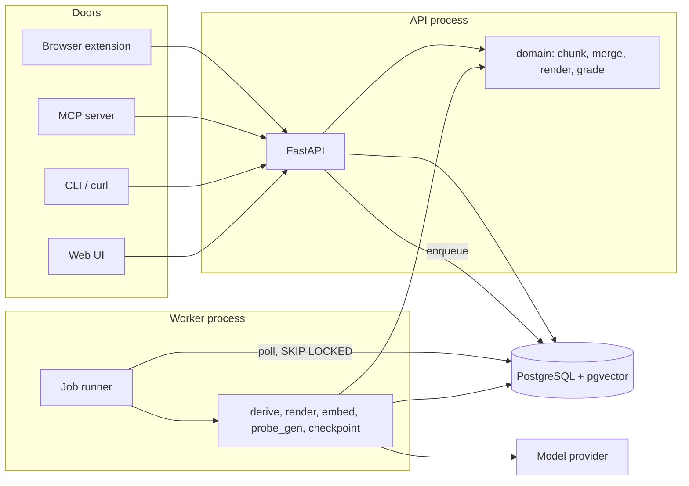
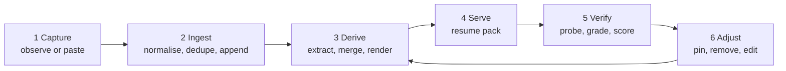
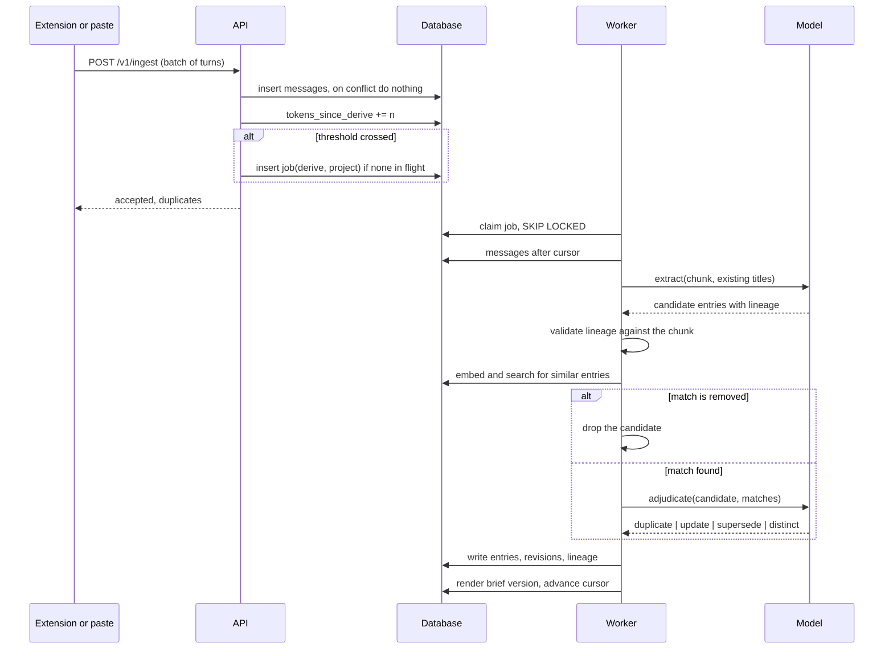
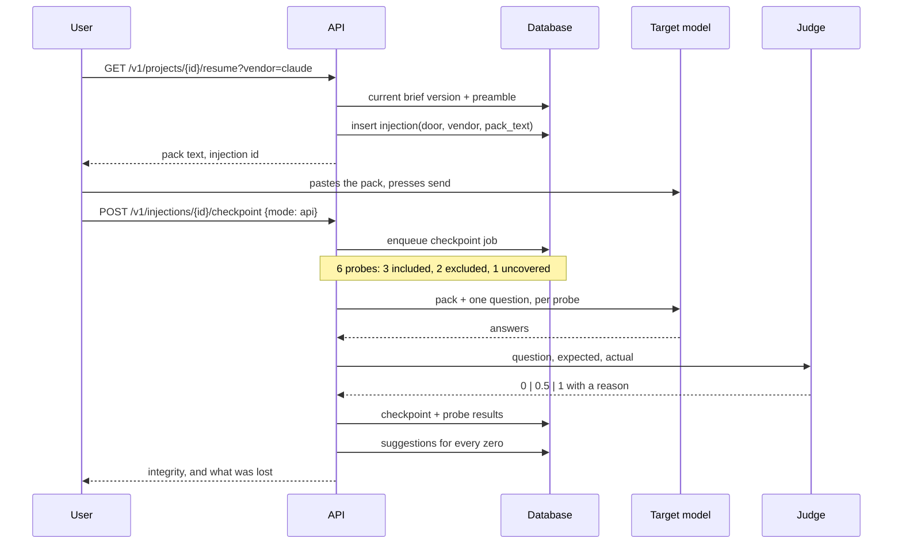

# herder - Architecture

## Shape

One FastAPI process serving the API and the web UI, one worker process draining a
database-backed job queue, one PostgreSQL with pgvector. Everything else - the browser
extension, the MCP server, the benchmark harness - is a client of that API and holds no
state of its own.



The API never calls a model. Every provider call happens in the worker, which is what makes
`POST /v1/ingest` fast, cheap and safe to hammer from a browser extension, and what stops a
slow provider from turning into a slow API.

## Stack

| Concern | Choice | Note |
| --- | --- | --- |
| Service | FastAPI | The generated OpenAPI page is a demo surface before there is a UI |
| Language | Python 3.12 | Same as the sibling backend project. The extension is the only TypeScript |
| Database | PostgreSQL 16 + pgvector | Similarity search over entries is the merge step. A second store for vectors would be a second place for the same fact to live |
| ORM | SQLAlchemy 2, async, asyncpg | |
| Migrations | Alembic | From the first commit. The first migration is hand-written so the constraints are visible |
| Schemas | Pydantic v2 | One definition used as the provider's output schema and as the parse target |
| Queue | The `jobs` table, `SKIP LOCKED` | A broker earns its place when retry has to survive a restart. This does not yet |
| Tokens | `tiktoken`, `cl100k_base` | Documented everywhere as an estimator, not as any vendor's real count |
| Local environment | Docker Compose | One command brings up API, worker and database |
| Tests | pytest | Concentrated on `domain/`, the invariants and the merge verdicts |
| Web UI | Server-rendered templates | No Node build step, one process, runs from PowerShell. The extension is where the TypeScript budget goes |
| Extension | TypeScript, Manifest V3, Vite | Deferred until the core loop is measured |

## Layers

```
api/          routers. HTTP in, HTTP out. No logic, no provider calls
schemas/      Pydantic request and response models
services/     orchestration: ingest, derive, serve, checkpoint, adjust. Talks to the database
domain/       pure functions: chunking, merging, rendering, scoring. No IO. Heavily tested
models/       SQLAlchemy tables
core/         config, db session, security, llm client, tokens, embeddings
worker/       job runner and one handler per job kind
prompts/      versioned prompt templates
```

The line that matters is `domain/`. Chunking, the render ordering and budget, the merge
verdict handling and the integrity weighting are pure functions over plain data with no
database and no network, so they can be tested exhaustively and cheaply. Everything
expensive to test lives outside them. This is deliberate: the parts of this system most
likely to be wrong are also the parts most awkward to reach through an API, and putting them
behind a service call would mean they were never properly tested.

## The loop

Six stages. Stages 1 and 2 run continuously, 3 runs on a trigger in the background, 4 to 6
run when a person asks.



### 1. Capture

A turn is captured when it is finished. For the extension that means the assistant's node
has stopped mutating for 1500 ms, or the user's message has rendered. Events are batched -
twenty of them or two seconds, whichever comes first - and held in local storage until the
server acknowledges them, so closing the tab mid-batch loses nothing.

Pasting a transcript is the same path with a parser in front of it, and it is the door built
first, because it needs no browser and it exercises everything after it.

### 2. Ingest

Resolve `(vendor, vendor_conv_id)` to a conversation, creating it on first sight. Insert
messages, ignoring conflicts on `content_hash`. Count tokens. Add the new token count to
`projects.tokens_since_derive` and enqueue a derive if the project has crossed the threshold
(2000 tokens by default) or the last derive is older than the maximum age (10 minutes) and
there is new material. The partial unique index on `jobs` makes a second enqueue a no-op
rather than a duplicate job.

### 3. Derive

The core, and the only stage that is interesting. It runs against a cursor - the last `seq`
processed per conversation - so it only ever reads material it has not seen.

```
derive(project):
    new = messages after project.derive_cursor, across the project, in time order
    if none: return

  A chunk       split at turn boundaries, target 6000 tokens
  B extract     per chunk, one model call, structured output:
                  [{layer, kind, title, text, lineage[msg ids], confidence, supersedes_title?}]
                given the chunk and the titles of the project's existing active entries
  C merge       per candidate, embed it, search entries by cosine similarity (threshold 0.86)
                  no match          -> create
                  match, and the match is removed -> DROP. Removed means removed
                  otherwise         -> ask the model to adjudicate:
                      duplicate  -> extend lineage, bump last_seen, seen_in_conversations
                      update     -> new revision, merged text, union of lineage
                      supersede  -> new entry, old one superseded_by the new
                      distinct   -> create
  D tail        the last 1200 tokens of the most recent conversation, verbatim, as one
                session entry of kind=tail. Replaced wholesale each derive, never merged
  E age         session entries untouched for 7 days with confidence < 0.7 -> archived
                project entries of kind preference or identity seen in 3+ conversations
                  -> promotion_suggested, never promoted automatically
  F render      a new brief version under budget
    advance the cursor, reset tokens_since_derive
```

Three things in that are load-bearing and worth stating separately.

**Extraction is given the existing titles.** Without them the model re-states things the
system already knows in slightly different words on every pass, and the merge step spends
its budget adjudicating near-duplicates it should never have been handed. With them the
model can say `supersedes_title` and the merge step gets a hint rather than a guess.

**Merge is a two-stage filter and the cheap stage runs first.** Embedding similarity is
arithmetic over a vector index and it costs nothing; adjudication is a model call. Only
candidates that clear the similarity threshold are adjudicated, and only against their top
three matches. Adjudicating every candidate against every entry would be the obvious
implementation and it would make the cost of derivation quadratic in the size of the memory.

**The session tail is not merged, it is replaced.** It is verbatim recent text, it has no
business being deduplicated against durable entries, and treating it as a normal entry would
fill the store with near-identical tails. It is one entry per project, rewritten each pass.

### 4. Render

```
render(project, budget):
    order:  pinned first
            then by layer:  stable, project, session
            then by kind:   constraint, decision, open_thread, code_state,
                            preference, identity, glossary, fact, artifact_ref
            then by last_seen descending
    reserve 25% of the budget for the tail
    take entries in order until the remaining budget is spent
    append the tail, truncating it from the front if it does not fit
    record what was included and what was excluded
```

The ordering is the whole design of the render step, because ordering is what decides what
gets cut. Constraints and decisions come before facts because a model that has been told the
constraints can behave correctly without knowing every fact, and one that has the facts but
not the constraints cannot. The tail gets a reserved share rather than competing on equal
terms, because verbatim recent text is what makes a resumed conversation feel continuous and
it would otherwise lose every tie to a durable entry.

Every render is a new immutable version. Adjusting an entry re-renders without re-extracting,
which is what makes the adjuster feel immediate and costs nothing.

### 5. Serve

A resume pack is a brief version plus a preamble, formatted for a target vendor.

```
<herder-context v=1 project="..." version=17 integrity=0.91>
You are continuing prior work. The block below is verified context from earlier sessions.
Treat it as established. If something here conflicts with what the user says now, the user wins.
Do not summarise this block back to the user; just use it.

## Stable
- [preference] ...
## Project
- [constraint] ...
- [decision] ...
## Session (most recent)
- [tail] ...
</herder-context>
```

Two lines in that preamble are doing real work. "If something here conflicts with what the
user says now, the user wins" exists because stale context is the failure mode that makes a
memory system worse than no memory system. "Do not summarise this block back to the user"
exists because without it a model opens the conversation by reciting the context, which is
both annoying and a privacy problem on a shared screen.

Every serve writes an `injections` row. That is what a checkpoint later attaches to.

### 6. Verify

```
checkpoint(injection, mode):
    probes = 3 from entries included in that version    (did the context transmit)
             2 from entries excluded by the budget      (what did compression cost)
             1 from messages no entry covers            (what did extraction miss)
    answers = ask the target model, given the pack and one question at a time (api mode)
              or one compound numbered message in the live chat (in_chat mode)
    grades  = judge(question, expected, actual) -> 0 | 0.5 | 1 with a reason
    integrity = weighted mean, included weighted 1.0, excluded and uncovered 0.5
    a zero on an included probe    -> entry.transmission_failed = true
    a zero on an excluded probe    -> suggestion: add this back
    a zero on an uncovered probe   -> suggestion: extract this
```

The three probe categories are weighted differently because they are not the same claim. An
included entry the model could not recall is a failure of the system as built. An excluded
one is a budget decision working as intended, and it should pull the score down without
dominating it.

## Handling a model that does not cooperate

Every provider call is temperature 0, JSON mode where the provider has it, validated against
a Pydantic schema, with exactly one repair retry. What happens after that depends on which
call it was, and the differences matter.

| Failure | Response |
| --- | --- |
| Malformed JSON from extraction | `llm_calls` row written with the raw response, one repair retry, then the chunk is skipped and recorded as skipped. Derivation continues with the other chunks. A whole derive lost to one bad chunk would be a bad trade |
| Valid JSON, lineage referencing message ids not in the chunk | The candidate is dropped and counted. This is the model inventing evidence, and it is the one failure that must never be tolerated, because the audit trail is the product |
| Valid JSON, lineage empty | Same. A derived entry without lineage is not a low-confidence entry, it is an unsupported claim |
| Adjudication fails to parse | Fall back to `distinct` - create the entry. The cost is a near-duplicate the user may see; the alternative default, `duplicate`, silently discards new information |
| Probe generation fails | No probe for that entry. The checkpoint runs with fewer probes and reports the count. A checkpoint that reports the number of probes behind it can be believed |
| Judge fails to parse | The probe is excluded from the score and flagged, never defaulted to 0 or to 1. Both defaults are lies |
| Timeout or transport error | Retried inside the client with backoff. After the retries the job fails, lands in `jobs.error`, and is visible on the dashboard |
| Provider returns a refusal | A 200 with no answer in it. Treated as a parse failure, not as an empty result |

The rule underneath all of them: **a failure is recorded and counted, never defaulted into a
plausible value.** An extraction that silently produced nothing looks exactly like a chunk
that genuinely contained nothing worth keeping, and those two need to be told apart.

## The doors

| Door | Use | Records |
| --- | --- | --- |
| REST | Everything. The other doors are clients of it | Everything |
| CLI | `herder paste`, `herder brief`, `herder resume`. Checked from PowerShell | Through the API |
| Web UI | Adjuster, brief, checkpoints, dashboard | Through the API |
| Browser extension | Live capture and one-click resume into a composer | `door = extension` on the injection |
| MCP | Six tools, so an agent can read context and write back into it | `door = mcp` on the injection |

## API surface

All under `/v1`, JSON, bearer key or session cookie.

| Method | Path | Behaviour |
| --- | --- | --- |
| POST | `/ingest` | A batch of observed turns. Idempotent. Returns accepted and duplicate counts |
| POST | `/ingest/paste` | A pasted transcript, parsed into messages |
| GET | `/projects` | |
| POST | `/projects` | |
| PATCH | `/projects/{id}` | Name, budgets |
| GET | `/projects/{id}/stats` | Tokens captured, entries by layer and status, current version, compression ratio, latest integrity |
| GET | `/projects/{id}/conversations` | |
| PATCH | `/conversations/{id}` | Move to another project |
| GET | `/conversations/{id}/messages` | The raw log, paged |
| GET | `/projects/{id}/entries` | Filterable by layer, status, kind. Each entry says whether it is in the current brief |
| POST | `/projects/{id}/entries` | Add one by hand |
| PATCH | `/entries/{id}` | Edit title, text or layer. Writes a revision |
| POST | `/entries/{id}/{action}` | `pin`, `unpin`, `remove`, `restore`, `promote`, `archive` |
| GET | `/entries/{id}/lineage` | The raw messages behind it |
| GET | `/projects/{id}/brief` | The current version |
| GET | `/projects/{id}/brief/versions` | |
| GET | `/brief-versions/{id}/diff` | Against another version |
| POST | `/projects/{id}/derive` | Force a derive now |
| POST | `/projects/{id}/render` | Force a re-render |
| GET | `/projects/{id}/resume` | The pack. Writes an injection. Takes vendor, budget, door |
| GET | `/injections/{id}/probes` | The compound probe message, for an in-chat checkpoint |
| POST | `/injections/{id}/checkpoint` | Run one. `api` mode runs it server-side; `in_chat` posts captured answers |
| GET | `/checkpoints/{id}` | Integrity and every probe with its reason |
| GET | `/projects/{id}/integrity` | The time series |
| GET | `/projects/{id}/suggestions` | |
| POST | `/suggestions/{id}/accept` | And `/dismiss` |
| GET | `/me/export` | Everything, as JSON |
| DELETE | `/me` | Enqueues a hard delete |
| GET | `/health` | Green from the first day, and verified to go red |
| GET | `/metrics` | Jobs by status, derive latency, model calls, tokens spent |

## Key sequence - a conversation becomes a brief



## Key sequence - resume and verify



## Prompts

In `prompts/`, one file each, every one carrying a `version` header that is written to the
`llm_calls` row on every call. A prompt change with no version bump makes every earlier
measurement unattributable, which is the quiet way a harness stops meaning anything.

| Prompt | Job |
| --- | --- |
| `extract.md` | Chunk plus existing titles to candidate entries. Three worked examples covering a decision, a code state and an open thread |
| `adjudicate.md` | Candidate plus up to three matches to one of four verdicts, with a reason |
| `probe_gen.md` | An entry or a raw message to a question and a ground-truth answer, answerable only from that content |
| `judge.md` | Question, expected and actual to 0, 0.5 or 1 with a reason |
| `preamble.md` | The resume-pack header, one variant per target vendor |

The extraction rules that live in `extract.md` are part of the design rather than prompt
wording: extract only what the user said or what was explicitly agreed, never the model's own
unadopted suggestions; one entry per atomic idea; prefer durable phrasing over stale
specifics; lineage is mandatory and must reference real ids in the chunk; titles are at most
80 characters and stable across rephrasings.

The first of those is the one that decides whether this works. A conversation with a chatbot
is mostly the chatbot talking, and an extractor that treats assistant output as fact will
fill the memory with suggestions the user read and rejected.

## Benchmark harness

`bench/`, outside the application, driving the real pipeline through the API rather than
reimplementing any of it. A harness that reimplements extraction measures the
reimplementation.

- `bench/datasets/` - synthetic long conversations, 8k to 60k tokens, across four
  archetypes: a coding session, research and writing, business planning, and a support
  handover. Each ships with a hand-written ground-truth fact list.
- `bench/methods/` - `herder` (the full loop), `naive_summary` (one "summarise this" prompt
  at the same budget), `truncate_tail` (the last N tokens, which is what people actually do).
- Metrics: recall of ground-truth facts, hallucination rate, compression ratio, cost per
  resume. Reported per archetype as well as combined, because a method that wins on code and
  loses on planning is a finding rather than an average.

`naive_summary` is the comparison that matters. It is what a reasonable person would build in
an afternoon, and if herder does not beat it at the same token budget then the entries, the
merging, the layering and the versioning are elaborate machinery around no advantage. The
harness is built to be able to return that answer.

## Security and privacy

- Secrets from the environment. Nothing in the repository.
- API keys stored as SHA-256 hashes with a visible prefix, shown once at creation.
- Passwords with Argon2, if there is ever a second user. There is one now.
- Server logs carry ids, counts and timings, never message content.
- No third-party analytics anywhere in the web app.
- Rate limits on `/ingest` per key, and on every endpoint that can cause a provider call.
- `GET /me/export` and `DELETE /me` work before anyone other than the author has an account.
- The self-host path is `docker compose up`, and it is the primary path rather than a
  fallback. A memory of everything someone has ever said to a chatbot is exactly the kind of
  thing that should be able to run on their own machine.
