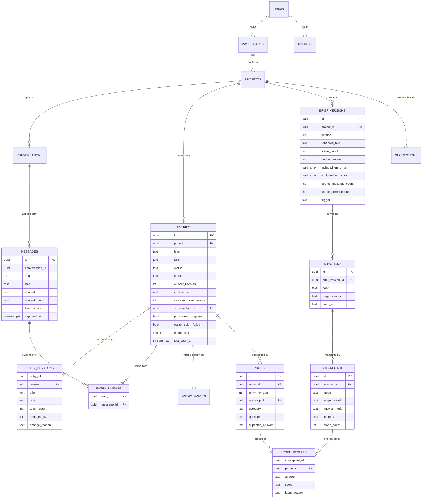
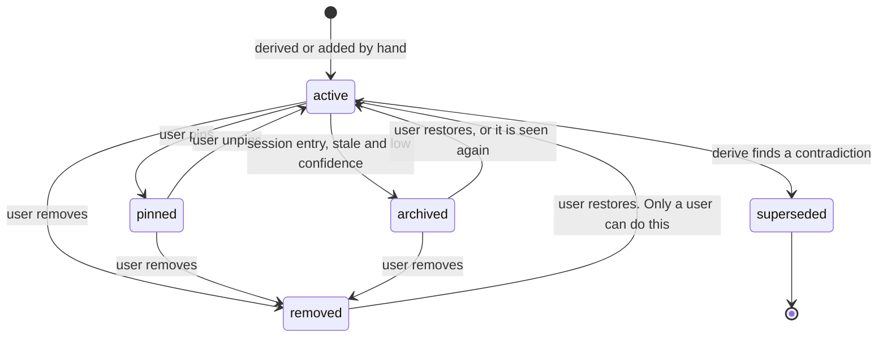

# herder - Data model

PostgreSQL 16 with pgvector. **Eighteen tables.** UUIDv7 primary keys, generated in the
application so they are time-ordered and can be created before an insert. Every table has
`created_at timestamptz not null default now()`. Timestamps are UTC. There is no soft delete
except where a `status` column already carries the meaning.

The shape is this: **a message is a fact that happened, an entry is a claim about what it
meant, a brief version is a snapshot of the claims that fitted, and a checkpoint is a
measurement of one snapshot.** Those four are separate on purpose, and nothing downstream is
allowed to edit anything upstream of it.

| Table | Job |
| --- | --- |
| `users` | One account. Owns everything |
| `workspaces` | The tenancy anchor. One per user in v0.1 |
| `api_keys` | Bearer keys for the extension, MCP and REST. Hashed |
| `projects` | The scope everything else hangs from. Holds the budgets and the derive cursor |
| `conversations` | One thread in one vendor |
| `messages` | One turn. Append-only. The source of truth |
| `entries` | One atomic remembered thing, at its current state |
| `entry_revisions` | The text of an entry at each revision. Never overwritten |
| `entry_lineage` | Which messages an entry came from. The audit trail |
| `entry_events` | What a person did to an entry, and when |
| `brief_versions` | An immutable rendered brief, with what it included and what it dropped |
| `injections` | One serve. Which version went where, through which door |
| `probes` | A question with a ground-truth answer, cached per entry revision |
| `checkpoints` | One verification run against one injection. Carries the integrity score |
| `probe_results` | One graded answer. The detail behind the score |
| `suggestions` | What a checkpoint or a promotion rule thinks the user should do |
| `jobs` | The database-backed queue |
| `model_calls` | Every inference call - extraction, NLI, embedding - with its model, implementation, prompt version, tokens, latency and raw output |

Eighteen is nearly three times the sibling project's seven, and that deserves an answer
rather than a shrug. Six of them are the versioning that makes the system auditable
(`entry_revisions`, `entry_lineage`, `entry_events`, `brief_versions`, `injections`,
`model_calls`) and four are the measurement chain (`probes`, `checkpoints`, `probe_results`,
`suggestions`). Both groups are the project rather than bookkeeping around it: without the
first there is no answer to "why does it think that", and without the second there is no
number. What did get cut is listed at the end.

## Entities

The first migration is hand-written rather than autogenerated, so that the constraints
carrying the design are visible in it. It is **not** a transcription of the DDL in the
specification this folder was written from: that DDL predates the decision to run every model
locally, and still carries a 1536-dimension vector column and a `vendor_accounts` table for
provider keys. Where the two disagree, this document is right and the spec is history.

## messages

The spine, and the only table that is truly append-only. Nothing updates a message and
nothing deletes one except a cascade from deleting the user.

- `unique (conversation_id, content_hash)` is the idempotency guarantee. The extension will
  re-send the same turn - on a retry, on a page reload, on a `MutationObserver` firing twice
  for the same node - and a duplicate is silently acknowledged rather than stored again.
  `content_hash` is `sha256(vendor + conversation id + role + normalised text)`.
- `unique (conversation_id, seq)` is the ordering guarantee, and `seq` is **arrival order,
  assigned server-side as `max(seq) + 1` and never renumbered.** The specification said the
  tail should be recomputed when a turn arrives out of order; that is an UPDATE, and
  invariant 1 forbids one. The invariant wins - it is the one with a test and with the whole
  audit story behind it. Thread order lives in `client_position` instead, and readers order
  by `(client_position, seq)`. A late arrival therefore lands with a later `seq` and its
  correct position, and every reader still sees the conversation in the order it happened.
  Gaps in `seq` are fine: it has to be unique and increasing, not contiguous.
- `token_count` is `tiktoken` `cl100k_base` and is documented everywhere as an estimator. It
  is not the token count any particular vendor will charge, and it does not need to be: it is
  used for budgeting and for compression ratios, where consistency matters more than being
  right about a specific vendor's tokeniser.

## conversations

`unique (vendor, vendor_conv_id)` so the same chat seen twice is the same conversation.

A pasted transcript has no vendor id, and an earlier draft of this document claimed that two
pastes of one transcript would become two conversations whose duplicate turns the message
hash would then catch. That is wrong: the unique constraint on `content_hash` is scoped to a
conversation, so it would have caught nothing and the corpus would have doubled.

So a paste is **content-addressed**: `vendor_conv_id` is `paste:` plus a hash of the
normalised transcript. The same text resolves to the same conversation, every turn then
collides on its own hash, and nothing is inserted - which is what makes the plan's
requirement, "re-pasting the same transcript adds no messages", true by construction rather
than by hope. A *continued* transcript hashes differently, which is why the paste endpoint
takes an optional `conversation_id`: append to the original and the overlap dedupes turn by
turn.

## entries and entry_revisions

An entry is a claim. `entries` holds its identity and its current state; `entry_revisions`
holds the text at each revision and is never overwritten. The split exists so that a
checkpoint scored against revision 3 still means something after a person edits the entry
into revision 4.

`layer` is `stable` (about the user, outlives projects), `project` (about the work) or
`session` (about the current thread). `kind` is one of `fact`, `decision`, `constraint`,
`preference`, `identity`, `open_thread`, `code_state`, `artifact_ref`, `glossary`, `tail`.
`source` is `derived` or `user`.

`embedding` is `vector(384)` over `title + text` at the current revision, with an HNSW index,
and it is what the merge step searches. 384 is a sentence transformer running locally on CPU;
the original design assumed a hosted 1536-dimension model and there is no longer any such
thing in this project. The dimension is fixed in the DDL, so changing the embedding model is a
migration rather than a setting - which is the honest place for it, because it is a decision
that invalidates every vector already stored.

### Status flow

Two edges carry the design:

- **`removed` is reachable from every state and leaves only by a human hand.** Derivation
  runs over material that repeats itself, so an entry the user deleted would otherwise be
  re-created on the next pass, and the user would delete it again, forever. The hard rule is
  in the merge step: a candidate matching a removed entry is dropped rather than merged or
  created.
- **`superseded` is terminal.** The old entry stays in the table with `superseded_by` set,
  because the fact that a decision was reversed is itself part of the history, and a
  checkpoint run before the reversal still has to be readable afterwards.

Promotion from `project` to `stable` is never automatic. When an entry of kind `preference`
or `identity` has been seen in three or more distinct conversations, `promotion_suggested`
is set and a suggestion appears; the layer only changes when a person confirms it. An
automatic promotion is a claim about who the user is, made without asking, and it is exactly
the kind of thing that makes a memory system feel like it is watching rather than working.

## entry_lineage

Two columns, and it is the reason the whole project is defensible. Every derived entry has
at least one row here pointing at a real message in the same project. The extraction prompt
is required to return message ids from the chunk it was given, and an entry whose lineage
does not validate is a failed extraction rather than a low-confidence entry.

Manual entries have no lineage rows and carry `source = user`. The UI says so rather than
showing an empty panel.

## brief_versions

Immutable. A change of any kind is a new version, never an edit. `included_entry_ids` and
`excluded_entry_ids` are both stored, and the second one is the interesting column: it is
what lets the UI say "eleven entries did not fit", and it is where the `excluded` probes in
a checkpoint come from. A render that only recorded what it kept could never measure what
the budget cost.

`source_message_count` and `source_token_count` are the raw material covered at render time.
Compression ratio is `source_token_count / token_count` and it is the headline number, so it
is stored rather than computed from a join that might later be filtered differently.

## injections and the measurement chain

An injection is one serve: this exact brief version, through this door, to this vendor, at
this time, with the exact pack text that was produced. It is the join key between "what we
sent" and "what came back", and without it a checkpoint score would be attached to a brief
that may have been re-rendered since.

A checkpoint hangs off an injection, not off a project or a version, for the same reason.
`mode` is `api` - the pack and one question sent to a model directly, which is cheap, fast
and the default - or `in_chat`, where the extension sends a compound probe message into the
real chat and captures the reply. The second measures the actual deployed model with all its
own system prompt and memory in play, which is the honest measurement, and it is opt-in
because it puts noise in the user's conversation.

`probes` are cached per `(entry_id, entry_revision)` so that generating them is paid for
once. A probe with `entry_id` null and `message_id` set is an `uncovered` probe, generated
from raw material no entry claims - the only way to measure what extraction missed.

## model_calls

Not in the original specification as a table; it is there as an instruction ("log every LLM
call with prompt version, token counts and latency so the benchmark can be reproduced") and
this is where that instruction lives.

One row per inference call: purpose (`extract`, `adjudicate`, `probe_gen`, `grade`, `answer`,
`embed`), which model and **which extractor implementation** produced it, prompt version,
input and output token counts, latency, whether the output validated on the first attempt,
and the raw output. The raw output is the bulky part to keep and the only part that matters
when something breaks, because a validation failure with the output thrown away is unfixable.

It is also what makes re-scoring cheap. Changing how a grade is interpreted, or how recall is
aggregated, becomes a re-read of rows already computed rather than another full pass over the
corpus. Nothing is billed any more, so the currency is wall-clock - and on a CPU-only machine
that is the scarcer of the two. A harness whose every run costs an afternoon is a harness that
stops being run.

Recording the implementation matters as much as recording the model, because comparing the
three extractors is the entire point of having three. A number that cannot say whether it came
from `heuristic` or from `local` proves nothing.

## jobs

A database-backed queue polled with `SELECT ... FOR UPDATE SKIP LOCKED`. No Redis, no
broker. Kinds are `derive`, `render`, `embed`, `probe_gen`, `checkpoint`, `delete_user`.

One index carries a rule that would otherwise be a race:

    create unique index one_derive_per_project on jobs ((payload->>'project_id'))
      where kind = 'derive' and status in ('queued', 'running');

Derivation reads a cursor, calls a model, and writes entries. Two of them running for one
project at the same time would extract the same messages twice and merge each other's
output. Debouncing in application code would mostly work; a partial unique index is the
version that cannot be got wrong under load, and it makes the enqueue a no-op instead of a
lock.

## Invariants

These are enforced in code and each one has a test. They are the specification's list, plus
two that follow from decisions made in this folder.

1. `messages` is append-only. No update, no delete except cascade from deleting the user.
2. Every entry with `source = derived` has at least one lineage row pointing at a message in
   the same project.
3. An entry with `status = removed` never appears in `included_entry_ids`, never gets
   probed, and never receives a new lineage row.
4. `brief_versions.rendered_text` is immutable.
5. `projects.current_brief_version_id` points at the highest version **rendered at the
   project's own budget**. A serve-time budget override stores its version - the injection
   points at it, and a checkpoint scores exactly that text - but never moves the pointer, so
   the brief every other reader sees is not changed by one caller asking for a smaller pack.
   Readers of "the brief" read the pointer, never the highest version.

   *Was:* "always points at the highest version for that project". True until stage 5 added
   overrides, after which it made one `resume --budget 150` the brief for every later serve.
   Changed after the stage 5 review; the reasoning is in `06-context.md`.
6. `entry_revisions` has a row for every revision from 1 to `entries.current_revision`.
7. Compression ratio for a version is at least 1 **once the source exceeds the budget**.
   As first written this said "always", and that is false rather than merely untested: a
   114-token conversation renders a brief whose verbatim session tail is the whole
   conversation, plus entry lines restating it, so the brief is legitimately larger than
   its source. Compression only means anything in the regime where the source does not
   fit, and that is the regime the invariant now describes. The companion invariant that
   does hold unconditionally is 8's budget half: `token_count <= budget_tokens` unless
   pinned entries alone exceed it, in which case the render reports `over_budget`.
8. Every entry in `included_entry_ids` has `status` of `active` or `pinned` at render time,
   and every pinned entry is included.
9. Every inference call writes a `model_calls` row, including the ones that fail, and records
   which extractor implementation was in force. A failed call with no row is time nobody can
   account for; an unattributed one makes every comparison meaningless.

## The benchmark corpus lives outside the database

Ground-truth fact lists for the benchmark conversations are JSON files beside the
conversations in `bench/datasets/`, and run results are files in `bench/results/`. There are
no `bench_*` tables.

Measurement belongs in git, where a change to a number can be read in a diff and where the
result of a run is committed beside the code that produced it. The production schema should
not carry tables that exist only to hold the answers to questions about it. This follows the
sibling project's decision for the same reason, and the same caveat applies: `model_calls` is
in the database because it is operational - it is how a live system explains where its minutes
went - not because it is part of the harness.

## What is deliberately not stored

- **No summary of a conversation.** There is no "conversation summary" column anywhere. The
  entries are the summary, and a second, unversioned, un-lineaged one would be the thing
  people actually read, which defeats the auditability the rest of the schema pays for.
- **No cache of the resume pack.** The pack is stored on the injection because that is a
  historical record of what was sent. It is not looked up as a cache; a new serve renders a
  new pack from the current version.
- **No per-vendor copy of a brief.** Vendor differences live in the preamble template, not in
  a stored variant per vendor, or the version count multiplies by the number of vendors and
  the diff view stops meaning anything.
- **No message content in logs.** Server logs carry ids, counts and timings. The content is
  in the database and in the export, and nowhere else.

## Deferred, with the reason

These are in the specification and are not in the first migration.

| Table or column | Why it waits |
| --- | --- |
| `workspace_members` | There is one user. Adding a membership table later is additive - a new table and a join - and changes no existing column. `workspaces` itself is kept from the start because retrofitting a tenancy boundary is not additive: it moves a foreign key on `projects` and touches every query in the system |
| `vendor_accounts` | **Cut outright, not deferred.** It held encrypted per-workspace provider keys, and this project has no provider and will not have one. If per-workspace model settings are ever wanted, that is a settings column, not an encrypted-secret table |
| `workspaces.plan`, `workspaces.region` | Billing and data residency. Neither exists yet, and a column that is always `free` and always `eu` is a claim the project cannot support |

## Constraints worth stating

- `unique (conversation_id, content_hash)` on messages. Idempotent ingest.
- `unique (conversation_id, seq)` on messages. Ordering.
- `unique (vendor, vendor_conv_id)` on conversations.
- `unique (workspace_id, name)` on projects.
- `unique (project_id, version)` on brief versions.
- `unique (key_hash)` on api keys. Keys are stored as hashes and shown once.
- The partial unique index on `jobs` above.
- Every amount-free numeric in this schema is a token count or a score. Token counts are
  integers. Scores are `real` in the range 0 to 1, and the three probe scores are exactly
  0, 0.5 and 1 - a graded judgement with three values a person can argue with, not a
  continuous number the judge would be making up.
