# mailman - Build plan

## Objective

**The primary goal is a system that runs.** Something that can be opened in a browser,
handed a real PDF, and watched doing the job - used as a demonstration in job applications
and walked through in an interview. Working to a certain extent beats designed thoroughly
and half-built.

That is a constraint on this plan, not a preamble. It means every stage ends in something
that can be run and looked at, unsupported cases fail loudly instead of being worked around,
and the queue interface arrives early enough to be the thing that gets shown rather than the
thing that ran out of time.

It does not mean the measurement gets dropped. The evaluation harness is what separates this
from every other document-AI demo, and it is what an interviewer will actually probe. The
order below reaches something demonstrable first and then measures it, rather than choosing
between the two.

Finished, for the purpose of this project, when four things are true:

1. A person who is not the author can upload an invoice and see structured data come out.
2. The queue shows what needs a person, and a correction can be made and approved in a
   browser.
3. The README carries accuracy figures produced by the harness in this repository,
   including the changes that did not help.
4. It is hosted somewhere with a link that can go on an application.

There are no dates in this plan. Stages are ordered by what each one needs from the one
before it.

## Order of work

```mermaid
flowchart LR
    subgraph A[Pipeline]
        S0[0. Scaffold] --> S1[1. Ingestion]
        S1 --> S2[2. Extraction]
        S2 --> S3[3. Ten documents<br/>end to end]
    end
    subgraph B[Rules and routing]
        S4[4. Validation] --> S5[5. Confidence<br/>and routing]
        S5 --> S6[6. Promotion,<br/>corrections, tests]
    end
    subgraph C[Demonstrable]
        S7[7. Minimal<br/>review queue]
    end
    subgraph D[Measurement]
        S8[8. Corpus<br/>and baseline] --> S9[9. Iteration]
    end
    S3 --> S4
    S6 --> S7
    S7 --> S8
    S9 --> S10[10. Host it,<br/>write the README]
    S10 --> S11[11. MCP server]
    S10 --> S12[12. AWS]
```

| Stage | Goal | Done when |
| --- | --- | --- |
| 0 | Scaffold | FastAPI, Docker Compose with PostgreSQL, Alembic migrations for all seven tables, `/health` green from PowerShell, git initialised with real messages from the first commit |
| 1 | Ingestion | `POST /documents` takes a PDF, stores the bytes in an S3-shaped path, inserts the row, returns the id, and pdfplumber has pulled the text |
| 2 | Extraction | A Pydantic invoice model is the provider's output schema and the parse target. Extractions are stored with the raw response, latency and token count. Malformed JSON, missing fields and timeouts are handled as three different things |
| 3 | Ten documents end to end | Ten varied synthetic invoices go in and structured data comes out of PostgreSQL, **and there is a written list of everywhere it got something wrong** |
| 4 | Validation | Every rule is a small testable function writing a row per document. The rules come from stage 3's failure list, not from imagination. Errors route to review; warnings do not |
| 5 | Confidence and routing | A composite confidence exists, a threshold is set, and the reason for that threshold is written down |
| 6 | Promotion, corrections, tests | `approve` promotes into `invoices` in one transaction, `corrections` logs the fix and re-validates, and pytest covers the state machine and the transaction boundaries |
| 7 | Minimal review queue | **The demo exists.** A queue page, a document beside its fields, edit and approve. Bare. No styling pass |
| 8 | Corpus and baseline | Thirty to forty documents with labels beside them, a harness that reports per-field accuracy, and **a recorded baseline** |
| 9 | Iteration | At least three genuine attempts at improvement, each measured, each written into `NOTES.md`, including the ones that failed |
| 10 | Host it, write the README | A public link, and a README with the problem, the diagram, the numbers, the dead ends and the limitations |
| 11 | MCP server | Optional. Extraction exposed as MCP tools over the API that already exists |
| 12 | AWS | Optional. Lambda, S3, RDS |

Nothing is built. Stage 0 is the current work.

### Why the queue comes before the corpus

The first draft of this plan put the review interface last, on the grounds that it is the
easy part and that doing it early is how a project ends up as a demo with no numbers behind
it. That risk is real, but it is outweighed by three things:

1. **It is the demo.** The stated goal is something that can be shown, and nobody is
   impressed by a terminal.
2. **It is the tool for building the corpus.** Assembling thirty to forty labelled documents
   means looking hard at a lot of extractions. Doing that against jsonb in a database client
   is miserable, and miserable work gets cut short.
3. **It is small.** A list, a document viewer and a form, over an API that already exists.

The risk is handled by a gate instead of by ordering: **stage 7 is bare and stays bare.** No
styling, no polish, no second screen, until the baseline in stage 8 has been recorded. If
stage 7 starts growing, that is the failure this note exists to catch.

### Why the rules come after the first ten documents

The obvious order is to design the validation rules first. The better order is to run ten
documents through a pipeline with no rules at all and write down every place it went wrong,
because that list describes how this model fails on these documents rather than listing
failures that seemed plausible in advance. The rules that come out of it are the ones that
catch something.

### Why the labels are safe even though the corpus comes late

Writing the answer key after seeing what the model produces is normally fatal - the labels
end up describing the model's behaviour instead of the correct answer. That risk does not
apply here, because the documents are generated: **the generator emits the labels file at
the same time as the document**, so ground truth exists by construction and never passes
through anyone's judgement. The only hand-labelling is for the handful of public sample
documents, and those get labelled from the document, never from an extraction.

### Stage 9 in detail

The stage exists to produce evidence, and the order matters.

1. The baseline is recorded before anything is touched. A baseline recorded after the first
   improvement is not a baseline.
2. The report lists the documents that got each field wrong. That list is what makes the
   next change informed rather than a guess.
3. One change at a time. Measure. Write down what happened, including no change and worse.
4. Keep the failures in the README. "I tried retrieval and it did not help on this document
   set" is worth more to a reader than three improvements and no dead ends, because it shows
   the harness was used to decide something rather than to confirm a decision already made.

## Decisions already made

| Decision | Reason |
| --- | --- |
| A running demo is the primary goal | It is what goes on a job application. Every stage ends in something that can be run from PowerShell and looked at |
| Every stage has a PowerShell check | Testing is done from a terminal on Windows. If a stage cannot be verified that way it is not finished. The commands are in [05-tasks.md](05-tasks.md) |
| The minimal queue comes before the corpus | It is the demo, and it is the tool for looking at extractions while the corpus is built. Kept bare by a gate rather than by ordering |
| Unsupported inputs fail loudly | A spreadsheet or a scan with no text layer is rejected with a reason rather than half-processed into a thin extraction that looks real |
| Seven tables | Documents, extractions, invoices, line items, vendors, validation results, corrections. The shape matters more than the exact columns |
| No review-queue table | The queue is `GET /documents?status=needs_review`. A queue table would be a second place for the same fact to live |
| No evaluation tables | Gold labels are JSON files beside the documents and run results are files. Measurement belongs in git history, not in the production schema |
| Extraction output is a claim; the invoice is accepted truth | Two tables, so a reviewer's correction never overwrites the answer being measured |
| Extractions are appended, never updated | Re-running a document under a new `prompt_version` has to be free of consequence, or nobody will re-run one. This is the table the harness depends on |
| `raw_response` kept beside `extracted_data` | When parsing breaks, the evidence has to still be there |
| `latency_ms` and `token_count` from the first extraction | They cannot be backfilled, and they are the cost story |
| Amounts are `numeric` in PostgreSQL and `Decimal` in Python | Exact decimal. Never float, anywhere, including JSON transport - which is where a float usually gets in |
| Arithmetic checked in Python | A model asked whether its own answer adds up agrees with itself. A rule someone wrote can be read, tested and argued with |
| Rules are small individual functions with a severity | Individually testable, and adding one is writing a function rather than editing a pipeline |
| Errors route to review, warnings do not | One routing rule, in one place |
| Confidence is composite, not the model's self-report | Populated required fields, parseable types, validation outcomes, and the model's own confidence contributing least |
| Model confidence can send a document to review but never rescue one | Confidently wrong is the failure this system exists to survive |
| Routing threshold is configuration | The trade between reviewer time and bad records is a number to be measured, with its justification written down |
| `status` drives everything, and one function moves it | Every transition appends to `status_history`, so a stuck document is explainable a week later |
| Promotion and the status change are one transaction | A half-promoted document is a state no status describes |
| `failed` and `rejected` are different statuses | One is the system's fault, one is a person's decision. Collapsing them hides operational problems inside business outcomes |
| Unique on (`vendor_id`, `invoice_number`) in the database | Duplicate invoices are the expensive mistake here, and a reviewer can override a rule but not a constraint |
| Validation rules come from the first ten documents | Rules written in advance catch imagined failures |
| The harness drives the real pipeline through the command line | A harness that reimplements extraction measures the reimplementation |
| Field-level accuracy, not document-level | One wrong field in twelve is not a failed document, and a document pass rate cannot be broken down afterwards |
| FastAPI, Docker Compose, Alembic from the first commit | A schema hand-built once cannot be rebuilt on another machine. The OpenAPI page is a free artifact and a free demo surface |
| Background processing, no broker | `POST /documents` returns immediately and `status` is how a caller finds out. A broker earns its place when retry needs to survive a restart |
| Server-rendered templates for the review queue | Runs from PowerShell with no Node build step, deploys as one process. The API exists either way if a framework is wanted later |
| S3-shaped storage paths behind one interface, from the start | Makes the AWS move a client swap rather than a schema change. Nearly free to do now |
| Invoices only, at first | `doc_type` is the hook for a second type. The claim that it generalised waits until one runs |
| Synthetic and public documents only | No employer or client document enters this repository. The constraint outranks realism |
| Commit as the work happens | The history is part of what is on display and is not squashed at the end |
| `NOTES.md` is kept by hand, and tooling may append facts to it | The record of what was tried and what the numbers did can be written down by whoever is at the keyboard. The judgement - what was surprising, what it meant, what to do next - stays the author's, because that is the part no tool can produce and it is where the credibility lives |
| Its own harness rather than reusing `evaluaters/eval-harness` | Different unit of measurement. See [06-context.md](06-context.md) |

## Open questions

| Question | Blocks | Notes |
| --- | --- | --- |
| What are the required fields? | Stage 2 | Determines what can go straight through. Too many required fields sends everything to review |
| What is the expected invoice-number format? | Stage 4 | The rule needs one, and a real corpus has several. It may have to be per vendor |
| How are scans with no text layer handled - page image to a vision model, or OCR first? | After stage 3 | Affects cost and the shape of ingestion. Probably the image, with OCR as a fallback. Until then they are rejected with a reason |
| How are line items matched between the extraction and the label? | Stage 8 | Order is not guaranteed. Probably matched on description then compared, but the matching itself can fail and that has to be visible rather than counted as a wrong amount |
| What exactly goes into composite confidence, and at what weights? | Stage 5 | The first version can be crude. The defensible version comes out of stage 8 |
| What is the threshold? | Stage 9 | Only a measurement can answer it. Pick something arbitrary in stage 5 and expect to change it |
| Does supplying similar labelled documents help at this corpus size? | Stage 9 | Thirty examples may be too few for it to do anything. Worth trying and worth reporting if it does not |
| Is `status_history` as jsonb enough, or does it want its own table? | Stage 6 | Seven tables is the target and jsonb holds the line. If querying time-in-status gets awkward, an eighth table is the honest answer |
| Where does it host, and what does it cost? | Stage 10 | The link is part of the deliverable, so this is not optional. To be discussed once there is something running. Free database tiers have got worse, and a demo needing a paid database every month is a different decision from one that does not |
| Does the hosted demo need a seeded database? | Stage 10 | A public link to an empty queue demonstrates nothing. It probably ships with a handful of documents already processed |
| Does the hosted demo call a paid provider on every visitor upload? | Stage 10 | An open upload box on a public link is an open invoice for provider tokens. Options are a rate limit, a fixed set of sample documents, or a read-only demo |
| Does the MCP server expose extraction only, or the queue too? | Stage 11 | Exposing the queue means an agent can approve records, which needs a confirmation gate |

## Risks

| Risk | Effect if it happens | Response |
| --- | --- | --- |
| The bare queue in stage 7 turns into a front-end project | Time spent on an interface nobody was going to grade, and the measurement never happens | Stage 7 is a list, a viewer and a form. No styling pass before the stage 8 baseline is recorded. This gate replaces putting the UI last |
| Stages 8 and 9 get skipped because the demo already works | The project becomes indistinguishable from every other document-AI demo, and the one differentiating thing is the one missing | Stage 10 does not start before the baseline exists. A demo with no numbers is exactly the thing this project was meant not to be |
| Thirty to forty documents is too few to separate a real improvement from noise | Every reported percentage is a coin flip | Report the count beside every number, report per field rather than in aggregate, and treat a two-document movement as nothing |
| Provider cost grows with every harness run | Running the harness becomes something to avoid, which defeats it | Extractions are stored, so a scoring change is re-measured against responses already paid for. Only a prompt or model change needs a fresh run |
| The rules end up encoding the quirks of the generated documents | The pipeline works on the corpus and falls over on anything else | The generator varies layout, vendor, currency and date format on purpose, and public samples sit beside the generated ones |
| Scope creep into document types two and three | Three half-working pipelines and no numbers for any of them | Invoices until stage 10 is done |
| The code gets ahead of the understanding | The parts an interviewer probes hardest are the parts that cannot be explained | The validation rules and the harness are read line by line and adjusted until they reflect the author's own judgement. See [06-context.md](06-context.md) |
| A client or employer document ends up in the repository | A real problem, not a portfolio problem | Synthetic and public only. Checked before every commit |
| Stages 11 and 12 get started before stage 10 is finished | The interesting extensions half-built, the core unfinished | Both are optional and both come after a hosted, documented system |
