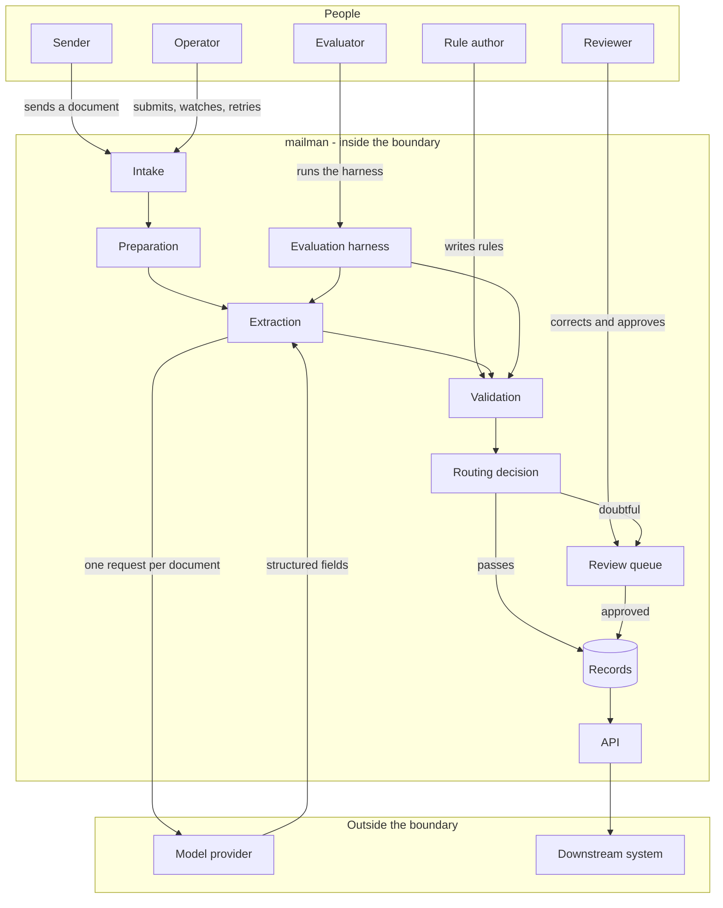

# mailman - Interaction and system boundary

## Actors

| Actor | Type | What they want |
| --- | --- | --- |
| Sender | Human, outside the organisation | To send an invoice in whatever form suits them and be paid. They will not change their format |
| Operator | Human | To have documents processed without touching most of them, and to find out quickly when something is stuck |
| Reviewer | Human | To be shown only the documents that need a person, with the document and the fields side by side, and to fix a field in a few seconds |
| Rule author | Human | To write down a business rule once and have every document checked against it |
| Evaluator | Human | To find out whether a change to the prompt, the model or the pipeline moved accuracy, with evidence |
| Model provider | External system | Receives a prepared document, returns structured fields |
| Downstream system | External system | Reads approved records over the API. Never sees an unapproved one |

The Operator, Reviewer, Rule author and Evaluator are one person in this project. They are
separated here because they want different things and the system owes each of them
something different.

## Interaction diagram

## What the system is in the business of

- Turning a document that was never going to fit the format into a record that does.
- Being wrong in a visible way. A field the system is unsure about becomes a task for a
  person, not a row in the database.
- Checking arithmetic and business rules in code that a person wrote and can read, rather
  than asking the model whether its own answer is right.
- Keeping every version of what the model said, including the wrong ones, because that is
  the only way to find out later whether a change helped.
- Recording what a reviewer changed, because a correction is the most valuable data the
  system produces. It is a hand-labelled example that someone was going to create anyway.
- Making a stuck document explainable. Every state a document passed through is written
  down, so "where is this one" has an answer.
- Never processing the same file twice by accident.

## What the system does not care about

- Being the system of record for anything. It hands records over and forgets them.
- Payment, approval workflow, ledgers, chasing the sender, or anything after the record
  exists.
- Which model is on the other end. Extraction is an interface, and swapping the provider is
  a configuration change plus a harness run to find out what it cost.
- Whether a rule is a good rule. It runs the rules it is given and reports what failed.
- Learning automatically from corrections. Corrections are recorded; nothing behind the
  scenes adjusts itself.
- Being fast. Correct and reviewable beats quick. A document taking a minute is fine.
- Scale. One process, one database, a queue measured in tens of documents.
- Handling documents that are not invoices, until a second type is actually built. The
  design leaves room; the claim waits for the evidence.
- Multiple users at once, permissions, or authentication beyond a single shared secret on
  the API. There is one reviewer.

## Main use cases

| ID | Actor | Goal | Trigger | Result |
| --- | --- | --- | --- | --- |
| UC-1 | Operator | Get a document into the system | Upload | The document is stored and an id comes back immediately. Processing runs behind it |
| UC-2 | Operator | Process a document end to end | Upload completes | Fields extracted, rules run, and the document either auto-approved or waiting for review. `status` says which |
| UC-3 | Reviewer | Clear the queue | Documents are sitting at `needs_review` | Reviewer sees the document beside the fields with the failed rules highlighted, corrects, approves. The record is filed and every correction logged |
| UC-4 | Reviewer | Reject a document | It is not an invoice, or it is unreadable | The document is closed with a reason and no record is filed |
| UC-5 | Rule author | Add a business rule | Write the rule | Every document processed after that is checked against it. Documents already filed are not retroactively re-judged |
| UC-6 | Evaluator | Measure accuracy | Run the harness against the labelled set | Field-level accuracy per field, and the individual documents that got each field wrong |
| UC-7 | Evaluator | Compare two approaches | Two harness runs exist | The difference per field, and the list of documents that changed answer |
| UC-8 | Downstream system | Read approved records | Call the API | Approved records only. Nothing in review, nothing rejected |
| UC-9 | Operator | Re-run a document after a change | A prompt or model changed and an old document is worth redoing | A new extraction is created against the same document, under the new prompt version. The old one is still there to compare against |
| UC-10 | Operator | Find out how the system is doing | Ask for metrics | Counts by status and the auto-approval rate. The answer to "is this actually saving work" |

## Constraints that come from the actors

- The sender will not change. Every assumption about layout, column order, wording or file
  type is wrong for some sender, so the system has to fail into review rather than fail into
  a bad record.
- The reviewer's time is the expensive resource. A queue that flags everything is the same
  as no system at all, and a queue that flags nothing is worse. The routing rule is the
  dial, and its setting is an open question that only the harness can answer.
- The reviewer needs the document and the fields on one screen. Making a person open the
  PDF separately defeats the point.
- The rule author writes rules in Python, not in a rule language. There is one rule author
  and they are a programmer.
- The evaluator needs the same document to be re-runnable without losing the previous
  answer, so extractions are added and never replaced.
- The downstream system must never be able to read an unapproved record, which is why the
  approved record and the model's answer are different things in different tables.
- Credentials come from the environment. A database dump or a document set is something you
  might share; a key is not.
- No document from an employer or a client enters this system. The label set is synthetic or
  public, and that constraint outranks realism.
