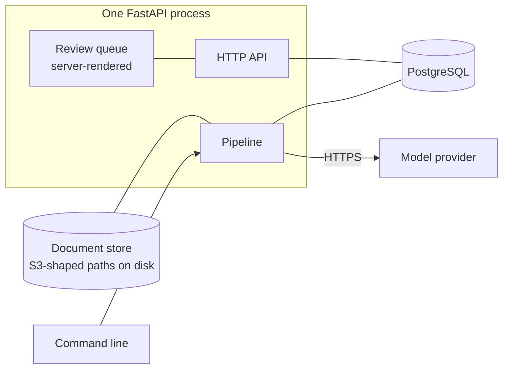
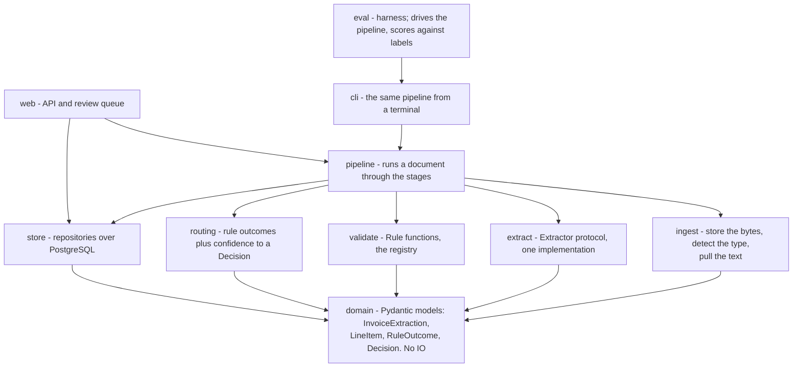
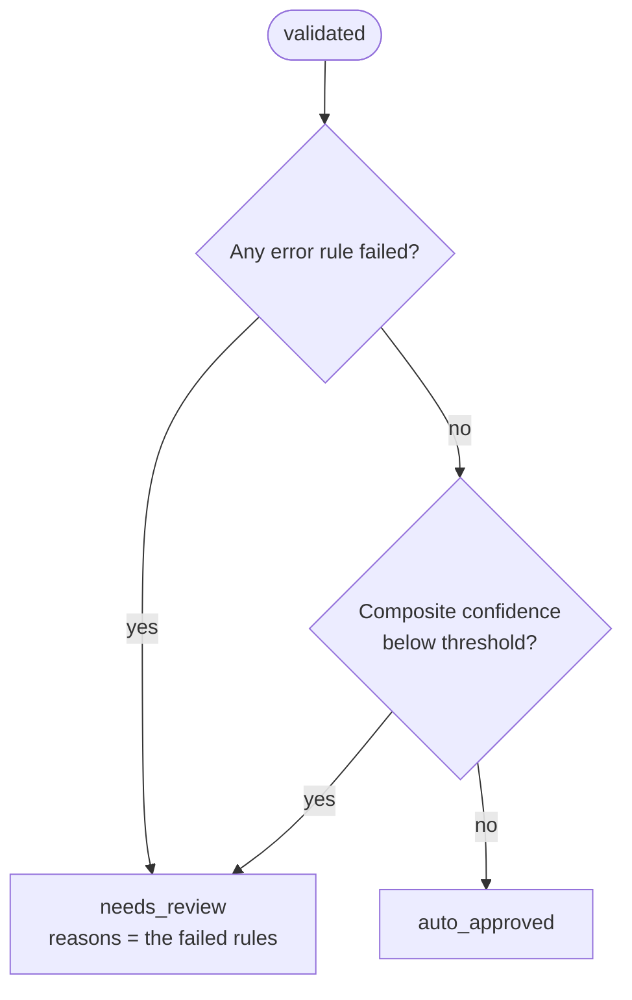
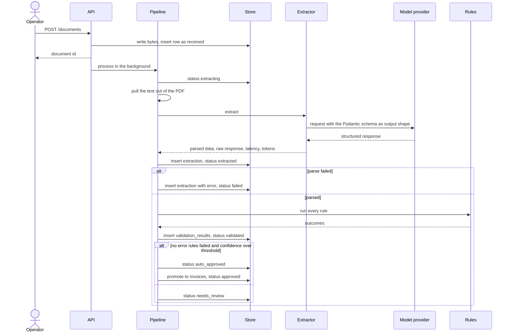
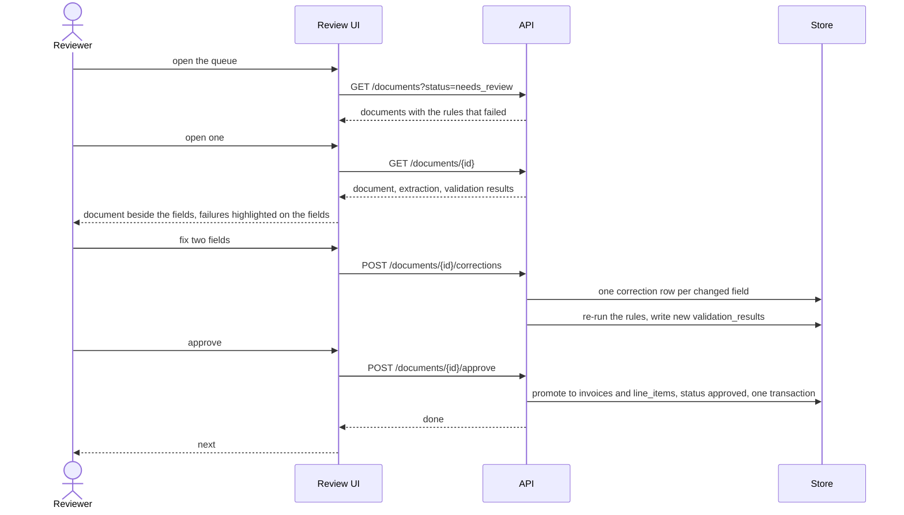
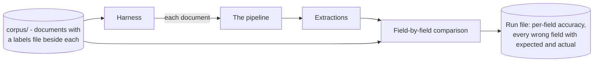

# mailman - Architecture

Internal document. Credentials are referred to by environment variable only.

## Shape

One FastAPI process, one PostgreSQL database, one document store. Brought up together with
Docker Compose. Schema managed by Alembic migrations from the first commit, because a
schema that was hand-built once cannot be rebuilt on another machine.

The command line and the HTTP layer call the same pipeline. Neither has logic the other
lacks. The command line comes first, and it stays useful afterwards because the evaluation
harness drives the pipeline through it rather than through HTTP.

`POST /documents` returns as soon as the row exists and runs the pipeline as a background
task. The upload does not block on a provider call that takes seconds. There is no broker
and no worker fleet - `status` is how a caller finds out what happened, and that is what the
column is for. A broker earns its place when processing needs durable retry across a
restart, and not before.

## Stack

| Concern | Choice | Note |
| --- | --- | --- |
| Service | FastAPI | The generated OpenAPI page is a portfolio artifact for free |
| Database | PostgreSQL | Schema work is part of what this demonstrates |
| Migrations | Alembic | From the first commit, not retrofitted |
| Extraction shape | Pydantic model | One definition used as the provider's output schema, the parse target and the API response shape |
| PDF text | pdfplumber | Text layer only at first. Scans come later |
| Local environment | Docker Compose | One command brings up the process and the database |
| Tests | pytest | Concentrated on the state machine, the transaction boundaries and the rules |
| Review queue | Server-rendered templates | No Node build step, one process, runs from PowerShell |

## Layers

The dependency rule: extraction, validation, routing and storage never import each other.
They meet at typed data objects. That is what lets a rule be added without touching the
extractor, and the provider be swapped without touching the rules.

Everything points at the domain models and nothing points sideways. The pipeline is the only
place that knows about all the stages.

The provider client is imported lazily inside the extractor, so ingestion, validation,
routing and storage are testable with no provider library installed and no key present. Most
of this system can be exercised offline, and that is deliberate rather than incidental.

## The state machine

The document status flow, its terminal states, and the distinction between `failed` and
`rejected` are in [04-data-model.md](04-data-model.md). It is documented there because
`documents.status` is the column the whole system operates on, and the flow is a property of
the data rather than of any one component.

Two rules the code has to protect:

- No status is set without appending to `status_history`. There is one function that moves a
  document and it does both, and nothing else writes the column.
- Promotion to `invoices` and `line_items` happens in one transaction with the status change
  to `approved`. A half-promoted document is the worst state this system could reach, because
  it is one that no status describes.

## Extraction

One Pydantic model defines the invoice shape. It is the provider's structured output schema,
the parse target, and the response body. One definition, so the three cannot drift.

Four failure cases are handled explicitly rather than caught as one exception:

| Failure | Response |
| --- | --- |
| Malformed JSON | Row written with `raw_response` populated, `extracted_data` null, `error` set. Document to `failed` |
| Valid JSON, missing required fields | Same, with the missing fields named in `error`. This is different from malformed and worth telling apart |
| Timeout or transport error | Retried with backoff inside the extractor. After the retries, `failed` |
| Valid and complete | Row written, document to `extracted` |

Retries live inside the extractor and nowhere else. The pipeline asks for one extraction and
either gets one or gets an error; it never sees the attempts in between. The attempt count
goes into the row, because an extraction that succeeded on the fifth try should not look
like one that succeeded on the first.

`latency_ms` and `token_count` are recorded from the very first extraction. They cannot be
backfilled, and they are the cost story.

## Validation

Rules are small individually testable functions, each with a name and a severity, registered
into a set. Each writes one row to `validation_results`.

| Rule | Severity | What it catches |
| --- | --- | --- |
| Required fields present | error | A record cannot be filed without them |
| Line items sum to subtotal | error | A misread quantity or price. The most common extraction error worth catching |
| Subtotal plus tax equals total | error | A misread total, or tax read as a line item |
| Line arithmetic: quantity times unit price equals amount | error | Per-line misreads that still happen to sum correctly |
| Total matches the total printed on the document | error | The model computing rather than reading |
| Currency consistent across all amounts | error | Mixed or invented currency |
| Invoice number matches the expected format | error | A field read from the wrong part of the page |
| Issue date is plausible | error | Not in the future, not implausibly old. Catches a misparsed year |
| Dates are ordered: due date not before issue date | warning | Usually a swapped pair |
| Vendor resolves against `vendors` | warning | An unknown vendor is often just a new vendor |
| Invoice number not already recorded for this vendor | error | Duplicate submission, the expensive mistake here |

Arithmetic is checked in Python, on `Decimal`, never by asking the model whether its own
answer adds up. A model asked to check its own arithmetic agrees with itself. A rule that
was written down can be read, tested and argued with, and that is the difference between a
system and a demo.

The rule list is not final and is not meant to be. It comes from running the first ten
documents and writing down where extraction went wrong - **the failures are what generate
the rules**, not the other way round.

## Routing

Warnings are recorded and shown to a reviewer if the document reaches them, but never route
on their own.

Composite confidence is defined in [04-data-model.md](04-data-model.md). The order here is
the point: the checks that can be trusted are asked first, and the model's own opinion of
itself contributes least and can only send a document to review, never rescue one.

The threshold is configuration. Setting it is the trade between reviewer time and bad
records reaching the database, and it gets chosen from a harness measurement with the
reasoning written down.

## API surface

Authentication is a single shared secret. There is one reviewer.

| Method | Path | Behaviour |
| --- | --- | --- |
| POST | `/documents` | Upload. Stores the bytes, inserts the row, starts processing in the background, returns the id |
| GET | `/documents?status=needs_review&limit=50` | The queue. Filterable by status, paged. This is why there is no queue table |
| GET | `/documents/{id}` | The document with its latest extraction and its validation results. What the review screen reads |
| GET | `/documents/{id}/extraction` | The extraction on its own |
| POST | `/documents/{id}/reprocess` | Re-run, optionally under a given `prompt_version`. Adds an extraction, never replaces one |
| POST | `/documents/{id}/corrections` | Submit field corrections. Logs them and re-runs validation |
| POST | `/documents/{id}/approve` | Promote to `invoices` and `line_items`, in one transaction |
| GET | `/vendors` | Reference data |
| GET | `/health` | Green from the first day of the scaffold |
| GET | `/metrics` | Counts by status, auto-approval rate, and the accuracy figures the harness last recorded |

`/metrics` is small and pays off out of proportion to its size. It is the endpoint that
turns "I built a pipeline" into "this is what it does, here is the auto-approval rate", in
the README and in an interview.

`/reprocess` taking a `prompt_version` is what makes the append-only extractions table pay
for itself: the same document under a new prompt, side by side with the old answer.

## Key sequence - one document

## Key sequence - a review

The corrected values become the invoice. The extraction row keeps what the model originally
said, untouched. The pair is a labelled example, and that is the whole reason the corrections
table exists.

## Evaluation harness

The harness drives the real pipeline through the command line. It does not reimplement
extraction, because a harness that measures a copy of the system measures the copy and
drifts from it the moment the system changes.

Comparison is field by field, not document by document. A document with one wrong field out
of twelve is not a failed document, and reporting it as one hides where the problem is.

| Field kind | Comparison |
| --- | --- |
| Invoice number, currency | Exact after trimming and case folding |
| Amounts | Exact on the `Decimal` value |
| Dates | Exact on the parsed date, so formatting differences are not counted as errors |
| Vendor and buyer names | Normalised - case, punctuation, legal suffixes - then exact. Anything looser is recorded as a near match and counted separately, never silently forgiven |
| Line items | Matched as a set, then compared per line. Reported as precision and recall over lines, because a missed line and an invented line are different failures |

Every run records the model name, the prompt version and the rule set in force. Two runs
that do not record what differed cannot be compared, and comparison is the whole point.

Because extractions are stored, a change to the scoring can be re-measured against responses
already paid for. Only a change to the prompt or the model needs a fresh run against the
provider.

## Rules this architecture is meant to protect

- The raw provider response is stored unmodified alongside the parsed version. When parsing
  breaks, the evidence is still there.
- Extractions are appended, never updated. Re-running a document has to be free of
  consequence or nobody will re-run one.
- What the model claimed and what the business accepted are different tables. A correction
  never overwrites the claim.
- Arithmetic is checked in Python on `Decimal`. The model is never asked to verify itself.
- No float touches money, at any layer, including JSON transport.
- Adding a rule is writing one function and registering it. Nothing else changes.
- Swapping the provider is satisfying one protocol. The rules, the routing and the review UI
  do not know a provider exists.
- The routing threshold is configuration, not a conditional buried in the pipeline.
- Status changes go through one function that also appends to `status_history`.
- Promotion to `invoices` and the status change to `approved` are one transaction.
- Credentials come from the environment, never into source, the database or the store.
- Errors are typed and raised. Nothing is swallowed to keep a document moving.

## Deployment

Local and first deployment are the same shape: the process and PostgreSQL, brought up
together, driven from PowerShell. Documents are files on disk behind one interface, laid out
in S3-shaped paths, so moving to object storage later is a different implementation of that
interface and not a change to the pipeline.

The AWS variant - extraction in Lambda, documents in S3, database in RDS - is a later stage
and is deliberately not designed into the code now. Designing for a deployment that may not
happen produces indirection with nothing behind it. The one concession made in advance is
the storage interface and the path layout, because that one is nearly free.
