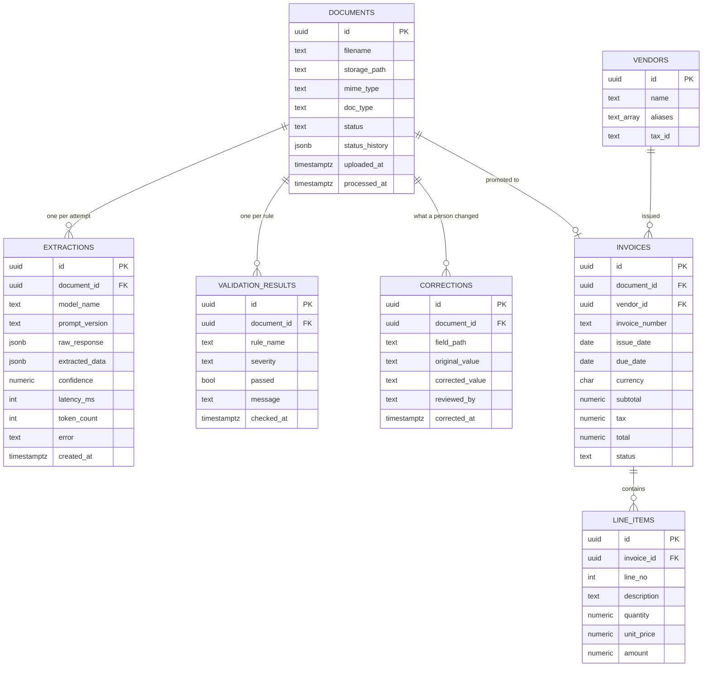
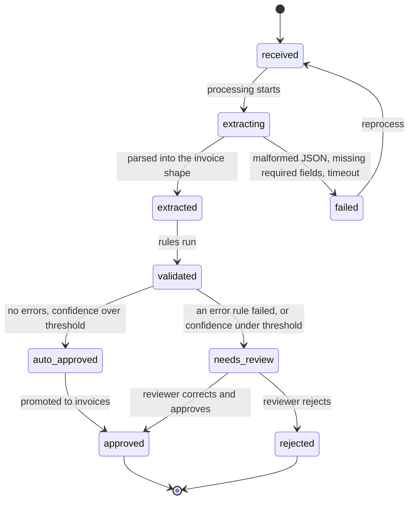

# mailman - Data model

PostgreSQL. **Seven tables.** The shape matters more than the exact columns, and the shape
is this: a document is the spine, an extraction is a claim, an invoice is accepted truth,
and everything a person did is written down.

| Table | Job |
| --- | --- |
| `documents` | The spine. `status` drives the whole system |
| `extractions` | One row per attempt. Never overwritten |
| `invoices` | The canonical record, after extraction and validation |
| `line_items` | The lines of a canonical invoice |
| `vendors` | Reference data to resolve names against |
| `validation_results` | One row per rule per document. This is what routes to review |
| `corrections` | Every human fix. Audit trail and free labelled data |

Two things are deliberately not tables. There is no review-queue table - the queue is
`GET /documents?status=needs_review`, because a queue table would be a second place for the
same fact to live. And there are no evaluation tables - gold labels are JSON files beside
the documents, and harness results are files. Nothing about measurement needs the production
database.

## Entities



## documents

The spine. Every other table hangs off it, and `status` is what the whole system is really
operating on.

| Column | Notes |
| --- | --- |
| `id` | Primary key |
| `filename` | What the sender called it. Not trusted for anything |
| `storage_path` | Key into the document store. Laid out in an S3-shaped path structure from the start, so moving to S3 later is a different client and not a different schema |
| `mime_type` | Detected from the bytes, not from the extension |
| `doc_type` | Invoice today. This is the hook a second document type hangs on, and the column that routes to a different extractor when one exists |
| `status` | The state machine value. See below |
| `status_history` | Appended entry per transition: the status, when, and what caused it |
| `uploaded_at` | When it arrived |
| `processed_at` | When it reached a terminal status. Null while it is still moving |

The bytes are not in the database. `storage_path` points at them. The text pulled out of a
PDF is written beside the original in the same storage path structure rather than into a
column, because it is large, it is regenerable, and keeping it answers the question that
otherwise cannot be answered later: did the model read it wrong, or was it handed something
unreadable.

### Status flow



`approved` is the only status that has a row in `invoices`. `auto_approved` is the routing
decision; `approved` is the promotion having happened. Keeping them separate means the
auto-approval rate - the number `GET /metrics` reports and the one worth putting in the
README - is measurable directly from the status history, rather than inferred from the
absence of corrections.

`failed` is the system's own fault: a corrupt file, a provider timeout, a response that
would not parse. `rejected` is a person deciding this should not become a record. They are
different statuses because collapsing them hides operational problems inside business
outcomes.

Every transition appends to `status_history` with a timestamp and a cause. A stuck document
has to be explainable a week later, and "how long does a document spend in `extracting`" has
to be a query rather than a guess.

## extractions

One row per extraction attempt. Append only, never updated. This is the table that makes
the evaluation harness possible: the same document can be re-run under a new
`prompt_version` and the two answers compared, because the first one is still there.

| Column | Notes |
| --- | --- |
| `document_id` | Which document |
| `model_name`, `prompt_version` | Without both, one extraction cannot be compared to another and the harness has nothing to report against |
| `raw_response` | What came back, unmodified. When parsing breaks, this is what saves the investigation |
| `extracted_data` | The parsed result, validated against the Pydantic invoice shape. Null on a failed attempt |
| `confidence` | See below. Recorded, weakly trusted, never the only gate |
| `latency_ms`, `token_count` | Logged from the first extraction, not added later. They are the cost and speed story, and backfilling them is impossible |
| `error` | Why the attempt failed, when it did. Malformed JSON, missing required field, timeout |
| `created_at` | When |

A failed attempt still writes a row. `raw_response` populated, `extracted_data` null,
`error` set. Throwing away the failures would remove the record of how often the model
fails to produce parseable output, which is one of the things worth measuring.

Several extractions per document is normal, not an error.

### What confidence means

Not the model's self-report alone. That signal is weak, and a model that is confidently
wrong is the failure this system exists to survive. The stored `confidence` is a composite:

- whether every required field came back populated,
- whether the fields that came back parse as the types they are supposed to be,
- what the validation rules said,
- and the model's own confidence, contributing least.

A first version lands in stage 5 with a threshold chosen by hand; the defensible version
comes out of stage 8, once the harness can say what the threshold costs in reviewer time and
what it buys in bad records caught. Whatever it ends up being, the reasoning gets written
down - it is the first thing an interviewer will push on.

## invoices and line_items

The canonical record. A row exists here only when a document reaches `approved`, whether it
got there automatically or through a reviewer.

Separate from `extractions` on purpose: **extraction output is a claim, this is accepted
truth.** A correction never overwrites the claim, which keeps the audit trail honest and
keeps the measurement intact.

| Constraint | Reason |
| --- | --- |
| Unique on (`vendor_id`, `invoice_number`) | Duplicate invoices are the expensive mistake in this domain, and the database should enforce it as well as the rule, because a reviewer can override a rule and cannot override a constraint |
| Amounts are `numeric`, never `float` | Postgres `numeric` is exact decimal. Python side is `Decimal`, and JSON transport is strings, because a float sneaks in through JSON parsing more often than through the database |
| `currency` on the invoice | An amount without its currency is not a number that means anything |
| `quantity` is `numeric` | Quantities are genuinely fractional - hours, kilograms |
| `document_id` kept | The record points back at the document it came from, and through it at every extraction attempt |

Line items are a table rather than JSON on the invoice because they are the thing most often
extracted wrongly, the thing the harness scores as a set, and the thing worth querying.

## vendors

Reference data, small and mostly hand-maintained. `aliases` is a text array.

This is where a validation rule gets interesting. A model returns "Acme Corp." and "ACME
Corporation" interchangeably, and neither is wrong on the document. Resolution is: normalise
the extracted name - case, punctuation, legal suffixes - and match against the normalised
name and the alias list. A name that does not resolve is a **warning**, not an error,
because an unknown vendor is often just a new vendor.

Anything fuzzier than that - edit distance, embeddings - is a project in itself and is not
this project. If it gets added, it gets measured by the harness like everything else.

## validation_results

One row per rule per document. `severity` is `error` or `warning`. `passed` is the outcome.

The routing rule is simple and lives in one place: **any failed `error` rule routes to
`needs_review`. Failed `warning` rules do not.**

Rows are written for passes as well as failures. A rule that used to pass and now fails is
only visible if the pass was recorded.

`message` is not decoration. It is what the reviewer reads to know what to look at, so it
names the numbers involved: "line items sum to 1,240.00 but subtotal says 1,204.00".

Re-running validation after a correction writes a new set of rows with a later `checked_at`
rather than updating the old ones.

## corrections

Every field a person changed, with the value before and after.

Two uses, and the second is the reason this table matters more than it looks:

1. Audit trail. Who changed what, when.
2. **A free labelled dataset.** Each correction is a hand-verified right answer produced by
   work that had to happen anyway. `field_path` uses the same dotted paths the harness uses
   for field-level comparison, on purpose, so a correction can become an expected value in
   the gold set without translation.

Values are stored as text, before and after, rather than typed per field. The alternative is
a column per type or a jsonb blob, and text keeps the table readable and the diff obvious.

## The evaluation corpus

Not in the database. A directory of documents with a labels file beside each one:

```
corpus/
  0001-acme-clean.pdf
  0001-acme-clean.labels.json
  0002-many-lines.pdf
  0002-many-lines.labels.json
  ...
```

The labels file holds the correct extraction in the same shape the extractor produces, so
comparison is field against field with no translation step.

Harness results are files too, one per run, recording the model, the prompt version, the
per-field accuracy and every individual field that was wrong with its expected and actual
value. A percentage with no way to see the failures behind it cannot be acted on.

This is kept out of Postgres deliberately: the corpus and its results belong to the
repository and to git history, they need to be readable in a diff, and none of the
production tables should have to carry a schema that exists only for measurement.

## What is deliberately not stored

- Credentials, in any table.
- Document bytes in the database. A path only.
- A cleaned-up model response that replaces the original.
- Any document from an employer or a client. Synthetic and public only, and this is a rule
  about what may exist in this repository rather than a preference.
- Any judgement about whether accuracy was good. The harness reports; the reader concludes.

## Constraints worth stating

- Extractions, validation results and corrections are append only.
- A row in `invoices` implies a document in `approved`. Nothing else produces one.
- Deleting a document is not supported. `rejected` is the mechanism.
- Every status change appends to `status_history`. No transition happens silently.
