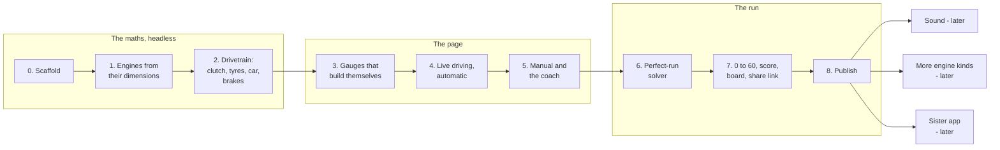

# pedalsim - Build plan

## Objective

**One plain, sporty page of gauges with real engine maths behind it - and the maths builds
the gauges too.** Cycle through engines from a V4 to a V12. The gauges start as empty circles;
rev the engine and they pixelate into existence, each part appearing where and as much as the
engine has actually been. Drive, brake, shift by hand with a coach telling you when, and run
0 to 60 against the perfect run the page has worked out for that engine.

Finished, for the first version, when seven things are true:

1. In neutral, every throttle position settles the rev counter at a different, repeatable
   rpm, and the revs rise and fall at the rate the engine's torque and inertia allow.
2. The five engines drive visibly differently in the same car, and each engine's numbers
   (peak torque, peak power, redline, top speed, 0 to 60) come out of its dimensions and
   land in the range real engines of its kind reach. A test fails if they stop doing so.
3. Every engine's gauges start as empty circles and are built only by running that engine:
   a stretch of the tachometer appears where the engine has revved, the speedometer where
   the car has been, the redline only once it has been reached. Nothing on a gauge face is
   drawn by hand; every tick, number and arc is placed from the engine's own figures.
4. A person who is not the author can pull away and shift through the gears in manual using
   only a keyboard, guided by the coach, without being told how.
5. A 0 to 60 run produces a score card whose time-lost numbers add up exactly to the gap from
   the perfect run, and the ghost needle shows that perfect run alongside.
6. A run shared as a link gives the same time and score in another browser.
7. It is live on GitHub Pages at `/pedalsim/`, with no server behind it.

There are no dates in this plan. Stages are ordered by what each one needs from the one
before it.

## Order of work

| Stage | Goal | Done when |
| --- | --- | --- |
| 0 | Scaffold | `pedalsim/` with `index.html` opening under `npx serve`, `package.json`, `node --test` running, `sim/step.js` with its signature, `tools/drive.js` writing a CSV trace from a scripted input list |
| 1 | Engines from their dimensions | `engines/params.js` for V4, V6, V8, V10, V12; `tools/build-engines.js` writes the tables, gearing and coach points; `tools/figures.js` prints each engine's figures. Tests: displacement and redline from the formulas; free-rev settles at one rpm per pedal; the limiter bounces; stall below stall speed; figures inside their ranges |
| 2 | The drivetrain, headless | Clutch and tyres as stick or slip couplings with the lock test, the four cases written out; gearbox; chassis forces with weight transfer; ABS-capped brakes with the hold rule; the torque converter and shift map. Tests: pulling away gently works, dumping the clutch at idle stalls, too many launch revs spin the wheels and lose time, engine braking only in gear, top speed equals the power-drag crossing, the automatic creeps and does not hunt; golden traces and `SIM_VERSION`; no `Math.sin` and friends in `sim/` |
| 3 | Gauges that build themselves | Faces laid out entirely from the engine's figures (tick spacing by a nice-numbers rule, redline arc, one shift light per cylinder). A development field per gauge that grows where the engine has been; a reveal that turns development into pixel blocks shrinking from coarse to fine; the dyno strip plotting only points the engine has produced. Empty circles at the start, a fully built tachometer after a few pulls to the limiter. Played from a stage 2 CSV trace first, so the build-up is designed before there is input. Needles with spring dynamics, crisp from the start. The author's sporty look is what gets revealed |
| 4 | Live driving, automatic | The fixed-step loop, keyboard and pointer controls, engine picker, start key, automatic gearbox with P-R-N-D. You can rev, drive and brake every engine |
| 5 | Manual and the coach | Clutch, H-pattern stick, grind, over-rev and the check engine light; the coach's up and down arrows, shift marker, rev-match needle, slip energy per shift. Done-when includes someone other than the author shifting through the gears on a keyboard |
| 6 | The perfect-run solver | `tools/solve.js` finds each engine's best manual 0 to 60 within human shift limits, writes its log and time; a test reruns every stored perfect run |
| 7 | 0 to 60, score, board, share link | Countdown, run recorder, ghost needle, phase-by-phase time lost, the score and the clean mark, bests and recent runs held in memory until a refresh, share links that re-drive on open. A test: a run recorded in headless Chrome scores the same in Node |
| 8 | Publish | In `deploy/build-static.mjs` and the Pages workflow; README with what it is, a short recording, how to run it, what a shared run does and does not prove; root README lists it |

**Nothing is built.**

### Why the maths comes first and headless

The author's words: "it should be a basic page, nothing crazy, the crazy is the algorithm."
So the algorithm is built and tested before any pixel. If the clutch or tyre model is wrong,
a beautiful gauge is reporting nonsense.

### Why the gauges come before live input

The gauges are the whole visible product. Playing them from a recorded trace lets the design
be judged on its own, and lets the author's sporty styling go in without fighting input code.

### The interface is built by the engine

The author's idea: "i want the math to also build the interface". The gauges start as empty
circles. Choose an engine and rev it, and they pixelate in. It is the same principle as the
rest of the project carried onto the screen: nothing is shown that the engine has not
produced. The tachometer's face exists where the needle has been, the redline appears the
first time the engine reaches it, the torque curve is plotted only from points the engine has
made at full throttle - like a real dyno pull. Floor it in neutral a few times and the
tachometer is complete; drive and the speedometer follows.

It also makes the engines' differences visible on first sight: a V12's tachometer is laid
out to a higher redline with its own tick spacing and twelve shift lights, a V4's to its own.
How this works is in [03-architecture.md](03-architecture.md), "The interface the engine
builds".

### Why the solver comes before the score

The score is measured against the perfect run. Without the perfect run there is nothing to
measure against, and a leaderboard of raw times says nothing about how well someone shifted.

## Decisions settled by the author

| Decision | Reason |
| --- | --- |
| The name pedalsim | The author's |
| Only pedals, gauges and the shift stick; no road | The first brief |
| One page, just gauges, kept basic; the complexity is in the calculation | "it should be a basic page, nothing crazy, the crazy is the algorithm" |
| No server. Standalone, runs on GitHub Pages | "i want it standalone, can run through github pages". The "backend" is the calculation driving the dials |
| Choose the engine, cycling through them from a V4 up to a V12 | "you select which engine you want to rev up and shift through"; "i should be able to cycle between the cylinders" |
| The engines are built from their measurements | Confirmed by the author: "yes the engines are built from measurements and such" |
| The maths builds the interface: gauges start as empty circles and pixelate in as the engine is revved | The author's idea, exchange 3. Feasible; see "The interface is built by the engine" above |
| Clean run: no grinding, no blowing the engine, gentle on the clutch | Confirmed by the author: "that sounds good for a clean run, dont blow out the engine etc" |
| Engine sound later, not in the first version | The author |
| Five engines, V4, V6, V8, V10, V12, cycled in order | The author: "add v10 please". A true V4 - rare in cars, rough by nature - is just another parameter set |
| A sandbox: every refresh is a new run, nothing is saved | The author: "each refresh is a new run, no need for sessions and stuff like that, its a sandbox that resets". Empty circles, no bests, default settings on every load. Nothing in the browser's storage |
| The board lasts while the page is open; a run is kept past a refresh only by sharing it as a link, which the receiver's page re-drives | Follows from no server and the sandbox. The link carries the inputs, never the score, so it cannot be edited into a better time |
| The look starts from the CodePen pen filipz/pen/dPygJGM, with ma77os/pen/xxyywo as the backup | The author's pick. Public pens are MIT licensed by CodePen; credit the author and keep the notice |
| The engine lines: bank A, bank B and their sum against crank angle, faint behind the gauges | The author: "engine lines are cool". The pen's sound-reactive lines turned into the engine's own signal |
| The colours cycle: each engine has its own palette, changing as the engine cycles | The author: "cycle between colors" |
| The rpm represents the amount of gas given | The author's first requirement for the gauges |
| Show speed rising, and what happens when you brake | The author's |
| Automatic, with manual shifting as an option | "with options to use a manual shift" |
| The page teaches when to shift up and when to shift down | "know when to shift, when to downshift" |
| The leaderboard is about shifting well on a 0 to 60 run: the most efficient and correct run, the timing | The author's |
| Sporty design; the author is looking for inspiration on CodePen | The author's |
| No hardware is assumed. The author owns no wheel, pedals or shifter | Keyboard, mouse and touch are the controls |
| Car engines are the focus for now | "so far im concerned with car engines" |
| A sister app that uses calculations to do something else may live beside it later | Not planned yet. The author will explore it |
| Planned first, same requirements folder, private context log updated every prompt | The author's instruction |

## Decisions proposed, waiting for the author's confirmation

| Decision | Reason |
| --- | --- |
| A build tool turns the measurements into tables offline, and its output is committed | The tool may use any maths; the live step keeps the determinism rules. The page can show *why* a V12 differs from a V4 |
| The reveal is display-side: development grows from the simulation's state, and the simulation never reads it | Keeps `sim/` pure and deterministic; a replay rebuilds the same gauges because it produces the same states |
| Each engine has its own build-up; cycling to another engine dissolves the faces back to empty circles, and returning restores what that engine had built, until a refresh | Each engine's scale is different, so one face cannot serve two |
| A "build it all" control, also used when the browser asks for reduced motion | Someone who only wants the gauges should not have to earn them |
| Blowing the engine un-builds it: the faces break back into pixels and empty circles, and the run is not clean | The author's "dont blow out the engine", shown in the interface's own language |
| The 0 to 60 run is not locked behind a built tachometer | Building is an invitation, not a gate. The coach's shift marker does wait until its part of the face exists |
| One car carries every engine | The engine is then the only variable, and comparisons are fair |
| Gearing is calculated per engine | First gear from grip, top gear from where power meets drag, a progression between |
| Tyres can spin, from the first version | Without a grip limit the V12 pushes at about 2 g off the line, does 0 to 60 in under two seconds, and the launch is no skill. Kinetic grip below static makes wheelspin cost time |
| The clutch and tyres share one stick or slip rule | One well-tested piece of maths instead of two |
| The perfect run is solved on the author's machine and committed | Deterministic, instant on the page, and checked by a test |
| The perfect driver gets no faster shift than a person | Otherwise "perfect" wins by a margin no one can close |
| Score = 1000 times perfect time over your time, plus a clean mark | Every mistake already costs time; smoothness is shown, not double-counted |
| The score card splits time lost by phase, summing exactly to the gap | Tells the driver where the time went, which is what makes them try again |
| A ghost needle shows the perfect run during your run | The clearest picture of "shift here, not there" |
| Simple ABS: the wheels never lock under braking | Braking stays readable on the gauges; a locked wheel would drop the speedometer to zero while the car still moves |
| Plain JavaScript modules, no build step | The trail pattern; already deploys on Pages |
| From the pen take its colour presets, Boldonse and Bodoni Moda (copies served from the repo), glow-line needles and arcs, and film grain; write all code fresh | The author's pick, made into gauges. The pen's shader is based on a Shadertoy shader whose default licence is non-commercial share-alike, so its code is not copied - see 03-architecture, "The look, from the pen" |
| Palettes: V4 Cool, V6 Neon, V8 Warm, V10 Cyberpunk, V12 Monochrome; the redline always red and the type always light grey | The redline has to read as a redline whatever the colours. On the V12's silver it is the only colour, which suits it |
| Gauge faces drawn to an offscreen canvas from a generated description, revealed through a WebGL2 shader, with a canvas 2D fallback; needles drawn crisp on top | Per-pixel decisions every frame are what a shader is for, and trail already uses WebGL2 here. SVG, the first proposal, cannot pixelate |
| 1000 simulation steps a second; no transcendental functions in the step | Stable couplings; the same run on every browser |
| mph by default, km/h as a setting | US-facing, like the author's other projects |

## Open questions

| Question | Blocks | Notes |
| --- | --- | --- |
| How long should a full build take? | Stage 3 | Proposed: three or four full-throttle pulls to the limiter in neutral build the tachometer; the speedometer builds to whatever speed has been reached. Tuned by feel |
| What does the empty state show? | Stage 3 | Proposed: the circle outlines and the needle hubs only. The needles appear with the start key |
| Sound | Later | Settled as later. When it comes: a note synthesised from rpm, load and cylinder count |
| Should the automatic have a 0 to 60 run too? | Stage 7 | Proposed: yes, timed, but not scored - there is no shifting skill in it beyond the launch |
| More engine kinds later | After stage 8 | Turbocharged (boost gauge, lag), diesel (low redline, huge torque), rotary, motorcycle, electric (no gears at all). Each is a parameter set and a few new curves |
| The sister app | Not this project | Ideas are kept in the context log. Lives in its own folder beside the engine app, may reuse `sim/` |

## Risks

| Risk | Effect if it happens | Response |
| --- | --- | --- |
| The couplings chatter or explode at the lock point | Needles shake, the core feels broken | Stick or slip with the lock test, a 1 ms step, the four cases written out and each tested, all before stage 3 |
| Derived engines come out unrealistic | The V12 does not feel like a V12, and the "built from dimensions" claim looks silly | `figures.js` against published ranges for naturally aspirated engines of each size; tune parameters, never patch the tables by hand |
| The solver finds a silly optimum | The perfect run does something no person could, and the score is meaningless | Human shift limits on the perfect driver; the author drives each engine and checks the perfect run looks right before it is committed |
| A keyboard is too blunt for a clutch | Visitors stall forever and leave | Pedal ramps, a slow clutch rise, and a done-when test with someone else on a keyboard. The automatic is the default, so nobody starts in manual |
| Browsers disagree on a shared run | Links show a different score | Determinism rules, quantised inputs, golden traces in Node and Chrome |
| The page grows features | "Basic page" turns into a dashboard | The author's rule is the guard: one page, gauges. Anything else goes behind a single score card or into the later list |
| The build-up hides what a driver needs | A newcomer cannot read the revs or see the shift marker | Needles are crisp from the start; the coach's arrows do not depend on the face; "build it all" is one click |
| The reveal costs too much per frame | Stutter on a phone | Faces are drawn once per engine to a texture; each frame is one shader pass over two small quads with a short array of development values |
| Copied design code carries a licence | A public repo using code it may not | Nothing is copied from the pen: its shader derives from a Shadertoy shader under non-commercial share-alike. Take the look, write the code, credit the pen as inspiration |
