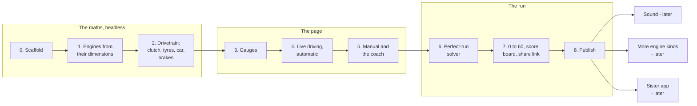

# pedalsim - Build plan

## Objective

**One plain, sporty page of gauges with real engine maths behind it.** Choose an engine from
four cylinders to twelve, rev it, drive it, brake, shift by hand with a coach telling you
when, and run 0 to 60 against the perfect run the page has worked out for that engine.

Finished, for the first version, when six things are true:

1. In neutral, every throttle position settles the rev counter at a different, repeatable
   rpm, and the revs rise and fall at the rate the engine's torque and inertia allow.
2. The five engines drive visibly differently in the same car, and each engine's numbers
   (peak torque, peak power, redline, top speed, 0 to 60) come out of its dimensions and
   land in the range real engines of its kind reach. A test fails if they stop doing so.
3. A person who is not the author can pull away and shift through the gears in manual using
   only a keyboard, guided by the coach, without being told how.
4. A 0 to 60 run produces a score card whose time-lost numbers add up exactly to the gap from
   the perfect run, and the ghost needle shows that perfect run alongside.
5. A run shared as a link gives the same time and score in another browser.
6. It is live on GitHub Pages at `/pedalsim/`, with no server behind it.

There are no dates in this plan. Stages are ordered by what each one needs from the one
before it.

## Order of work

| Stage | Goal | Done when |
| --- | --- | --- |
| 0 | Scaffold | `pedalsim/` with `index.html` opening under `npx serve`, `package.json`, `node --test` running, `sim/step.js` with its signature, `tools/drive.js` writing a CSV trace from a scripted input list |
| 1 | Engines from their dimensions | `engines/params.js` for I4, V6, V8, V10, V12; `tools/build-engines.js` writes the tables, gearing and coach points; `tools/figures.js` prints each engine's figures. Tests: displacement and redline from the formulas; free-rev settles at one rpm per pedal; the limiter bounces; stall below stall speed; figures inside their ranges |
| 2 | The drivetrain, headless | Clutch and tyres as stick or slip couplings with the lock test, the four cases written out; gearbox; chassis forces with weight transfer; ABS-capped brakes with the hold rule; the torque converter and shift map. Tests: pulling away gently works, dumping the clutch at idle stalls, too many launch revs spin the wheels and lose time, engine braking only in gear, top speed equals the power-drag crossing, the automatic creeps and does not hunt; golden traces and `SIM_VERSION`; no `Math.sin` and friends in `sim/` |
| 3 | Gauges | SVG tachometer and speedometer generated from the engine tables, needles with spring dynamics, key-on sweep, shift light bar, gear indicator, dyno strip. Played from a stage 2 CSV trace, so the look is designed before there is input. Styled through CSS variables, ready for the author's sporty design |
| 4 | Live driving, automatic | The fixed-step loop, keyboard and pointer controls, engine picker, start key, automatic gearbox with P-R-N-D. You can rev, drive and brake every engine |
| 5 | Manual and the coach | Clutch, H-pattern stick, grind, over-rev and the check engine light; the coach's up and down arrows, shift marker, rev-match needle, slip energy per shift. Done-when includes someone other than the author shifting through the gears on a keyboard |
| 6 | The perfect-run solver | `tools/solve.js` finds each engine's best manual 0 to 60 within human shift limits, writes its log and time; a test reruns every stored perfect run |
| 7 | 0 to 60, score, board, share link | Countdown, run recorder, ghost needle, phase-by-phase time lost, the score and the clean mark, bests and recent runs in the browser, share links that re-drive on open. A test: a run recorded in headless Chrome scores the same in Node |
| 8 | Publish | In `deploy/build-static.mjs` and the Pages workflow; README with what it is, a short recording, how to run it, what a shared run does and does not prove; root README lists it |

**Nothing is built.**

### Why the maths comes first and headless

The author's words: "it should be a basic page, nothing crazy, the crazy is the algorithm."
So the algorithm is built and tested before any pixel. If the clutch or tyre model is wrong,
a beautiful gauge is reporting nonsense.

### Why the gauges come before live input

The gauges are the whole visible product. Playing them from a recorded trace lets the design
be judged on its own, and lets the author's sporty styling go in without fighting input code.

### Why the solver comes before the score

The score is measured against the perfect run. Without the perfect run there is nothing to
measure against, and a leaderboard of raw times says nothing about how well someone shifted.

## Decisions settled by the author

| Decision | Reason |
| --- | --- |
| The name pedalsim | The author's |
| Only pedals, gauges and the shift stick; no road | The first brief |
| One page, just gauges, kept basic; the complexity is in the calculation | "it should be a basic page, nothing crazy, the crazy is the algorithm" |
| No server. Standalone, runs on GitHub Pages | "i want it standalone, can run through github pages". The "backend" is the calculation driving the dials |
| Choose the engine, from four cylinders up to a V12 | "you select which engine you want to rev up and shift through" |
| The rpm represents the amount of gas given | The author's first requirement for the gauges |
| Show speed rising, and what happens when you brake | The author's |
| Automatic, with manual shifting as an option | "with options to use a manual shift" |
| The page teaches when to shift up and when to shift down | "know when to shift, when to downshift" |
| The leaderboard is about shifting well on a 0 to 60 run: the most efficient and correct run, the timing | The author's |
| Sporty design; the author is looking for inspiration on CodePen | The author's |
| No hardware is assumed. The author owns no wheel, pedals or shifter | Keyboard, mouse and touch are the controls |
| Car engines are the focus for now | "so far im concerned with car engines" |
| A sister app that uses calculations to do something else may live beside it later | Not planned yet. The author will explore it |
| Planned first, same requirements folder, private context log updated every prompt | The author's instruction |

## Decisions proposed, waiting for the author's confirmation

| Decision | Reason |
| --- | --- |
| Five engines: inline-4, V6, V8, V10, V12 | Reads "a V4 to a V12" as four cylinders to twelve. A true V4 is rare in cars; one can be added if wanted |
| Engines are built from their dimensions by a tool, not hand-drawn curves | The originality the author asked for: redline from piston speed, torque from displacement, smoothness from firing gap. The page can show *why* a V12 differs from an I4 |
| One car carries every engine | The engine is then the only variable, and comparisons are fair |
| Gearing is calculated per engine | First gear from grip, top gear from where power meets drag, a progression between |
| Tyres can spin, from the first version | Without a grip limit the V12 pushes at about 2 g off the line, does 0 to 60 in under two seconds, and the launch is no skill. Kinetic grip below static makes wheelspin cost time |
| The clutch and tyres share one stick or slip rule | One well-tested piece of maths instead of two |
| The perfect run is solved on the author's machine and committed | Deterministic, instant on the page, and checked by a test |
| The perfect driver gets no faster shift than a person | Otherwise "perfect" wins by a margin no one can close |
| Score = 1000 times perfect time over your time, plus a clean mark | Every mistake already costs time; smoothness is shown, not double-counted |
| The score card splits time lost by phase, summing exactly to the gap | Tells the driver where the time went, which is what makes them try again |
| The board is per browser; runs are shared as links re-driven on open | A shared board needs a server, which the author ruled out. A link carries the inputs, never the score, so it cannot be edited into a better time |
| A ghost needle shows the perfect run during your run | The clearest picture of "shift here, not there" |
| Simple ABS: the wheels never lock under braking | Braking stays readable on the gauges; a locked wheel would drop the speedometer to zero while the car still moves |
| Plain JavaScript modules, no build step, SVG gauges | The trail pattern; already deploys on Pages |
| 1000 simulation steps a second; no transcendental functions in the step | Stable couplings; the same run on every browser |
| mph by default, km/h as a setting | US-facing, like the author's other projects |
| No sound in the first version | The author asked for gauges. A synthesised engine note is a strong later addition - see open questions |

## Open questions

| Question | Blocks | Notes |
| --- | --- | --- |
| "V4" - four cylinders in general, or an actual V4? | Stage 1 | Proposed: inline-4. A V4 can be a sixth engine |
| Sound? | After stage 8 | Proposed later: a note synthesised from rpm, load and cylinder count, so the I4 and V12 also *sound* different. Optional and muted by default |
| The sporty design: which CodePen pens? | Stage 3 | The author is looking. Keep each pen's link and author in a credits file. Gauge maths stays generated; the pen supplies the look |
| What counts as "clean"? | Stage 7 | Proposed: no grind, no over-rev, total clutch slip energy under a per-engine limit |
| Should the automatic have a 0 to 60 run too? | Stage 7 | Proposed: yes, timed, but not scored - there is no shifting skill in it beyond the launch |
| More engine kinds later | After stage 8 | Turbocharged (boost gauge, lag), diesel (low redline, huge torque), rotary, motorcycle, electric (no gears at all). Each is a parameter set and a few new curves |
| The sister app | Not this project | Ideas are kept in the context log. Lives in its own folder beside the engine app, may reuse `sim/` |

## Risks

| Risk | Effect if it happens | Response |
| --- | --- | --- |
| The couplings chatter or explode at the lock point | Needles shake, the core feels broken | Stick or slip with the lock test, a 1 ms step, the four cases written out and each tested, all before stage 3 |
| Derived engines come out unrealistic | The V12 does not feel like a V12, and the "built from dimensions" claim looks silly | `figures.js` against published ranges for naturally aspirated engines of each size; tune parameters, never patch the tables by hand |
| The solver finds a silly optimum | The perfect run does something no person could, and the score is meaningless | Human shift limits on the perfect driver; the author drives each engine and checks the perfect run looks right before it is committed |
| A keyboard is too blunt for a clutch | Visitors stall forever and leave | Pedal ramps, a slow clutch rise, and a done-when test with someone else on a keyboard. The automatic is the default, so nobody starts in manual |
| Browsers disagree on a shared run | Links show a different score | Determinism rules, quantised inputs, golden traces in Node and Chrome |
| The page grows features | "Basic page" turns into a dashboard | The author's rule is the guard: one page, gauges. Anything else goes behind a single score card or into the later list |
| Copied design code carries a licence | A public repo using code it may not | Credit every pen used; take the look, rewrite the code to the gauge generator |
