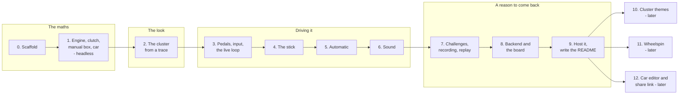

# pedalsim - Build plan

## Objective

**A car you drive by its instruments alone, built on maths that holds up.** Three pedals, a
stick and a cluster; no road. A person who drives a manual should stall it, find the bite
point and grin, and a person who reads the code should find a real powertrain model with
tests that check it against real cars.

Finished, for the first version, when six things are true:

1. A person who is not the author can open the page, start the engine, stall it, and pull
   away in first, using only the keyboard, without being told how.
2. The same with an automatic: creep in Drive, kickdown, will not leave Park without the
   brake.
3. Every car's 0 to 60 time, top speed and cruising revs land inside the targets in its car
   file, and a test fails if they stop doing so.
4. A recorded run replays identically in Node and in the browser, and a test fails if it
   stops doing so.
5. A challenge result sent to the server is re-driven there, and the board shows the
   server's number.
6. It is hosted - the page with the rest of the static site, the backend as a profile on the
   one server - at a link that can go on an application.

There are no dates in this plan. Stages are ordered by what each one needs from the one
before it.

## Order of work

| Stage | Goal | Done when |
| --- | --- | --- |
| 0 | Scaffold | `pedalsim/` with `index.html` opening under `npx serve`, `package.json`, `node --test` running, an empty `sim/` with the step signature, `tools/drive.js` running a scripted input list and writing a CSV trace |
| 1 | The maths, headless | Engine, idle control, limiter, stall, clutch stick or slip, manual gearbox, car forces, brakes holding on a hill. Tests: idle holds; dumping the clutch at idle stalls; a held car does not creep; top speed is where power meets drag; each car's 0 to 60 and rpm at 70 inside its targets; golden traces with `SIM_VERSION`; no `Math.sin` and friends in `sim/` |
| 2 | The cluster | SVG dials generated from the car's cluster block, needles with spring dynamics, key-on sweep, warning lights, the small display. Driven from a CSV trace from stage 1, so the look is designed before there is any input. Checked at desktop width and phone landscape |
| 3 | Pedals and the live loop | Fixed-step loop at 1000 steps a second, the three pedals drawn and moving, keyboard ramps, mouse and touch drag, gamepad and USB pedal axes with calibration, ignition. Gears on number keys. You can stall it and drive it |
| 4 | The stick | H-pattern drag on segments, synchro and grind, matched clutchless shifts, reverse lockout, over-rev damage and the check engine light |
| 5 | Automatic | Torque converter, lock-up, shift map with hysteresis, kickdown, P-R-N-D lever with the brake interlock and the parking pawl, creep. The family car's automatic inside its targets |
| 6 | Sound | Engine voice in an `AudioWorklet` from rpm, load and cylinders; limiter stutter; starter, grind, stall, pawl |
| 7 | Challenges, recording, replay | The run log, the six challenges, personal bests, the last ten runs, watch any run back. A replay test: record in the browser, replay in Node, same result |
| 8 | Backend and the board | Node server, PostgreSQL, the four routes, replay verification, rate limit, names, board view in the page. A CI workflow running the tests against a real database |
| 9 | Host it, write the README | The page in the static build at `/pedalsim/`, the `pedalsim` compose profile, initdb, Caddy block. README with what it is, a recording with sound, how to run it, what it deliberately does not do |
| 10 | Cluster themes | Later. A second and third cluster style from the same dial maths - see the open questions |
| 11 | Wheelspin | Later. Wheels as their own body, a tyre curve, traction limits. Changes `SIM_VERSION` |
| 12 | Car editor and share link | Later. Tune a car in the page; the car travels in the URL. Never on the board |

**Nothing is built.**

### Why the maths comes before anything on screen

The project is a joke with one load-bearing part: the car has to feel right with nothing to
look at but needles. If the clutch model is wrong, the prettiest cluster in the world is
reporting nonsense. Stage 1 is headless so it can be tested properly - scripted runs, traces,
numbers checked against targets - before a single pixel would hide a bug.

### Why the cluster comes before input

The cluster is the graphic design half of the project and the thing a visitor sees first.
Driving it from a recorded trace lets the dials, needles and lights be designed and judged on
their own, without fighting the input code at the same time.

### Why the backend comes last

Everything except the board works without it. A backend built before the simulation settles
would be verifying a moving target, and every change to the step function invalidates the
board anyway.

## Decisions settled by the author

| Decision | Reason |
| --- | --- |
| The name pedalsim | The author's |
| A car simulator that is only the pedals, the gauges and the gear stick | The brief, and the joke. No road, no steering, no view |
| Manual or automatic | The brief. Both are first-version features, not one now and one later |
| Built on maths and graphic design | The brief. The powertrain is a real model; the cluster is designed with care |
| A graphic front end and a small backend | The brief. The backend stays small |
| Planned first, with the same requirements folder as the other apps, and a private context log updated every prompt | The author's instruction |

## Decisions proposed, waiting for the author's confirmation

These are the design's recommendations. Each is used by the documents as written, and each
can be overturned - if it is, the row moves to the context log with what replaced it.

| Decision | Reason |
| --- | --- |
| The backend's job is a leaderboard whose results the server re-drives itself | A leaderboard that trusts the page is a list of whatever anyone typed. Replaying the inputs makes the backend small and still worth having, and it is the part of the project an engineer will ask about |
| The page works fully without the backend | The server is optional infrastructure for one feature. A visitor whose network fails still has the whole car |
| The simulation is plain JavaScript, shared by the page and the server | Determinism across the two is the point. Writing it twice, in two languages, means two models that drift apart |
| The backend is Node, not Python like mailman, herder and roamer | Follows from the line above: Node imports the page's own `sim/`. A Python backend would need a second implementation kept in step by a parity suite |
| Plain JavaScript modules, no framework, no build step, like trail | One page with a few panels does not need a framework. The repo already deploys trail this way |
| SVG for the cluster, pedals and stick | Crisp at any size, easy to generate from maths, styled with CSS. A cluster is a few hundred shapes, well inside what SVG handles at 60 frames a second |
| 1000 simulation steps a second, fixed | The clutch's stick or slip needs a small step to be stable with a light flywheel. Cheap enough: a few hundred arithmetic operations a step |
| No transcendental functions in the simulation | They may differ between JavaScript engines, which would break replays between the page and the server |
| Synthesised engine sound, no recordings | No samples to license, and it follows the simulation exactly, including the limiter |
| Cars are types, not brands | No trademarks. Targets are taken from published road tests of each class, so the figures still mean something |
| No tyre slip in the first version | Wheelspin is a third body and a tyre model. The car is convincing without it; it is stage 11 |
| mph by default, km/h as a setting | The author's other projects are US-facing. The simulation is SI inside either way |
| Stalling, grinding and over-revving are consequences, not failures | The silliness lives here. A stall needs the key again; an over-rev lights the check engine light until a "new engine" button |
| Six challenges: pull away, 0 to 60, quarter mile, hold 50, economy, hill start | Each one exercises a different part of the model: the bite point, the shift points, top-end power, throttle control, efficiency, clutch and brake together |
| No accounts. A display name per board entry | Nothing on the board needs an identity, and accounts are a subsystem to secure |
| The board shows only the current `SIM_VERSION` | A result from a different simulation is a different contest. Old runs are kept, not shown |
| Desktop first, phone in landscape supported | Three pedals and a stick need room. Touch input with several fingers at once is part of stage 3 |
| A `pedalsim` profile on the existing server | One host, no second bill |

## Open questions

| Question | Blocks | Notes |
| --- | --- | --- |
| Is the leaderboard the backend's job, or did the author have something else in mind? | Stage 8, and the shape of the server | The proposal is above. Alternatives: a shared garage of cars people tuned; sharing runs by link with no board; ghost runs to race against on the cluster |
| Is it a toy, a set of challenges, or both? | Stage 7 | Proposed both: free driving is the front door, challenges are the reason to return |
| Who designs the look? | Stage 2 | The author may want to design the cluster themselves (as with roamer's UI), or use the design system the resume was rebuilt with, or have one proposed |
| Which cluster style first? | Stage 2 | Proposed: one analog cluster done properly. Candidates for later: an 80s digital bar-graph cluster, a 70s chrome-ringed one, a modern screen |
| What is the silly car? | Stage 1 | A car that is absurd on purpose shows the maths is general. Ideas: a ride-on lawnmower with three gears, a delivery van that will not get past 70, a dragster with two gears and a clutch that bites at 6000 |
| Does the author own sim pedals, a wheel or a shifter? | Stage 3 | USB pedals and an H-pattern shifter both appear as gamepad devices. Worth testing against real hardware if it exists; otherwise a controller's triggers |
| Is there anything at all to look at besides the cluster? | Stage 2 | Proposed: no. The cluster is the only window. A faint vibration of the whole cluster at high revs is the furthest it goes |
| Should a stall or over-rev be punished more? | Stage 4 | Proposed gentle: key again, or a "new engine" button. A challenge run ends on a stall |
| Fixed hill grade, or a road profile? | Stage 1 | Proposed: grade is a setting and a challenge parameter, flat by default. A profile is a road, which the project does not have |
| How strict are the anti-abuse rules on the board? | Stage 8 | A replay proves the run is possible, not that a person drove it. Proposed: say so on the board and leave it there |

## Risks

| Risk | Effect if it happens | Response |
| --- | --- | --- |
| The clutch model chatters or explodes at the lock-up point | The car shudders or the needles go wild, and the core of the project feels broken | The stick or slip state machine with a proper lock test, a small fixed step, and scripted tests of pulling away, stalling and engine braking in stage 1 before anything is drawn |
| The page and the server disagree on a replay | Honest runs refused by the board | No transcendental functions in `sim/`, quantised inputs, golden traces checked in Node and in a browser, `SIM_VERSION` checked on submit |
| A keyboard is too blunt to drive a clutch | Visitors without a controller cannot pull away, and the first impression is a stall they cannot fix | Pedal ramps tuned so the clutch rises slowly, a slow-modifier key, a forgiving default car, and the first done-when test is a person doing it with only a keyboard |
| The cars feel wrong to people who drive | The maths is right and the joke still lands flat | Targets from real road tests, and the author drives each car before its stage is done |
| Audio is glitchy or late | The engine note lags the needle, which is worse than silence | An `AudioWorklet` fed parameters each frame, not new nodes per frame; sound can be muted and the page is complete without it |
| Mobile browsers fight multi-touch on the pedals | Phone drivers cannot press clutch and throttle together | Pointer events with touch-action off on the pedal area, tested on a real phone in landscape at stage 3 |
| The graphic design never ends | Weeks on one dial and no working car | Stage 2 has one cluster style. Themes are stage 10, after hosting |
| Scope grows into a driving game | A road, steering, traffic, and no finished project | The not-in-scope list in 02-interaction. There is no road |
