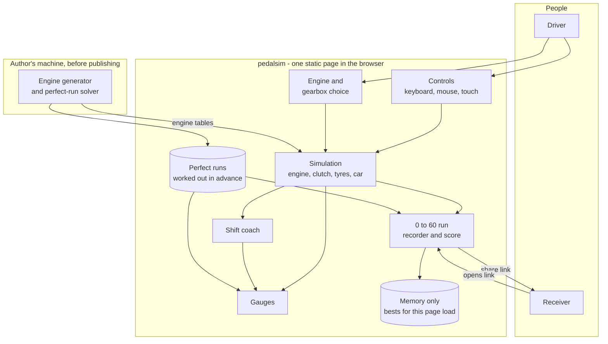

# pedalsim - Interaction and system boundary

## Actors

| Actor | Type | What they want |
| --- | --- | --- |
| Driver | Human, the public | To pick an engine, rev it, drive it by the needles, and see what it does. A few minutes, no sign-in |
| Challenger | Human, the public | A driver doing the 0 to 60 run again and again to shift better and beat their best |
| Receiver | Human, the public | Someone who opened a shared run link and wants to see the run and its score, and try to beat it |
| Portfolio visitor | Human, the public | Wants to see it work in a minute: choose the V12, floor it, change gear, see the score card |
| Author | Human | Adds and tunes engines, regenerates their tables, hosts the page |

There is no server, so no system actor. Everything happens in the visitor's browser.

## Interaction diagram



The link is the only thing that leaves a browser, and only when a driver chooses to send it.

## What the system is in the business of

- Making the needles honest. The rev counter answers the throttle by as much as the engine
  can, the speedometer answers the gearing and the weight, and braking takes speed off at the
  rate the brakes and the tyres allow.
- Showing how engines differ, with nothing else changing: same car, same tyres, five engines.
- Building its own interface from the engine: every face laid out from the engine's figures,
  and shown only as far as the engine has been.
- Teaching shifting: when to change up, when to change down, what revs to meet.
- Scoring a 0 to 60 run against the best that engine can do, and saying where the time went.
- Being plain to look at, and sporty. The page is simple; the calculation is not.

## What the system does not care about

- Where the car is. No road, map, track, scenery, steering or camera.
- A server, accounts, or a global leaderboard. Sharing is a link.
- Remembering anything. It is a sandbox: every refresh starts with empty circles, no bests,
  default settings. Nothing is written to the browser's storage.
- Real car brands, model names, trademarks.
- Exotic engine layouts in the first version: rotary, two-stroke, diesel, turbocharging,
  electric. Later, perhaps.
- Sound, in the first version. See the open questions.
- Hardware. No wheels, pedals or shifters are needed or assumed. A game controller works if
  one happens to be plugged in.
- Damage to anything but the engine's dignity.
- Money in any form.
- Being a training tool anyone relies on.

## Main use cases

| ID | Actor | Goal | Trigger | Result |
| --- | --- | --- | --- | --- |
| UC-1 | Driver | Choose an engine | Cycles V4, V6, V8, V10, V12 with one control | The engine is swapped in the same car. The faces dissolve back to empty circles and are laid out again for this engine: its own range, tick spacing, redline, one shift light per cylinder. An engine visited earlier since the last refresh comes back as built as it was left |
| UC-2 | Driver | Start it | Start key or button | The needles appear and sweep, the engine catches and idles. Idle trembles less the more cylinders there are |
| UC-3 | Driver | Rev it in neutral | Throttle | The revs rise and settle where the throttle holds them, fall when released, bounce off the limiter if floored. **The tachometer's face pixelates in wherever the needle has been**, the dyno strip draws the torque curve from the pulls, the redline appears the first time it is reached |
| UC-3a | Driver | Skip the build-up | "Build it all" | Every face resolves fully in a second |
| UC-4 | Driver | Drive in automatic | Selects D, throttle, brake | Creeps, accelerates, shifts up by itself, kicks down when floored, slows when braked |
| UC-5 | Driver | Drive in manual | Switches to manual, clutch, stick, throttle | Pulls away or stalls; changes gear or grinds; the coach shows up and down arrows and the rev-match target |
| UC-6 | Driver | Brake | Brake | The speed falls, the revs fall in gear; at a stop in gear without the clutch, it stalls |
| UC-6a | Driver | Blow the engine | A downshift that drags the revs past the over-rev limit | The engine dies, the faces break back into pixels and empty circles, "new engine" to carry on |
| UC-7 | Challenger | Do the 0 to 60 run | Starts the run | Countdown, the run, the time, the score card, the ghost of the perfect run |
| UC-8 | Challenger | See where the time went | Reads the score card | Time lost on the launch and on each shift, shift revs against the best revs, wheelspin, limiter time |
| UC-9 | Challenger | Keep a best | Finishes a run better than before | The run is the new best for that engine until the page is refreshed, and can be watched again |
| UC-10 | Challenger | Share a run | Copies its link | A link that holds the inputs, not the score |
| UC-11 | Receiver | See a shared run | Opens the link | The page re-drives the run, shows the score it earns, and offers "beat it" on the same engine |

## The page

One screen. Proposed arrangement, to be restyled by the author's sporty design.

At the start, before any engine has run:

```
+--------------------------------------------------------------------+
|  pedalsim          < V8 >                           [ AUTO | MAN ] |
|                                                                    |
|        .-------------.          .-------------.                    |
|       /               \        /               \                   |
|      |        .        |      |        .        |                  |
|       \               /        \               /                   |
|        '-------------'          '-------------'                    |
|                                                                    |
|   [clutch] [brake] [throttle]      H-pattern stick   [ START ]     |
+--------------------------------------------------------------------+
```

After some revving and driving:

```
+--------------------------------------------------------------------+
|  pedalsim          < V8 >                           [ AUTO | MAN ] |
|                                                                    |
|   [ shift lights, one per cylinder: o o o o o o o o ]              |
|                                                                    |
|        .-------------.          .-------------.                    |
|       /  TACHOMETER   \        /  SPEEDOMETER  \       GEAR        |
|      |   ghost needle  |      |                 |       [ 3 ]       |
|      |   shift marker  |      |                 |      up / down    |
|       \   redline     /        \               /       arrow       |
|        '-------------'          '-------------'                    |
|                                                                    |
|   dyno strip: torque and power curves, a dot at the current revs   |
|                                                                    |
|   [clutch] [brake] [throttle]      H-pattern stick     0-60: 5.82s |
|                                                    [ START RUN ]   |
+--------------------------------------------------------------------+
```

The pedals and stick are simple on-screen controls that also show what the keyboard is doing.

## Journeys

### J1 - First visit

1. The page opens on two empty circles and the V4, automatic, engine off.
2. Start. The needles appear, sweep and settle; the tach trembles at idle, and a few coarse
   blocks of face appear around the idle mark.
3. Throttle in neutral: the revs climb, settle, drop when released, and the face fills in
   behind the needle, coarse blocks first, sharpening as they are revisited. Floored: the
   limiter, the redline arc appears, and the dyno strip draws the torque curve left to right.
   A few more pulls and the tachometer is complete.
4. D, throttle: the speed builds and the speedometer's face pixelates in up to the speed
   reached. The box shifts at the shift marker; the lights fill.
5. Brake: speed and revs fall together; the box shifts down.
6. Cycle to the V12. The faces dissolve to empty circles. Rev it: the new tachometer comes in
   with a higher redline, different spacing and twelve shift lights. That comparison is the
   point.

### J2 - Manual and the coach

1. Switch to manual. Clutch and stick appear active.
2. Clutch, first, throttle, clutch out: it pulls away - or stalls, and the start key again.
3. As the revs reach the best shift point for this gear, the light bar completes and an up
   arrow lights. Shift.
4. Brake from speed: a down arrow and a second, faint needle on the tach - the revs the engine
   will need in the lower gear. Blip the throttle to meet it, release the clutch, smooth.

### J3 - The 0 to 60 run and a shared link

1. Start run, on the V8, manual. Countdown on the gauges.
2. The ghost needle runs the perfect launch and shifts alongside.
3. 60 mph: 5.31 s against a perfect 4.92 s. The card says: launch 0.21 s lost to wheelspin;
   1 to 2 shifted 600 rpm early, 0.09 s; 2 to 3 0.06 s; clutch held in 0.03 s too long.
4. Copy link. A friend opens it, their page drives the run again, shows the same 5.31 s, and
   offers to beat it.
