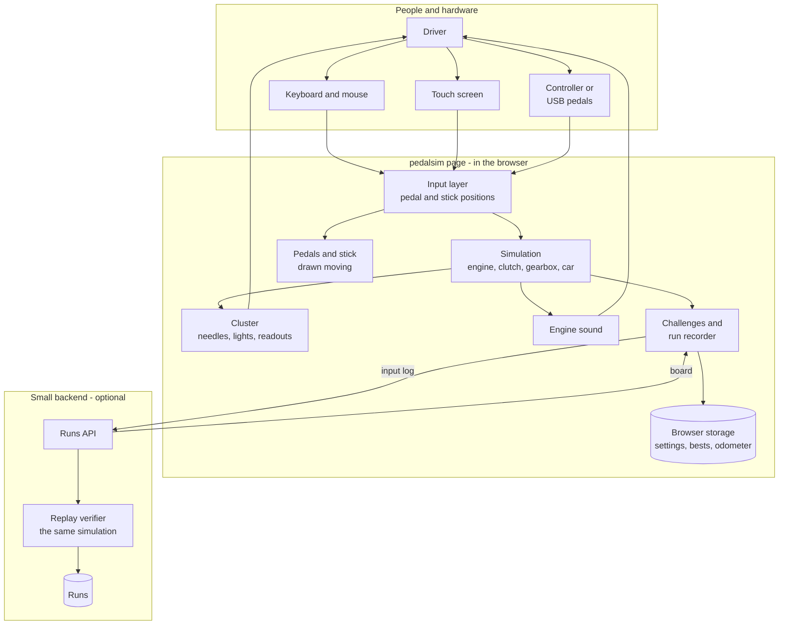

# pedalsim - Interaction and system boundary

## Actors

| Actor | Type | What they want |
| --- | --- | --- |
| Driver | Human, the public | To sit at the pedals and drive by the needles. Plays with it for a few minutes, or comes back to beat a time. Owes the site nothing, signs in to nothing |
| Challenger | Human, the public | A driver who has finished a challenge and wants the number on the shared board under a name of their choosing |
| Portfolio visitor | Human, the public | Someone reading the portfolio. Wants to see it work in a minute: turn the key, stall it, pull away, hear it, see the board |
| Author | Human | Tunes the cars, adds challenges, looks after the server. There is no admin section in the first version - see the open questions |
| Input devices | External hardware | Keyboard, mouse, touch screen, game controller, USB sim pedals and shifters. Read through the browser, never through a driver install |
| Leaderboard server | Inside the boundary, optional | Re-drives submitted runs and keeps the board. The page works without it |

## Interaction diagram

The simulation box appears twice in spirit: once in the page and once inside the replay
verifier. It is the same code. That is the point of the backend, and the reason it is
small.

## What the system is in the business of

- Simulating a car's powertrain closely enough that a person who drives a manual recognises
  it: the bite point, the stall, engine braking, the shove of a dropped clutch, the
  automatic creeping in Drive.
- Showing that simulation through instruments drawn with care: a cluster that is good to
  look at, with needles that move like needles rather than like numbers.
- Taking analog input seriously. A pedal is a position, not a button, even when it is
  driven from a keyboard.
- Making every run reproducible: the same inputs give the same needles, every time, on any
  machine.
- Keeping a leaderboard honest by trusting the inputs, not the result.

## What the system does not care about

- Where the car is. There is no road, map, track, scenery, steering or camera. Distance is
  a number on the odometer.
- Other traffic, collisions, damage to anything but the engine and the gearbox's pride.
- Tyre grip as a first-version feature. The tyres roll and never spin. Wheelspin is a
  later stage and an open question.
- Real car brands, real model names and their trademarks.
- Accounts, passwords, profiles, friends, chat. A leaderboard entry is a display name.
- Money in any form. No purchases, unlocks or adverts.
- Native apps or app stores.
- Force feedback to wheels or pedals.
- Being a training tool anyone relies on. It is a toy built on real maths, and it says so.
- Scale. One small server, a leaderboard in the thousands of rows.

## Main use cases

| ID | Actor | Goal | Trigger | Result |
| --- | --- | --- | --- | --- |
| UC-1 | Driver | Choose a car and a gearbox | Opens the page, or the garage | A car is loaded and the cluster changes to that car's dials and redline |
| UC-2 | Driver | Start the engine | Turns the key (button, key, or controller button) | Needles sweep and return, warning lights test and go out, the starter turns, the engine catches and settles at idle. A manual will not start in gear without the clutch down |
| UC-3 | Driver | Pull away | Brings the clutch up and the throttle in, or selects Drive and lifts off the brake | The car moves, the speedometer rises. Too little throttle and too fast a clutch stalls it |
| UC-4 | Driver | Change gear in a manual | Clutch down, drags the stick to another gate, clutch up | The gear changes. Without the clutch it grinds and stays in neutral. A downshift at too high a speed over-revs the engine |
| UC-5 | Driver | Drive an automatic | Moves the lever P-R-N-D, uses throttle and brake | It shifts by itself on a schedule that depends on throttle and speed. A floored throttle kicks down. It will not leave Park without the brake pressed |
| UC-6 | Driver | Stall and recover | Gets it wrong | Engine off, rev needle drops, oil pressure and battery lights on. Key again |
| UC-7 | Driver | Set up inputs | Opens input settings | Keys rebound; a controller or USB pedal set is detected, each axis assigned and its travel calibrated by pressing it fully |
| UC-8 | Driver | Take a challenge | Picks one from the list | A countdown, the run, a single result, and the personal best for that challenge and car |
| UC-9 | Driver | Watch a run back | Opens a recorded run | The pedals, stick, needles and sound replay exactly |
| UC-10 | Challenger | Put a result on the board | Sends a finished run with a display name | The server re-drives the run, records the result it computed, and shows the entry. A run whose replay disagrees with its claim is refused |
| UC-11 | Anyone | Read the board | Opens the leaderboard for a challenge and car | Best results, with a button to watch any of them back |
| UC-12 | Driver | Keep driving to nowhere | Just drives | The odometer keeps a lifetime total for that browser. That is all it does |

## Journeys

### J1 - First visit, manual car

1. The page opens on the cluster of the default car, engine off, needles at rest. Under it,
   three pedals; to the right, the stick in neutral. A one-line hint names the keys.
2. The driver presses the start key. The needles sweep to full scale and back, the lights
   flash and go out, a starter whirr, the engine catches, the tachometer settles near 800
   and trembles there.
3. The driver holds the clutch key: the clutch pedal travels down over a fraction of a
   second rather than snapping. They press 1, the stick moves into first.
4. They let the clutch up with no throttle. The revs sag as the bite point is reached, the
   speedometer twitches, and the engine stalls. Oil and battery lights. A quiet "stalled"
   on the cluster's display.
5. Start again. Clutch down, first, a little throttle, clutch up slowly. The car moves.
   They have driven nowhere at 12 mph and it felt like something.

### J2 - Automatic

1. Garage: picks the family car, automatic. The lever shows P, the cluster shows P lit.
2. Start. Tries to move the lever to D: it will not leave P. The hint says "brake". Brake
   held, lever to D, brake released: the car creeps at walking pace with no throttle.
3. Floors the throttle: the revs jump to the converter's stall speed, then climb with the
   speed, the box shifts up near the redline. Lifts: it shifts up early and the revs drop.
   Floors it again at 40: it kicks down two gears.

### J3 - A challenge and the board

1. Challenges: "0 to 60". Picks the sports coupe.
2. Countdown on the cluster's display. The run is recorded from the first input.
3. Result: 6.42 s, a new personal best. "Send to board" with a name field.
4. The server replays the run and answers with 6.42 s and a place. If the server is not
   reachable, the run is kept and the button says so; nothing else on the page changes.

### J4 - Real pedals

1. The driver plugs in a USB pedal set and presses any pedal. The input settings notice a
   new device.
2. "Press the clutch fully, then release": the axis is found and its range recorded. The
   same for brake and throttle.
3. The on-screen pedals now follow the real ones, including half presses.
