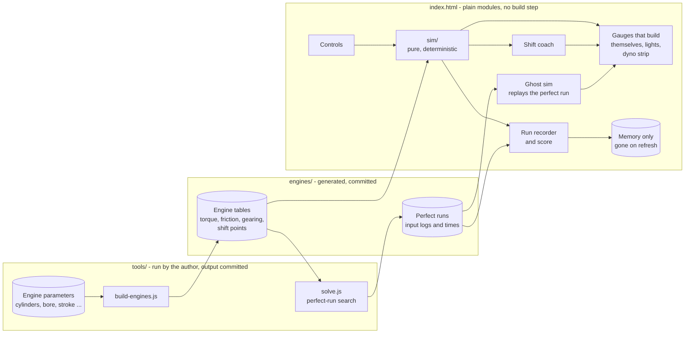
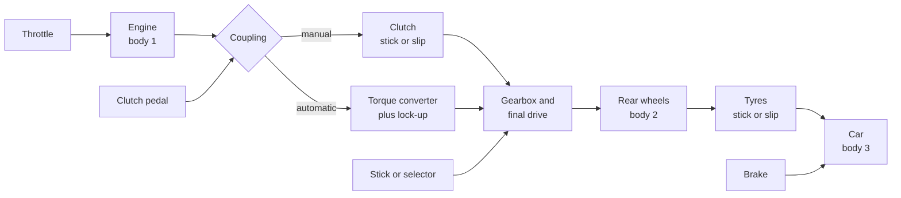
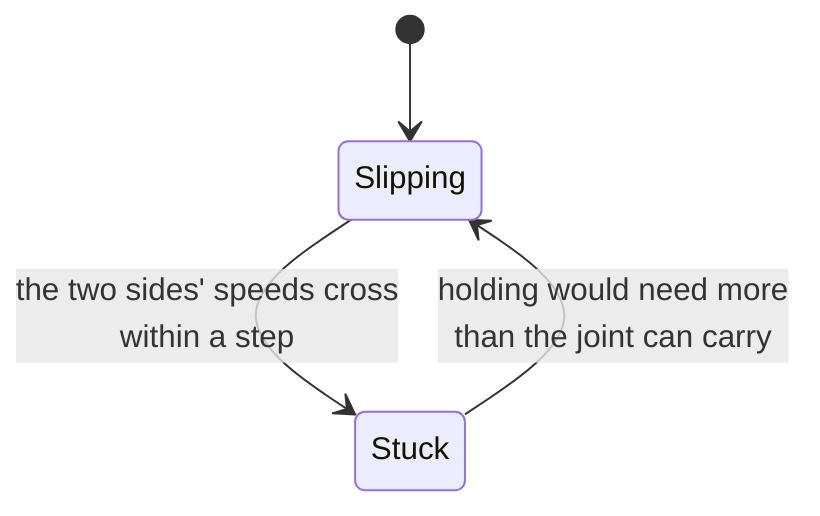
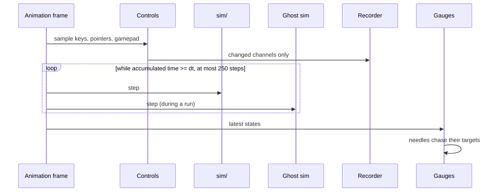
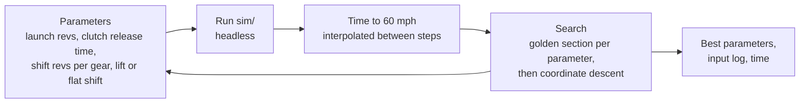
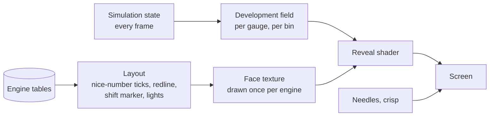

# pedalsim - Architecture

Internal document. Everything here is the design's proposal unless [00-plan.md](00-plan.md)
lists it as settled by the author.

## Shape of the thing

One static page. No server. Two kinds of calculation: the simulation that runs live in the
browser, and two tools that run on the author's machine before publishing - one that builds
each engine from its dimensions, and one that works out the perfect 0 to 60 run for it.



**`sim/` imports nothing from the browser.** No `window`, no DOM, no clock, no random. It is
a function from (engine, chassis, state, inputs) to the next state. That is what lets the
tests run it in Node, the solver run it thousands of times, the ghost run beside the driver,
and a shared link reproduce a run on someone else's machine.

## Engines built from their dimensions

The engines are not five hand-drawn torque curves. Each one is a short list of physical
parameters, and `tools/build-engines.js` turns that into the tables the simulation uses. The
point: a V4 and a V12 behave differently *because* of their dimensions, and the page can say
why.

Built in stage 1. The dimensions are those of real naturally aspirated engines, and each
engine's torque, power and redline are tested against that engine's published figures
(`engines/params.js` names the references; the page never names a maker):

| | V4 | V6 | V8 | V10 | V12 |
| --- | --- | --- | --- | --- | --- |
| Bore x stroke, mm | 86 x 86 | 94 x 83 | 94 x 89.5 | 84.5 x 92.8 | 94 x 78 |
| Displacement, litres | 2.00 | 3.46 | 4.97 | 5.20 | 6.50 |
| Piston speed at redline, m/s | 23.3 | 18.6 | 21.5 | 25.6 | 23.1 |
| Redline, rpm (derived) | 8100 | 6700 | 7200 | 8250 | 8850 |
| Peak torque, Nm at rpm | 195 at 6200 | 368 at 4700 | 516 at 5050 | 575 at 6300 | 701 at 6150 |
| Peak power, kW at rpm | 151 at 7800 | 222 at 6250 | 341 at 6750 | 461 at 7900 | 561 at 8350 |
| Held to | 2.0 litre fours (K20A, K20C2) | 2GR-FKS | 2UR-GSE | Huracan 5.2 | F140GA, L539 |

The engine picker cycles through them in order of cylinder count. No car uses a V4 of this
size, so the V4 is held to what a 2.0 litre four of the same build makes. It is rough by
nature - its banks do not cancel each other's shaking the way an inline-4's pistons do -
which the ripple carries (stage 3).

Everything below is derived, not entered:

```
Displacement   Vd   = cylinders * (pi / 4) * bore^2 * stroke
Redline        nmax = Sp_max * 60 / (2 * stroke)          rpm; a short stroke revs higher
Torque         T(n) = IMEP(n) * Vd / (4 * pi)             four-stroke: one power stroke per two turns
Friction       Tf(n) = FMEP(Sp) * Vd / (4 * pi)
               FMEP  = A + C * Sp + D * Sp^2              simplified Chen-Flynn, Sp = 2 * stroke * n / 60
Power          P(n) = T(n) * n * 2 * pi / 60
Inertia        Ie   = flywheel + cylinders * per-cylinder equivalent
Engine mass    from a table by layout, added to the car
Firing gap     720 / cylinders degrees                    sets how smooth idle is
```

- **IMEP shape.** Peak indicated pressure is about the same for any well-made naturally
  aspirated engine (14 to 16 bar here), so torque is mostly displacement. What differs is
  *where* it peaks: a smooth hump given by three numbers per engine - where it peaks as a
  fraction of the redline, and how far it has fallen at one tenth of the redline and at the
  redline. Those numbers were found by a search against the published figures, then fixed.
- **Redline from piston speed.** A long stroke means the piston travels further every turn, so
  the same piston speed limit is reached at fewer rpm. The V12's short 78 mm stroke is why it
  revs to 8850 on an ordinary 23 m/s. The V10 has a *longer* stroke than the V8 and still
  revs higher, because it is built for 25.6 m/s - a race-derived engine. Both reasons are
  in the numbers.
- **Smoothness.** A four-cylinder fires every 180 degrees, so its power strokes do not
  overlap and its torque pulses hard. A V12 fires every 60 and the strokes overlap. The idle
  tremble on the tachometer is calculated from that ripple and the inertia, not drawn in.
- **Friction**: A = 0.5 bar, C = 0.03 bar per m/s, D = 0.002 bar per (m/s)^2 - about 1.9 bar at
  20 m/s, as modern petrol engines measure. A first try with larger C and D put every torque
  peak too early, because friction rising with the square of piston speed eats the top end.
- **Pumping**: 0.9 bar with the throttle shut, falling to nothing wide open. It cannot
  exceed the atmosphere the pistons pull against, which is why it was not raised to make the
  revs fall faster.
- **Gearing is calculated too** - in stage 2, with the chassis it depends on. Six ratios per
  engine: first gear sized so peak torque just reaches the tyres' grip, top gear so the
  engine's power peak meets the drag curve, the gears between in a progression that tightens
  toward the top. Computed once, stored as numbers.
- **The throttle is not a straight line.** The plate's open area grows as 1 - cos(angle),
  stored as a table over the pedal. The air the engine gets is that area against how fast the
  engine is swallowing - see "How the revs answer the gas".

`build-engines.js` may use any maths it likes, `Math.pow` included, because its output is
fixed numbers committed to the repo. Only the live step has the determinism rules below.

## How the revs answer the gas

The author's first requirement: the rpm must represent the amount of gas given. It does,
in two ways that the page shows:

```
Steady:  the revs settle where   Tcomb(n, load(pedal, n)) = Tf(n) + load from the car
Moving:  the revs change at      dn/dt = (Tcomb - Tf - Tclutch) / Ie
```

In neutral there is no car load, so each pedal position has one rpm where the engine's
combustion torque exactly feeds its own friction - that is where the needle settles. How fast
it gets there is net torque over inertia: the dyno strip shows both curves, and the dot sits
where they meet.

**The air the engine gets** (`airLoad` in `sim/engine.js`). Air through the plate is roughly
fixed for an opening; the engine's appetite grows with its speed. Their ratio is how full each
cylinder gets, but never more than full:

```
r    = area(pedal) * throttleFlow * redline / rpm
load = r / (1 + r^8)^(1/8)                    the eighth root as three square roots
```

No two-dimensional table is needed, and no forbidden function: `r^8` is three
multiplications.

**What it does, measured** (stage 1, `node tools/figures.js`): in neutral, 10% pedal holds
about 1400 rpm, 20% about 4000, 30% about 6500-8000, and from about 40% the engine sits on its
limiter. That is how an unloaded engine behaves: it needs only a fifth of a cylinder of air
to spin itself to high revs. In gear, under load, the same pedal gives far fewer revs.

**The manifold has to fill.** The load does not jump to what the throttle allows; it moves
toward it over about `manifoldRatio * 120 / rpm` seconds - the time the engine takes to
swallow its own manifold. So a blip at idle is slower than one at speed, as in a real engine.

**Measured feel, to revisit when driving it live (stage 4):** idle to redline flat out in
neutral takes 0.52 to 0.74 s - none quicker than the 0.6 s Lexus quoted for the LFA's V10, the
famous fast one, with the flywheels sized for that. Part throttle reaches most of its rpm in
two or three seconds but takes six to ten to settle completely: near the settling point the
engine's push and its losses are almost balanced. Lighter flywheels would settle faster and
rev faster too.

## The drivetrain



All units inside `sim/` are SI. rpm and mph exist only at the edges.

### The chassis

Built in stage 2 (`sim/chassis.js`). One car carries every engine, so the engine is the only
variable: a rear-drive two-door, 1250 kg with a driver plus the engine (1390 to 1520 kg in
all), drag area 0.70 m^2 (drag coefficient 0.34 on 2.06 m^2), rolling resistance 0.012,
tyre radius 0.33 m, 52% of the weight on the rear at rest. Performance tyres: grip 1.15
gripping, 0.90 sliding. Weight shifts onto the rear wheels under acceleration:

```
Nrear = m * g * (static rear fraction) + m * a * h / L        h = 0.5 m, L = 2.6 m
```

using last step's acceleration. That is why a hard launch grips better than a standing
calculation would suggest: about two thirds of the weight is on the rear at full stretch.

**Gearing, per engine, calculated by the build tool.** Top gear puts the engine at its power
peak at top speed. First gear runs out at a quarter of top speed, as performance cars' do -
the plan's "first gear sized to the tyres' grip" was dropped: on the V12 it gave a first
gear good for about 150 mph. The four between close up toward the top. Final drive 3.4.
Resulting top speeds: 155, 177, 205, 228 and 243 mph, V4 to V12. No gearbox efficiency is
modelled, so these and the acceleration are a few percent generous.

### The engine at runtime

```
Tcomb = load(pedal_eff, n) * Tfull(n)
Te    = Tcomb - Tf(n) + ripple(n, crank angle)        ripple feeds the display tremble only
pedal_eff = max(pedal, idle controller)
```

- **Idle controller**: a proportional-integral loop holding idle. Why the revs dip and
  recover as the clutch bites. Its integral learns only with the driver off the pedal, below
  1.5 times idle, and not while the revs are falling faster than about 300 rpm a second.
  Both halves of that rule fixed a bug found in stage 1: learning during the fall from a blip
  unlearned the idle throttle and dipped the revs toward a stall; never learning above idle
  left a start-up flare idling 200 rpm high for good.
- **Starting**: the starter pushes hardest at a standstill and freewheels past 400 rpm; the
  engine fires at 200 rpm while the key is held; it flares a few hundred rpm above idle and
  settles within three or four seconds.
- **Rev limiter**: combustion cut above the limit until the revs fall a margin below it. The
  bounce is a real consequence, not an animation.
- **Stall**: below the stall speed (half of idle) the engine stops until the start key -
  but not while the key is held, because the starter is still helping.
- **Over-rev**: combustion cannot pass the limiter, but the wheels can drag the engine past it
  through a locked clutch after a bad downshift. Past the limiter, the check engine light.
  Past the engine's over-rev limit, **the engine is blown**: it stops, will not restart until
  "new engine", and its gauges break back into pixels and empty circles. Either one makes a
  run not clean.

### Three friction joints, one rule

Built in stage 2 (`sim/couplings.js`, `sim/drivetrain.js`). The car is a chain of bodies,
each joined to the next by friction that either sticks or slips:

```
engine --clutch--> rear wheels --tyres--> car body --brakes--> road
```



| | Clutch | Tyres | Brakes |
| --- | --- | --- | --- |
| Joins | Engine `we` and gearbox `ww * G` | Wheel surface `ww * r` and car `v` | Car `v` and the road |
| Holds, stuck | `e(pedal)^2 * 1.4 * peak torque` | `1.15 * Nrear * r` | `pedal * 1 g * m`, plus the pawl in Park |
| Passes, slipping | The same | `0.90` to `1.15 * Nrear * r`, by how fast it spins | The same |
| Feels like | Bite point, stall, the shove of a dropped clutch, engine braking | Grip, and wheelspin | Stopping, and staying stopped |

**One small solver, not cases written out.** The plan said to write out each combination of
stuck and slipping. With three joints there are eight, so instead `sim/couplings.js` solves
any chain: runs of bodies joined by sticking joints move as one, with their inertias
reflected through the ratios; each sticking joint's force is worked out by walking the run;
the most overloaded one lets go and the step is solved again. Seven unit tests check it on
numbers small enough to do by hand.

**The lock test.** A slipping joint whose two sides pass each other within a step locks, at
the speed that keeps their momentum - rather than letting the speeds chatter across each other
for ever, the classic bug in clutch models.

**Spinning grip fades, it does not drop.** Just past the limit a spinning tyre pulls nearly
as hard as a gripping one, falling to sliding grip as the spin reaches 4 m/s. With a straight
drop to sliding grip, a tyre that broke loose in first could only grip again by stopping its
spin entirely, and the car spun its wheels through every gear.

**The brakes hold the car body**, as the front brakes hold a real car. So enough torque
spins the rear wheels against a braked car - a brake stand, which powerful rear-drive cars
really do - and a test checks the car stays put while it happens.

**In neutral nothing joins the engine to the wheels**, whatever the clutch pedal says. A bug
found in stage 2: a released clutch "gripped" a ratio of zero and held the engine still.

**Traction control** (`sim/engine.js`): while the rear tyres spin faster than the car by more
than 1 m/s - where they start losing grip - it trims the throttle, proportionally at once
and integrally over time, and gives it back as they recover. On for the automatic, off for
the manual, where the launch is the driver's own (proposed; the author has not decided). The
first, integral-only version oscillated - cut, grip, give back, spin - and launched no faster
than none at all.

**The idle controller's authority is capped at 10% pedal.** Idle needs about 6% on every
engine. At 25%, its first limit, the V12's "idle" in second gear spun the rear tyres against
a braked car instead of stalling.

### The automatic

- **Torque converter**, from the standard capacity-factor model. Speed ratio
  `SR = turbine / pump`:

```
Tpump    = (npump / K(SR))^2        K from a table, rpm per root newton metre
Tturbine = TR(SR) * Tpump           TR about 2 at a standstill, 1 at the coupling point
```

  This gives creep at idle in D (2 to 8 mph, tested), the stall speed with the turbine held
  (a third of the redline, between 2000 and 3000 rpm), and weak engine braking when coasting.
  K at a standstill is set per engine from that stall speed; it rises toward the coupling
  point, and TR falls from 2 to 1 at a speed ratio of 0.85.
- **Lock-up clutch** from third gear up, when not shifting or kicking down, through the same
  stick or slip joint as the manual clutch.
- **Shift map**: per gear an up line and a lower down line in speed against throttle - light
  throttle at 1.8 times idle or 30% of the redline, whichever is higher; full throttle 4%
  short of the coach's point, because the converter slips and a line at the redline itself
  left the box on the limiter in first (a bug found in stage 2). Down lines sit at 70 to 75%
  of the up lines, so the box holds a gear across a band instead of hunting (tested). Kickdown
  past 92% throttle to the lowest gear under the shift point. Half a second between shifts.
- **Selector** P-R-N-D. Park's pawl engages only below 1 m/s. The brake interlock on leaving P
  is the lever's job (stage 5).

### The car

```
Fdrive = tyre force from the coupling above
Faero  = 0.5 * rho * CdA * v * |v|
Froll  = Crr * m * g * clamp(v / 0.05, -1, 1)
Fbrake = brake * 1 g * m, through the brake joint       a simple ABS: never more than the tyres hold
m * dv/dt = Fdrive - Faero - Froll - Fbrake
```

A stopped, braked car stays exactly stopped (the brake joint sticks). Top speed is worked out
by the build tool from where peak power meets drag, and a test drives each car flat out in
sixth and checks it gets there within 1%.

**Measured, stage 2** (`node tools/figures.js`): the automatic, flat out with traction
control, does 0 to 60 mph in 5.95 s (V4), 4.51 (V6), 4.33 (V8), 4.25 (V10), 4.09 (V12). The
V4 is power-limited; the rest are mostly grip-limited and bunch together, as rear-drive cars
on road tyres do (the V8's reference car is quoted at 4.2 to 4.4 s).

**The speedometer reads the driven wheels**, as a real one does, so wheelspin flares it. The
0 to 60 clock uses the car's true speed. The score card says so.

## Determinism

A shared link must give the same run on any machine.

1. **Fixed step**, `dt = 1 / 1000` s. The step count is the clock.
2. **No transcendental functions in `sim/`.** ECMAScript lets `Math.sin`, `exp`, `pow` and
   `log` differ in the last bit between engines. Curves are tables with linear
   interpolation; `sqrt`, correctly rounded under IEEE 754, is allowed.
3. **Quantised inputs**: every pedal value rounded to 1/1023 at the step boundary - the same
   number the log stores.
4. **No clock, no random, no `Date` in `sim/`.** A test greps for them.
5. **`SIM_VERSION`** changes whenever the step's output changes. Golden traces hash the state
   after scripted runs; a moved hash with an unmoved version fails the test.
6. **Checked in Node and headless Chrome**, and Firefox where installed.

## The loop



## The shift coach

All of it is computed from the engine tables, mostly in advance.

**When to change up - for speed.** In gear `i` at speed `v`, the force at the tyres is
`min(T(n_i(v)) * G_i * eta / r, grip)`. Change up when the next gear would push harder:

```
shift up at the speed where   F_i(v) = F_i+1(v),   or at the redline if they never cross
```

Precomputed per engine and gear by scanning speed, and drawn as the **shift marker** on the
tachometer. The light bar fills over the last 1500 rpm before it and flashes at it.

**When to change up - for economy.** With light throttle, change up once the next gear keeps
the revs above a lugging floor (about twice idle).

**When to change down.**

- *Lugging*: revs below the floor with real throttle - down arrow.
- *For speed*: full throttle, and the lower gear both pushes harder and stays under its shift
  point - down arrow.
- *Braking*: the gear you would want if you had to accelerate now - the one that puts the
  revs between peak torque and the shift point.

**What revs to match.** With the clutch down and a lower gear chosen, a second faint needle
shows `n_target = v / r * G_target * 60 / (2 * pi)`, the revs the engine must reach for a
smooth release. Blip the throttle to meet it.

**How smooth a shift was.** On each release the clutch's slip energy is integrated:

```
E = sum over the slip of  Tclutch * |we - ww * G| * dt          joules turned into heat
```

A perfect rev-match is near zero. A dumped downshift is hundreds of joules and a lurch.

## The perfect run

`tools/solve.js` finds, for each engine, the fastest 0 to 60 the simulation allows with a
manual gearbox - the reference every driver is scored against.



- **Starting point**: shift points from the crossover rule above, launch at peak torque.
- **The perfect driver is held to human limits**: the stick has a minimum travel time, and the
  solver gets no faster shift than a person can make. Otherwise "perfect" is unbeatable for a
  silly reason.
- **The crossing of 60 mph is interpolated** between the two steps either side, so the
  objective is smooth enough for the search instead of jumping in millisecond stairs.
- **Output**: the best input log and its time, committed as data. The page replays it as the
  ghost; a test reruns it and fails if the time moved without `SIM_VERSION` moving.
- **What it reveals**: the best shift is often not at the redline. Where the torque curve
  falls off early, the solver shifts well before it, and the page can say so.

## The score

**Time lost, phase by phase.** Your run is split into phases: launch, each gear, each shift.
For each phase take the range of speed it covered (using the highest speed reached so far, so
a speed dip during a shift does not count twice), and compare the time you spent with the
time the perfect run spent covering the same range:

```
lost(phase) = your time in phase - perfect time over the same speed range
sum of lost(phase) over all phases = your 0-60 time - perfect 0-60 time, exactly
```

So the card can say "the launch cost 0.21 s, the 1-2 shift 0.09 s" and the numbers add up to
the gap. Each phase also shows why: launch wheelspin time; shift revs against the perfect
run's; time with the clutch in; slip energy; time on the limiter.

**One number for the board.** Proposed:

```
score = round(1000 * perfect time / your time)        1000 is perfect
```

with a "clean" mark for a run with no grind, no over-rev, no blown engine and low clutch
heat (the author's definition: "dont blow out the engine etc"). A stall or a blown engine ends
the run. Every other mistake already costs time, so it is not penalised twice.

## The board and the share link

**The board** lives in memory for as long as the page is open: best score per engine, the
last ten runs, any of them watchable. A refresh clears it - the page is a sandbox and writes
nothing to the browser's storage. A link is the only way to keep a run.

**The share link** puts the run in the URL fragment, never sent to any server:

```
#run=<base64url( deflate( packed run log ) )>
```

The packed log carries the engine, gearbox, `SIM_VERSION`, the engine table hash and the
input changes - not the time or the score. The receiver's page re-drives it and computes
both. An opened run joins the receiver's board for that page load, so they can race it.

**What a link proves.** That the run is possible in this simulation. It cannot prove a person
drove it: a program could write a perfect input log. The page says so.

## The interface the engine builds

The author's idea: the gauges start as empty circles, and revving the engine makes them
pixelate in. Two pieces of maths: the **layout**, which decides what each face would show,
entirely from the engine's figures; and the **development field**, which decides how much of
it has been earned, entirely from what the engine has done.



### The layout, from the engine's figures

Nothing on a face is placed by hand.

- **Range**: the tachometer runs to the over-rev limit rounded up to a tidy figure; the
  speedometer to the top speed the gearing allows, rounded up.
- **Tick spacing** by a nice-numbers rule (the one plotting libraries use for axis labels):
  of the steps 1, 2 and 5 times a power of ten, the one that gives six to ten major ticks.
  A V4's tachometer and a V12's come out spaced differently because their redlines differ.
- **Angle** of any value: `a0 + (x / max) * sweep`.
- **Redline arc** from the redline to the limiter; **shift marker** from the coach's
  crossover point for the current gear.
- **Shift lights: one per cylinder.** A V4 gets four, a V12 twelve.
- The face is drawn once per engine to an offscreen canvas, in the author's sporty style.
  That texture is the finished gauge; the reveal decides how much of it is shown.

### The development field

Each gauge is cut into bins: the tachometer one per 100 rpm, the speedometer one per mph.
Each bin holds a development value `d` from 0 (not there) to 1 (fully built).

```
while the engine runs at revs n, every frame:
    d[bin(n)] += rate * dt * (0.3 + load)            lingering builds; full throttle builds faster
    spread a little to the neighbouring bins          so the face grows smoothly, not in stripes
speedometer: the same, from the car's speed
```

- **Some parts wait for an event, not for time.** The redline arc appears the first time the
  revs reach the redline. The shift marker for a gear appears the first time the engine passes
  it in that gear under load. The numerals appear once their bin is half built.
- **The dyno strip is a measurement, not a drawing.** For each rpm bin it plots the largest
  torque the engine has actually produced there at full throttle. A full-throttle pull in
  neutral draws the curve left to right, like a dyno run.
- **Rates are tuned by feel**: three or four full-throttle pulls to the limiter should
  complete the tachometer.
- **It is display-side.** The simulation never reads `d`. A replay rebuilds the same gauges
  because it produces the same states.

### The reveal: pixelating in

A fragment shader draws each gauge. For each pixel it finds the bin under it (from its angle
around the centre), reads that bin's `d`, and decides two things:

```
block size   b = 2 ^ round(5 * (1 - d))              32, 16, 8, 4, 2, 1 pixels
sample       the face texture at the centre of the b-by-b block the pixel falls in
shown        if  d > bayer(block x, block y)          a 4 x 4 ordered-dither threshold
```

So at `d = 0` nothing is shown but the circle outline; a little development scatters a few
big blocks; as it grows, the blocks multiply and shrink until the face is sharp. Ordered
dithering makes the blocks appear in a fixed, even pattern rather than fading, which is what
reads as pixelating in.

- **Blowing the engine** runs it backwards: every `d` drains to zero over a second and the
  face breaks back into blocks.
- **Cycling engines** dissolves the faces the same way, swaps in the new engine's face
  texture and its own development field. Returning to an engine restores what it had built,
  until the page is refreshed. A refresh always starts from empty circles.
- **"Build it all"** sets every `d` to 1 over a second. It is also the default when the
  browser reports a preference for reduced motion.
- **Fallback**: without WebGL2, the same reveal in canvas 2D, redrawing a face only when its
  development changes.

### As built (stage 3)

- **Faces** are painted with canvas 2D (`ui/face.js`), once per engine and on resize; glow is
  canvas shadow with additive blending, except the redline, drawn plainly so red stays red.
- **The reveal** (`ui/reveal.js`) is the shader above, with the development uploaded each frame
  as a one-pixel-high R8 texture. Near the centre (inside 40% of the radius), where the unit
  label sits, it uses the gauge's average development instead of an angle. The fallback
  without WebGL2 fades each bin's wedge in at an opacity of d: no pixels, same build-up.
- **Build-up rates** (`ui/development.js`): 6 per second of dwell on the tachometer, scaled by
  0.3 + load, spilling over 4 bins either side; 2.5 on the speedometer, spilling over 3. Three
  or four pulls to the limiter in neutral complete a tachometer, as intended.
- **The demos** (`ui/demos.js`) replaced the planned CSV trace player: the simulation runs in
  the page, so playing a script through it is simpler than parsing a trace, and exact.
- **The empty state**: circle outlines and hubs; the needles appear with the start key.
- **Pulse shape** (`ui/ripple.js`): each power stroke peaks 35 degrees after top dead centre
  and fades; a symmetric hump was tried first and made the V8 rougher than the V6.

### What stays crisp

The needles, the gear indicator and the coach's arrows are drawn sharp from the start,
outside the reveal. A newcomer can always read the revs and be told when to shift; what they
earn is the face around them.

## The page

- **Needles have mass**: a damped spring chasing the value, quicker on the tachometer than the
  speedometer:

```
acc = wn^2 * (target - angle) - 2 * zeta * wn * vel
```

- **Shift lights** (one per cylinder), **gear and arrow**, **ghost needle**, **rev-match
  needle**.
- **Dyno strip**: the torque and power curves as the engine has measured them, with a dot at
  the current revs and load. The calculation, on screen.
- **Engine picker**: one control that cycles V4, V6, V8, V10, V12 in order; keyboard too.
- **Pedals and stick**: simple controls that also show what the keyboard is doing. The H-pattern
  knob is projected onto its gate segments, so it moves only where a real one can.
- **Styling**: the look lives in the face painter's per-engine palettes and fonts, and in a
  few CSS custom properties for the page around the gauges, swapped as the engine cycles. Changing the look never
  touches the layout maths.

## The look, from the pen

The author's pick is Filip Zrnzevic's CodePen pen `filipz/pen/dPygJGM`. It is not a gauge: it
is a music visualizer - three glowing lines on a dark, warm gradient, each line with a ball
riding it, reacting to the bass, the middle and the treble of a song, with film grain over
everything and big bold type. What pedalsim takes is its look and one idea. Not its code.

**Why not the code.** The pen's shader says it is based on Shadertoy shader `MtVBzG`. CodePen
makes public pens MIT, but a pen cannot relicense what it built on, and Shadertoy's default
licence (unless the shader's author says otherwise) is Creative Commons
Attribution-NonCommercial-ShareAlike 3.0 - not something to paste into a public portfolio
under MIT. The pen also loads three.js and dat.gui, an outside noise image over plain `http`,
and a song. pedalsim needs none of them. So everything is written fresh; the credits file
names the pen as the inspiration.

**What is taken.**

| From the pen | In pedalsim |
| --- | --- |
| The colour presets: Cool, Neon, Warm, Cyberpunk, Monochrome | One per engine, cycling with it - below |
| Boldonse, a very wide heavy display face, in capitals | Gauge numerals, the gear number, the engine name. Heavy shapes pixelate in cleanly |
| Bodoni Moda italic, small, for captions | Labels: rpm x1000, mph, the score card's notes |
| Lines drawn as a glow: bright core colour fading to an edge colour, added onto the dark | Needles, the redline arc, the shift marks, the ghost needle |
| Film grain over the whole frame | Grain in the reveal shader, so coarse pixels and grain read as one texture. No outside image |
| An idle state that eases into a live state when the music starts | Engine off to engine running: the page eases from still to live on the start key |
| Lines that react to sound, with a bounce and ripple on each kick drum | **The engine lines** - below. The author: "engine lines are cool" |

**Not taken**: the song, the beat detector, three.js, dat.gui, the FPS counter, the profile
card, the noise image, the hidden cursor (a dragged pedal wants a real pointer).

**The colours cycle with the engine.** The author: "cycle between colors". Each engine
brings one of the pen's colour presets, and cycling the engine cycles the colours with it: the
faces dissolve, the palette cross-fades, the new engine's gauges pixelate in in their own
colours. Proposed assignment, as RGB:

| Engine | Preset | Background, top to bottom | Needle and tach arc, bank A line: core, edge | Bank B line: core, edge | Speedometer, shift lights, sum line: core, edge |
| --- | --- | --- | --- | --- | --- |
| V4 | Cool | 5 10 20 to 10 20 30 | 100 200 255, 0 100 200 | 100 255 200, 0 150 100 | 150 200 255, 50 100 200 |
| V6 | Neon | 5 5 15 to 10 10 20 | 255 0 255, 128 0 255 | 0 255 255, 0 128 255 | 255 255 0, 255 128 0 |
| V8 | Warm | 20 10 5 to 40 20 10 | 255 200 0, 255 100 0 | 255 100 100, 200 50 50 | 255 150 50, 200 100 0 |
| V10 | Cyberpunk | 0 20 40 to 20 0 40 | 255 0 128, 200 0 100 | 0 255 128, 0 200 100 | 255 255 0, 200 200 0 |
| V12 | Monochrome | 20 20 20 to 10 10 10 | 200 200 200, 150 150 150 | 255 255 255, 100 100 100 | 180 180 180, 120 120 120 |

The pen's sixth preset, Default, is spare. Two roles do **not** change with the palette,
because they carry meaning:

| Role | Colour, every engine |
| --- | --- |
| Redline, over-rev and blown engine: core, edge | 255 100 100, 200 50 50 - always red |
| Type | 224 224 224 |
| Ghost needle | Type colour at a third strength |

So the redline reads as a redline whatever the engine - and on the V12's silver Monochrome it
is the only colour on the page, which is no bad thing.

**The fonts** come from Google Fonts in the pen. pedalsim serves its own copies from the
repo, so the page works offline and fetches nothing; both are to be checked for an open font
licence before they are copied in.

### The engine lines

The pen's three lines dance to a song's bass, middle and treble. pedalsim has its own signal:
the torque each cylinder bank puts on the crankshaft. Three faint glowing lines across the page
behind the gauges, drawn against crank angle over two turns - one full engine cycle:

- **Line A**: bank one's torque pulses. **Line B**: bank two's. **Line C**: the two added -
  what the crankshaft actually feels.
- A V4 shows four tall separate humps and a jagged sum. A V12 shows twelve overlapping humps
  and a sum that is nearly flat. That is *why* a V12 is smooth, drawn.
- Height follows the load; the shape drifts along as the engine turns, slowed down to be
  watchable; the pen's "kick" bounce fires on a gear change and on each limiter cut.
- Engine off: the lines lie flat, as the pen's do before the music starts.
- It comes from the ripple table the idle tremble already uses, on the display side only.
- **Kept out of the dials** (the author: "lets keep the dials clean"): each gauge's circle is
  cut out of the lines with a soft edge, so they run between and around the gauges, never
  across a face.
- The lines are in the engine's colours: bank A the needle colour, bank B the second colour,
  the sum the speedometer colour.

## Controls

| Source | How |
| --- | --- |
| Keyboard | Held, a pedal ramps toward 1; released, toward 0. The clutch rises slower than it falls, so the bite point is findable. Number keys for gears, a key each for start, shift up and down |
| Mouse and touch | Drag a pedal down; drag the knob; several fingers at once on a phone |
| Game controller, if present | Triggers for throttle and brake. Optional, never required |

## Files, proposed

```
pedalsim/
  index.html
  sim/        step, inputs, replay (stage 0); clock, curves, engine (stage 1); chassis,
              couplings, converter, gearbox, drivetrain (stage 2); coach, score, log
  engines/    params.js (entered), v4.js ... v12.js (generated), perfect/*.js (generated)
  ui/         layout (nice numbers, angles), face painter, development field, reveal shader
              and its canvas 2D fallback, needle, lights, dyno, pedals, stick, board, scorecard
  input/      keyboard, pointer, gamepad
  tools/      drive.js (scripted run to CSV); build-engines.js, engine-maths.js, measure.js,
              figures.js, golden.js (stage 1); solve.js
  test/
  package.json   "test": "node --test"
```

Run locally with `npx serve`, not plain `python -m http.server`, which sends `.js` as
text/plain on this machine and modules refuse to load.

## Deployment

GitHub Pages, with the rest of the static site, at `/pedalsim/`: added to
`deploy/build-static.mjs` and the Pages workflow's paths. Nothing else.
