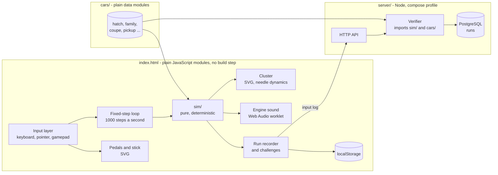
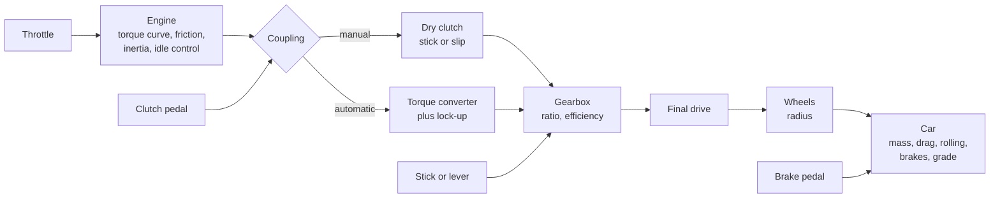
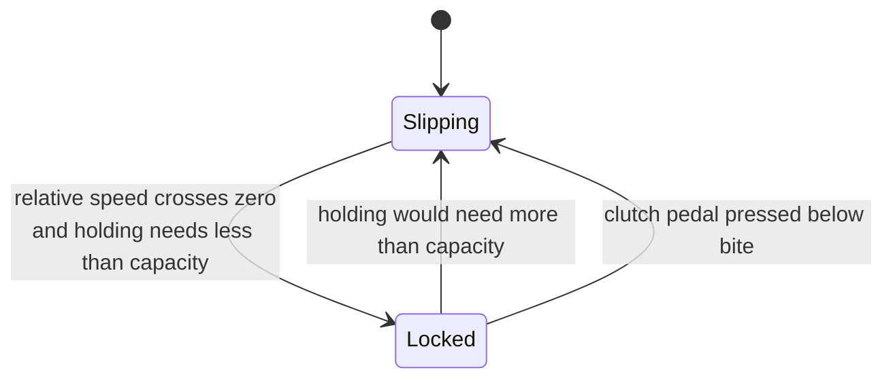
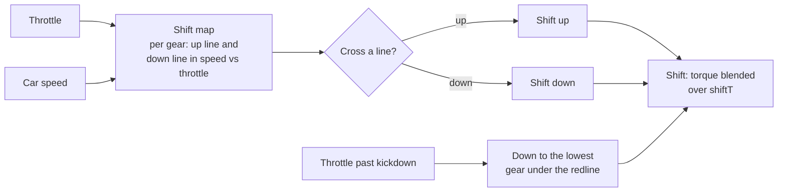
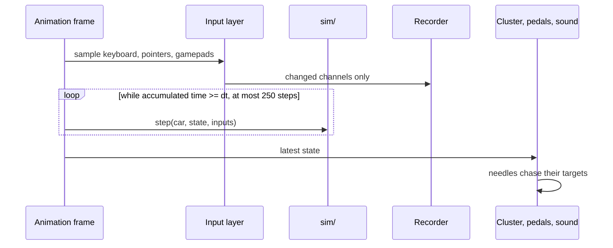
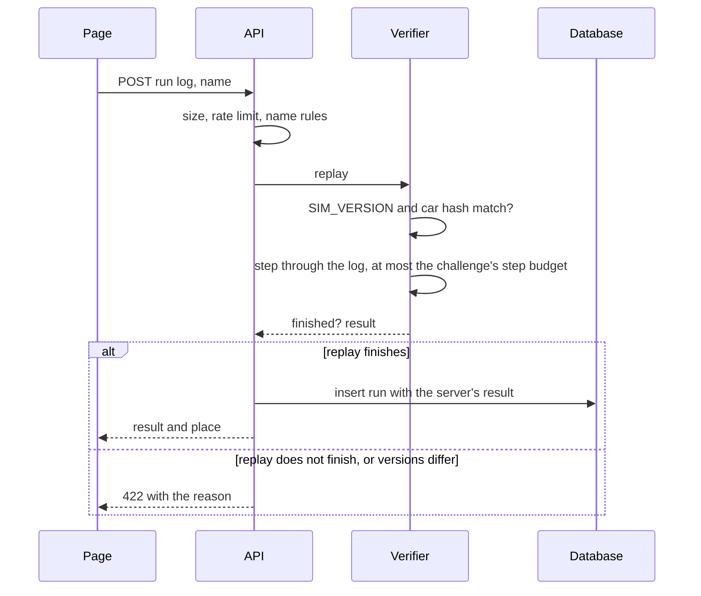

# pedalsim - Architecture

Internal document. Everything here is the design's proposal unless [00-plan.md](00-plan.md)
lists it as settled by the author.

## Shape of the thing

One page and one small server. The page holds the whole car. The server holds a copy of the
same simulation and a table of runs.



**`sim/` imports nothing from the browser.** No `window`, no DOM, no clock, no random. It is
a function from (car, state, inputs) to the next state, and that is what lets the server run
it, the tests run it in Node, and a replay reproduce a run exactly.

## The drivetrain



All units inside `sim/` are SI: metres, seconds, kilograms, newtons, newton metres, radians a
second. rpm, mph and km/h exist only at the edges.

### State

| Quantity | Symbol | Notes |
| --- | --- | --- |
| Engine speed | `we` | rad/s. rpm = `we * 60 / (2 * pi)` |
| Car speed | `v` | m/s, signed (reverse is negative) |
| Clutch locked | `locked` | Manual only. Stick or slip |
| Gear | `gear` | -1, 0, 1..n. Automatic adds a selector P, R, N, D and the gear it chose |
| Shift in progress | `shiftT` | Automatic only, seconds left in a shift |
| Engine running | `running` | False after a stall or before the key |
| Limiter cut | `cut` | Hysteresis flag for the rev limiter |
| Fuel, coolant, odometer, damage | | Slow quantities |

### The engine

```
Tcomb(n, u) = u * Tfull(n)              u = effective throttle 0..1, Tfull from a table
Tfric(n)    = f0 + f1 * n + f2 * n^2    friction and pumping; this is engine braking
Te          = Tcomb - Tfric
```

- **Idle control.** The effective throttle is `max(pedal, uIdle)`, where `uIdle` comes from
  a small proportional-integral controller holding the idle speed. That is why the revs dip
  and recover when the clutch bites, as they do in a real car.
- **Rev limiter.** Above the limit, combustion is cut until the speed falls a set margin
  below it. The bounce on the tachometer and the stutter in the sound both come from this
  flag, not from an animation.
- **Stall.** Below the stall speed with fuel on, the engine stops: `running` goes false and
  combustion is zero until the key is turned.
- **Starter.** Turning the key applies a starter torque for a fixed time. A manual will not
  crank in gear unless the clutch is down; an automatic only in P or N.
- **Over-rev.** Combustion cannot push past the limiter, but the wheels can drag the engine
  past it through a locked clutch. A downshift that does that sets the damage flag.

### The clutch: stick or slip

The one genuinely awkward piece of maths in the project, and the piece that makes it feel
like a manual.



- **Capacity.** `Tcap = e(c) * Tmax`, where `c` is the clutch pedal, `e` an engagement curve
  that is zero above the bite point and rises to one as the pedal comes up, and `Tmax`
  about 1.4 times the engine's peak torque.
- **Gearbox input speed.** `wg = v / r * G`, with `G` the gear ratio times the final drive.
- **Slipping.** The clutch passes `Tcap * sign(we - wg)`. The engine and the car are two
  separate bodies, each integrated with the torque on it.
- **Locked.** The engine and the car are one body. Its acceleration is the net torque over
  the combined inertia, the car's mass reflected through the gearing:

```
Ieq   = Ie + m * r^2 / (G^2 * eta)
alpha = (Te - Tload / G) / Ieq           Tload = resistive force * r
Thold = Te - Ie * alpha                  torque the clutch must carry to stay locked
```

  If `|Thold| > Tcap` the clutch breaks loose and slips.
- **Locking.** While slipping, if `we - wg` changes sign within a step and the clutch could
  hold the result, the step ends with the two speeds set equal and `locked` true. Without
  this the speeds chatter across each other forever, which is the classic bug in clutch
  models.

The stall, the bite point, the shove of a dropped clutch, engine braking on a lift and the
money shift all fall out of these few lines. None of them is scripted.

### The torque converter

The automatic's coupling, from the standard capacity-factor model. Speed ratio
`SR = turbine speed / pump speed`.

```
Tpump    = (npump / K(SR))^2        K in rpm per root newton metre, from a table
Tturbine = TR(SR) * Tpump           TR about 2 at SR = 0, falling to 1 at the coupling point
```

- At a standstill in Drive the converter passes a little torque at idle: **creep**.
- Held on the brake with the throttle floored, the engine settles at the converter's
  **stall speed**: the point where `Tpump` meets the engine's full torque.
- Above `SR = 1` (coasting) the converter drives the engine from the wheels with a reduced
  capacity, which gives an automatic its weaker engine braking.
- A **lock-up clutch** closes above a set speed in the top gears, using the same stick or
  slip code as the manual.

### The automatic's shift logic



The down lines sit below the up lines, so a gear is held across a band of speeds instead of
hunting. Light throttle shifts up early, full throttle near the redline. The selector has P,
R, N and D; leaving P needs the brake, and P refuses to engage above walking pace with the
sound of a parking pawl ratcheting.

### The car

```
Fdrive = Tcoupling * G * eta / r                           (zero in neutral)
Faero  = 0.5 * rho * CdA * v * |v|
Froll  = Crr * m * g * clamp(v / 0.05, -1, 1)
Fgrade = m * g * s                                         s = grade / sqrt(1 + grade^2)
Fbrake = b * Fbrake_max, opposing motion
m * dv/dt = Fdrive - Faero - Froll - Fgrade - Fbrake
```

- The brakes hold the car still with the same stick or slip rule as the clutch: if the car
  is stopped and the brakes can resist everything else, it stays stopped. Without it a
  braked car creeps backwards and forwards around zero.
- The tyres do not slip in the first version. Wheelspin needs the wheels as a third body and
  a tyre curve; it is a later stage.
- Top speed is not a number in the car file. It is where the engine's power in the best gear
  meets drag plus rolling, and the test suite checks that it comes out that way.

### Slow quantities

- **Fuel.** Flow is combustion power times a specific fuel consumption, plus an idle
  minimum. The fuel gauge reads a level with a heavily damped needle, as real ones are.
- **Coolant.** A first-order lag toward a temperature that depends on load. Starts cold, warms
  over a few minutes. Holding the limiter long enough raises it.
- **Odometer and trip.** Distance integrated from `v`. There is nowhere to have gone.

## Determinism

A run must give the same numbers on every machine, because the server replays it and the
board trusts only the replay.

1. **Fixed step.** `dt = 1 / 1000` s. The step count is the clock. Frame rate never enters
   `sim/`.
2. **No transcendental functions in the step.** The specification lets `Math.sin`, `exp`,
   `pow` and `log` differ in the last bit between JavaScript engines. Curves are tables with
   linear interpolation; `sqrt`, which IEEE 754 requires to be correctly rounded, is allowed.
   Drawing the cluster uses `Math.sin` freely, because drawing is not simulated.
3. **Quantised inputs.** Every pedal value is rounded to 1/1023 at the step boundary, the
   same number the run log stores. The live run and its replay see identical inputs.
4. **No clock, no random, no `Date` in `sim/`.** A lint rule and a test enforce it.
5. **A version number.** `SIM_VERSION` changes whenever the step function's output changes.
   A golden-trace test hashes the state after fixed scripted runs; if the hash moves and the
   version did not, the test fails.
6. **Checked across engines.** The golden traces are checked in Node and in headless Chrome,
   and in Firefox where installed.

## The loop



Inputs are sampled once a frame and held for that frame's steps. The cap on steps a frame
stops a backgrounded tab from trying to catch up on a minute of simulation at once.

## The cluster

Drawn in SVG, generated from the car's cluster block by arithmetic rather than drawn by
hand, so a new car gets correct dials for free.

- **Dials.** Each dial has a range, a start angle and a sweep. A tick for value `x` sits at
  `a0 + (x / max) * sweep`. Major and minor ticks, numerals, and the redline arc come from
  the same formula.
- **Needles have mass.** A needle does not jump to the value; it is a damped spring chasing
  it:

```
acc = wn^2 * (target - angle) - 2 * zeta * wn * vel
```

  The tachometer is quick and slightly underdamped, so a blip overshoots a hair. The
  speedometer is slower and heavier. The fuel needle takes seconds. This runs per frame on
  the display side and is not part of the simulation.
- **Key-on sweep.** Needles to full scale and back, every warning light for a moment.
- **Lights.** Oil pressure and battery when the engine is not running, check engine after an
  over-rev, shift light near the redline, P-R-N-D or the gear number.
- **A small display** for the odometer, trip, instantaneous economy, the challenge countdown,
  and one-word messages: stalled, grind, limiter.
- **Idle tremble.** A fraction of a degree of shake on the tachometer at idle, scaled down
  as the revs rise.

## Pedals and the stick

### Pedals

A pedal is a value from 0 to 1, drawn as a pedal pivoting on its hinge by that fraction of
its travel.

| Source | How it becomes a position |
| --- | --- |
| Keyboard | Held, the value ramps toward 1; released, toward 0, at rates set per pedal. The clutch rises slower than it falls, so a keyboard driver can find the bite point. A modifier halves the rates |
| Mouse | Press on a pedal and drag down; the drag distance is the travel |
| Touch | Pointer events, one finger per pedal, several at once, so clutch and throttle can move together |
| Controller | Triggers are analog: throttle and brake. The clutch on a stick axis, or a button with the keyboard's ramp |
| USB pedals | Read as gamepad axes. Calibrated once by pressing each fully; stored per device name |

### The H-pattern stick

The knob lives on a set of line segments: one horizontal neutral rail and one vertical slot
per gate. A dragged pointer is projected onto the nearest point of that set, so the knob can
only move where a real knob can.

- Past most of a slot's travel the knob reaches the synchro. If the clutch is down, or the
  engine and gearbox speeds already match closely, the gear engages and the knob drops into
  its detent.
- Otherwise the knob stops at the synchro, the gearbox grinds, and the gear does not engage
  until the clutch goes down or the revs are matched. A matched clutchless change works, as
  it does in a real car.
- Keyboard: number keys select a gear directly, with the same clutch and grind rules.
  Controller: buttons step up and down.
- Reverse is behind a lockout: it needs the car stopped or nearly so, or it grinds.

### The automatic lever

A straight gate, P-R-N-D. Drag or keys. Leaving P needs the brake. P will not engage while
moving.

## Sound

Web Audio, through an `AudioWorklet` so the note is generated sample by sample from
parameters the page sets each frame.

- **The note.** A four-stroke engine fires `cylinders / 2` times a revolution, so the basic
  frequency is `rpm / 60 * cylinders / 2`. The voice is a sum of harmonics of half that
  frequency, with amplitudes that grow with load, through a filter whose cutoff rises with
  throttle, over band-limited noise for intake.
- **The limiter** is audible because combustion is actually cut: load drops to zero for those
  steps and the voice follows.
- **Effects.** Starter motor, grind, parking pawl, stall cough. All synthesised. No samples,
  so nothing to license.
- Sound starts on the first key press or click, because browsers forbid autoplay.

## Challenges and the run log

A challenge is a start state, a finish condition and a result, all in `sim/` so the server
evaluates it with the same code.

| Challenge | Start | Finish | Result |
| --- | --- | --- | --- |
| Pull away | Engine running, stopped, in neutral | 20 mph | Time; a stall ends the run |
| 0 to 60 | Engine running, stopped | 60 mph | Time |
| Quarter mile | Engine running, stopped | 402.3 m | Time and trap speed |
| Hold 50 | Rolling at 50 | 60 s | Mean absolute error from 50 mph |
| Economy | Engine running, stopped | 5 km | Fuel used, with a time limit |
| Hill start | Stopped on a 15 percent grade, brake on | 10 m up the hill | Time; rolling back more than 0.5 m ends the run |

The run log is the car, the gearbox, the challenge, `SIM_VERSION`, and a list of input
changes, each a step number, a channel and a value. Recording only changes keeps a minute's
run to a few kilobytes. See [04-data-model.md](04-data-model.md).

## The small backend

Node, so the server imports the very `sim/` and `cars/` modules the page loads. Not the
Python stack the other server projects use - see the plan for why.

| Route | Does |
| --- | --- |
| `GET /health` | Database reachable, `SIM_VERSION` |
| `POST /api/runs` | Accepts a run log and a display name. Replays it. Stores the server's result |
| `GET /api/boards/{challenge}/{car}/{gearbox}` | Best results for the current `SIM_VERSION` |
| `GET /api/runs/{id}` | A stored run's log, for watching it back |



- **The server's number is the number.** The page's claimed result is compared and logged,
  never stored as the result.
- **Only stock cars.** The car hash must match the server's copy, so a tuned car never
  reaches the board.
- **What this does not prove.** A replay proves the run is possible in the simulation. It
  does not prove a person drove it: an input log written by a program would pass. The board
  says so. For a toy's leaderboard that is the honest line to draw.
- **Abuse.** Request size capped, a rate limit per address (stored hashed, not raw), display
  names limited in length and characters, a short word list.
- **CORS** allows the site's own origin only.

## Files, proposed

```
pedalsim/
  index.html
  sim/          step, engine, clutch, converter, gearbox, car, curves, challenges, log
  cars/         one module per car, plain data
  ui/           cluster, needle, pedals, shifter, lever, garage, settings, board
  input/        keyboard, pointer, gamepad, calibration
  audio/        engine voice worklet, effects
  server/       http, verifier, db, migrations
  tools/        drive.js (scripted run to a CSV trace), figures.js (each car's numbers)
  test/
  package.json  "test": "node --test"
```

Cars are JavaScript modules exporting plain objects rather than JSON, so the page imports
them under any server, and the server and tests import them in Node.

Like trail, the page needs a server that sends `.js` as JavaScript to run locally:
`npx serve`, not plain `python -m http.server` on this machine.

## Deployment

- **The page**: on GitHub Pages with the rest of the static site, at `/pedalsim/`, added to
  `deploy/build-static.mjs` and the workflow's paths.
- **The backend**: a `pedalsim` profile in `deploy/docker-compose.prod.yml`, a database and
  login in `deploy/initdb/`, a block in the Caddyfile for `pedalsim.<domain>`. It is small:
  a memory ceiling of 128 MB is the starting guess.
- If the server is down, the page says the board is unreachable and everything else works.
