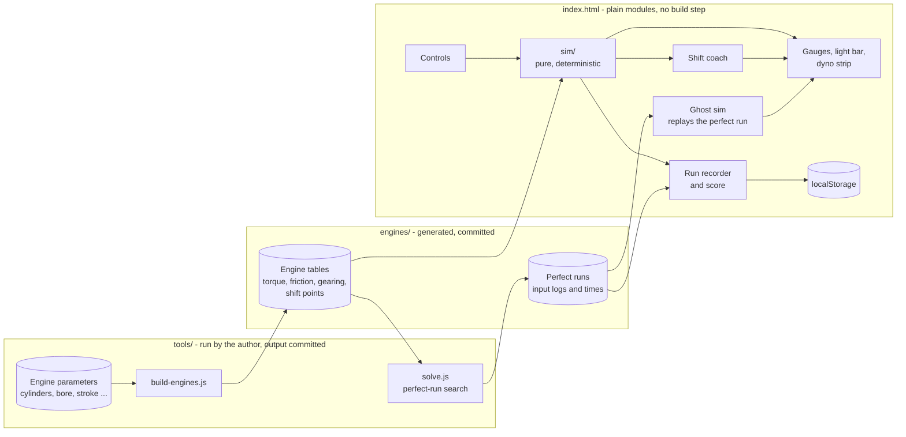
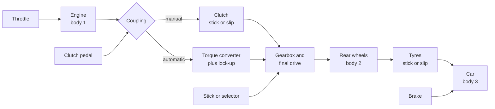
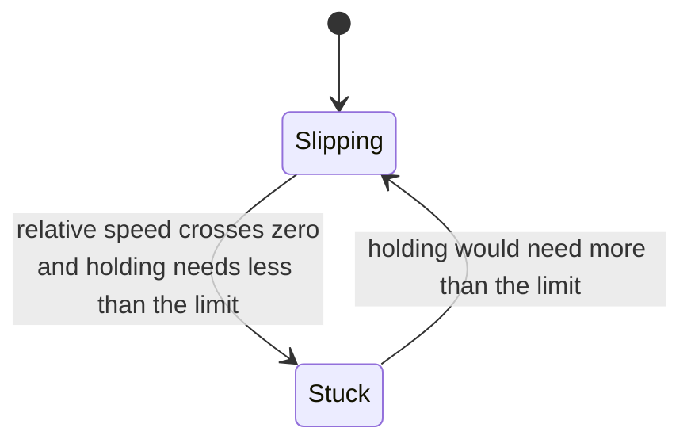
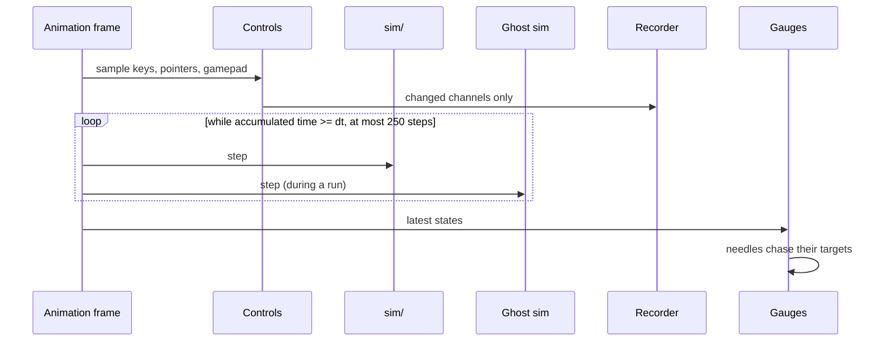
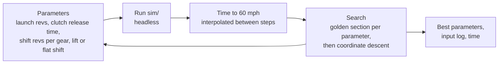

# pedalsim - Architecture

Internal document. Everything here is the design's proposal unless [00-plan.md](00-plan.md)
lists it as settled by the author.

## Shape of the thing

One static page. No server. Two kinds of calculation: the simulation that runs live in the
browser, and two tools that run on the author's machine before publishing - one that builds
each engine from its dimensions, and one that works out the perfect 0 to 60 run for it.



**`sim/` imports nothing from the browser.** No `window`, no DOM, no clock, no random. It is
a function from (engine, chassis, state, inputs) to the next state. That is what lets the
tests run it in Node, the solver run it thousands of times, the ghost run beside the driver,
and a shared link reproduce a run on someone else's machine.

## Engines built from their dimensions

The engines are not five hand-drawn torque curves. Each one is a short list of physical
parameters, and `tools/build-engines.js` turns that into the tables the simulation uses. The
point: an I4 and a V12 behave differently *because* of their dimensions, and the page can say
why.

| Parameter | I4 | V6 | V8 | V10 | V12 |
| --- | --- | --- | --- | --- | --- |
| Cylinders | 4 | 6 | 8 | 10 | 12 |
| Bore x stroke, mm (starting guess) | 86 x 86 | 94 x 84 | 92 x 94 | 92 x 79 | 89 x 87 |
| Displacement, litres (derived) | 2.0 | 3.5 | 5.0 | 5.2 | 6.5 |
| Peak mean piston speed, m/s | 20 | 20 | 21 | 23 | 23 |
| Character | Peaky | Broad | Low-down | Peaky, high | Broad, high |

Everything below is derived, not entered:

```
Displacement   Vd   = cylinders * (pi / 4) * bore^2 * stroke
Redline        nmax = Sp_max * 60 / (2 * stroke)          rpm; a short stroke revs higher
Torque         T(n) = IMEP(n) * Vd / (4 * pi)             four-stroke: one power stroke per two turns
Friction       Tf(n) = FMEP(Sp) * Vd / (4 * pi)
               FMEP  = A + C * Sp + D * Sp^2              simplified Chen-Flynn, Sp = 2 * stroke * n / 60
Power          P(n) = T(n) * n * 2 * pi / 60
Inertia        Ie   = flywheel + cylinders * per-cylinder equivalent
Engine mass    from a table by layout, added to the car
Firing gap     720 / cylinders degrees                    sets how smooth idle is
```

- **IMEP shape.** Peak indicated pressure is about the same for any well-made naturally
  aspirated engine, so torque is mostly displacement. What differs is *where* it peaks, from a
  shape table per character (peaky, broad, low-down) over the fraction of the redline.
- **Redline from piston speed.** A long stroke means the piston travels further every turn, so
  the same piston speed limit is reached at fewer rpm. That one line is why the V10 and V12
  rev higher than the V8 here.
- **Smoothness.** A four-cylinder fires every 180 degrees, so its power strokes do not
  overlap and its torque pulses hard. A V12 fires every 60 and the strokes overlap. The idle
  tremble on the tachometer is calculated from that ripple and the inertia, not drawn in.
- **Gearing is calculated too.** Six ratios per engine: first gear sized so peak torque just
  reaches the tyres' grip, top gear so the engine's power peak meets the drag curve, the gears
  between in a progression that tightens toward the top. Computed once, stored as numbers.
- **The throttle is not a straight line.** A throttle plate passes most of its air in the
  first third of its travel at low revs. A table of load against pedal and rpm captures that,
  which is why a little gas revs a free engine a lot.

`build-engines.js` may use any maths it likes, `Math.pow` included, because its output is
fixed numbers committed to the repo. Only the live step has the determinism rules below.

## How the revs answer the gas

The author's first requirement: the rpm must represent the amount of gas given. It does,
in two ways that the page shows:

```
Steady:  the revs settle where   Tcomb(n, load(pedal, n)) = Tf(n) + load from the car
Moving:  the revs change at      dn/dt = (Tcomb - Tf - Tclutch) / Ie
```

In neutral there is no car load, so each pedal position has one rpm where the engine's
combustion torque exactly feeds its own friction - that is where the needle settles. How fast
it gets there is net torque over inertia: the dyno strip shows both curves, and the dot sits
where they meet.

## The drivetrain



All units inside `sim/` are SI. rpm and mph exist only at the edges.

### The chassis

One car carries every engine, so the engine is the only variable: a rear-drive two-door,
about 1250 kg plus the engine, frontal drag area about 0.65 m^2, rolling resistance about
0.012, tyre radius about 0.33 m. Weight shifts onto the rear wheels under acceleration:

```
Nrear = m * g * (static rear fraction) + m * a * h / L        h = centre of mass height, L = wheelbase
```

which is why a hard launch grips a little better than a standing calculation would suggest.

### The engine at runtime

```
Tcomb = load(pedal_eff, n) * Tfull(n)
Te    = Tcomb - Tf(n) + ripple(n, crank angle)        ripple feeds the display tremble only
pedal_eff = max(pedal, idle controller)
```

- **Idle controller**: a small proportional-integral loop holding idle. Why the revs dip and
  recover as the clutch bites.
- **Rev limiter**: combustion cut above the limit until the revs fall a margin below it. The
  bounce is a real consequence, not an animation.
- **Stall**: below the stall speed the engine stops until the start key.
- **Over-rev**: combustion cannot pass the limiter, but the wheels can drag the engine past it
  through a locked clutch after a bad downshift. That lights the check engine light.

### Two friction couplings, one rule

The clutch joins the engine to the gearbox; the tyres join the wheels to the road. Both are
friction, and both use the same stick or slip rule.



| | Clutch | Tyres |
| --- | --- | --- |
| Joins | Engine speed `we` and gearbox input `ww * G` | Wheel surface `ww * r` and car speed `v` |
| Limit when stuck | `e(clutch pedal) * Tclutch_max` | `mu_static * Nrear * r` |
| Passed when slipping | The same limit | `mu_kinetic * Nrear * r`, a little lower |
| What it feels like | Bite point, stall, the shove of a dropped clutch, engine braking | Grip, and wheelspin on a launch with too many revs |

Because kinetic grip is lower than static, a wheelspin launch is slower than a clean one.
That is what makes the launch a skill worth scoring, and what the solver has to find.

With two couplings there are four cases (both stuck, either slipping, both slipping). They
are written out rather than handed to a general constraint solver: each case gives the three
accelerations, and the case is accepted only if it is consistent with its own assumption.
**The lock test** - speeds crossing within a step are snapped together, not left to chatter
across each other - is the classic bug in clutch models and gets the most tests.

### The automatic

- **Torque converter**, from the standard capacity-factor model. Speed ratio
  `SR = turbine / pump`:

```
Tpump    = (npump / K(SR))^2        K from a table, rpm per root newton metre
Tturbine = TR(SR) * Tpump           TR about 2 at a standstill, 1 at the coupling point
```

  This gives creep at idle in D, the stall speed with the brake held and the throttle floored,
  and weak engine braking when coasting.
- **Lock-up clutch** in the upper gears, through the same stick or slip code.
- **Shift map**: per gear an up line and a lower down line in speed against throttle, so the
  box holds a gear across a band instead of hunting. Kickdown past a throttle threshold.
- **Selector** P-R-N-D. Leaving P needs the brake.

### The car

```
Fdrive = tyre force from the coupling above
Faero  = 0.5 * rho * CdA * v * |v|
Froll  = Crr * m * g * clamp(v / 0.05, -1, 1)
Fbrake = brake * Fbrake_max, capped at mu * m * g     a simple ABS: the wheels never lock
m * dv/dt = Fdrive - Faero - Froll - Fbrake
```

A stopped, braked car stays stopped (the same hold rule). Top speed is not in any file; it is
where power meets drag, and a test checks it.

**The speedometer reads the driven wheels**, as a real one does, so wheelspin flares it. The
0 to 60 clock uses the car's true speed. The score card says so.

## Determinism

A shared link must give the same run on any machine.

1. **Fixed step**, `dt = 1 / 1000` s. The step count is the clock.
2. **No transcendental functions in `sim/`.** ECMAScript lets `Math.sin`, `exp`, `pow` and
   `log` differ in the last bit between engines. Curves are tables with linear
   interpolation; `sqrt`, correctly rounded under IEEE 754, is allowed.
3. **Quantised inputs**: every pedal value rounded to 1/1023 at the step boundary - the same
   number the log stores.
4. **No clock, no random, no `Date` in `sim/`.** A test greps for them.
5. **`SIM_VERSION`** changes whenever the step's output changes. Golden traces hash the state
   after scripted runs; a moved hash with an unmoved version fails the test.
6. **Checked in Node and headless Chrome**, and Firefox where installed.

## The loop



## The shift coach

All of it is computed from the engine tables, mostly in advance.

**When to change up - for speed.** In gear `i` at speed `v`, the force at the tyres is
`min(T(n_i(v)) * G_i * eta / r, grip)`. Change up when the next gear would push harder:

```
shift up at the speed where   F_i(v) = F_i+1(v),   or at the redline if they never cross
```

Precomputed per engine and gear by scanning speed, and drawn as the **shift marker** on the
tachometer. The light bar fills over the last 1500 rpm before it and flashes at it.

**When to change up - for economy.** With light throttle, change up once the next gear keeps
the revs above a lugging floor (about twice idle).

**When to change down.**

- *Lugging*: revs below the floor with real throttle - down arrow.
- *For speed*: full throttle, and the lower gear both pushes harder and stays under its shift
  point - down arrow.
- *Braking*: the gear you would want if you had to accelerate now - the one that puts the
  revs between peak torque and the shift point.

**What revs to match.** With the clutch down and a lower gear chosen, a second faint needle
shows `n_target = v / r * G_target * 60 / (2 * pi)`, the revs the engine must reach for a
smooth release. Blip the throttle to meet it.

**How smooth a shift was.** On each release the clutch's slip energy is integrated:

```
E = sum over the slip of  Tclutch * |we - ww * G| * dt          joules turned into heat
```

A perfect rev-match is near zero. A dumped downshift is hundreds of joules and a lurch.

## The perfect run

`tools/solve.js` finds, for each engine, the fastest 0 to 60 the simulation allows with a
manual gearbox - the reference every driver is scored against.



- **Starting point**: shift points from the crossover rule above, launch at peak torque.
- **The perfect driver is held to human limits**: the stick has a minimum travel time, and the
  solver gets no faster shift than a person can make. Otherwise "perfect" is unbeatable for a
  silly reason.
- **The crossing of 60 mph is interpolated** between the two steps either side, so the
  objective is smooth enough for the search instead of jumping in millisecond stairs.
- **Output**: the best input log and its time, committed as data. The page replays it as the
  ghost; a test reruns it and fails if the time moved without `SIM_VERSION` moving.
- **What it reveals**: the best shift is often not at the redline. Where the torque curve
  falls off early, the solver shifts well before it, and the page can say so.

## The score

**Time lost, phase by phase.** Your run is split into phases: launch, each gear, each shift.
For each phase take the range of speed it covered (using the highest speed reached so far, so
a speed dip during a shift does not count twice), and compare the time you spent with the
time the perfect run spent covering the same range:

```
lost(phase) = your time in phase - perfect time over the same speed range
sum of lost(phase) over all phases = your 0-60 time - perfect 0-60 time, exactly
```

So the card can say "the launch cost 0.21 s, the 1-2 shift 0.09 s" and the numbers add up to
the gap. Each phase also shows why: launch wheelspin time; shift revs against the perfect
run's; time with the clutch in; slip energy; time on the limiter.

**One number for the board.** Proposed:

```
score = round(1000 * perfect time / your time)        1000 is perfect
```

with a "clean" mark for a run with no grind, no over-rev and low clutch heat. A stall ends the
run. Every other mistake already costs time, so it is not penalised twice.

## The board and the share link

**The board** is per browser: best score per engine, the last ten runs, any of them watchable.

**The share link** puts the run in the URL fragment, never sent to any server:

```
#run=<base64url( deflate( packed run log ) )>
```

The packed log carries the engine, gearbox, `SIM_VERSION`, the engine table hash and the
input changes - not the time or the score. The receiver's page re-drives it and computes
both. Received runs can be kept in a "friends" list on the receiver's board.

**What a link proves.** That the run is possible in this simulation. It cannot prove a person
drove it: a program could write a perfect input log. The page says so.

## The page

- **SVG gauges** generated from each engine's tables: tick at `a0 + (x / max) * sweep`, the
  redline arc, the shift marker. A new engine gets a correct tachometer for free.
- **Needles have mass**: a damped spring chasing the value, quicker on the tachometer than the
  speedometer:

```
acc = wn^2 * (target - angle) - 2 * zeta * wn * vel
```

- **Shift light bar**, **gear and arrow**, **ghost needle**, **rev-match needle**.
- **Dyno strip**: the engine's torque and power curves with a dot at the current revs and
  load. The calculation, on screen.
- **Pedals and stick**: simple controls that also show what the keyboard is doing. The H-pattern
  knob is projected onto its gate segments, so it moves only where a real one can.
- **Styling** through CSS custom properties, so the sporty look the author picks can be applied
  without touching the gauge maths.

## Controls

| Source | How |
| --- | --- |
| Keyboard | Held, a pedal ramps toward 1; released, toward 0. The clutch rises slower than it falls, so the bite point is findable. Number keys for gears, a key each for start, shift up and down |
| Mouse and touch | Drag a pedal down; drag the knob; several fingers at once on a phone |
| Game controller, if present | Triggers for throttle and brake. Optional, never required |

## Files, proposed

```
pedalsim/
  index.html
  sim/        step, engine, couplings, converter, gearbox, chassis, coach, score, log
  engines/    params.js (entered), i4.js ... v12.js (generated), perfect/*.js (generated)
  ui/         gauge, needle, lightbar, dyno, pedals, stick, board, scorecard
  input/      keyboard, pointer, gamepad
  tools/      build-engines.js, solve.js, drive.js (scripted run to CSV), figures.js
  test/
  package.json   "test": "node --test"
```

Run locally with `npx serve`, not plain `python -m http.server`, which sends `.js` as
text/plain on this machine and modules refuse to load.

## Deployment

GitHub Pages, with the rest of the static site, at `/pedalsim/`: added to
`deploy/build-static.mjs` and the Pages workflow's paths. Nothing else.
