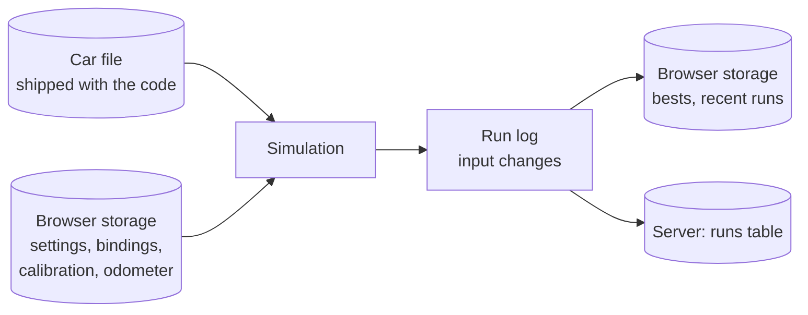
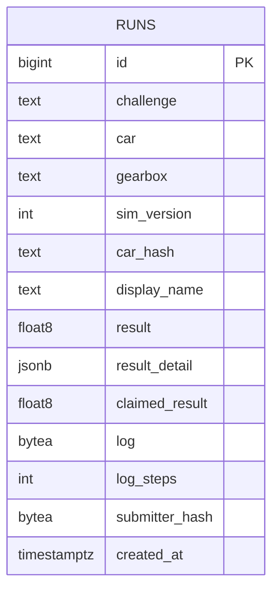

# pedalsim - Data model

Four kinds of data: car files that ship with the code, run logs, what one browser remembers,
and one table on the server. The shape matters more than the exact fields, and nothing here
exists yet.



## The car file

One module per car in `cars/`, exporting a plain object. Shipped with the code, read by the
page, the server and the tests. Never edited by a driver in the first version.

```
{
  id:          "coupe",
  name:        "Sports coupe",
  description: "Light, rear-drive, revs high",
  mass:        1350,              kg, with a driver
  wheelRadius: 0.32,              m
  cdA:         0.62,              m^2, drag coefficient times frontal area
  crr:         0.011,             rolling resistance coefficient
  brakeForce:  12000,             N at full pedal
  engine: {
    cylinders:  6,
    inertia:    0.18,             kg m^2, crank and flywheel
    idleRpm:    800,
    stallRpm:   350,
    redlineRpm: 7200,
    limiterRpm: 7400,
    overRevRpm: 8400,             past this through a locked clutch: damage
    torque:     [[1000,180],[2000,230],[3500,275],[5000,290],[6500,265],[7400,235]],
    friction:   [f0, f1, f2],
    fuel:       { bsfc: 260, idleFlow: 0.25, tankLitres: 60 }
  },
  gearboxes: {
    manual: { ratios: [3.36, 2.07, 1.43, 1.10, 0.87, 0.73], reverse: 3.18, finalDrive: 3.62,
              efficiency: 0.93, clutchCapacity: 1.4, bite: 0.55 },
    auto:   { ratios: [...], reverse: ..., finalDrive: ..., efficiency: 0.90,
              converter: { k: [[sr, K], ...], tr: [[sr, TR], ...], lockupFromGear: 3 },
              shiftMap: { up: [...], down: [...] }, kickdown: 0.92, shiftTime: 0.35 }
  },
  cluster: { speedMaxMph: 180, rpmMax: 8000, style: "analog-1" },
  targets: { zeroToSixty: [5.6, 6.2], topSpeedMph: [150, 160], rpmAt70: [2300, 2700] }
}
```

- **Curves are point tables**, interpolated linearly, never formulas: the determinism rule in
  [03-architecture.md](03-architecture.md).
- **A car may offer one gearbox or both.** The driver picks where both exist.
- **`targets` are not used by the simulation.** They are the figures a real car of this type
  would reach, from published road tests of the class, and the figures tool and the tests
  check the simulation against them. A car whose numbers fall outside its targets is a car
  that needs tuning, not a target that needs moving.
- **The car hash** is a SHA-256 of the object serialised with sorted keys. The server
  refuses runs whose hash does not match its copy.

### The starting garage, proposed

| id | Type | Gearboxes | Why it is here |
| --- | --- | --- | --- |
| `hatch` | Small hatchback, four cylinders | Manual 5 | The default. Forgiving clutch, low power, easy to learn on |
| `family` | Family saloon | Auto 6, manual 6 | The automatic most people know: creep, kickdown |
| `coupe` | Sports coupe, six cylinders | Manual 6 | High redline, sharp clutch, the challenge car |
| `pickup` | Pickup, eight cylinders | Auto 4 | Torque everywhere, low redline, a different note |
| `silly` | To be decided by the author | - | One car that is absurd on purpose. See the open questions |

## The run log

```
{
  format:     1,
  simVersion: 3,
  car:        "coupe",
  carHash:    "9f2c...",
  gearbox:    "manual",
  challenge:  "zero-to-sixty",          or null for free driving
  steps:      6421,                     length of the run
  events: [
    [0,    "key",    1],
    [212,  "clutch", 1023],
    [460,  "gear",   1],
    [903,  "thr",    388],
    [910,  "clutch", 1001],
    ...
  ],
  claimed:    { time: 6.421 }           the page's own result; the server never trusts it
}
```

- Channels: `thr`, `brake`, `clutch` (0 to 1023), `gear` (-1 to 6, or P/R/N/D for an
  automatic), `key` (0 or 1).
- Only changes are recorded. A pedal held still costs nothing.
- In storage and on the wire the events are packed as one flat integer array to keep the
  size down. A minute of hard driving is a few kilobytes.
- A replay feeds the events back in at their step numbers. Because the simulation is
  deterministic, that is the whole replay.

## What the browser keeps

`localStorage`, one key per concern, each a JSON object with a version number so a later
format can migrate it.

| Key | Holds |
| --- | --- |
| `pedalsim.settings` | Units (mph or km/h), sound volume, last car and gearbox, hints on or off |
| `pedalsim.bindings` | Keyboard keys per action |
| `pedalsim.devices` | Per gamepad or pedal device name: which axis is which pedal, its calibrated range, dead zone, inversion |
| `pedalsim.bests` | Best result per challenge, car and gearbox, with its run log |
| `pedalsim.recent` | The last ten run logs, for watching back |
| `pedalsim.odometer` | Lifetime distance driven to nowhere, per car |

Everything here belongs to one browser. Clearing it loses it, and nothing else breaks.

## The server: one table

PostgreSQL, in its own database on the shared server.



- **`result` is the server's replay**, never the page's claim. `claimed_result` is kept only
  to notice a page whose simulation has drifted from the server's.
- **`submitter_hash`** is a keyed hash of the address, for the rate limit. The raw address is
  never stored.
- **Index** on `(challenge, car, gearbox, sim_version, result)` for the board query.
- Challenges and cars are not tables. They are code, versioned with `SIM_VERSION`.

## What is deliberately not stored

- No accounts, emails or passwords. A display name is all there is.
- No raw IP addresses.
- No telemetry of free driving. Only runs a driver chose to send ever leave the browser.
- No custom or tuned cars on the server.
