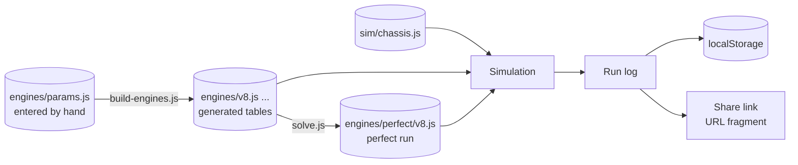

# pedalsim - Data model

No database and no server. Five kinds of data: engine parameters the author enters, engine
tables and perfect runs generated from them, the one chassis, run logs, and what one browser
keeps. The shape matters more than the exact fields, and nothing here exists yet.



## Engine parameters - entered

`engines/params.js`, one entry per engine. The only engine numbers anyone types.

```
{
  id: "v8",
  label: "V8",
  layout: "V", cylinders: 8, bankAngle: 90,
  bore: 0.092, stroke: 0.094,            m
  pistonSpeedMax: 21,                    m/s at the redline
  imepPeak: 13.5e5,                      Pa
  character: "low-down",                 picks the IMEP shape table
  friction: { A: 0.97e5, C: 0.15e5, D: 0.005e5 },     Pa, Pa per m/s, Pa per (m/s)^2
  flywheel: 0.12, perCylinderInertia: 0.008,          kg m^2
  mass: 210,                             kg, added to the chassis
  idleRpm: 750, stallRpm: 350
}
```

## Engine tables - generated

`engines/<id>.js`, written by `tools/build-engines.js`, committed, never edited by hand. A
header comment says so and names the parameters' hash.

```
{
  id: "v8", label: "V8", cylinders: 8,
  displacement: 0.00500,                 m^3
  redlineRpm: 6700, limiterRpm: 6850, overRevRpm: 7900,
  idleRpm: 750, stallRpm: 350,
  inertia: 0.184, mass: 210,
  torqueFull:  [[rpm, Nm], ...],         about 40 points
  friction:    [[rpm, Nm], ...],
  loadMap:     { pedals: [...], rpms: [...], load: [[...], ...] },
  ripple:      { firingGapDeg: 90, amplitude: ... },
  manual: { ratios: [6], finalDrive, efficiency, clutchMax, bite },
  auto:   { ratios: [6], finalDrive, efficiency, converter: { k: [...], tr: [...] },
            lockupFromGear, shiftMap: { up: [...], down: [...] }, kickdown },
  coach:  { upFullThrottleRpm: [per gear], lugFloorRpm, ... },
  figures: { peakTorque: [Nm, rpm], peakPower: [kW, rpm], topSpeedMph, zeroToSixtyRef }
}
```

- Every curve is a point table, interpolated linearly in `sim/`, never a formula. That is the
  determinism rule in [03-architecture.md](03-architecture.md).
- `figures` are for the page's engine card and the tests. The simulation never reads them.
- **The engine hash**: SHA-256 of the object serialised with sorted keys. A shared run carries
  it; a receiver with different tables says the run is from another version.

## Perfect runs - generated

`engines/perfect/<id>.js`, written by `tools/solve.js`.

```
{
  engine: "v8", engineHash: "...", simVersion: 1, gearbox: "manual",
  time: 4.917,                           seconds to 60 mph
  params: { launchRpm, clutchRelease, shiftRpm: [5], liftOnShift },
  log: <packed run log>                  the ghost replays this
}
```

## The chassis

`sim/chassis.js`, plain constants. One car for every engine.

```
{ massWithoutEngine: 1250, cdA: 0.65, crr: 0.012, wheelRadius: 0.33,
  wheelbase: 2.6, cgHeight: 0.5, staticRearFraction: 0.5,
  muStatic: 1.05, muKinetic: 0.85, wheelInertia: 2.4, brakeMax: 14000 }
```

## The run log

```
{
  format: 1, simVersion: 1,
  engine: "v8", engineHash: "...", gearbox: "manual",
  mode: "zero-to-sixty",                 or "free"
  steps: 5310,
  events: [[0, "key", 1], [212, "clutch", 1023], [460, "gear", 1], [903, "thr", 1023], ...]
}
```

- Channels: `thr`, `brake`, `clutch` (0 to 1023), `gear` (-1 to 6, or P/R/N/D), `key`.
- Only changes are recorded. Packed as one flat integer array; a 0 to 60 run is a few hundred
  bytes, small enough for a URL.
- No time and no score in the log. Both are recomputed from it.

## The share link

```
https://<site>/pedalsim/#run=<base64url( deflate-raw( packed log ) )>
```

The fragment never reaches any server. `CompressionStream` in the browser does the deflate.

## What the browser keeps

`localStorage`, one key per concern, each with a format number.

| Key | Holds |
| --- | --- |
| `pedalsim.settings` | Units, last engine, last gearbox mode, coach on or off |
| `pedalsim.bindings` | Keyboard keys per action |
| `pedalsim.bests` | Best 0 to 60 run per engine: its log, recomputed time and score |
| `pedalsim.recent` | The last ten runs |
| `pedalsim.friends` | Runs received by link and kept, with the name the sender typed |

Everything here belongs to one browser. Clearing it loses it and nothing else breaks.

## What is deliberately not stored

- Nothing on any server. There is no server.
- No accounts, emails or names beyond a name typed into a share link.
- No telemetry. A run leaves the browser only as a link the driver copied.
