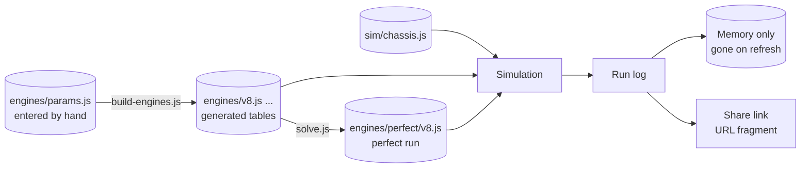

# pedalsim - Data model

No database and no server. Five kinds of data: engine parameters the author enters, engine
tables and perfect runs generated from them, the one chassis, run logs, and what the page holds
in memory while it is open. Nothing is saved. The shape matters more than the exact fields, and nothing here exists yet.



## Engine parameters - entered

`engines/params.js`. The only engine numbers anyone types. Built in stage 1.

```
SHARED = {                               physics and plumbing, the same for every engine
  frictionA: 0.5e5, frictionC: 0.03e5, frictionD: 0.002e5,     Pa, Pa per m/s, Pa per (m/s)^2
  pumpingClosed: 0.9e5,                  Pa, throttle shut
  throttleLeak: 0.004, throttleFlow: 1.5,
  manifoldRatio: 1.0,                    manifold volume over displacement
  starterFactor: 3, starterFreeRpm: 400, fireRpm: 200,
  inertiaPerCylinder: 0.008,             kg m^2
}

ENGINES = [{                             in the order the page cycles them
  id: "v8", label: "V8", cylinders: 8, bankAngle: 90,
  bore: 0.094, stroke: 0.0895,           m
  pistonSpeedMax: 21.5,                  m/s at the redline
  imepPeak: 14.6e5,                      Pa
  shape: { peakAt: 0.85, atIdle: 0.74, atRedline: 0.91 },
  flywheel: 0.319,                       kg m^2
  mass: 200,                             kg, added to the chassis in stage 2
  idleRpm: 650,
  targets: {                             the reference engine's published figures
    peakTorque: [500, 535], peakTorqueRpm: [4600, 5800],
    peakPower: [310, 355], peakPowerRpm: [6400, 7200],
    redline: [6800, 7300],               left out where no published figure was found
  },
}, ...]
```

## Engine tables - generated

`engines/<id>.js` and `engines/index.js`, written by `tools/build-engines.js`, committed,
never edited by hand. The header names the SHA-256 of the parameters it was built from, and
`test/engines.test.js` rebuilds every file in memory and fails if a committed one differs.

```
export default {
  id: "v8", label: "V8", cylinders: 8, bankAngle: 90, firingIntervalDeg: 90,
  displacement: 0.0049689, bore: 0.094, stroke: 0.0895, mass: 200,
  inertia: 0.383,
  idleRpm: 650, stallRpm: 350, fireRpm: 200,
  redlineRpm: 7200, limiterRpm: 7350, limiterHysteresisRpm: 200, overRevRpm: 8300,
  throttleFlow: 1.5, manifoldRatio: 1, pumpingNm: 35.59,
  starterNm: 166.07, starterFreeRpm: 400,
  throttleArea: { start: 0, step: 1/64, values: [...] },     open area over the pedal
  combustion:   { start: 0, step: 50, values: [...] },       Nm at a full cylinder, over rpm
  friction:     { start: 0, step: 50, values: [...] },       Nm, over rpm
}
```

- Every curve is an evenly spaced table, read by straight-line interpolation in `sim/`
  (`sim/curves.js`), never a formula. That is the determinism rule in
  [03-architecture.md](03-architecture.md).
- The rpm tables run 1500 rpm past the over-rev limit, so a needle dragged past it by a bad
  downshift still reads a curve.
- **Not in the file**, on purpose: the full-throttle torque and power curves and their peaks.
  They are what the tables *produce*, so they are measured by running the engine
  (`tools/measure.js`) rather than stored where they could disagree with it.
- **Added in stage 2**, worked out with the chassis:

```
  gearing: { wheelRadius, finalDrive: 3.4, ratios: [6], reverse, clutchMaxNm, topSpeed },
  coach:   { upshiftRpm: [5] },                 full throttle, gear 1 to 5
  auto:    { up: [[light, full] x 5], down: [[light, full] x 5],     m/s
             kickdown: 0.92, lockupFromGear: 3, stallRpm,
             converter: { K: table over speed ratio, TR: table over speed ratio } },
```
- **The engine hash** for a run log (stage 7) is the parameters hash in the header.

## Perfect runs - generated

`engines/perfect/<id>.js`, written by `tools/solve.js`.

```
{
  engine: "v8", engineHash: "...", simVersion: 1, gearbox: "manual",
  time: 4.917,                           seconds to 60 mph
  params: { launchRpm, clutchRelease, shiftRpm: [5], liftOnShift },
  log: <packed run log>                  the ghost replays this
}
```

## The chassis

`sim/chassis.js`, plain constants. One car for every engine. Built in stage 2.

```
{ massWithoutEngine: 1250, wheelRadius: 0.33, cdA: 0.70, crr: 0.012, airDensity: 1.2,
  g: 9.81, wheelbase: 2.6, cgHeight: 0.5, rearWeightFraction: 0.52,
  muStatic: 1.15, muKinetic: 0.9, wheelInertia: 2.4, brakeDecelMax: 1.0 }
```

The chassis is part of what an engine file is built from (its gearing depends on it), so it
is in the parameters hash: change the car and every engine file is stale until rebuilt.

## The run log

```
{
  format: 1, simVersion: 1,
  engine: "v8", engineHash: "...", gearbox: "manual",
  mode: "zero-to-sixty",                 or "free"
  steps: 5310,
  events: [[0, "key", 1], [212, "clutch", 1023], [460, "gear", 1], [903, "thr", 1023], ...]
}
```

- Channels: `thr`, `brake`, `clutch` (0 to 1023), `gear` (-1 to 6, or P/R/N/D), `key`.
- Only changes are recorded. Packed as one flat integer array; a 0 to 60 run is a few hundred
  bytes, small enough for a URL.
- No time and no score in the log. Both are recomputed from it.

## The share link

```
https://<site>/pedalsim/#run=<base64url( deflate-raw( packed log ) )>
```

The fragment never reaches any server. `CompressionStream` in the browser does the deflate.

## The gauge layout and development - in memory only

Built when an engine is chosen, thrown away when the tab closes.

```
layout[engine] = {
  tach:  { max, majorStep, minorStep, a0, sweep, redline, limiter, shiftMarks: [per gear] },
  speed: { max, majorStep, minorStep, a0, sweep },
  lights: cylinders,
  faces: { tach: <texture>, speed: <texture> }          painted once
}

development[engine] = {
  tach:  Float32Array(bins),            one per 100 rpm, 0..1
  speed: Float32Array(bins),            one per mph, 0..1
  events: { redlineSeen, shiftMarkSeen: [per gear] },
  dyno:  Float32Array(bins)             largest full-throttle torque seen per rpm bin
}
```

- Kept per engine, so cycling back restores what that engine had built.
- Never saved: every refresh starts with empty circles (the author: "each refresh is a new
  run ... its a sandbox that resets").
- Never read by `sim/`.

## What lives in memory while the page is open

Nothing is written to the browser's storage - no `localStorage`, no cookies, no IndexedDB.
The page is a sandbox: a refresh starts it over. While it is open it holds:

| Held | What |
| --- | --- |
| Settings | Units, gearbox mode, coach on or off - back to defaults on refresh |
| Bests | Best 0 to 60 run per engine: its log, recomputed time and score |
| Recent | The last ten runs |
| Opened links | A run opened from a link joins the board so it can be raced |

To keep a run past a refresh, share it as a link.

## What is deliberately not stored

- Nothing on any server. There is no server.
- Nothing in the browser's storage. A refresh forgets everything.
- No accounts, emails or names beyond a name typed into a share link.
- No telemetry. A run leaves the browser only as a link the driver copied.
