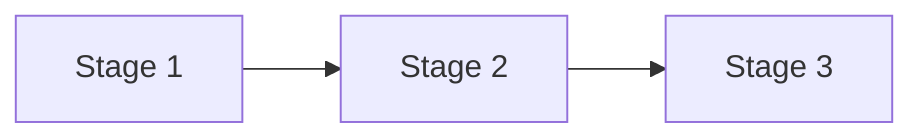

# Build plan

## Objective

One paragraph. What this app is for, and what has to be true before it can be called
finished. Written so it can be checked, not admired.

## Order of work

The stages are ordered so that each one produces something that can be run and judged.
Nothing is built before the thing it depends on.

| Stage | Goal | Done when |
| --- | --- | --- |
| 1 | | |
| 2 | | |
| 3 | | |

## Decisions already made

Things that are settled, so they do not get re-argued. Include the reason, because the
reason is what tells you when the decision should be revisited.

| Decision | Reason |
| --- | --- |
| | |

## Open questions

Things that are not settled and that block a specific stage.

| Question | Blocks | Notes |
| --- | --- | --- |
| | | |

## Risks

| Risk | Effect if it happens | Response |
| --- | --- | --- |
| | | |
