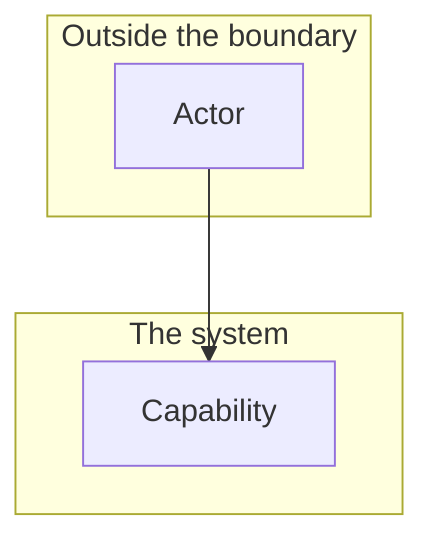

# Interaction and system boundary

## Actors

| Actor | Type | What they want |
| --- | --- | --- |
| | Human / External system | |

## Interaction diagram

Everything inside the boundary is this system's responsibility. Everything outside it is
someone else's, and this system only reacts to it.

## What the system is in the business of

The things it owns and is judged on.

-

## What the system does not care about

Stated deliberately. If one of these is later needed, it is a change of scope and belongs
in `00-plan.md`, not a quiet addition.

-

## Main use cases

| ID | Actor | Goal | Trigger | Result |
| --- | --- | --- | --- | --- |
| UC-1 | | | | |
