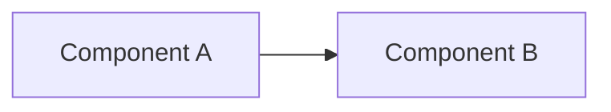
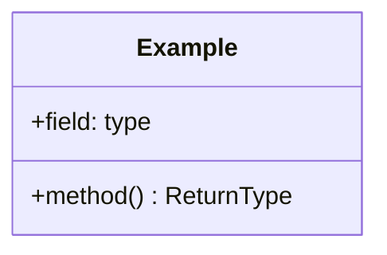
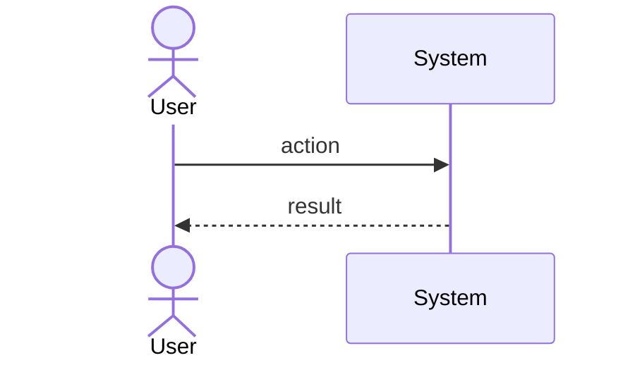

# Architecture

Internal document. Names classes and modules. Contains no secret values; secrets are
referred to by the environment variable that supplies them.

## Components

If the app runs as more than one process, list them and show how they talk. If it is a
single process, say so and list the layers instead.

| Component | Runs where | Responsibility |
| --- | --- | --- |
| | | |

## Layers

State the dependency rule. Usually: each layer may only call the one below it.

## Class diagram

## Key sequence

One representative path through the system, start to finish.

## Rules this architecture is meant to protect

The constraints that would be violated if someone took a shortcut.

-
