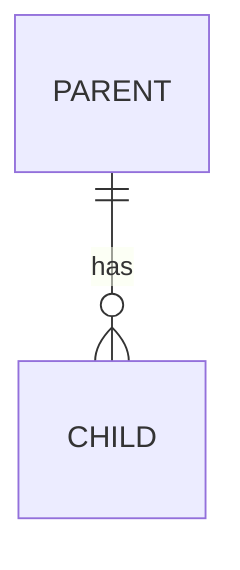

# Data model

## Store

What holds the data, and what its lifetime is. If data is per-browser, per-machine or
per-deployment, say which.

## Entity relationships

## Tables

### `table_name`

Purpose in one line.

| Column | Type | Notes |
| --- | --- | --- |
| `id` | | Primary key |

## Constraints worth stating

Uniqueness, cascade behaviour, and anything enforced in code rather than by the store.

-

## What is deliberately not stored

-
