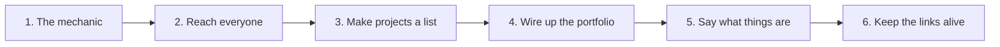

# Portfolio landing page - Build plan

## Objective

A front door that gets a visitor to open at least one project. It is finished when every
project in the portfolio is reachable from it, on any device, within seconds of arriving.

It is not finished. The mechanic works and the content behind it does not: two projects are
wired up out of eight.

## Order of work

| Stage | Goal | Done when | Status |
| --- | --- | --- | --- |
| 1 | The mechanic | A character moves, boxes highlight when reachable, acting on one opens it | Done |
| 2 | Reach everyone | Clicking works without touching the game, touch controls work on a phone, and the instructions are visible on arrival | Done |
| 3 | Projects as a list | A project is defined in exactly one place and the scene is generated from it | **Not done. This is the current work** |
| 4 | Wire up the portfolio | Every project in the repository is reachable from the front door | Not started. Blocked by stage 3 in practice |
| 5 | Say what things are | A visitor can tell what a box is before opening it | Not started |
| 6 | Keep the links alive | A moved folder or a dead host is caught before a visitor finds it | Not started |

### Stage 3 in detail

A project currently takes three edits in three places that do not know about each other:
the box markup, the destination in the link map, and the position in the style file.
Forgetting the second produces a box that highlights, jumps, plays its particles, and then
goes nowhere.

Three edits per project is a small cost that has had a large effect: the front door has two
projects on it while the repository has eight. Stage 4 is not really blocked by effort, it
is blocked by friction.

The fix is one list of projects - identifier, label, icon, position, destination - with the
scene generated from it. Every other app in this repository already keeps its content in a
list, and this is the one that most needs to.

### Stage 5 in detail

A box is an icon and a name. A visitor cannot tell what any project is without opening it,
which means they open one, decide, and leave. A line of description on approach, or on
hover, would let them choose which one to open. That is a different outcome from choosing
whether to open anything.

## Decisions already made

| Decision | Reason |
| --- | --- |
| The front door is a game rather than a grid | A visitor decides in seconds. Being handed a character is a better hook than a list of links |
| Clicking always works | Plenty of visitors do not want to play anything, and making the game mandatory would lose them |
| Touch controls are a first-class input | On a phone there is no keyboard, so they are not a fallback |
| The instructions are on screen from the start | A front door that needs explaining has failed |
| Movement is a fixed step, not a simulation | It is a navigation device. Physics would cost more than it returns |
| Reachability is a distance threshold | Enough for boxes placed far apart, and cheap |
| All animation lives in the style file | Same rule as the rest of the repository |
| The page holds no project content | A name, an icon and a destination. Each project describes itself |
| Nothing is stored about the visitor | Consistent across every app in this repository |
| No dependency, no build step, no network call | The front door loads instantly or it has failed |

## Open questions

| Question | Blocks | Notes |
| --- | --- | --- |
| Does every project belong on the front door? | Stage 4 | Two are Python projects that do not run as static pages. They may need a description and a repository link rather than a box that opens something |
| What happens when there are eight boxes rather than two? | Stage 3 and 4 | The scene is a fixed screen. Eight boxes either crowd it or the scene has to scroll |
| Do two boxes within the threshold of each other break acting? | Stage 4 | Acting opens whichever box is marked reachable. With boxes close together, which one that is becomes a coincidence |
| Should the professional work be on it too? | Stage 4 | There are client sites listed in the repository README that do not appear anywhere on the page |
| Is the game reachable from a keyboard in a way assistive technology can follow? | Stage 5 | Clicking works, which covers the worst case, but nothing has been checked |

## Risks

| Risk | Effect if it happens | Response |
| --- | --- | --- |
| The front door keeps showing two projects | Every other app in the repository is invisible to anyone arriving at the top | Stages 3 and 4, in that order |
| A destination goes stale | A box that highlights, animates, and opens onto nothing | Stage 6 |
| Adding a project stays a three-edit job | Projects continue not to be added, which is the current state | Stage 3 |
| A visitor cannot tell what a box is | They open one, decide, and leave | Stage 5 |
| The scene crowds as boxes are added | The mechanic stops working before the portfolio is covered | Decide the layout answer during stage 3, not after |
| Relative destinations break when an app is deployed alone | The front door works locally and not where it is hosted | Confirm against how the repository is actually served |
