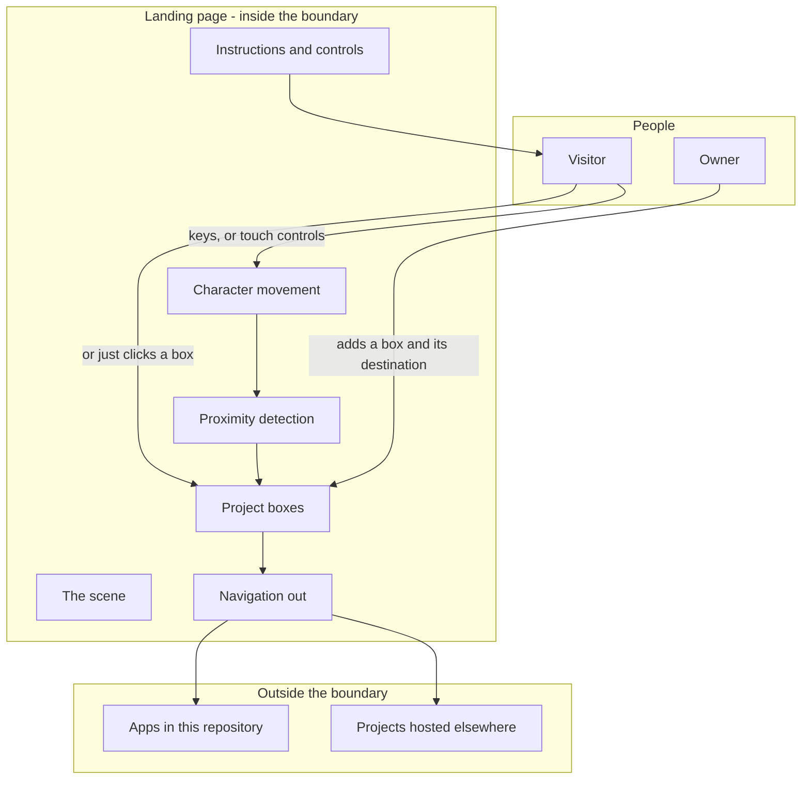

# Portfolio landing page - Interaction and system boundary

## Actors

| Actor | Type | What they want |
| --- | --- | --- |
| Visitor | Human | To find out within seconds whether anything here is worth their time |
| Owner | Human | To add a project to the front door without it being a task |
| The projects | External | Each is a separate page or a separate site. This page only points at them |

## Interaction diagram

## What the system is in the business of

- Getting a visitor to open at least one project.
- Offering a reason to stay for a few seconds longer than a list of links would earn.
- Never blocking anyone. Clicking a box works without touching the game at all.
- Working on a phone, where none of the keyboard controls exist.
- Explaining itself immediately, without a tutorial.

## What the system does not care about

- Being a game. There is no score, no goal, no state to reach, and no ending.
- Describing the projects. That is each project's own job, on its own page.
- Knowing anything about the visitor. Nothing is stored, sent, or counted.
- Remembering anything between visits. The visited markers last as long as the page does.
- Loading, hosting, or running any of the projects. It points at them and gets out of the
  way.
- Search placement, sharing, or distribution.

## Main use cases

| ID | Actor | Goal | Trigger | Result |
| --- | --- | --- | --- | --- |
| UC-1 | Visitor | Understand what to do | Arrive | Instructions and controls are on screen already |
| UC-2 | Visitor | Move around | Press a direction, or a touch control | The character moves |
| UC-3 | Visitor | See what can be opened | Get close to a box | The box highlights and animates |
| UC-4 | Visitor | Open a project the game way | Press to act while a box is highlighted | The box responds and the project opens |
| UC-5 | Visitor | Skip the game | Click a box | The same project opens |
| UC-6 | Visitor | Keep track | Open several | Opened boxes are marked |
| UC-7 | Owner | Add a project | Add a box and its destination | It appears in the scene and can be opened |

## Constraints that come from the actors

- Every project must be reachable by clicking. The game is an option, never a requirement.
- Touch devices have no keyboard, so the on-screen controls are the primary input there and
  not a fallback.
- The instructions must be visible before the visitor does anything.
- The page must load instantly. It is the first thing anyone sees and there is no second
  chance.
- Adding a project must be a small edit. If it is a chore, projects stop being added, which
  is exactly what appears to have happened.
