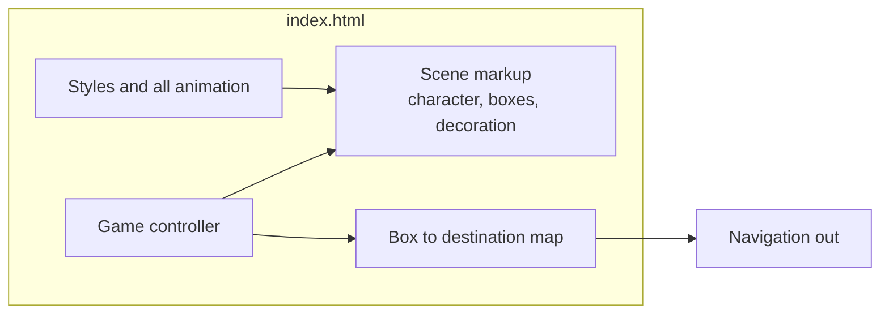
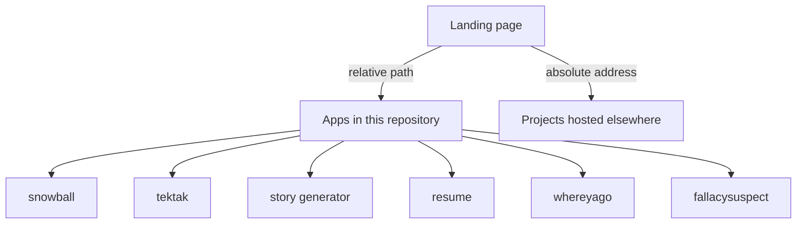
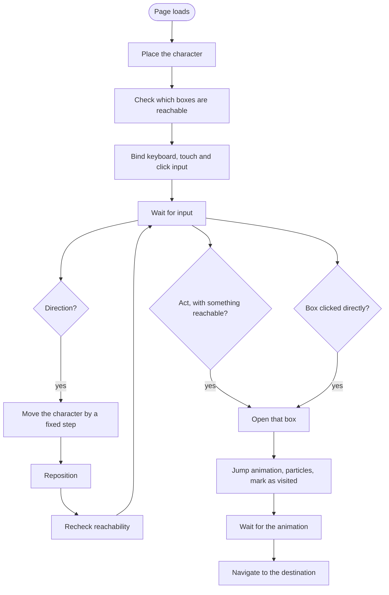
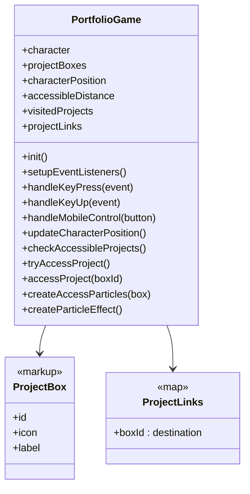
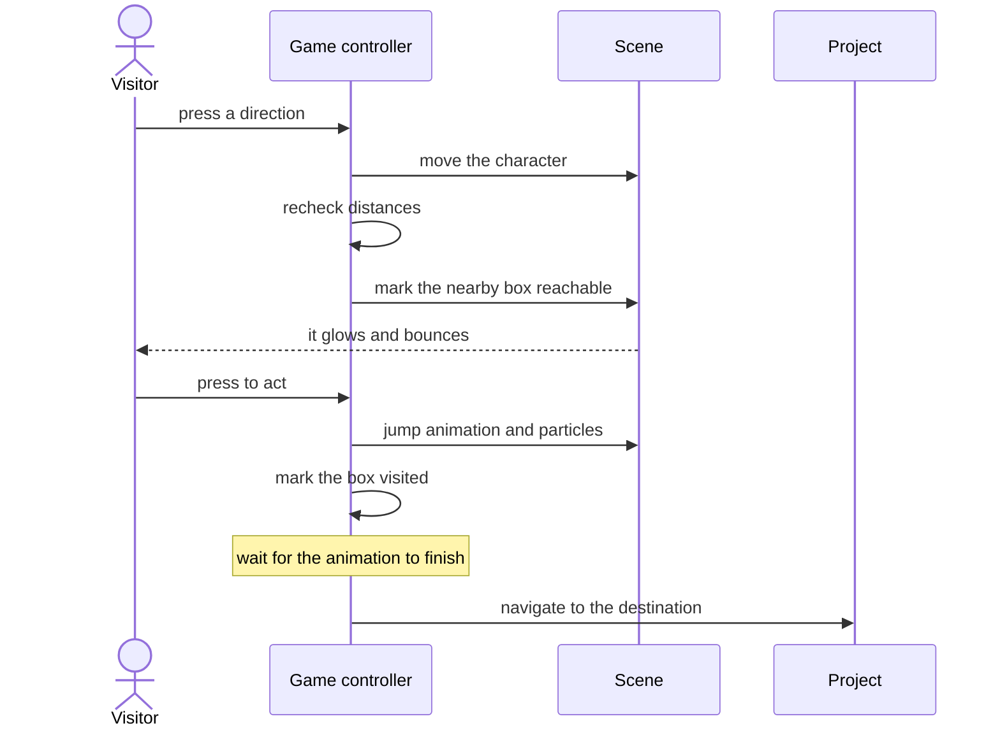

# Portfolio landing page - Architecture

Internal document.

## Components

One file at the repository root. Structure, style and behaviour together, no dependency, no
build step, no network call.

The repository around it is a set of independent static apps, each in its own folder. The
landing page is the front door and knows nothing about any of them beyond a destination
string.

The dotted truth of that diagram: only two of those destinations are currently wired up.
Everything else in the repository is unreachable from the front door.

## The loop

Movement is a fixed step per input rather than a physics simulation. There is no velocity,
no gravity, no collision beyond proximity, and no animation frame loop driving position.
For a navigation device that is enough, and it is why the page has no perceptible cost.

## Reachability

A box is reachable when the distance between it and the character is under a threshold.
The check runs after every move and sets a class; the highlight, the glow and the bounce
are all defined in the style file.

Two consequences worth knowing:

- The check compares distance between element positions on screen. It is measured against
  the rendered layout rather than against a coordinate model, so a resize changes what is
  reachable without anything being recalculated deliberately.
- Acting opens whichever box is currently marked reachable. With boxes placed far apart
  that is unambiguous. Placing two within the threshold of each other would make it a
  coincidence which one opens.

## Structure diagram

One class, and its state is a position, a threshold, a set of visited box identifiers, and
the map from box to destination.

## Where a project is defined

Adding a project currently takes edits in three places: the box markup in the scene, the
destination in the link map, and a position in the style file. Three edits, none of which
know about the other two, and forgetting the second produces a box that highlights, jumps,
plays its particles, and then goes nowhere.

That is almost certainly why there are two boxes and not eight. It is the first thing to
fix, and the fix is to define a project once - identifier, label, icon, position,
destination - and generate the boxes from that list, the way the other apps in this
repository already handle their content.

## Key sequence - opening a project

## Rules this architecture is meant to protect

- Clicking a box always works. The game is optional and must stay optional.
- Touch controls are a first-class input, not a fallback, because on a phone they are the
  only input.
- All animation lives in the style file.
- The page holds no project content. It holds a name, an icon and a destination.
- Nothing is stored, sent, or counted. The visited markers live in memory for the session.
- No dependency, no build step, no network call. The page loads instantly or it has failed.
