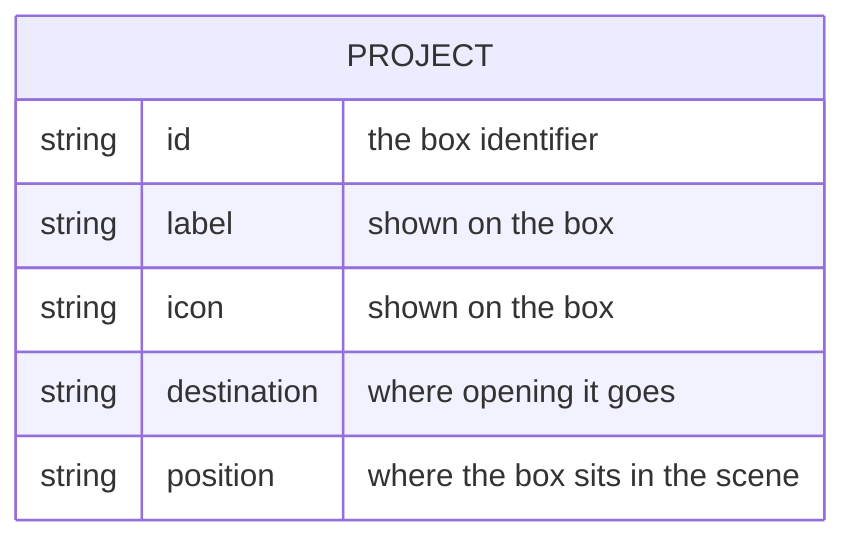

# Portfolio landing page - Data model

## Store

None. Nothing is written to browser storage, no cookie is set, no request is made, and
nothing survives the page being closed.

| Data | Where it lives | Lifetime |
| --- | --- | --- |
| Character position | In memory | The session |
| Which boxes have been opened | In memory | The session |
| Reachability threshold | A constant | Fixed |
| The project list | Split across markup, a link map and the style file | Until the page is edited |

## The project list

The only content this page has, and it is currently not a list at all. A project is defined
in three separate places that do not know about each other.

| Part | Where it currently lives | What happens if it is forgotten |
| --- | --- | --- |
| Identifier, label, icon | The scene markup | No box appears |
| Destination | The link map | The box highlights, jumps, plays its particles, and goes nowhere |
| Position | The style file | The box lands wherever the default puts it |

Three edits for one project, with no single place that describes one. This is the reason
the front door has two projects on it while the repository has eight.

The fix is to make the shape above real: one list of projects, with the boxes, their
positions and their destinations all generated from it. Every other app in this repository
already keeps its content in a list for exactly this reason.

## Destinations

Two kinds, and the difference matters for deployment.

| Kind | Form | Notes |
| --- | --- | --- |
| Within this repository | A relative path to a sibling folder | Works when the whole repository is served from one root, and breaks if an app is deployed on its own |
| Elsewhere | A full address | Depends on that site staying where it is, which nothing here checks |

Nothing verifies either kind. A moved folder or a retired host produces a box that opens
onto nothing, and the failure is only visible to someone who clicks it.

## Session state

| Value | Meaning |
| --- | --- |
| Character position | Where the character is on screen |
| Visited box identifiers | Which projects have been opened this session, used only to mark them |
| Reachability threshold | How close counts as close enough |

The visited set is intentionally not persisted. Remembering it would mean storing something
about a visitor, and this page stores nothing about anyone.

## What is deliberately not stored

- Anything about the visitor. No analytics, no visit count, no identifiers, no referrer
  tracking.
- Any description of a project. The page holds a name, an icon and a destination; the
  project describes itself.
- Anything at all after the tab closes.
