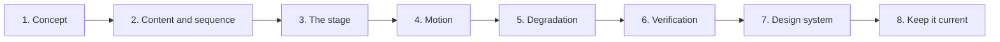

# Interactive Resume - Build plan

## Objective

A resume that occupies exactly one screen and never scrolls, answers three different
readers' questions without asking which one they are, loads with no request beyond the file
itself, and is itself evidence of the front-end claim it makes.

The page has been rebuilt. What remains is verification, one genuine gap, and the discipline
of keeping the content honest.

## Order of work

| Stage | Goal | Done when | Status |
| --- | --- | --- | --- |
| 1 | Concept | The navigation model is chosen and the rejected alternatives are recorded | Done |
| 2 | Content and sequence | The resume is in lists, and the page sequence is derived from them | Done |
| 3 | The stage | One viewport, nothing scrolls, one page active, the rest inert | Done |
| 4 | Motion | Direction-aware transitions, staggered entrances, masked type, navigation locked while running | Done |
| 5 | Degradation | Reduced motion, no pointer, printing and refused storage all handled | Done |
| 6 | Verification | The checks in the task list have been performed on a real browser, not just written | Not started |
| 7 | Design system | The tokens, type, motion and components exist as a Claude Design project | In progress |
| 8 | Keep it current | The content matches reality and the lists do not contradict each other | Ongoing |

### Stage 6 in detail

This is the honest gap. The page is built and the code is there for keyboard operation,
reduced motion, contrast and printing. **None of it has been exercised on a real browser.**
Written and verified are different things, and the task list keeps them apart deliberately.

The checks that matter most, in order:

- Keyboard alone, end to end, confirming focus never lands on an offscreen page.
- Reduced motion with the preference actually set.
- Contrast in both themes, particularly the faint monospace labels, which are the most
  likely failure.
- Printing to a file, which is the one output nobody looks at until it is embarrassing.
- 1280x720 and 1366x768, the two sizes most likely to overfill a page.

## Decisions already made

| Decision | Reason |
| --- | --- |
| No scrollbar | The user's own instruction, and the defining constraint of the page. A long scrolling page spends the reader's first look badly |
| No zooming either | Offered as an alternative navigation model and rejected. Disorientation is a real failure mode and the page gains nothing from it |
| A fixed stage with section swap | Chosen over a book that flips, a zoomable canvas, and a hybrid with drill-down |
| One file, no framework, no build step, no network call | The page is part of the claim. It also means it will still open in ten years |
| Sections may hold several pages | The mechanism that lets the no-scrollbar rule hold without cutting content. Experience is two pages because one role has six substantial bullets |
| Add a page rather than shrink the type | The failure mode of a fixed stage is cramming. This is the rule that prevents it |
| Content in lists rather than in markup | Updating a resume must be editing a line. A resume that is annoying to update stops being updated |
| Direction is a single root variable | Makes forward and backward genuinely different animations rather than one played twice. It is the only orientation cue the page gives |
| Stagger computed in CSS from an index | Keeps timing declarative and out of JavaScript, so the reduced-motion path is one media query rather than a second code path |
| Navigation locked during a transition | Input outrunning the animation is the obvious way a stage like this breaks |
| Offscreen pages are inert, not merely hidden | Hidden but tabbable is worse than either |
| No self-assessed proficiency levels | The previous version carried invented percentages. Nothing supported them and they could not honestly be read as scores |
| Role tags come only from that role's own bullets | Makes it structurally impossible for the tags and the prose to contradict each other |
| Both themes complete, not one applied over the other | An afterthought theme is visible as one |
| The theme is the only thing persisted | It is a display preference and identifies nobody |
| The page number lives in the address | So a reader can send someone a link to one page. It is not storage |
| No contact form | A form implies something receives it, and nothing does |
| Reduced motion removes transitions rather than shortening them | A page whose interface is motion has to be honest about turning it off |

## Open questions

| Question | Blocks | Notes |
| --- | --- | --- |
| Is an empty page acceptable without JavaScript? | Stage 6 | The stage is built by script. The previous version degraded to a readable document and this one does not. The fix is to author the pages in markup and let the script take over only navigation, which is a real amount of work for a case that may not matter |
| Should the resume be downloadable as a document? | Delivery | The print stylesheet may be the whole answer. Not discussed |
| Should `story generator` be linked from Projects? | Content | It has no `index.html`, and the grid is built for six cards |
| Does the design system cover the whole portfolio or only this page? | Stage 7 | The stated intent was the portfolio, built from this page first |

## Risks

| Risk | Effect if it happens | Response |
| --- | --- | --- |
| A page overfills on a common laptop size | The safety valve engages and the reader gets a hidden scrollbar, which is the exact thing the page exists to avoid | Stage 6 checks 1280x720 and 1366x768 explicitly. The response is always to split the page, never to shrink the type |
| The page is unusable from a keyboard | A resume claiming front-end skill argues against itself | The code is written for it. Stage 6 is where it stops being an assumption |
| Reduced motion is not genuinely honoured | The readers most affected are the ones least able to work around it, and the interface here is the motion | Verified with the preference set, not by reading the media query |
| Content drifts from reality | The most damaging failure available to a resume, and the least visible | Stage 8. Review whenever anything changes |
| A metric on the page is not in the resume | Worse than drift, because it is invention | Every statistic must be traceable to a line in the resume. The four present are |
| The content grows and gets crammed in | The pages become dense and the composition stops working | Add a page. It is a one-line change to the sequence |
| Motion overwhelms the content | The page becomes a demo of transitions rather than a resume | The motion is spent on moving between pages rather than on decorating them. Ambient effects stay below the threshold of notice |
| No JavaScript means no resume | A reader with script disabled sees nothing at all | Recorded as a known gap rather than pretended away. It is the one place this rebuild is worse than what it replaced |
