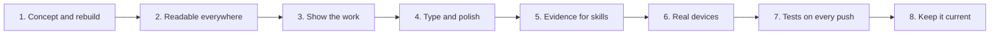

# Interactive Resume - Build plan

## Objective

The front page of moabboud.dev: a resume that a recruiter can judge in ten seconds, a hiring
manager can read in two minutes, and an engineer can take apart, written by hand in one page
with nothing loaded from anyone else, and itself evidence of the front-end claims it makes.

The page is built. What remains is testing it on real devices, keeping it honest as the
projects change, and turning the checks into tests that run on every push.

## Order of work

| Stage | Goal | Done when | Status |
| --- | --- | --- | --- |
| 1 | Concept and rebuild | A fixed stage, lateral motion, light and colourful, six sections | Done |
| 2 | Readable everywhere | Content in the markup, link previews, favicon, PDF, keyboard, reduced motion, contrast measured, print as a resume | Done |
| 3 | Show the work | Pictures of the real projects, the Trail clip, the gallery | Done |
| 4 | Type and polish | Self-hosted Geist, balanced headings, one-page view with its hint | Done |
| 5 | Evidence for skills | Every skill shows where it was used or says it has none | Done |
| 6 | Real devices | Checked on a real phone, Safari, Firefox and a screen reader | Phone done by the author; the rest not started |
| 7 | Tests on every push | The layout and behaviour checks run in CI | Not started. Belongs with the site's CI work |
| 8 | Keep it current | Words, numbers, pictures and the PDF agree with the projects | Ongoing |

## Decisions already made

| Decision | Reason | Rejected |
| --- | --- | --- |
| A fixed stage, one screen at a time, moving sideways | The author's choice; the page is composed rather than scrolled | A long scrolling page, a flipping book, a zoomable canvas |
| Vertical input drives lateral movement | A reader's instinct to scroll produces the movement the page has | Ignoring the wheel |
| A "One page" view as well, with a note that points to it | Skimmers get a scrolling document without losing the stage | Forcing phones into one page: built and reverted the same day, because the author wanted the swipe kept |
| Light and colourful, a hue per section; a built dark theme | The author's instruction | The first version's near-black with one orange accent |
| Content in the markup, the script only adds behaviour | Crawlers, link previews, printers and script-less readers all get the whole resume | Content in script lists, which left the page empty without JavaScript |
| Experience headline-first, the resume's sentence one click away | Headlines fit a screen and a phone; the full text is still on the page | Sending readers to the PDF or LinkedIn for detail |
| Projects as an auto-moving, endless gallery; the front card opens into the picture | The author's request; it shows that the page moves and puts the work first | A grid of cards, judged too crammed |
| Pictures only of real work, or drawn from the repository's own records | A picture is a claim too | Stock imagery, invented numbers in diagrams |
| Skills show where they were used; unproven ones say so | More convincing to an engineer than a longer list | Self-assessed percentages; hiding the unproven ones |
| A Machine Learning skill group | The summary and the 2026 work claim it; the supplied four groups never named it | Leaving the claim unsupported on the Capabilities page |
| Geist for everything, Geist Mono for labels, self-hosted | Chosen by the author over Fraunces headings after seeing both | System fonts, a font CDN |
| No framework, no CDN, no build step for the page | Nothing a reviewer values would be gained, and it keeps the page inspectable | Astro, GSAP, Three.js; a shader hero; View Transitions over the existing motion |
| The PDF is printed from the page by a script | The PDF cannot disagree with the page | A separately written document |
| No phone number, no tracking, no contact form | A public page is scraped; nothing would receive a form | |
| "Fallacy Detector" on the resume | The app's own title | "Fallacy Suspect", the folder's name |

## Open questions

| Question | Blocks | Default |
| --- | --- | --- |
| Where Fallacy Detector and Pneumonia Detection are hosted | Their cards linking to live apps | Link to code (Pneumonia to its current host) until the hosting work decides |
| When Herder has a demo | Herder's card losing "In progress" | It keeps the label |
| Pneumonia's new interface | A real screenshot on its card | The drawn diagram stays |

## Risks

| Risk | Mitigation |
| --- | --- |
| Motion put first, reading second | Headline-first text, a one-page view, reduced motion honoured everywhere, the gallery pauses on request |
| A layout change makes a stage page overflow at a common size | Measured at 1920x1080, 1440x900, 1366x768, 1280x720 and 820x1180 after every change |
| The PDF, preview or pictures go stale | One script regenerates the PDF and images; pictures are re-captured when an app changes |
| Content drifts from the truth | Numbers are the resume's own; the evidence rule for skills; the task list records what is verified and what is not |
