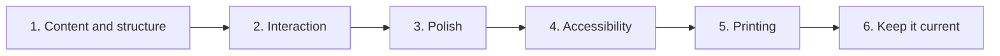

# Interactive Resume - Build plan

> **Superseded in part.** This plan describes the previous version of the page. The page is
> being rebuilt from scratch and this document is pending a rewrite. See
> [06-context.md](06-context.md) for current decisions and state.

## Objective

A single-page resume that answers three different readers' questions without asking which
one they are, loads instantly, and is itself evidence of the front-end claim it makes.

Built and working. The remaining work is maintenance discipline and a small number of
gaps: printing, keeping the content honest against itself, and accessibility.

## Order of work

| Stage | Goal | Done when | Status |
| --- | --- | --- | --- |
| 1 | The content, structured | Skills, work history and projects render from lists rather than from markup | Done |
| 2 | Interaction | Skill filtering, expandable roles, theme toggle that is remembered | Done |
| 3 | Polish | Section reveal, filling bars, counters, typing role line, pointer effects, progress bar, both themes complete | Done |
| 4 | Accessibility | Keyboard reachable throughout, focus visible, motion preference respected, contrast checked in both themes | Not started |
| 5 | Printing | A reader who prints or saves to a file gets something usable | Not started |
| 6 | Keep it current | The content matches reality, and the lists do not contradict each other | Ongoing |

### Stage 4 in detail

This is the one real gap. The page is interactive, and interactive means keyboard and
motion questions that a static document does not raise:

- The skill filter and the role expanders must be reachable and operable from a keyboard,
  and must announce their state.
- Focus must be visible in both themes.
- The typing line, the pointer spotlight and the card tilt are motion. A reader who has
  asked their system to reduce motion should get a still page.
- Contrast has to hold in both themes, not just the one that was designed first.

It matters more here than on most pages, because a resume claiming front-end competence
that is unusable from a keyboard is making an argument against itself.

### Stage 5 in detail

People print resumes and save them as files to attach to things. Today that produces
whatever the browser makes of a page designed for a screen, with the theme, the effects and
the collapsed roles all in play. At minimum, printing should expand every role, drop the
decoration, and use the light theme.

## Decisions already made

| Decision | Reason |
| --- | --- |
| One file, no framework, no build step | The page is part of the claim. It also means it will still open in ten years |
| Content in lists rather than in markup | Updating a resume must be editing a line, not editing HTML. A resume that is annoying to update stops being updated |
| Skills carry a self-assessed level | Shows relative depth across a list. Presented as a bar in a list rather than as a score, because that is all it can honestly support |
| A fixed set of skill groups | The filter is built from them, so adding one is a deliberate change |
| The most senior role expanded by default | A reader who expands nothing still sees the important part |
| Roles collapsible | Three readers want three different depths from the same section |
| Separate viewport observers for reveal and for the skill bars | Filling the bars when the section reveals means the reader arrives after the fill is over |
| Every effect decorates content already present | Nothing may be gated behind an animation |
| Both themes complete, not one applied over the other | An afterthought theme is visible as one |
| The theme is the only thing persisted | It is a display preference and identifies nobody |
| No contact form | A form implies something receives it, and nothing does. Direct links are honest |
| Dates as one free-text line | Nothing sorts or computes from them |

## Open questions

| Question | Blocks | Notes |
| --- | --- | --- |
| Does the page work from a keyboard alone? | Stage 4 | Untested. The filter and the expanders are the parts at risk |
| Is a reduced-motion preference respected? | Stage 4 | Three separate effects would need to stop |
| Does contrast hold in both themes? | Stage 4 | The second theme is the one likely to have been checked less |
| What should printing produce? | Stage 5 | At minimum: every role expanded, decoration dropped, light theme |
| Should the technology tags be checked against the skills list? | Stage 6 | They are related by convention only, and a mismatch is the most likely inconsistency |
| Should the projects link out to the other apps in this repository? | Stage 6 | There are several sitting alongside it and nothing currently connects them |

## Risks

| Risk | Effect if it happens | Response |
| --- | --- | --- |
| The page is unusable from a keyboard | A resume claiming front-end skill argues against itself | Stage 4, and it is the reason stage 4 is next |
| The content drifts from reality | The most damaging failure available to a resume, and the least visible | Stage 6. Review whenever anything changes |
| Tags and the skills list disagree | A careful reader notices, and it undermines the whole page | Either check them or keep them in one place |
| The self-assessed levels are read as scores | They cannot support that reading | They stay bars in a list. Never a number on its own, never a total |
| Printing produces something unusable | People do print resumes | Stage 5 |
| Effects overwhelm the content | The page becomes a demo of effects rather than a resume | Every effect decorates content already present. Keep it that way |
