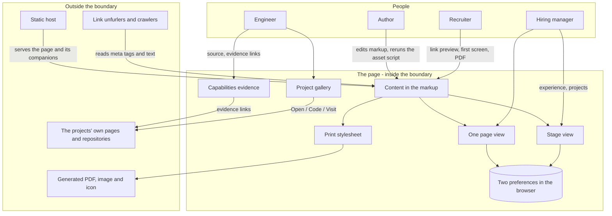

# Interactive Resume - Interaction and system boundary

## Actors

| Actor | Type | What they want | Time they give it |
| --- | --- | --- | --- |
| Recruiter | Human | Who this is, what role, where, how to reach Mohamad, a PDF to attach | About ten seconds, often on a phone or through a link preview |
| Hiring manager | Human | What Mohamad has done, with numbers, and what gets built | One to two minutes on a laptop |
| Engineer interviewing Mohamad | Human | Evidence of how Mohamad works: the code, the measurements, the page itself | As long as it holds them, dev tools open |
| The author | Human | To change what the page says without fighting the page | Whenever the resume changes |
| Link unfurlers and crawlers | External system | Title, description, preview image, text they can read without running script | One request |
| Printer / PDF reader | External system | A document that reads as a resume on paper | One print |
| Static host | External system | Files to serve at `/` and `/resume/` | Every push |

## Interaction diagram

## What the system deliberately does NOT care about

| Not in scope | Why |
| --- | --- |
| Who the reader is | No analytics, no counters, no identifiers. The page cannot tell a recruiter from anyone else and does not try |
| Receiving messages | No contact form: nothing would receive it. Email and LinkedIn are links |
| A phone number | The page is public and scrapeable. The phone number belongs on the copy sent with an application |
| Tailoring per application | One resume, one address. A version per employer is not built |
| Self-assessed skill levels | Percentages cannot be defended. A skill shows where it was used or says it has no public example |
| Running the projects | The page links to them. The server-side projects are shown as code, measurements and diagrams |
| Old browsers getting the motion | Anything without the needed features gets the document, not a broken stage |

## Use cases

| Use case | Actor | Flow | Outcome |
| --- | --- | --- | --- |
| Judge from the link | Recruiter | Pastes the address into LinkedIn or email; the unfurler reads the meta tags | A card with name, title, availability and three numbers |
| First screen | Recruiter | Opens the page | Name, title, "open to full-time roles", summary, numbers, LinkedIn / GitHub / Email / PDF, all on one screen |
| Get the PDF | Recruiter | Presses "Resume PDF" in the header, on the index, or in Contact | A two-page resume with working links |
| Skim | Hiring manager | Reads headlines on each Experience page, opens the ones that matter | The full sentence under each headline, one at a time per role |
| Prefer scrolling | Any reader | Sees the "Change to one page" note, or uses the header button | The whole resume as one document; the choice is remembered |
| Check a skill | Engineer | Picks "Python" or "Docker" on Capabilities | The roles and projects that show it, each a link |
| Look at the work | Hiring manager, engineer | Watches the gallery or swipes it | Each project in turn: its picture, its description, a link to open it or read its code |
| Read without script | Crawler, reader with script off | Loads the page | Every section as a plain document, every detail open |
| Print | Anyone | Prints, or the author regenerates the PDF | The print stylesheet's resume: contact line, full sentences, skills as lines, six projects |
| Update the resume | Author | Edits the markup, reruns the asset script, commits | The page, the PDF and the preview agree |
