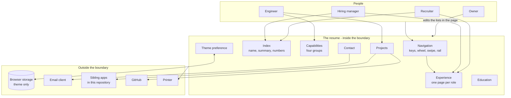

# Interactive Resume - Interaction and system boundary

## Actors

| Actor | Type | What they want |
| --- | --- | --- |
| Recruiter | Human | Titles, organisations, dates, location, and how to make contact |
| Engineer | Human | What was actually built, and in what |
| Hiring manager | Human | Scope, ownership and outcomes |
| Owner | Human | To edit the content without it becoming a project |

Three readers with different questions, arriving at the same page, none of whom will say
which one they are. The page cannot ask, so the sequence has to serve all three.

The order of the pages is the answer. A reader who stops after one page has seen the
strongest claim. A reader who stops after two has seen the most recent role in full.

## Interaction diagram

Everything inside the boundary is one file. Nothing crosses it inward at runtime.

## What the system is in the business of

- Presenting one complete idea at a time, rather than a column the reader scrolls past.
- Making movement a decision. The reader goes somewhere because they chose to.
- Being fast. It is read in the first thirty seconds of interest or not at all, and it loads
  with no request beyond the file itself.
- Being credible as evidence. A hand-written page with no framework, running from a file, is
  part of the claim it makes.
- Being honest when the motion is unwanted, unavailable, or being printed.

## What the system does not care about

- Knowing anything about the reader. No form, no analytics, no tracking, no contact capture.
- Persuading. It presents; it does not sell.
- Being a content management system. The content lives in lists in the page.
- Multiple versions or tailoring per application.
- Search engine placement or any distribution mechanism.
- Scrolling and zooming. Both were offered as navigation models and both were rejected.

## Main use cases

| ID | Actor | Goal | Trigger | Result |
| --- | --- | --- | --- | --- |
| UC-1 | Any reader | Work out who this is | Open the page | Name, title, summary and four numbers, on one screen |
| UC-2 | Any reader | Move through the resume | Press an arrow key, turn the wheel, swipe | The screen is replaced by the next composed page |
| UC-3 | Any reader | Go straight to one section | Press a digit, or use the rail, header or menu | That section's first page, directly |
| UC-4 | Hiring manager | Read one role properly | Reach Experience | One role per page, at full detail, nothing competing for the screen |
| UC-5 | Engineer | Read only the banking role | Choose it from the tabs within Experience | That role, without passing through the other |
| UC-6 | Engineer | See the range of capability | Reach Capabilities | Four groups as four columns, or one group at a time on a narrow screen |
| UC-7 | Engineer | See something real and running | Reach Projects | Cards linking out to what is live |
| UC-8 | Any reader | Make contact | Reach Contact | Direct links to email, phone and GitHub |
| UC-9 | Any reader | Read in their preferred theme | Toggle it | The theme switches and is remembered next visit |
| UC-10 | Any reader | Send someone one page | Copy the address | The address carries the page number and opens there |
| UC-11 | Any reader | Print it or save it as a file | Print | A document with every page expanded, in order, without the machinery |
| UC-12 | Any reader | Read it without motion | Ask the system for reduced motion | The same page with transitions and pointer effects removed |
| UC-13 | Any reader | Read it from a keyboard alone | Tab and arrow | Every control reachable, offscreen pages inert, position announced |
| UC-14 | Owner | Update the content | Edit the lists at the top of the script | The pages rebuild from them |

## Constraints that come from the actors

- Nothing may be cut to make a page fit. If content does not fit, the section gains a page.
  This is why Experience is two pages rather than one.
- Forward and backward must look different. It is the only orientation cue the page gives,
  and without it a reader who goes back cannot tell that they did.
- The wheel must do something sensible. A reader will try to scroll, and that instinct
  should move them forward rather than do nothing.
- The reader must always know there is more. A counter, a rail and a key hint stay on screen.
- The content must be editable by changing a list. If updating a resume needs a build step,
  it stops being updated.
- No contact form. A form implies something receives it, and nothing does.
- The page must survive its own interface being unavailable: no motion, no pointer, no
  colour, no screen.
