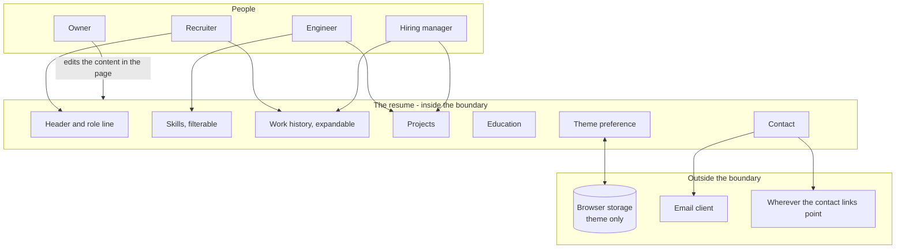

# Interactive Resume - Interaction and system boundary

## Actors

| Actor | Type | What they want |
| --- | --- | --- |
| Recruiter | Human | Roles, dates, and whether the basics match, in under a minute |
| Engineer | Human | Which technologies, at what depth, and whether anything real was built with them |
| Hiring manager | Human | What was shipped and what it was worth |
| Owner | Human | To edit the content without it becoming a project |

Three readers with different questions, reading the same page. The interactivity exists so
each can get to their part without the page hiding anything from the others.

## Interaction diagram

## What the system is in the business of

- Answering three different readers' questions from one page, without asking them which
  one they are.
- Being fast. It is read in the first thirty seconds of interest or not at all.
- Being credible as evidence. A hand-written page that runs from a file is part of the
  claim.
- Letting the reader control what they see: filter, expand, switch theme.
- Getting out of the way. Every animation is a garnish and none of them may delay reading.

## What the system does not care about

- Knowing anything about the reader. No form, no analytics, no tracking, no contact capture.
- Persuading. It presents; it does not sell.
- Being a content management system. The content lives in the page and is edited there.
- Multiple versions, tailoring per application, or generating a document to attach.
- Being printable. Printing is a browser feature and this page has not been designed
  against it.
- Search engine placement or any distribution mechanism.

## Main use cases

| ID | Actor | Goal | Trigger | Result |
| --- | --- | --- | --- | --- |
| UC-1 | Any reader | Work out who this is | Open the page | Name, role, and a line cycling through what they do |
| UC-2 | Engineer | Find one kind of skill | Choose a filter | Only that group is shown |
| UC-3 | Engineer | Judge depth | Scroll to the skills | Bars fill as they come into view, showing relative depth |
| UC-4 | Recruiter | Scan the roles | Scroll to the work history | Roles, organisations and dates as a timeline |
| UC-5 | Hiring manager | Read one role properly | Expand a role | What was done, and the technologies it used |
| UC-6 | Engineer | See something real | Scroll to the projects | Project cards |
| UC-7 | Any reader | Read in their preferred theme | Toggle it | The theme switches and is remembered next visit |
| UC-8 | Any reader | Make contact | Reach the contact section | Direct links out to email and elsewhere |
| UC-9 | Owner | Update the content | Edit the page | The lists in the page drive what is rendered |

## Constraints that come from the actors

- The most senior role is expanded by default. A reader who expands nothing should still
  see the important part.
- Filtering must never remove something permanently. A reader who filters and forgets must
  be able to get back.
- Nothing may block reading. Every animation is decoration on top of content that is
  already there.
- The content must be editable by changing a list in the page. If updating a resume needs a
  build step, it stops being updated.
- No contact form. A form implies something receives it, and nothing does.
