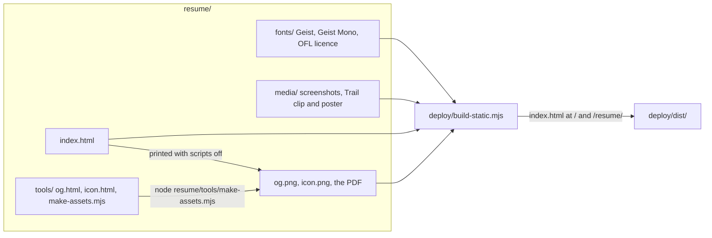
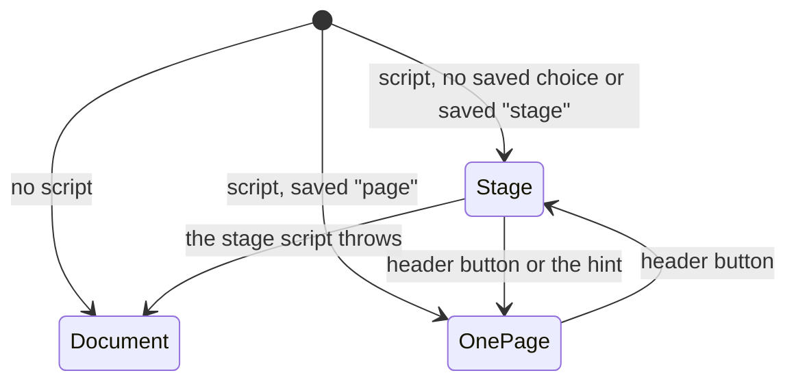
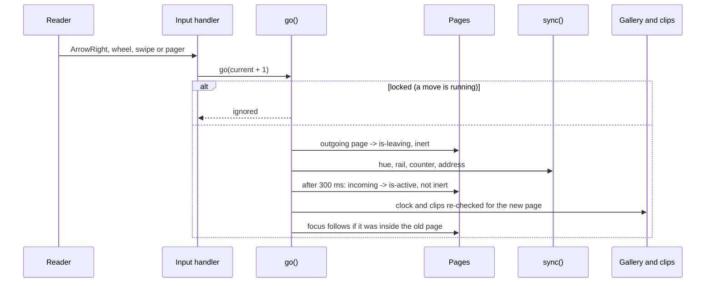

# Interactive Resume - Architecture

## Shape

One page, `resume/index.html`, holding its own CSS and JavaScript. Everything it says is in
its markup. The script adds behaviour to content that is already there; it never writes the
content. Beside it sit files it references by root-absolute path, because the same page is
served at `/` and at `/resume/` and a relative path cannot be right in both.

| Part | Role |
| --- | --- |
| `index.html` | The page: content, styles, script |
| `fonts/` | Geist (text and headings) and Geist Mono (labels), Latin subsets, self-hosted, with the SIL OFL |
| `media/` | Pictures on the project cards, and the Trail clip. Captured from the real apps |
| `og.png`, `icon.png`, `Mohamad-Abboud-Resume.pdf` | Generated, committed, published |
| `tools/make-assets.mjs` | Drives a local Chrome or Edge over the DevTools protocol, no packages. Renders `og.html` and `icon.html` to images and prints the page to the PDF |
| `deploy/build-static.mjs` | The site's allowlist build. Copies the page twice and its companions once |

## Three ways the same page runs

Two classes on `<html>` decide it, set in the head before first paint:

| State | Classes | What the reader gets |
| --- | --- | --- |
| Document | neither | No script, or the script failed. Sections stacked, all details open, stage controls hidden |
| One page | `scripted` | The document, chosen. Sticky header, the hue and the address follow the section being read |
| Stage | `scripted js` | One page at a time, lateral motion, rail, pager, keys, wheel and swipe |

The stage CSS lives inside `@media screen` and keys off `.js`, so printing always gets the
document. If the stage script throws, it removes both classes and the reader keeps the
document.

## Components

| Component | What it does | Notes |
| --- | --- | --- |
| Stage engine | `go()` moves between pages, direction-aware; `sync()` sets the hue, rail, counter, live region and address | Input is ignored for about a second after a move. In-page links are handled by the script so focus can follow |
| Addresses | `pageFromHash()` resolves `#projects` and friends, the legacy `#1` to `#8`, and `#projects-more` | Pages are addressed by their `id` |
| Motion | Elements with `data-anim` enter on X, staggered in document order; masked display type rises | Direction is one root variable multiplying every transform |
| Headline-first experience | Each bullet is a `
`: headline in `
`, the resume's sentence inside | Authored open. On the stage they close and share a `name`, so one opens at a time. Print opens them |
| Capabilities evidence | Chips carry `data-used`; the panel lists those places from `.sources` | Hover previews, click / tap / key pins. In one column the panel moves under the tapped group |
| Project gallery | Endless carousel. Wide: the front card opens to 1.6 times a side card with a floating text panel. Narrow: equal cards, neighbours peeking | Auto-advances every 5.5 s while on screen; holds for pointer, keyboard focus, hidden tab, reduced motion, or its pause button |
| Clips | A `video[data-clip]` plays only while its card is in front and on screen | `preload="none"` until it may play; never under reduced motion or Save-Data |
| View toggle and hint | Switches stage and one page, keeping the reader's place both ways | The hint shows for ten seconds to a reader who has never chosen |
| Overflow cue | When a stage page has to scroll internally, its bottom fades and "More below" shows | The safety valve, not navigation |
| Ambient | Section-hued wash, grid, grain; reticle and blob follow the pointer | The pointer loop stops when settled: an idle page requests no frames |
| Theme | Light by default, a built dark counterpart | Saved choice applied in the head, no flash |

## Key sequence: moving to the next page on the stage

## Rules that keep it working

| Rule | Why |
| --- | --- |
| Links inside the page are root-absolute (`/trail/`, `/resume/...`) | The page is served at two addresses |
| `[data-count]` belongs to the index counters only | The counters rewrite the text of every element carrying it. Capabilities uses `data-places` for that reason |
| Rerun `make-assets.mjs` when the words change, and commit its outputs with the change | The PDF is printed from the page; it goes stale otherwise |
| A new card picture comes from the real app, or is drawn only from what the repository records | The gallery's promise is that pictures are of the real work |
| The stage must not need its internal scroll at 1280x720 and up, or at 820x1180 | Measured after every layout change; see the task list |
